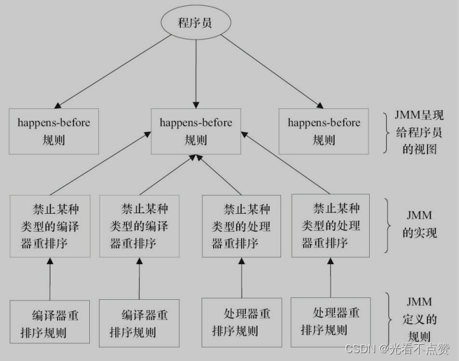
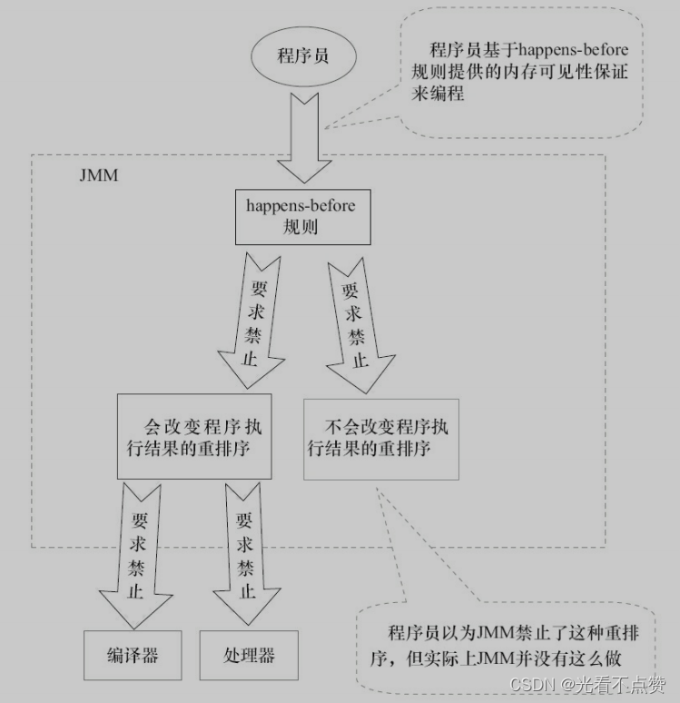
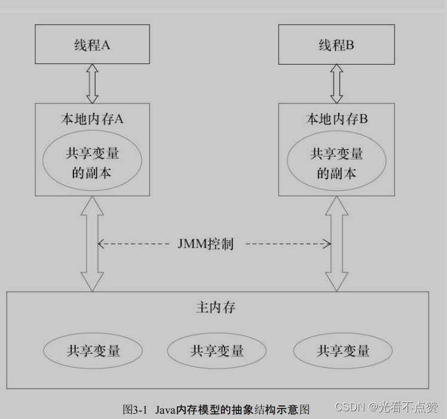

# Java 内存模型与重排序

## 概念卡
Q: 为什么需要 Java 内存模型（JMM）？它解决的核心矛盾是什么？
A:
- 核心矛盾：CPU 和编译器为了性能会做指令重排序 + 多级缓存，导致多线程下内存可见性问题。JMM 在这之上定义了一套规范，约束哪些重排序合法、哪些读写对其他线程可见
- JMM 不是一个物理模型，而是一个抽象规范（JSR-133，JDK 5 起生效），屏蔽不同硬件平台的差异
- 两个关键问题：线程间如何通信（共享内存 vs 消息传递）、线程间如何同步
- Java 采用共享内存模型，线程间通过写-读共享变量来隐式通信，JMM 控制主内存与线程本地内存的交互
- 面试表达重点：JMM 是 Java 对"多线程程序允许做什么优化、必须保证什么可见性"的契约

## 机制卡
Q: happens-before 规则是什么？它在 JMM 中扮演什么角色？
A:
- happens-before 是 JMM 定义的偏序关系，描述两个操作之间的可见性保证：如果 A happens-before B，则 A 的结果对 B 可见
- 六条核心规则：程序顺序规则、监视器锁规则、volatile 规则、传递性、start() 规则、join() 规则
- 关键理解：happens-before 是"程序员视角的保证"，JMM 允许重排序，但重排序后的结果必须和按 happens-before 执行一致
- 面试用法：遇到多线程代码，用 happens-before 逐条推导两个操作之间是否有可见性保证

## 对比追问卡
Q: as-if-serial 和 happens-before 有什么区别？为什么 JMM 需要两个语义？
A:
- as-if-serial：保证**单线程**内程序执行结果不变，给单线程程序员"顺序执行"的幻境
- happens-before：保证**正确同步的多线程**程序执行结果不变，给多线程程序员"按 happens-before 顺序执行"的幻境
- 两者目标一致：在不改变执行结果的前提下，尽可能让编译器和处理器做优化
- JMM 的平衡：对会改变结果的重排序坚决禁止，对不影响结果的完全放开。极致案例：编译器分析后认定某锁只在单线程用 → 锁消除；volatile 变量只被单线程访问 → 降级为普通变量
- 面试亮点：能说出"JMM 的底线是不改变执行结果，除此之外怎么优化都行"

## 机制卡
Q: volatile 变量如何通过内存屏障建立可见性和有序性？
A:
- volatile 写：写前插 StoreStore 屏障（禁止前面的普通写重排到 volatile 写之后），写后插 StoreLoad 屏障（确保后续 volatile 读看见最新值）
- volatile 读：读后插 LoadLoad 和 LoadStore 屏障（禁止后面的普通读写重排到 volatile 读之前）
- 可见性原理（JMM 抽象语义）：volatile 写将本地内存中的共享变量刷新到主内存；volatile 读将本地内存置为无效，强制从主内存读取
- 面试正确说法：不要直接说"volatile 对应 lock 前缀指令"——不同 CPU/JVM 实现不同。正确表述是"volatile 通过 JMM 规则和 JVM 插入的内存屏障建立可见性和有序性保证"
- volatile 能保证单次读/写的原子性（包括 long/double），但不能保证复合操作（如 volatile++）的原子性

## 边界卡
Q: 什么场景下 volatile 不够用，必须升级为锁或原子类？
A:
- 任何"先读后写"的复合操作：i++、if-then-update、check-then-act —— volatile 无法阻止中间被其他线程插入
- 多个变量间存在不变式（invariant）：如"账户余额 = 所有子账户之和"，volatile 无法同时保护多个变量
- 需要互斥语义的场景：volatile 没有互斥语义，多线程可同时执行同一段 volatile 代码
- 结论：状态标志/一次性安全发布用 volatile；复合操作和不变量保护用锁或 AtomicInteger 等原子类（底层依赖 CAS 循环）
