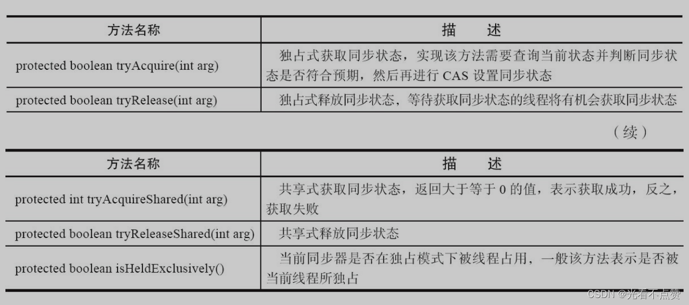
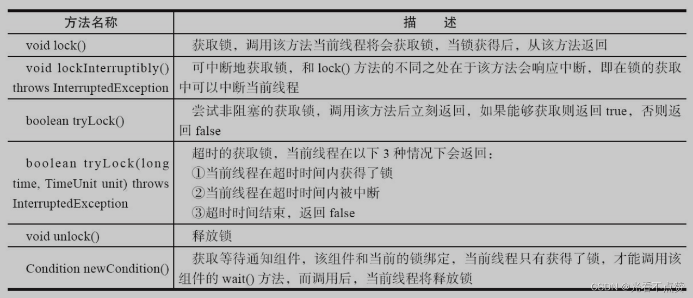
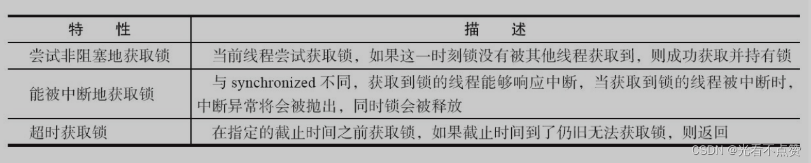

# Lock 接口与 AQS

## 概念卡
Q: Lock 接口相比 synchronized 提供了哪些额外能力？为什么还需要显式锁？
A:
- synchronized 的局限：获取和释放锁被 JVM 固化（先获取再释放），无法灵活控制。例如"先获取锁 A，再获取锁 B，然后释放 A 获取锁 C"这种复杂场景难以实现
- Lock 提供的关键能力：
  1. 可中断获取锁（lockInterruptibly），等待锁时可被中断
  2. 超时获取锁（tryLock(time)），避免无限期等待
  3. 非阻塞获取锁（tryLock()），获取不到立即返回
  4. 多条件等待：一个 Lock 可创建多个 Condition
- 缺点：必须手动 unlock()（finally 块中），使用更复杂；synchronized 有 JVM 层面的偏向锁/轻量级锁等优化
- 面试表达：Lock 不是替代 synchronized，而是在 synchronized 不够灵活的场合使用。90% 的场景 synchronized 足够

## 机制卡
Q: AQS（AbstractQueuedSynchronizer）的设计核心是什么？它如何用一个框架支撑 ReentrantLock、Semaphore、CountDownLatch 等多种同步器？
A:
- AQS 是 JUC 包几乎所有同步组件的底层框架，核心设计：一个 int 变量表示同步状态 + 一个 FIFO 双向队列管理等待线程
- 采用模板方法模式：AQS 定义 acquire/release 等模板方法，子类只需重写 tryAcquire/tryRelease 来决定"什么条件下可获取/释放同步状态"
- 资源共享模式：独占模式（Exclusive，如 ReentrantLock）和共享模式（Share，如 Semaphore/CountDownLatch）
- 状态管理：通过 getState()/setState()/compareAndSetState()（CAS）三个方法操作同步状态
- 面试亮点：AQS 是理解整个 JUC 包的钥匙——读懂 AQS，ReentrantLock、Semaphore、CountDownLatch、CyclicBarrier 的实现都能快速理解

## 机制卡
Q: AQS 同步队列中，一个线程从获取锁失败到最终获得锁经历了什么？
A:
- 入队（addWaiter + enq）：用 CAS 将当前线程构造成 Node 节点加入 tail。enq 用死循环确保入队一定成功
- 自旋等待（acquireQueued）：节点在自旋中检查前驱节点是否为 head。只有前驱是 head 的节点才有资格尝试获取（保证 FIFO 公平性，避免惊群效应）
- 阻塞（park）：获取失败后判断是否应阻塞（shouldParkAfterFailedAcquire），满足则 park() 挂起线程
- 唤醒（unparkSuccessor）：前驱节点释放锁后，unpark head 的后继节点
- 获取成功：将自己设为 head（不需要 CAS，因为只有获取到锁的线程在操作），从 acquireQueued 返回
- 面试追问：为什么 head 不需要 CAS 设置？因为同一时刻只有一个线程能获取到独占锁

## 机制卡
Q: 共享模式和独占模式在 AQS 中的关键区别是什么？为什么 Semaphore 释放一个许可能唤醒多个等待者？
A:
- 独占模式（acquire）：同一时刻只有一个线程能获取。获取失败加入同步队列等待
- 共享模式（acquireShared）：同一时刻允许多个线程获取。tryAcquireShared 返回值 >= 0 表示获取成功
- 关键区别：共享模式获取成功后调用 setHeadAndPropagate → 如果还有剩余许可，继续唤醒后继节点 → 形成"级联唤醒"效果
- 释放（doReleaseShared）必须线程安全：多个线程可能同时释放，通过 CAS 循环确保正确性
- 典型实例：ReentrantLock（独占）、Semaphore（共享，每次 acquire 消耗一个许可）、CountDownLatch（共享，await 等待计数器归零）、ReentrantReadWriteLock（写锁独占 + 读锁共享）

## 边界卡
Q: Lock 接口和 synchronized 各自的适用场景？如何选择？
A:
- 优先 synchronized：逻辑简单、不需要中断/超时、锁持有时间短。JVM 有偏向锁/轻量级锁/锁粗化/锁消除等自动优化
- 选择 Lock 的场景：需要尝试获取锁（tryLock）、需要可中断的锁获取、需要超时等待、需要多条件等待（多个 Condition）、需要在不同方法中获取和释放锁
- 性能考量：JDK 6 之后 synchronized 做了大量优化，轻量级竞争下性能相差无几。高竞争场景下，显式锁的公平性选择和条件队列能提供更好的控制
- 知名陷阱：Lock 必须 finally 中 unlock，否则异常导致锁永不释放；synchronized 自动释放
