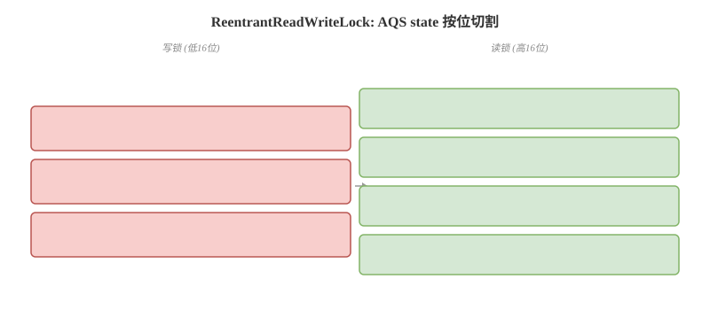

# ReentrantLock 与读写锁

## 概念卡
Q: ReentrantLock 的"可重入"是如何实现的？为什么需要可重入性？
A:
- 可重入含义：已经获得锁的线程可以再次获取同一个锁而不被阻塞
- 实现原理：AQS 的 state 变量记录锁被重入的次数。获取锁时，如果当前线程是持有锁的线程，state += 1；释放锁时 state -= 1；当 state 降为 0 时锁才真正释放
- 需要的场景：递归调用同步方法、一个锁保护的代码中调用了另一个同样用该锁保护的方法（如父类方法和子类重写方法都用同一把锁）
- 如果没有可重入：线程第二次获取自己持有的锁时会自旋等待自己释放 → 死锁
- ReentrantLock 默认非公平锁，构造函数传 true 可指定公平锁

## 机制卡
Q: 公平锁和非公平锁在 AQS 实现上的区别是什么？为什么默认非公平？
A:
- 非公平锁（默认）：调用 lock() 时先 CAS 直接尝试抢占（tryAcquire(1)），失败后再走标准 AQS 入队流程。刚释放锁的线程和新来的线程有同等竞争机会
- 公平锁：lock() 时先检查同步队列中是否有等待时间更长的线程（hasQueuedPredecessors()），如果有则必须排队，不会尝试插队
- 默认非公平的原因：非公平锁减少了线程切换。释放锁的线程调用 unlock → 刚来的线程恰好 CAS 抢到 → 不需要从队列中唤醒等待线程 → 少了两次上下文切换
- 代价：非公平锁可能导致"饥饿"——等待队列中的线程长时间得不到执行。公平锁保证 FIFO 但吞吐量更低（大量线程切换）
- 面试进阶：在非公平锁中，如果新来的线程没抢到锁，它仍然要进同步队列排队，此时和公平锁行为一致（队列内部是 FIFO）

## 机制卡
Q: ReentrantReadWriteLock 如何在同一个 AQS state 上同时管理读锁和写锁？
A:
- 按位切割：state 是 int 类型（32 位），高 16 位表示读锁获取次数（所有线程总和），低 16 位表示写锁重入次数
- 读状态获取：`state >>> 16`（无符号右移 16 位）
- 写状态获取：`state & 0x0000FFFF`（抹去高 16 位）
- 写状态 +1：`state + 1`；读状态 +1：`state + (1 << 16)`（即 state + 0x00010000）
- 获取写锁的条件：读状态为 0 且写状态为 0（或当前线程是写锁持有者用于重入）。当存在读锁时写锁必须等待——保证写操作对读操作的可见性
- 获取读锁的条件：写状态为 0（或当前线程是写锁持有者，此时允许锁降级）。当存在写锁时读锁必须等待
- 关键设计：写锁是独占锁，读锁是共享锁。读多写少的场景下显著提升并发度

## 对比追问卡
Q: 什么是锁降级？为什么支持锁降级但不支持锁升级？
A:
- 锁降级：持有写锁 → 获取读锁 → 释放写锁，最终只持有读锁。目的是保证数据可见性——在写锁释放前先获取读锁，确保在转为读操作时不会看到其他写线程的修改
- 锁降级流程：readLock.unlock()（先释放旧的读锁）→ writeLock.lock() → readLock.lock()（在持有写锁时获取读锁）→ writeLock.unlock()（释放写锁，完成降级）
- 不支持锁升级（读锁→写锁）的原因：如果多个线程同时持有读锁，同时要求升级为写锁，会造成死锁（互相等待对方释放读锁）。读写锁的设计保证读锁和写锁互斥
- 实际场景：对缓存数据进行修改——先用读锁读数据 → 发现需要修改 → 释放读锁 → 获取写锁 → 再次检查数据是否仍需要修改（双重检查）→ 修改 → 获取读锁 → 释放写锁 → 用读锁读新数据

## 机制卡
Q: Condition 接口相比 Object 的 wait/notify 有什么优势？底层等待队列如何工作？
A:
- Object 监视器的局限：一个对象只有一个等待队列（WaitSet），notify 只能随机唤醒一个等待线程。无法精确控制唤醒哪个条件的等待者
- Condition 的优势：一个 Lock 可以创建多个 Condition，每个 Condition 维护独立的等待队列。可以精确唤醒等待特定条件的线程（如生产者-消费者中的"非空"和"非满"两个条件）
- 底层实现：ConditionObject 是 AQS 的内部类，每个 Condition 持有一个单向等待队列。await() → 将当前线程从同步队列移到 Condition 等待队列 → 释放锁 → 挂起。signal() → 将等待队列头节点移回同步队列 → 当节点在同步队列中获取到锁后，await() 返回
- 与 synchronized 的 waitSet 对比：synchronized 一个对象只有一个 WaitSet 和一个 EntryList；Lock 一个同步器有一个同步队列 + 多个 Condition 等待队列
- 注意事项：await() 后用 while 而非 if 检查条件；signal() 调用前必须持有锁
