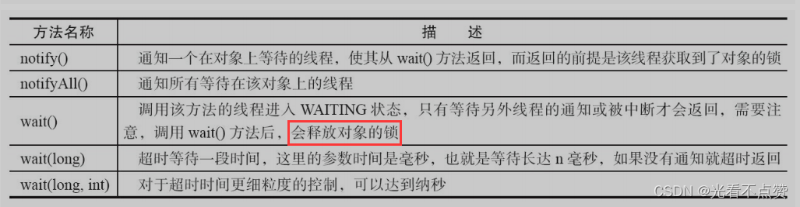
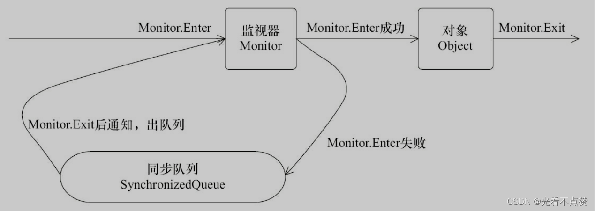
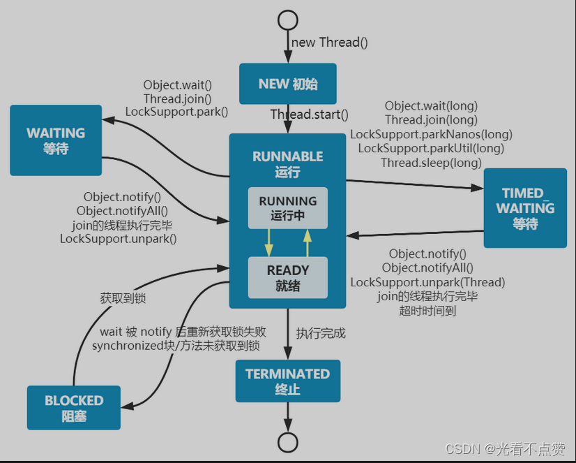

# ThreadLocal 与线程通信

## 概念卡
Q: ThreadLocal 解决的核心问题是什么？和 synchronized 的根本区别在哪？
A:
- 核心问题：在线程封闭的基础上，为每个线程维护独立的变量副本，避免共享带来的同步开销和数据竞争。本质是"以空间换时间"的设计
- 与 synchronized 的根本区别：ThreadLocal 用隔离消除竞争（无锁），synchronized 用互斥保护共享（有锁）。选择取决于数据是否真的需要跨线程共享
- 典型场景：数据库连接管理（每个线程独立 Connection）、事务上下文传递、Web 请求上下文（RequestContextHolder）、日志全链路追踪（traceId）
- 面试表达：ThreadLocal 不是用来解决共享变量同步问题的，而是把"共享"变成"各用各的"，从源头上消除竞争

## 机制卡
Q: ThreadLocal 的 ThreadLocalMap 内部结构是什么？为什么 key 用弱引用？内存泄漏如何发生？
A:
- 结构：每个 Thread 对象内持有一个 ThreadLocalMap，以 ThreadLocal 对象为 key（弱引用），以变量副本为 value（强引用）
- key 用弱引用原因：如果 key 是强引用，ThreadLocal 外部引用置 null 后，只要线程存活，ThreadLocal 对象就永远无法 GC，造成严重内存泄漏
- 泄漏路径：key 被 GC 后变成 null，但 value 作为强引用仍被 Entry 持有，且无法通过外部途径访问。正确做法：始终在 finally 块中调 remove()
- 自愈机制：get()/set()/remove() 时会触发探测式清理（expungeStaleEntry）和启发式清理（cleanSomeSlots），沿途清理 key 为 null 的过期条目
- 关键提醒：线程池场景下线程长期存活，如果不用 remove()，即使有自愈机制也无法清理所有过期 value

## 机制卡
Q: ThreadLocalMap 用开放地址法解决 hash 冲突，和 HashMap 的拉链法有什么不同？扩容条件是什么？
A:
- 冲突解决：用开放地址法（线性探测），而非 HashMap 的链地址法。发生冲突时向后线性查找直到找到空位
- hash 值生成：用斐波那契黄金分割数 0x61c88647 作为增量（HASH_INCREMENT），使散列更均匀
- 冲突处理分支：找到位置为空则放入；key 一致则替换；key 为 null（过期）则调 replaceStaleEntry 清理并替换；都不匹配则向后探测
- 扩容阈值：`len * 2/3`，触发 rehash → 先全量探测式清理 → 判断清理后 size >= `threshold * 3/4` → 满足则扩容为 2 倍
- 设计原因：ThreadLocalMap 用开放地址法而非拉链法，因为 key 是弱引用且会自动过期，需要沿途扫描清理，开放地址更利于"边走边清理"的模式

## 对比追问卡
Q: ThreadLocal、InheritableThreadLocal、TransmittableThreadLocal 三者各自解决什么问题？线程池场景下为何前两者失效？
A:
- **ThreadLocal**：线程隔离，每线程独立副本，不跨线程传递
- **InheritableThreadLocal**：子线程创建时从父线程拷贝 inheritableThreadLocals。在线程池失效原因：线程复用，只在首次创建时拷贝一次
- **TransmittableThreadLocal**（阿里开源）：专为线程池场景设计。核心机制：提交任务时 capture 父线程上下文 → 执行前 replay 到工作线程 → 执行后 restore 工作线程原值。用 TtlRunnable/TtlCallable 装饰原始任务，装饰器模式插入传递逻辑
- 关键提醒：TTL + TtlExecutors 能自动清理；如果只用 TTL 没用阿里线程池，需 ASM 字节码增强扫描线程创建方式并插入清理逻辑
