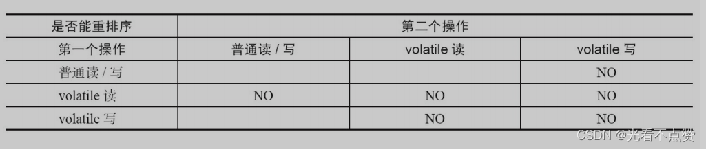

# volatile 与 JMM

## 概念卡
Q: volatile 保证什么？不保证什么？

A:
- 保证可见性：一个线程对 volatile 变量的写，对之后读取同一变量的线程可见。
- 保证有序性：volatile 读/写会建立 JMM 规定的 happens-before 关系，并限制相关重排序。
- 保证单次读/写的原子性。
- 不保证复合操作的原子性，例如 `volatile++` 仍然是读、改、写三步。

## 机制卡
Q: volatile 写和 volatile 读在 happens-before 上怎么配合？

A:
- 对同一个 volatile 变量的写，happens-before 后续任意线程对该变量的读。
- 写 volatile 前的普通写，也会通过这个 happens-before 关系对后续读线程可见。
- 读 volatile 后，线程可以看见写线程在写 volatile 前发布出去的状态。
- 面试表达：volatile 常用来做状态发布、停止标志、单次安全发布，不适合保护复合临界区。

## 图示卡
Q: 复习 volatile 屏障规则时要抓住什么？

A:
- volatile 写偏 release：禁止前面的普通写被重排到 volatile 写之后。
- volatile 读偏 acquire：禁止后面的普通读写被重排到 volatile 读之前。
- 具体屏障指令与硬件平台/JVM 实现有关，不要把某条汇编当成跨平台固定答案。

## 对比追问卡
Q: volatile 为什么不能替代 synchronized？

A:
- volatile 没有互斥，多个线程可以同时执行同一段代码。
- synchronized 既有互斥，也有可见性和有序性。
- 如果操作是“读当前值→计算→写回”，volatile 只能保证每次读写可见，不能保证整个复合过程不被打断。
- 典型结论：状态标志可优先考虑 volatile，复合状态不变式要用锁、原子类或并发容器。

## 正确性审查卡
Q: 原文中关于 volatile 底层的表述哪里需要谨慎？

A:
- “底层汇编一定会加 lock”不够严谨；具体指令取决于 JVM、CPU 架构和操作类型。
- “写回主内存/本地内存失效”适合作为 JMM 教学模型，不应直接等同于真实硬件每次都发生完整主内存读写。
- 更准确的面试说法：volatile 通过 JMM 规则和 JVM 插入的内存屏障/平台指令，建立可见性与有序性保证。
