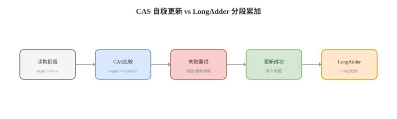

# 原子类与 LongAdder

## 概念卡
Q: Java 原子类解决什么问题？它和 volatile、synchronized 的关系是什么？
A:
- 原子类把常见的读-改-写操作封装成 CAS 循环，例如 incrementAndGet、compareAndSet
- volatile 只能保证可见性和单次读写原子性，不能保证 `i++` 这种复合操作原子
- synchronized 能保护任意临界区和多个变量不变式，但会涉及互斥阻塞和上下文切换
- 原子类适合单变量、短逻辑、高并发下的无锁更新；复杂不变式仍应使用锁或更高层并发结构
- 面试表达：原子类是 CAS + volatile 语义的库级封装，不是替代所有锁的万能方案

## 分类卡
Q: JUC 原子类有哪些类型？面试要怎么归类回答？
A:
- 基本类型：AtomicInteger、AtomicLong、AtomicBoolean
- 引用类型：AtomicReference、AtomicStampedReference、AtomicMarkableReference
- 数组类型：AtomicIntegerArray、AtomicLongArray、AtomicReferenceArray
- 字段更新器：AtomicIntegerFieldUpdater、AtomicLongFieldUpdater、AtomicReferenceFieldUpdater，用反射/限制条件更新对象 volatile 字段
- 高吞吐计数：LongAdder、LongAccumulator、DoubleAdder、DoubleAccumulator，用分散热点提升并发累加性能

## ABA 卡
Q: CAS 的 ABA 问题是什么？AtomicStampedReference 和 AtomicMarkableReference 如何解决？
A:
- ABA 是指变量从 A 变成 B 又变回 A，CAS 只比较当前值，会误以为期间没有变化
- 如果对象引用被复用、节点被删除后又插回，ABA 可能破坏无锁数据结构的正确性
- AtomicStampedReference 给引用附加版本号，每次修改同时推进 stamp，CAS 比较引用和值版本
- AtomicMarkableReference 给引用附加 boolean 标记，常用于逻辑删除场景
- 面试注意：普通计数器自增通常不怕 ABA；真正敏感的是无锁栈、队列、对象生命周期这类结构性场景

## LongAdder 卡
Q: LongAdder 为什么在高并发累加下通常比 AtomicLong 快？
A:
- AtomicLong 所有线程 CAS 同一个 value，高并发下失败重试严重，热点集中
- LongAdder 低竞争时更新 base，竞争激烈时把增量分散到多个 Cell
- 每个线程根据探针值落到不同 Cell 上 CAS，降低多个线程争抢同一内存位置的概率
- sum 时把 base 和所有 Cell 求和，因此它适合统计型场景，不适合需要每次更新后立刻拿到严格线性一致结果的场景
- ConcurrentHashMap 的计数思想也类似：用 baseCount + CounterCell 分散热点

## 选择卡
Q: AtomicLong、LongAdder、LongAccumulator 应该如何选？
A:
- 需要每次更新都返回准确新值，或要做 compareAndSet 条件更新：AtomicLong
- 只做高并发累加统计，例如 QPS、命中数、错误数：LongAdder
- 需要自定义结合函数，例如取最大值、最小值、乘积等：LongAccumulator
- 低并发下 AtomicLong 更简单，LongAdder 的 Cell 结构反而有额外成本
- 需要多个字段同时保持一致：三者都不够，应使用锁、不可变对象 + AtomicReference 或事务边界

## 性能边界卡
Q: 原子类一定比锁快吗？什么场景下 CAS 会变慢？
A:
- 不一定。CAS 在低冲突短操作下很快，但高冲突时大量自旋失败会消耗 CPU
- 临界区逻辑较长、需要等待 IO、需要保护多个变量时，锁通常更合适
- CAS 失败重试不是免费午餐，线程不会阻塞但会持续占用 CPU
- 原子类不能表达条件队列、公平性、可中断等待等复杂同步语义
- 面试回答：原子类追求无阻塞进展，锁追求临界区互斥和更强表达能力，要按冲突程度和语义复杂度选

## 正确性审查卡
Q: 复习原子类时，哪些说法需要修正？
A:
- “CAS 一定没有锁”：不严谨。底层可能使用硬件原子指令和缓存一致性协议，语义上是无阻塞，不等于没有硬件级同步成本
- “AtomicInteger 可以解决所有并发问题”：错误。它只解决单变量原子更新
- “LongAdder 的 sum 是强一致实时值”：不严谨。sum 是聚合瞬时结果，并发更新中不保证线性一致
- “AtomicReference 能自动保证对象内部线程安全”：错误。它只保证引用替换原子，对象内部可变字段仍需同步
- “ABA 都必须解决”：不一定。只有 ABA 会影响业务正确性或数据结构正确性时才需要版本/标记
