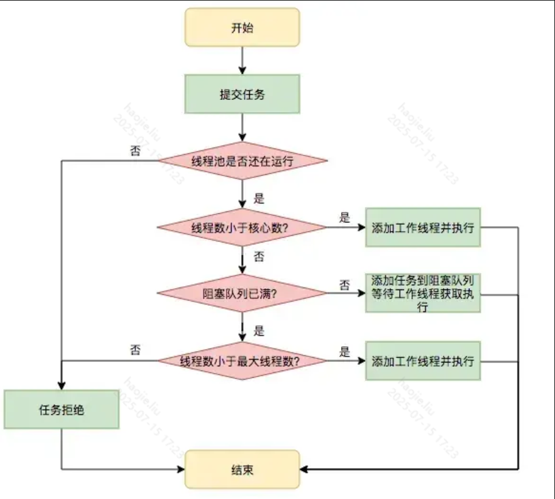

# 线程池核心机制

## 概念卡
Q: 为什么需要线程池？池化技术解决了什么问题？
A:
- 线程创建/销毁成本高：涉及操作系统资源分配、内核态切换。频繁创建线程可能导致内存耗尽或 CPU 过度消耗在线程调度上
- 池化技术的四个优势：
  1. 降低资源消耗：复用已创建线程，减少创建/销毁开销
  2. 提高响应速度：任务到达时无需等待线程创建，直接执行
  3. 统一管理：可限制最大线程数，避免无限制创建导致 OOM
  4. 扩展功能：定时执行、周期执行、任务队列、拒绝策略等
- 面试表达：线程池本质是生产者-消费者模式——调用者生产任务，线程池中的工作线程消费任务

## 机制卡
Q: ThreadPoolExecutor 的 7 个核心参数及其协作流程是什么？
A:
- corePoolSize：核心线程数，即使空闲也不被回收（除非 allowCoreThreadTimeOut 设为 true）
- maximumPoolSize：最大线程数，当队列满时最多创建这么多线程
- keepAliveTime + TimeUnit：非核心线程空闲存活时间，核心线程默认不回收
- workQueue（阻塞队列）：保存等待执行的任务。三种常见选择 —— SynchronousQueue（直接交接，无容量）、LinkedBlockingQueue（无界，任务无限堆积）、ArrayBlockingQueue（有界，需配合拒绝策略）
- threadFactory：创建线程的工厂，建议自定义命名方便排查
- RejectedExecutionHandler（拒绝策略）：四种内置策略 —— AbortPolicy（抛异常，默认）、CallerRunsPolicy（调用者线程执行）、DiscardPolicy（静默丢弃）、DiscardOldestPolicy（丢弃队列中最旧任务）
- 任务执行流程：核心线程 → 队列 → 非核心线程 → 拒绝策略

## 机制卡
Q: 线程池的任务执行流程是什么？什么时候创建新线程，什么时候入队？
A:
- 完整流程：
  1. 当前线程数 < corePoolSize → 创建新线程执行（不管有无空闲核心线程）
  2. 当前线程数 >= corePoolSize → 任务入队等待
  3. 队列满且当前线程数 < maximumPoolSize → 创建非核心线程执行
  4. 队列满且当前线程数 >= maximumPoolSize → 触发拒绝策略
- 关键细节：步骤 2 中，先入队而非优先创建新线程——减少线程创建开销，弹性应对流量波峰
- 核心线程 vs 非核心线程在设计上没有区别，只是是否受 keepAliveTime 影响。addWorker 方法中不区分两者
- 面试陷阱：如果用的是无界队列（LinkedBlockingQueue 无参构造），maximumPoolSize 和拒绝策略永远不会生效，线程数最多只有 corePoolSize

## 对比追问卡
Q: 四种常见线程池（FixedThreadPool、CachedThreadPool、SingleThreadExecutor、ScheduledThreadPool）的区别和各自风险？
A:
- FixedThreadPool（core = max）：固定大小线程池，用 LinkedBlockingQueue（无界）。风险：任务堆积导致 OOM
- CachedThreadPool（core = 0, max = Integer.MAX_VALUE）：可缓存线程池，用 SynchronousQueue（无容量直接交接），空闲 60s 回收。风险：高并发下无限创建线程导致 OOM
- SingleThreadExecutor：单线程线程池，保证任务顺序执行。风险同 Fixed
- ScheduledThreadPoolExecutor：核心线程数固定，支持定时/周期执行。用 DelayedWorkQueue（堆实现）。风险：长时间阻塞的任务会影响定时精度
- 面试铁律：生产环境禁止用 Executors 工厂方法创建线程池，必须手动 new ThreadPoolExecutor 指定参数，因为无界队列或无限最大线程数的默认设置极易导致 OOM

## 边界卡
Q: 线程池的参数如何合理设置？拒绝策略选哪个？
A:
- CPU 密集型任务：corePoolSize = CPU 核数 + 1，最大化 CPU 利用率
- IO 密集型任务：corePoolSize = CPU 核数 * 2 或更大，具体根据 IO 等待时间和 CPU 计算时间的比例（公式：CPU 核数 * (1 + 等待时间/计算时间)）
- 混合型：根据任务类型拆分为两个线程池
- 队列选择：建议有界队列（ArrayBlockingQueue），设置合理的容量 + 配合拒绝策略，宁可拒绝也不让任务无限堆积
- 拒绝策略：一般用 CallerRunsPolicy（将任务回退给调用者执行，自然形成反压），或自定义策略（记录日志 + 监控告警）。DiscardPolicy 静默丢弃是危险的
- 监控：通过 getPoolSize()/getActiveCount()/getQueue().size()/getCompletedTaskCount() 监控线程池状态，设置告警阈值
