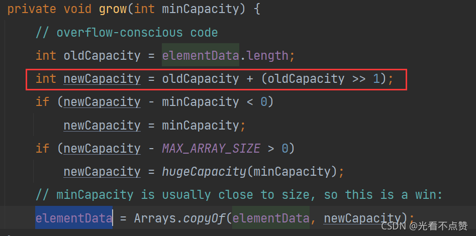
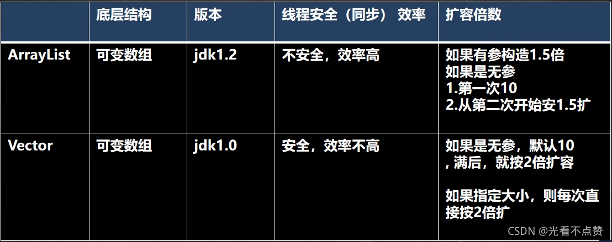
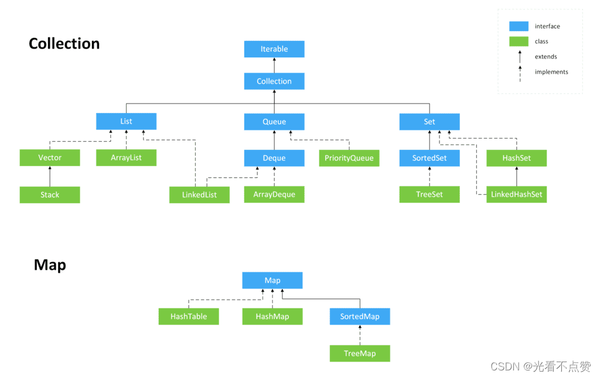

# ArrayList、LinkedList 与 CopyOnWriteArrayList




## 概念卡
Q: 为什么 ArrayList 要标记 RandomAccess 接口而 LinkedList 不标记？这个设计蕴含了什么设计模式？

A:
- RandomAccess 是一个标记接口（Marker Interface），用于向 JVM / 类库传递元信息
- ArrayList 底层是 Object[] 数组，支持 O(1) 随机访问，因此标记 RandomAccess
- 类库代码（如 Collections.binarySearch）会通过 `instanceof RandomAccess` 进行运行时策略选择：
  - 标记了 RandomAccess 的集合：直接使用索引循环遍历
  - 未标记的集合：使用迭代器遍历，避免 O(n²) 的索引访问
- LinkedList 底层是双向链表，随机访问需要 O(n) 遍历，不标记该接口
- 设计模式体现了**策略模式（Strategy Pattern）**在 JDK 内部的应用

## 概念卡
Q: 什么场景下选择 ArrayList 而非 LinkedList？判断依据不仅是"增删/查询"的直觉。

A:
- ArrayList 胜出的实际场景远超直觉：
  - **随机访问**：O(1)，LinkedList 是 O(n)，差距巨大
  - **尾部插入**：ArrayList 均摊 O(1)，与 LinkedList 的 O(1) 持平
  - **内存占用**：ArrayList 每个元素仅存储引用（4/8 字节），LinkedList 每个节点额外存储 prev/next 两个指针（约 24 字节），内存开销约为 ArrayList 的 3-4 倍
  - **缓存友好性**：数组连续内存，CPU 缓存行命中率高；链表节点分散，频繁 cache miss
- LinkedList 仅在**头部/中部频繁插入删除**时占优，且需要 Iterator 定位到具体位置
- 大多数业务场景下 ArrayList 是更合理的选择，LinkedList 实际使用率远低于直觉预期

## 机制卡
Q: ArrayList 的扩容机制如何在源码中实现？为什么扩容因子是 1.5 倍而非 2 倍？

A:
- 扩容入口：`ensureCapacityInternal` -> `ensureExplicitCapacity` -> `grow`
- `grow` 核心逻辑：
  ```java
  int oldCapacity = elementData.length;
  int newCapacity = oldCapacity + (oldCapacity >> 1); // 1.5 倍
  ```
- 为什么是 1.5 倍而非 2 倍：
  - 空间利用率：1.5 倍扩容后，上一次扩容浪费的空间可以被后续扩容复用
  - 如果 2 倍扩容，每次扩容的新容量总是大于之前所有容量之和，无法复用已释放的内存
  - 举例：10 -> 15 -> 22 -> 33，从 15 扩到 22 时释放的 15 个空间恰好能被 22 容纳一部分
- 扩容后会调用 `Arrays.copyOf` 将旧数组复制到新数组，这是一个 O(n) 操作
- JDK7 引入了 `EMPTY_ELEMENTDATA` 和 `DEFAULTCAPACITY_EMPTY_ELEMENTDATA` 共享空数组，延迟分配：new ArrayList() 真正创建的是长度为 0 的共享数组，首次 add 才分配容量 10

## 概念卡
Q: ArrayList 的 fail-fast 机制是如何工作的？它保证线程安全吗？

A:
- fail-fast 是**错误检测机制**，非线程安全方案：
  - ArrayList 内部维护一个 `modCount` 字段，记录结构性修改（add/remove）次数
  - 每次创建迭代器时，迭代器会记录当前的 `expectedModCount = modCount`
  - 迭代器每次操作前检查 `modCount == expectedModCount`，不相等则抛出 ConcurrentModificationException
- 不保证线程安全：fail-fast 是 best-effort 检测，不能依赖它做并发控制
  - 如果修改恰好在检查后发生，迭代器不会抛异常但可能访问到不一致数据
  - 单线程下遍历时调用 remove 也会触发
- 正确方案：使用 `iterator.remove()` 遍历删除，或使用 CopyOnWriteArrayList / Collections.synchronizedList

## 机制卡
Q: CopyOnWriteArrayList 如何实现线程安全？它的"写时复制"策略有什么权衡？

A:
- 核心机制：**写时复制 (Copy-On-Write)**
- 原理：add 操作加 ReentrantLock，复制原数组到新数组（长度+1），写入新元素，再原子替换引用
  ```java
  final ReentrantLock lock = this.lock;
  lock.lock();
  try {
      Object[] elements = getArray();
      int len = elements.length;
      Object[] newElements = Arrays.copyOf(elements, len + 1);
      newElements[len] = e;
      setArray(newElements);
      return true;
  } finally { lock.unlock(); }
  ```
- get 操作**不加锁**，直接读取当前数组引用，不会抛出 ConcurrentModificationException
- 权衡：
  - 优势：读写分离，读操作无锁，非常适合**读多写少**场景
  - 劣势：每次写都复制整个数组，内存开销大、写性能差；读到的可能是旧数据（弱一致性）
  - 不适合写入频繁的场景，写入成本与数组大小成正比
