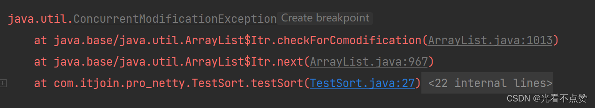
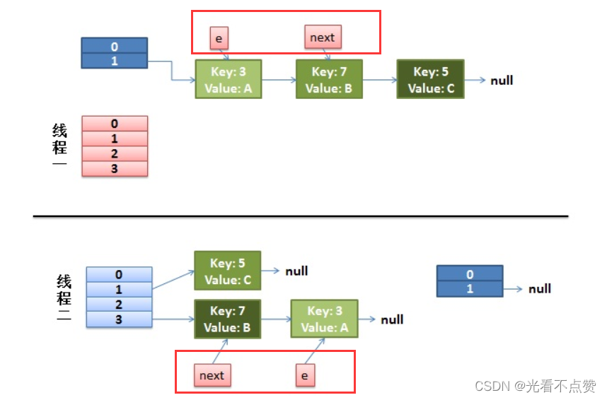
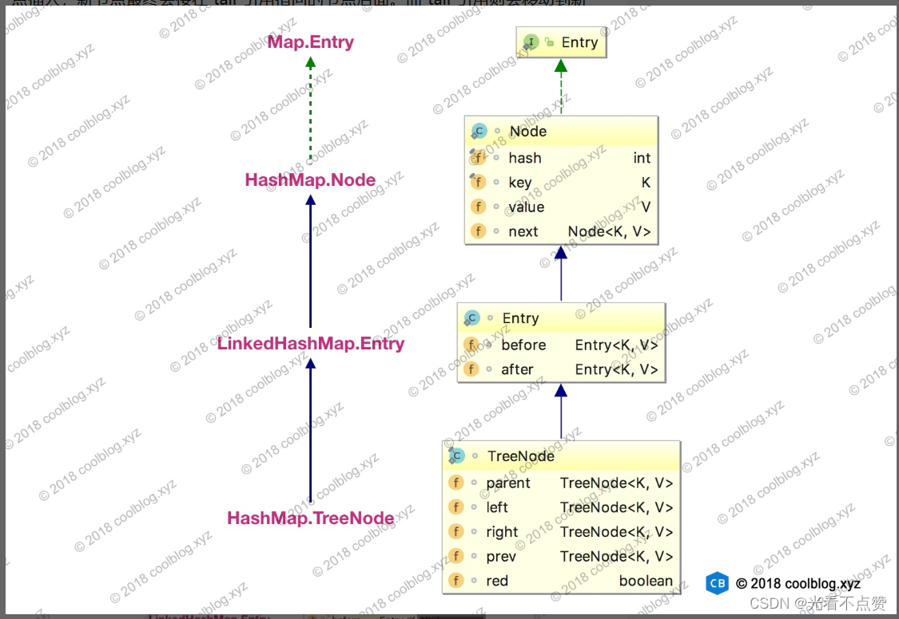

# HashMap 原理

## 概念卡
Q: 为什么 HashMap 的容量必须是 2 的幂？这个设计与"高效散列+索引定位"有什么关系？

A:
- 索引定位公式：`(n - 1) & hash`，其中 n 是数组长度。只有当 n 是 2 的幂时，n-1 的二进制才是全 1（如 16-1=15=0b1111），此时 `&` 操作等价于 `hash % n` 取模，但位运算比取模快一个数量级
- 如果容量不是 2 的幂，n-1 的二进制存在 0 位，`&` 操作会使某些索引位置永远无法被命中（如 n=10, n-1=9=0b1001，最低位永远是 1，导致 index 只能是奇数），大量位置空置而部分位置严重碰撞
- 扩容时也受益：`e.hash & oldCap` 为 0 则位置不变，为 1 则挪到 `原位置+oldCap`，无需 rehash 就能均匀拆分链表——这个优化只有在 2 倍扩容时成立
- 构造函数中通过 `tableSizeFor(int cap)` 将用户传入的任意容量向上取整为最近的 2 的幂

## 机制卡
Q: HashMap 的 hash 扰动函数为什么将高 16 位与低 16 位做异或？为什么不直接用 key.hashCode() 取模？

A:
- key.hashCode() 返回 32 位 int，但实际定位索引时只用了低几位（`(n-1) & hash`，n 通常不超过 65536）。如果直接取模，高 16 位完全不参与索引计算，碰撞率会显著上升
- JDK 设计：`hash = (key == null) ? 0 : (h = key.hashCode()) ^ (h >>> 16)` —— 将高 16 位右移与低 16 位做异或，让高位信息融入低位
- 为什么用异或而非与/或：与运算结果偏向 0，或运算结果偏向 1，异或能让 0 和 1 均匀分布，保留更多熵
- key 为 null 时 hash 固定为 0，这也是 HashMap 允许一个 null key 的原因——null 始终存在 index 0 的位置

## 机制卡
Q: HashMap 的 put 方法和 resize 扩容方法各自的核心流程是怎样的？JDK8 为什么改为尾插法？

A:
- put 流程：
  1. 桶数组未初始化则调用 resize() 分配
  2. `(n - 1) & hash` 定位索引，空则直接插入 Node
  3. 不为空：检查首节点 key 是否相同 → 是红黑树则走 putTreeVal → 是链表则遍历到尾插入，binCount >= 7 且桶数 >= 64 时链表转为红黑树
  4. key 相同则覆盖旧值
  5. ++size > threshold 则 resize()
- resize 流程：
  1. 容量翻倍（oldCap << 1），阈值翻倍
  2. 创建新数组，遍历旧数组每个桶
  3. 单节点：直接 `e.hash & (newCap - 1)` 放入新位置
  4. 红黑树节点：调用 split 拆分
  5. 链表节点：通过 `e.hash & oldCap` 判断是 0 还是 1，0 在原位置不动，1 移到 `原位置 + oldCap`。用 loHead/loTail 和 hiHead/hiTail 两组指针保持顺序
- 改为尾插法的原因：JDK7 的头插法在多线程并发扩容时会导致链表成环，CPU 100% 死循环。JDK8 用尾插法配合 lo/hi 两组链表指针，不逆序，消除了死循环。但 JDK8 的 HashMap 仍然不是线程安全的——put 时的数据覆盖问题依然存在

## 概念卡
Q: 为什么链表转红黑树的阈值是 8？树转回链表的阈值是 6？两个阈值为什么不同？

A:
- 树化阈值为 8 的理论依据：在 hash 分布良好的假设下，桶中节点数服从参数 λ=0.5 的泊松分布。根据概率计算，链表长度达到 8 的概率约为 0.00000006（亿分之六），几乎不可能发生。将阈值设为 8，既能在极端情况下获得红黑树的 O(log n) 查找性能，又避免绝大多数情况下不必要的树化开销
- TreeNode 节点大小约是普通 Node 的 2 倍（维护 parent/left/right/prev/red 五个额外引用），过早树化是空间浪费
- 树转回链表阈值为 6 而非 7 的原因：防止链表和红黑树之间频繁切换（震荡）。如果树化阈值和退化阈值都是 7，size 在 7 附近波动会导致反复 treeify/untreeify，性能抖动严重。差值 2 作为缓冲区

## 边界卡
Q: HashMap 的线程不安全具体体现在哪些方面？JDK7 和 JDK8 的表现有何不同？

A:
- 通用不安全表现（JDK7 和 JDK8 都有的问题）：
  1. put 时的数据覆盖：两个线程同时计算到同一空索引，线程 A 先放入后被线程 B 覆盖（丢数据）
  2. size++ 的非原子性：多线程 put 导致 size 计数不准确，可能远小于实际元素数
  3. get 读到不一致数据：扩容期间一个线程 put 时另一个线程 get，可能读到旧数组或 null
- JDK7 特有：并发扩容死循环。头插法 + 多线程同时 resize 导致链表成环，get 遍历环时 CPU 飙到 100%。根本原因是扩容时链表顺序被逆置 + 多线程交替操作
- JDK8 改进：尾插法消除了死循环，但仍有数据丢失问题。扩容期间两个线程各自创建新数组，后完成的线程覆盖先完成的线程的迁移结果
- 正确替代方案：Collections.synchronizedMap()（全局锁，性能差）、ConcurrentHashMap（分段锁/CAS+synchronized，推荐）
