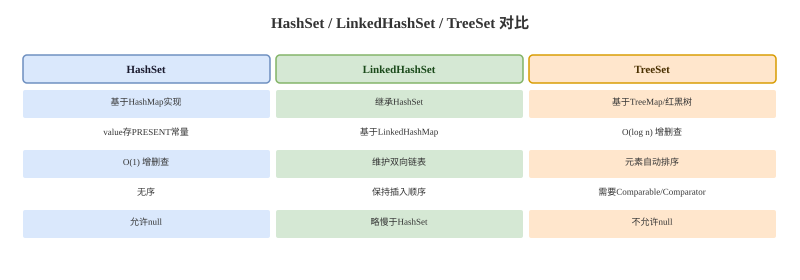

# HashSet、LinkedHashSet 与 TreeSet

## 概念卡
Q: 为什么 JDK 中所有的 Set 实现都基于 Map？这种"代理模式"设计的动机是什么？

A:
- 设计动机：**复用而非重复**
  - Set 的三大核心需求——唯一性判定、哈希存储、快速查找——恰好是 HashMap 的核心能力
  - 直接复用 HashMap 避免了重复实现哈希表、链表转红黑树、扩容等复杂逻辑
- 实现方式：Set 将元素作为 Map 的 key 存储，value 统一指向一个共享的 Object 实例（PRESENT）
- 类比：这是**组合优于继承**的典型应用——Set 组合了一个 Map，而不是继承自 Collection 后重写所有逻辑
- 好处：HashMap 的改进（如 JDK8 引入红黑树）自动惠及 HashSet，零成本升级
- 代价：每个元素多存储一个 PRESENT 引用，但这是一个共享单例，总体代价忽略不计

## 概念卡
Q: HashSet 如何判定两个元素是否"相同"？为什么重写 equals 必须同时重写 hashCode？

A:
- 判定流程分三步（源码路径：putVal -> p.hash == hash && (p.key == key || key.equals(k))）：
  1. 首先比较 hashCode 是否相等，不等则直接判定为不同元素
  2. hashCode 相等后，先用 `==` 比较引用地址，相同则判定为重复
  3. 引用不同时，调用 `equals` 方法比较内容，相同则判定为重复
- 为什么必须同时重写：
  - HashMap 首先通过 hashCode 定位桶位置，如果两个 equals 相等的对象 hashCode 不同，会落到不同桶中，Set 无法判定它们重复
  - 这违反了 `equals` 约定：等价的对象的 hashCode 必须相等
  - 不重写的结果：Set 中出现"看起来一样"的重复元素，程序行为异常

## 机制卡
Q: LinkedHashSet 如何在保证去重的同时维护插入顺序？它的节点结构与 HashSet 有何不同？

A:
- LinkedHashSet 继承 HashSet，底层使用 LinkedHashMap（而非 HashMap）
- LinkedHashMap 的节点类型是 `Entry<K,V>`，继承自 `HashMap.Node<K,V>`，额外增加了 `before` 和 `after` 两个指针：
  ```java
  static class Entry<K,V> extends HashMap.Node<K,V> {
      Entry<K,V> before, after;
      Entry(int hash, K key, V value, Node<K,V> next) {
          super(hash, key, value, next);
      }
  }
  ```
- 双层结构：哈希表提供 O(1) 查找，双向链表维护插入顺序
  - 哈希表的桶数组仍然使用 `Node<K,V>` 类型存储（多态）
  - 双向链表的 head/tail 指针链接所有 Entry，按插入顺序排列
- 新增元素时调用 `linkNodeLast`，将新 Entry 追加到链表尾部
- 可以通过构造函数参数 `accessOrder=true` 切换为维护访问顺序，基于此可实现 LRU 缓存

## 概念卡
Q: TreeSet 凭什么认定两个元素"相同"？与 HashSet 的 equals/hashCode 判定有何本质区别？

A:
- TreeSet 的元素"相同"判定不是根据 equals，而是根据 **Comparator 或 Comparable 的 compareTo 方法**
  - 如果 `compareTo()` 返回 0，则 TreeMap 判定 key 已存在，value 被替换，新元素不会被添加
- 与 HashSet 的本质区别：
  - HashSet：依赖 hashCode + equals，是"相等性"判定
  - TreeSet：依赖 compare 结果，是"顺序等价"判定
- 实际陷阱：当自定义比较器与 equals 不一致时：
  - 如按字符串长度排序，"abc" 和 "def" 的 compareTo 返回 0（长度相同）
  - 此时 TreeSet 认为它们是"相同元素"，但 HashSet 认为它们不同
  - 这是 Set 接口规范明确允许的，但容易产生线上 bug
- 使用无参构造器时，要求元素必须实现 Comparable 接口，否则第一次 put 时抛出 ClassCastException

## 概念卡
Q: TreeSet 使用无参构造器创建时，取出的数据是"无序"还是"有序"？为什么？

A:
- 使用无参构造器时，元素不会按"添加顺序"取出，但会按**元素的自然顺序**（Comparable 接口定义的顺序）排列
- 这种"无序"是指不对插入顺序做保证，但实际内部是排序的：
  - TreeSet 底层是 TreeMap，TreeMap 底层是红黑树
  - 红黑树是一种自平衡二叉搜索树，每次插入都会按 compare 结果放置节点
  - 中序遍历即可获得排序结果
- 若要自定义排序，向构造器传入一个 Comparator 即可
- 注意：如果传入自定义 Comparator，Comparator 的规则决定"唯一性"，且符合该规则的元素只能存在一个
