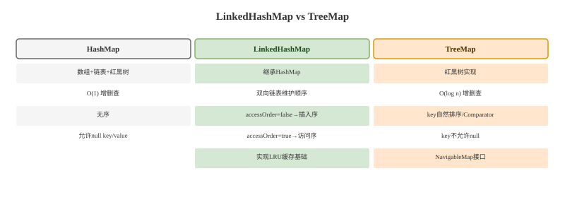

# LinkedHashMap 与 TreeMap

## LinkedHashMap 卡
Q: LinkedHashMap 在 HashMap 基础上多了什么？它如何保证顺序？
A:
- LinkedHashMap 继承 HashMap，节点在 HashMap Node 基础上增加 before/after 指针
- 所有节点额外组成一条双向链表，用于维护遍历顺序
- 默认是插入顺序：先插入的先遍历
- 构造参数 accessOrder=true 时变成访问顺序：get/put 命中后节点会移动到链表尾部
- 面试一句话：HashMap 负责 O(1) 定位，双向链表负责稳定迭代顺序

## LRU 卡
Q: 为什么 LinkedHashMap 可以实现简单 LRU 缓存？
A:
- accessOrder=true 时，每次访问会把节点移动到链表尾部，链表头部就是最久未访问节点
- 重写 removeEldestEntry，可以在插入新节点后判断是否淘汰 eldest
- 这样可以用少量代码实现固定容量 LRU
- 但 LinkedHashMap 本身不是线程安全的，多线程缓存需要外部同步或使用成熟缓存库
- 面试边界：简单 LRU 可以用 LinkedHashMap，生产级缓存还要考虑并发、过期、统计、淘汰策略和内存控制

## TreeMap 卡
Q: TreeMap 的底层结构是什么？它和 HashMap 的查询复杂度有什么区别？
A:
- TreeMap 底层是红黑树，按 key 的自然顺序或 Comparator 排序
- get/put/remove 的时间复杂度是 O(log n)
- HashMap 在 hash 分布良好时期望 O(1)，但不维护 key 顺序
- TreeMap 支持 firstKey、lastKey、floorKey、ceilingKey、subMap 等有序范围查询
- 面试选择：需要排序或范围查询用 TreeMap；只需要快速键值查找通常用 HashMap

## 比较器卡
Q: TreeMap 的 Comparator/Comparable 使用不当会有什么问题？
A:
- TreeMap 判断 key 是否重复，依赖 compare 结果是否为 0，而不是 equals
- 如果 compare 返回 0，即使 equals 为 false，也会被认为是同一个 key，后插入会覆盖旧值
- Comparator 必须满足自反性、传递性和一致性，否则红黑树排序和查找会异常
- key 如果是可变对象，插入后改变参与比较的字段，会破坏树结构的查找语义
- 面试提醒：TreeSet 底层也是 TreeMap，因此去重规则同样依赖比较结果

## 对比卡
Q: HashMap、LinkedHashMap、TreeMap 应该如何选择？
A:
- HashMap：无序，期望 O(1)，最常用的通用 Map
- LinkedHashMap：保持插入顺序或访问顺序，适合顺序遍历和简单 LRU
- TreeMap：按 key 排序，O(log n)，适合范围查询和有序导航
- 三者默认都不是线程安全的，并发场景要考虑 ConcurrentHashMap、Collections.synchronizedMap 或外部锁
- 面试回答要先问需求：是否要顺序、是否要范围查询、是否并发、数据规模和性能目标是什么

## 正确性审查卡
Q: LinkedHashMap 和 TreeMap 有哪些常见误区？
A:
- “LinkedHashMap 按 key 排序”：错误。它维护插入顺序或访问顺序，不按 key 大小排序
- “TreeMap 无参构造就是无序”：错误。无参构造使用 key 的自然顺序，前提是 key 实现 Comparable
- “TreeMap 判断重复靠 equals”：错误。核心看 compare 是否返回 0
- “LinkedHashMap 天然适合生产缓存”：不完整。它能做淘汰骨架，但缺少并发、过期、统计等能力
- “红黑树一定比 HashMap 快”：错误。TreeMap 是 O(log n)，HashMap 期望 O(1)，只是 HashMap 不提供有序能力
