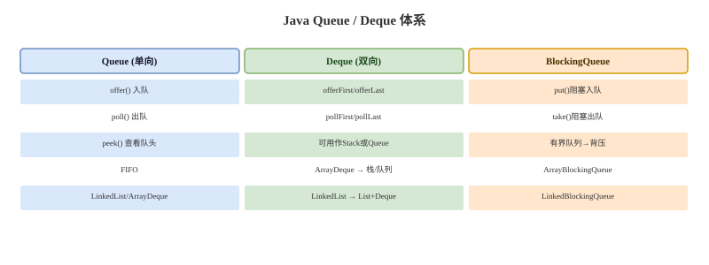

# Queue 与 Deque

## 概念卡
Q: Queue 和 Deque 的语义区别是什么？
A:
- Queue 是单端队列，通常表达 FIFO：一端入队，另一端出队
- Deque 是双端队列，两端都可以插入和删除，可以当队列，也可以当栈
- Queue 常见方法有 offer、poll、peek；Deque 常见方法有 offerFirst/offerLast、pollFirst/pollLast、peekFirst/peekLast
- Java 推荐用 ArrayDeque 替代 Stack 实现栈语义，因为 Stack 继承 Vector，历史包袱重且方法同步开销不必要
- 面试表达：Queue/Deque 重点是抽象语义，不只是某个具体实现类

## API 卡
Q: add/offer、remove/poll、element/peek 有什么区别？
A:
- add 插入失败时抛异常，offer 插入失败时返回 false
- remove 取出失败时抛异常，poll 队列为空时返回 null
- element 查看队头失败时抛异常，peek 队列为空时返回 null
- 在容量受限队列或并发队列中，通常优先使用 offer/poll/peek，调用方更容易处理失败分支
- BlockingQueue 还扩展出 put/take 和带超时的 offer/poll，用于阻塞等待

## ArrayDeque 卡
Q: ArrayDeque 的底层如何实现？为什么常用它替代 Stack 和 LinkedList？
A:
- ArrayDeque 底层是循环数组，通过 head/tail 指针在数组两端移动
- 两端插入删除都是摊还 O(1)，内存局部性比链表好
- 它不允许 null 元素，这样 poll 返回 null 可以明确表示队列为空
- 相比 Stack，ArrayDeque 没有继承 Vector 的同步历史包袱
- 相比 LinkedList，ArrayDeque 少了节点对象和前后指针开销，通常更快、更省内存

## PriorityQueue 卡
Q: PriorityQueue 是队列吗？它的顺序和复杂度是什么？
A:
- PriorityQueue 是优先队列，不保证 FIFO，而是每次 poll 返回优先级最高或最低的元素，取决于 Comparator
- 底层通常是二叉堆，offer/poll 是 O(log n)，peek 是 O(1)
- 它不保证遍历顺序是有序的，只保证队头元素是当前最优先元素
- 它不是线程安全的，并发优先队列可考虑 PriorityBlockingQueue
- 面试陷阱：PriorityQueue 如果 Comparator 不稳定或 key 可变，会导致堆序语义出问题

## 选择卡
Q: ArrayDeque、LinkedList、PriorityQueue、BlockingQueue 应该如何选择？
A:
- 普通 FIFO 队列或栈：优先 ArrayDeque
- 需要频繁在中间删除、或必须保存 null 以外的链表节点操作：才考虑 LinkedList，但实际业务中较少
- 需要按优先级取元素：PriorityQueue
- 多线程生产者-消费者，且需要阻塞/背压：BlockingQueue
- 并发非阻塞队列：ConcurrentLinkedQueue

## 正确性审查卡
Q: Queue/Deque 有哪些常见误区？
A:
- “Queue 一定先进先出”：不严谨。PriorityQueue 也是 Queue，但按优先级出队
- “LinkedList 做队列最好”：通常不对。ArrayDeque 的数组局部性和更少对象分配往往更好
- “PriorityQueue 遍历是有序的”：错误。只有 poll 连续取出才体现优先级顺序
- “poll 返回 null 一定表示队列空”：对不允许 null 的队列成立；如果某实现允许 null，语义会混淆，所以多数队列不允许 null
- “Deque 和 Stack 是一回事”：Deque 可以表达栈，但 API 更现代，Stack 是早期同步类
