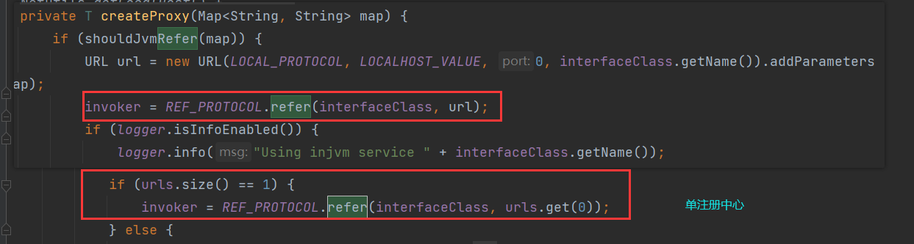

# 深入理解Dubbo与实战（三）| Dubbo启停原理解析

type: Post
status: Published
date: 2022/08/14
summary: Dubbo启停原理解析
tags: Dubbo
category: 中间件

# Dubbo启停原理解析

- 概述

> 本章将详细探讨Dubbo配置的设计模型、服务暴露的原理、服务消费的原理和优雅停机的原理。首先，学习优雅的分层配置设计，能够帮助我们更好地理解框架的启动配置逻辑，不管是注解还是XML配置都需要配置对象来承载。然后探讨服务暴露和服务消费的细节。最后研究优雅停机特性，能够保证线上服务和消费方平滑地退出。
> 

## 1.配置解析

- 常用的配置方式

> 目前Dubbo框架同时提供了 3种配置方式：`XML配置、注解、属性文件(properties和ymal)配置，最常用的还是XML和注解两种方式`。
> 

### 1.1 基于schema设计解析

- `dubbo.xsd`

> 该文件是约束XML配置时的标签和对应的属性，在编写时使用属性进行自动提示，默认目录在`dubbo-config/dubbo-configspring/src/main/resources/dubbo.xsd`
> 

> 在Spring中解析到自定义标签时会查找对应的`spring.schemas和spring.handlers`文件（**这两个文件中前者指定dubbo.xsd的位置，后者指定初始化和解析的类的全类名**），最终触发Dubbo的DubboNamespaceHandler类来进行初始化和解析。
> 
- schema层级的设计图

> 左边代表 schema 有继承关系的类型， 右边是独立的类型。
> 


- 模块说明


- 在xsd中编写配置实例

> 这样编写以后就会在XML文件中智能提示，当我们基于Dubbo做二次开发时，应该在schema中添
加合适的字段，同时应该在dubbo-config-api对应的Config类中添加属性和get & set方法， 这样用户在配置属性框架时会自动注入这个值。只有属性定义是不够的，为了让Spring正确解析标签，我们要定义element标签
> 


- 注意

> 目前绝大多数场景使用默认的Dubbo配置就足够了，如果新增特性，比如增加epoll特性， 则只需要在`providerType、consumerType、ProviderConfig 和 ConsumerConfig` 中增加 epoll属性和方法即可。如果使用已经存在schema类型(比如说protocolType)，则只需要添加新属性即可，也不需要定义新的element标签。如果接口是级别通用的，一般我们只需要在interfaceType中增加属性即可，继承自interfaceType的类型会拥有该字段。同理，在Dubbo对应类AbstractInterfaceConfig中增加属性和方法即可。
> 

### 1.2 基于XML配置原理解析

- 概述

> 上面我们讲到配置约束规范是在xsd中，那么框架是如何解析配置的呢。主要解析逻辑入口是在DubboNamespaceHandler类中完成的
> 
- DubboNamespaceHandler源码

> DubboNamespaceHandler主要把不同的标签关联到解析实现类中。`registerBeanDefinitionParser`
方法约定了在Dubbo框架中遇到标签`application、module和registry`等都会委托给`DubboBeanDefinitionParser`处理。
> 

```java
public class DubboNamespaceHandler extends NamespaceHandlerSupport implements ConfigurableSourceBeanMetadataElement {

    static {
        Version.checkDuplicate(DubboNamespaceHandler.class);
    }

    @Override
    public void init() {
        registerBeanDefinitionParser("application", new DubboBeanDefinitionParser(ApplicationConfig.class, true));
        registerBeanDefinitionParser("module", new DubboBeanDefinitionParser(ModuleConfig.class, true));
        registerBeanDefinitionParser("registry", new DubboBeanDefinitionParser(RegistryConfig.class, true));
        .............................
```

- DubboBeanDefinitionParser源码解析

> 这里主要就是看里面的`parse`方法，源码很长我们就讲述里面所做的工作
> 

==第一步：把标签解析成对应的Bean并注册到Spring上下文，同时保证单例==

> 生成 Spring的Bean定义，指定 beanClass 交给Spring反射创建实例确保Spring容器没有重复的Bean定义依次尝试获取XML配置标签name和interface作为Bean唯一id果协议标签没有指定name，则默认用 Dubbo检查重复Bean，如果有则生成唯一 id每次解析会向Spring注册新的BeanDefinition，后续会追加属性
> 

==第一步细节：标签如何解析==

> • 如果`<dubbo : service>`配置了class属性,那么为具体class配置的类注册Bean，并注入ref属性
• parseProperties方法会把key-value键值对提取出来放到BeanDefinition中， 运行时Spring会自动处理注入值，因此ServiceBean就会包含用户配置的属性值了。
• 如果是`<dubbo:provider>`这种内部嵌套了server标签时，就会在解析内部的service并生成Bean的时候，会把外层provider实例对象注入service，这种设计方式允许内部标签直接获取外部标签属性。
• 那么标签里面的内容（attribute）怎么提取：首先会查看配置对象有无get、set和is前缀方法有就反射储存，没有则当作parameters参数存储，parameters是一个Map对象；如果属性是引用对象，则Dubbo默认会创建RuntimeBeanReference类型注入，运行时由Spring注入引用对象。
> 

==第二步：标签解析过程==

> 获取具体配置对象所有方法，比如ProviderConfig类查找所有set前缀方法，并且只有一个参数的public方法提取set对应的属性名字，比如setTimeout，会得到 timeout校验是否有对应属性get或is前缀方法，没有就跳过直接获取标签属性值把匹配到的属性注入Spring的Bean剩余不匹配的attribute当作parameters注入Beanprops中保存了所有正确解析的属性， `!props.contains(name)`排除已经解析的值
> 

### 1.3 基于注解配置原理解析

- 开源前未重写注解的缺点

> 因为原来注解是基于AnnotationBean实现的， 主要存在以下几个问题：
> 
> - 注解支持不充分，需要XML配置＜dubbo:annotation＞；
> - @ServiceBean 不支持 Spring AOP；
> - @Reference不支持字段继承性。
- 注解相关的核心组件

> 注解处理逻辑主要包含3部分内容：
> 
> - 第一部分是如果用户使用了配置文件，则框架按需生成对应Bean
> - 第二部分是要将所有使用Dubbo的注解@Service的class提升为Bean
> - 第三部分要为使用@Reference注解的字段或方法注入代理对象。
> 
> 
> 

==注解EnableDubbo==

> 当Spring容器启动的时候，如果注解上面使用.Import,则会触发其注解方法selectimports，比如 EnableDubboConfig 注解中指定的 DubboConfigConfigurationSelector.class，会自动触
发 DubboConfigConfigurationSelector#selectImports 方法。
> 

```java
@EnableDubboConfig
@DubboComponentScan
public @interface EnableDubbo {
....
}

@Import(DubboConfigConfigurationRegistrar.class)
public @interface EnableDubboConfig {		//EnableDubboConfig 注解
...
}

@Import(DubboComponentScanRegistrar.class)
public @interface DubboComponentScan {		//DubboComponentScan 注解
...
}
```

- DubboConfigConfiguration相关解读

> DubboConfigConfiguration 里面标注了@EnableDubboConfigBindings，@EnableDubboConfigBindings同样指定了@Import(DubboConfigBindingsRegistrar.class)。因为@EnableDubboConfigBindings允许指定多个@EnableDubboConfigBinding注解,Dubbo会根据用户配置属性自动填充这些承载的对象
> 


- Dubbo解析注解属性步骤——`ConfigurationBeanBindingsRegister`

> 有下面两步我们就知道这个类所做的：**如果用户配置了属性，[比如dubbo.application.name](http://xn--dubbo-gv5ij80i.application.name/),则会自动创建对应Spring Bean到容器。注册和配置对象Bean属性绑定处理器DubboConfigBindingBeanPostProcessor，委托Spring做属性值绑定**。
> 
> 1. 获取`EnableDubboConfigBindings`注解所有值
> 2. 将每个`EnableDubboConfigBinding`注解包含的Bean注册到Spring容器
- @Service注解如何进行服务暴露

> 当用户使用注解旧DubboComponentScan 时，会激活 DubboComponentScanRegistrar, 同时生成 `ServiceAnnotationBeanPostProcessor 和 ReferenceAnnotationBeanPostProcessor`两种处理器，通过名称很容易知道分别是处理服务注解和消费注解。
> 

==ServiceAnnotationBeanPostProcessor==

> 因为 ServiceAnnotationBeanPostProcessor 处理器实现了 BeanDefinitionRegistryPostProcessor接口，Spring容器中所有Bean注册之后回调postProcessBeanDefinitionRegistry方法开始扫描旧Service注解并注入容器
> 
> 1. 取用户注解配置的包扫描：因为包名可能使用`${...}`占位符，因此框架会调用Spring的占位符解析做进一步解码
> 2. 注解扫描：触发ServiceBean定义和注入
> 3. **指定扫描dubbo的注解@Service,不会扫描Spring的Service注解**
> 4. 将@Servcie 作为不同 Bean 注入容器：这里并没有设置beanClass
> 5. 对扫描的服务创建 BeanDefinitionHolder，用于生成ServiceBean 定义：根据注册的普通Bean生成ServiceBean的占位符，用于后面的属性注入逻辑
> 6. 注册ServiceBean定义并做数据绑定和解析：提取普通Bean上标注的Service注解生成新的RootBeanDefinition,用于Spring启动后的服务暴露

==ReferenceAnnotationBeanPostProcessor==

> 在实际使用过程中，我们会在旧Service注解的服务中注入旧Reference注解，这样就可以很方便地发起远程服务调用，Dubbo中做属性注入是通过ReferenceAnnotationBeanPostProcessor处理的，主要做以下几种事情：
> 
> 1. 获取类中标注的@Reference注解的字段和方法。主要就是靠postProcessPropertyValues方法
> 2. 反射设置字段或方法对应的引用。
> 3. 遍历服务类所有的字段，查找Reference注解标注，并注入ReferenceBean类，这个类增加了 Spring初始化等生命周期方法

> 因为处理器 ReferenceAnnotationBeanPostProcessor 实现了 InstantiationAwareBeanPostProcessor
接口，所以在Spring的Bean中初始化前会触发postProcessPropertyValues方法我们做进一步处理，比如增加属性和属性值修改等。
> 


## 2.服务暴露的实现原理

- 概述

> 这节我们探讨服务是如何依靠前面的配置进行服务暴露的。
> 

### 2.1 配置承载初始化

- 默认覆盖策略规则

> 不管在服务暴露还是服务消费场景下，Dubbo框架都会根据优先级对配置信息做聚合处理，目前默认覆盖策略主要遵循以下几点规则：
> 
> - D 传递给 JVM 参数优先级最高，比如`Ddubbo. protocol.port=20880`
> - 代码或XML配置优先级次高，比如Spring中XML文件指定`<dubbo:protocol port="20880"/>`
> - 配置文件优先级最低，比如 `dubbo.properties` 文件指定 `dubbo.protocol.port=20880`。一般推荐使用`dubbo.properties`作为默认值，只有XML没有配置时，`dubbo.properties`配置项才会生效，通常用于共享公共配置，比如应用名等。
- 运行时属性值影响

> Dubbo的配置也会受到provider的影响，这个属于运行期属性值影响，同样遵循以下几点规则：
> 
> 1. 如果只有provider端指定配置，则会自动透传到客户端(比如timeout)
> 2. 如果客户端也配置了相应属性，则服务端配置会被覆盖(比如timeout)

### 2.2 远程服务的暴露机制

- RPC的暴露原理示意图

> 在整体上看，Dubbo框架做服务暴露分为两大部分，第一步将持有的服务实例通过代理转换成Invoker，第二步会把Invoker通过具体的协议（比如Dubbo）转换成Exporter，框架做了这层抽象也大大方便了功能扩展。这里的Invoker可以简单理解成一个真实的服务对象实例，是Dubbo框架实体域，所有模型都会向它靠拢，可向它发起invoke调用。它可能是一个本地的实现，也可能是一个远程的实现，还可能是一个集群实现。
> 


- 入口点——doExport

> 框架真正进行服务暴露的入口点在`ServiceConfig#doExport`中，无论XML还是注解，都会转换成`ServiceBean`，它继承自`ServiceConfig`，在服务暴露前会按照覆盖策略生效，主要处理思路就是遍历服务的所有方法，如果没有值则尝试从`-D`选项中读取，如果还没有则自动从配置文件`dubbo.properties`中读取。
> 
- 多协议多注册中心暴露——doExportUrls

> Dubbo支持多注册中心同时写，如果配置了服务同时注册多个注册中心，则会在`ServiceConfig#doExportUrls`中依次暴露
> 
> 
> 
> 

> Dubbo也支持相同服务暴露多个协议，比如同时暴露Dubbo和REST协议，框架内部会依次对使用的协议都做一次服务暴露，每个协议注册元数据都会写入多个注册中心。
> 
- 细节之——doExportUrlsFor1Protocol

> 
> 
> 1. 通过反射读取其他配置信息的对象到map，用于后续构造URL（比如应用名）
> 2. 读取全局配置信息，会自动添加前缀（默认在属性前面增加default.前缀，当框架获取URL中的参数时，如果不存在则会自动尝试获取default.前缀对应的值。）
> 3. 本地内存（JVM）服务暴露
> 4. 如果配置了监控地址，则服务调用信息会在拦截器中执行并上报
> 5. 通过动态代理转换成Invoker（在服务端生成的是AbstractProxylnvoker实例，所有真实的方法调用都会委托给代理，然后代理转发给服务ref 调用），registryURL存储的是注册中心地址，使用export作为key追加服务元数据信息
> 6. 服务暴露（端口打开）后向注册中心注册服务信息
> 7. 处理没有注册中心场景，直接暴露服务。不需要元数据注册，因为这里暴露的URL信息是以具体RPC协议开头的，并不是以注册中心协议开头的。
> 
> 
> 
- 注册中心在服务暴露所做的事情——`RegistryProtocol#export`

> 注册中心接收到这个URL会提取出具体协议，例如zookeeper会创建注册中心实例，然后取出export对应的具体服务URL，最后用服务对应的协议进行暴露，当服务暴露成功后把服务数据注册到ZooKeeper
> 
> 1. 委托具体协议(Dubbo)进行服务暴露，创建NettyServer监听端口和保存服务实例（存入map）。
> 2. 创建注册中心对象，与注册中心创建TCP连接。
> 3. 注册服务元数据到注册中心。
> 4. 订阅configurators节点，监听服务动态属性变更事件。 用于处理动态配置
> 5. 服务销毁收尾工作，比如关闭端口、反注册服务信息和去掉订阅配置监听器等。

==题外话之——代理==

> 目前框架实现两种代理：JavassistProxyFactory 和 JDdkProxyFactory。
> 
> - JavassistProxyFactory模式原理：创建Wrapper子类,在子类中实现invokeMethod方法，方法体内会为每个ref方法都做方法名和方法参数匹配校验，如果匹配则直接调用即可
> - JdkProxyFactory省去了反射调用的开销。DdkProxyFactory模式是我们常见的用法，通过反射获取真实对象的方法，然后调用即可。
- 拦截器的初始化——`ProtocolFilterWrapper——ListenerExporterWrapper#export`

> 当服务真实调用时会触发各种拦截器Filter，真正初始化的时机是在委托协议进行服务暴露之前框架会做拦截器初始化，加载 protocol 扩展点时会自动注入 Protocol Listenerwrapper 和 ProtocolFilterWrapper。
> 


1. 对服务先构造拦截器链（会过滤provider端分组即对provider生效的数据），然后触发Dubbo协议暴露
2. 会把真实的Invoker 服务对象ref 放到拦截器的末尾，**然后逐层包裹其他拦截器，这样保证了真实服务调用是最后触发的**
3. 为每个filter生成一个exporter，依次串起来
4. 每次调用都会传递给下一个拦截器（是否调用下一个拦截器由具体拦截器实现。）
- Dubbo协议进行服务暴露——`DubboProtocol#export`

> **在构造调用拦截器之后**会调用Dubbo协议进行服务暴露，具体过程如下
> 
> 1. 根据服务分组、版本、接口和端口构造key用于关联具体服务Invoker。
> 2. 把exporter存储到单例DubboProtocol 中
> 3. 服务**初次**（对服务暴露做校验判断，因为同一个协议暴露有很多接口）暴露会创建监听服务器
> 4. 创建NettyServer并且初始化Handler（在初始化Server过程中会初始化很多Handler用于支持一些特性，比如心跳、业务线程池处理编解码的Handler和口向应方法调用的Handler）

### 2.3 本地服务的暴露机制

- 概述

> 上一节我们讲了远程调用服务暴露的过程，但是需要使用Dubbo会有在同一个JVM中内部有引用自身服务的情况。Dubbo默认会把远程服务用`injvm`协议再暴露一份，这样消费方直接消费同一个JVM内部的服务，避免了跨网络进行远程通信。
> 
- 本地服务暴露细节——`ServiceConfig#exportLocal`

> 
> 
> 1. 显式指定injvm协议进行暴露，**这个协议比较特殊，不会做端口打开操作，仅仅把服务保存在内存中而已。**
> 2. 调用 `InjvmProtocol#export`，会提取URL中的协议，在InjvmProtocol类中存储服务实例信息，它的实现也是非常直截了当的，直接返回InjvmExporter实例对象，构造函数内部会把当前Invoker加入exporterMap

## 3.服务消费的实现原理

### 3.1 单注册中心消费原理

- RPC消费原理示意图

> Dubbo框架做服务消费也分为两大部分：
> 
> - 第一步通过持有远程服务实例生成Invoker，这个Invoker在客户端是核心的远程代理对象。
> - 第二步会把Invoker通过动态代理转换成实现用户接口的动态代理引用。**这里的Invoker承载了网络连接、服务调用和重试等功能，在客户端，它可能是一个远程的实现，也可能是一个集群实现。**
> 
> 
> 
- 服务引用的入口点——`ReferenceBean#getObjet`

> 不管是XML还是注解，都会转换成ReferenceBean，它继承自ReferenceConfig，主要处理思路就是遍历服务的所有方法，**如果没有值则会尝试从 D选项中读取，如果还没有则自动从配置文件dubbo.properties 中读取。**
> 
- 多协议多注册中心消费

> Dubbo支持多注册中心同时消费，如果配置了服务同时注册多个注册中心，则会在`ReferenceConfig#createProxy` 中合并成一个 Invoker
> 
> 1. 默认检查是否是同一个JVM内部引用
> 2. 直接使用injvm协议从内存中获取实例（跟前面服务暴露时服务实例都放到内存map中，那么消费时直接拿）
> 3. 注册中心地址后添加refer存储服务，消费元数据信息
> 4. 单注册中心消费：处理只有一个注册中心的场景，这种场景在客户端中是最常见的，客户端启动拉取服务元数据，订阅provider、路由和配置变更
> 5. 逐个获取注册中心的服务，并添加到invokers列表
> 6. 通过cluster将多个Invoker转换成一个Invoker
> 7. 把Invoker转换成接口代理，最终代理接口都会创建InvokerlnvocationHandler,这个类实现了 JDk 的 InvocationHandler 接口，所以服务暴露的Dubbo接口都会委托给代理去发起远程调用(injvm协议除外)。

==细节解析之——injvm协议从内存中获取实例——RegistryProtocol#refer==

> 这段逻辑主要完成了注册中心实例的创建，元数据注册到注册中心及订阅的功能。
> 
> 1. 设置具体注册中心协议，比如 ZooKeeper（具体注册中心协议会在启动时用registry存储对应值）
> 2. 创建具体注册中心实例（这里的URL其实是注册中心地址，真实消费方的元数据信息是放在refer属性中存储的。）
> 3. 根据配置处理多分组结果聚合（**大白话就是提取消费方refer中保存的元数据信息，如果包含多个分组值则会把调用结果值做合并处理**）
> 4. 理订阅数据并通过 cluster合并多个Invoker
> 5. 消费核心关键，持有实际Invoker和接收订阅通知（RegistryDirectory实现了 NotifyListener接口，服务变更会触发这个类回调notify方法，用于重新引用服务）
> 6. 注册消费信息（消费方应用名、IP和端口号等）到注册中心
> 7. 订阅服务提供者、路由和动态配置（第一次发起订阅时会进行一次数据拉取操作）
> 8. 通过 Cluster 合并 invokers（多个服务），同时默认也会启用FailoverCluster策略进行服务调用重试。
>     
>     
>     

==细节解析之——具体远程Invoker是在哪里创建——拦截器何时构造——RegistryDirectory#toInvokers==

> 在上面的refer方法的第七步中会进行一次数据拉取此时就会完成Invoker转换，下面是toInvokers的具体步骤
> 
> 1. 根据消费方protocol配置过滤不匹配协议（Dubbo框架允许在消费方配置只消费指定协议的服务）
> 2. 合并provider端配置数据，比如服务端IP和port等（在客户端进行合并，获得这些消息就解耦了消费方的强绑定配置）
> 3. 忽略重复推送的服务列表，防止重复引用
> 4. 使用具体协议创建远程连接
> 5. 在真实远程连接建立后也会发起拦截器构建操作（与2.2.2 小节中拦截器的叙述基本保持一致，只不过初始化逻辑是在前者ProtocolFilterWrapper的refer方法中）

==细节解析之——真正invokers创建时机——RegistryDirectory#toInvokers——DubboProtocol#refer——DubboProtocol#initClient==

> Dubbo协议在返回Dubbolnvoker对象之前会先初始化客户端连接对象。Dubbo支持客户端是否立即和远程服务建立TCP连接是由参数是否配置了 lazy属性决定的，默认会全部连接
> 
> 1. 如果配置了 lazy属性，则真实RPC调用才会创建TCP连接
> 2. 立即与远程连接（没有lazy则会立即调用），具体使用底层传输也是根据配置transporter决定的，默认是Netty传输。会触发HeaderExchanger#connect调用，用于支持心跳和在业务线程中编解码Handler,最终会调用Transporters#connect生成Netty客户端处理。

### 3.2 多注册中心消费原理

- 概述

> 在实际使用过程中，我们更多遇到的是单注册中心场景，但是当跨机房消费时，Dubbo框架允许同时消费多个机房服务。**默认Dubbo消费机房的服务顺序是按照配置注册中心的顺序决定的，配置靠前优先消费。**
> 
- 原理

> 多注册中心消费原理比较简单，每个单独注册中心抽象成一个单独的Invoker,多个注册中心实例最终通过StaticDirectory保存所有的Invoker,最终通过Cluster合并成一个Invoker（**第一层包含的服务Invoker是注册中心实例，对应注册中心实例的Invoker对象内部持有真实的服务提供者对象列表**）。这里还有一个特殊点，在多注册中心场景下，默认使用的集群策略是available
> 
- 多注册中心集群策略——AvailableCluster#join

> 
> 
> 1. 实现dolnvoke实际持有的invokers列表是注册中心实例，比如配置了 ZooKeeper和etcd3注册中心，实际调用的invokers列表只有2个元素。
> 2. 判断具体注册中心中是否有服务可用，这里发起的invoke实际上会通过注册中心RegistryDirectory获取真实provider机器列表进行路由和负载均衡调用。

### 3.3 直连服务消费原理

- 概述

> Dubbo可以绕过注册中心直接向指定服务(直接指定目标IP和端口)发起RPC调用，使用直连模式可以方便在某些场景下使用，比如压测指定机器等。
> 

## 4.优雅停机原理解析

- 概述

> 优雅停机特性是所有RPC框架中非常重要的特性之一，因为核心业务在服务器中正在执行时突然中断可能会出现严重后果。
> 
> 1. 收到kill 9进程退出信号，Spring容器会触发容器销毁事件。
> 2. provider端会取消注册服务元数据信息。
> 3. consumer端会收到最新地址列表（不包含准备停机的地址）。
> 4. Dubbo协议会发送readonly事件报文通知consumer服务不可用。 （降低网络延迟的损耗，Dubbo协议发送readonly时间报文时，consumer端会设置响应的provider为不可用状态，下次负载均衡就不会调用下线的机器。）
> 5. 服务端等待已经执行的任务结束并拒绝新任务执行。
> 
> 
>