# MySQL是怎样运行的：从根儿上理解MySQL | B+树索引以及索引优化

type: Post
status: Published
date: 2022/09/06
slug: example-9
summary: 在MySQL中默认的行格式是Compact，这里说额外说一下记录头信息是干嘛的，它是由固定的 5 个字节组成。逻辑上也是一行，里面的内容每隔几个几个位就能标记某种状态，大概能标记下面的每种状态
tags: Mysql
category: 数据库

# 快速查询的秘籍-B+树索引

- 行格式

> 在MySQL中默认的行格式是Compact，这里说额外说一下记录头信息是干嘛的，它是由固定的 5 个字节组成。逻辑上也是一行，里面的内容每隔几个几个位就能标记某种状态，大概能标记下面的每种状态
> 
> - `delete_mask`：标记该记录是否被删除
> - `min_rec_mask`：是否为B+树的每层非叶子节点中的最小记录
> - `n_owned`：表示当前分组拥有的记录数，只会在当前分组中的最大记录中表明，其他都为0
> - `heap_no`：表示当前记录在记录堆的位置信息
> - `record_type`：表示当前记录的类型，**0表示普通记录，1表示B+树非叶子节点记录，2表示最小记录，3表示最大记录**
> - `next_record`：表示下一条记录的相对位置

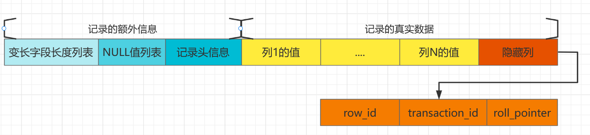

- 隐藏列

> row_id：不是必须，占6个字节；作用是行的ID，唯一标识一条记录transaction_id：是必须记录，占6个字节，标识占用的事务IDroll_pointer：是必须记录，占7个字节，称为回滚指针，在日志中会有大作用
> 
- 页的存放

> 在mysql中我们知道页与页的连接是双向链表（页与页不必在物理上连接），而页内的记录是一个单向链表；页内记录会被平均分成几个组（每个组最多8个记录），每个组的最大记录会被除槽0和末尾槽的其他槽位指针指向（这些装槽的地方就是页目录），槽0指向是这个页中最小的记录；末尾槽指向这个页的最大记录，目录页同理也是这样，整个遍历的过程使用二分非常容易找到对应的记录。
> 
- 图例

> 这里我们标记每个记录只标明记录头信息（n_owned和next_record属性）、主键值（按主键排序）还有其他信息
> 
> - 为了让箭头顺序（记录与记录之间是单链表）更直观我在前面的几个都标了序号；蓝色的就是记录头信息
>     
>     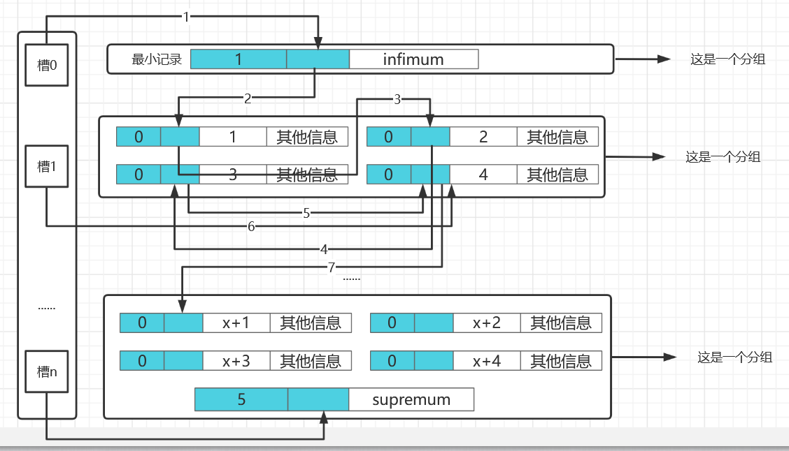
>     

## 1.没有索引的查找

- 概述

> 在正式介绍 索引 之前，我们需要了解一下没有索引的时候是怎么查找记录的。为了方便大家理解，我们下边先只看搜索条件为对某个列精确匹配的情况，所谓精确匹配，就是搜索条件中用等于=连接起的表达式，比如这样：
> 

```sql
SELECT [列名列表] FROM 表名 WHERE 列名 = xxx;

```

### 1.1 在一个页中的查找

- 概述

> 假设现在只有一个页，那么可以根据搜索条件分为两种不能的情况
> 
> - 以主键为搜索条件：**就是通过在页目录中使用二分快速定位到对应的槽**，然后再遍历该槽对应分组中的记录即可快速找到指定的记录。
> - 以其他列为搜索条件：**因为在数据页中并没有对非主键列建立所谓的 页目录** ，所以我们无法通过二分法快速定位相应的 槽 。这种情况下只能从 最小记录 开始依次遍历单链表中的每条记录，然后对比每条记录是不是符合搜索条件。很显然，这种查找的效率是非常低的。

### 1.2 在很多页中查找

- 概述

> 在一个表中有很多记录是常事，所以寻找可以分为两个步骤
> 
> 1. 定位到记录所在的页。
> 2. 从所在的页内中查找相应的记录。
- 注意

> 如果在没有索引的情况下，由于我们并不能快速的定位到记录所在的页，无论你根据主键还是其他列都是一页一页随着双向链表进行查找的；因为各个页中的记录并没有规律，我们并不知道我们的搜索条件匹配哪些页中的记录，所以 不得不 依次遍历所有的数据页。
> 

## 2.索引

- 概述

> 首先让我们忘记索引的存在，看看几条记录在页中的存储方式就是上面我们图所画出来的那样，我们先简单建一个表，插几条数据，再看看记录是如何存放的
> 

```sql
mysql> CREATE TABLE index_demo(
 -> c1 INT,
 -> c2 INT,
 -> c3 CHAR(1),
 -> PRIMARY KEY(c1)
 -> ) ROW_FORMAT = Compact;
Query OK, 0 rows affected (0.03 sec)

```

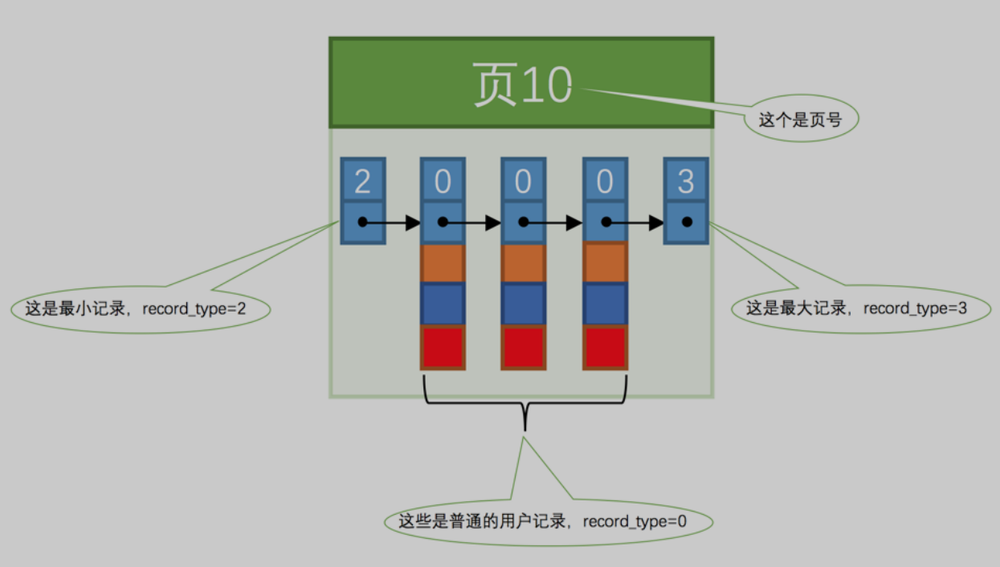

### 2.1 一个简单的索引方案

- 概述

> 回想一下主键是如何在一个页中快速定位到某条记录的，起关键性作用的就是目录项；那么我们是不是可以在页与页之间也引入一个类似于目录的东西起到快速指路的作用呢？我们需要遵守规则：
> 
> - 下一个数据页中用户记录的主键值必须大于上一个页中用户记录的主键值。
- 插入几条数据

> 我们假设一个页最多可以放三条数据，第四条时就要进行页分裂
> 

```java
mysql> INSERT INTO index_demo VALUES(1, 4, 'u'), (3, 9, 'd'), (5, 3, 'y');
 Query OK, 3 rows affected (0.01 sec)
 Records: 3 Duplicates: 0 Warnings: 0

 mysql> INSERT INTO index_demo VALUES(4, 4, 'a');
 Query OK, 1 row affected (0.00 sec)

```

==第一步==

> 此时变成了这样，之所以页号是不连续的，因为页在存储空间里可能并不挨着，但是你仔细看这是不符合我们后面的页的记录必须大于前一个页的要求的
> 
> 
> 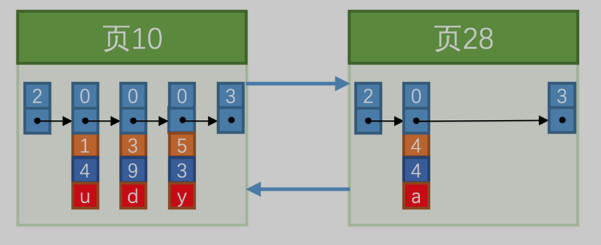
> 

==第二步——页分裂==

> 所以我们要经过一些记录的移动操作，来保证状态一直成立，这个过程我们也可以称为
> 
> 
> ```
> 页分裂
> ```
> 
> 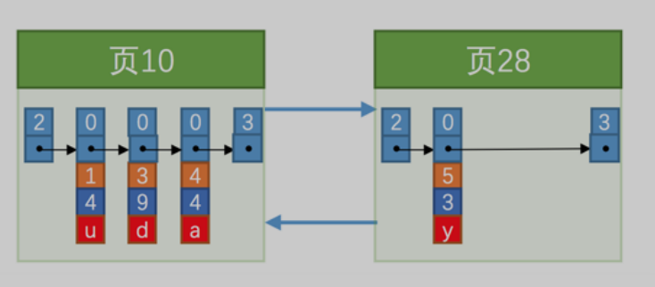
> 

==第三步——给所有的页建立一个目录项——索引==

> 当我们插入了很多条数据以后，就会产生很多页，那如果是你你怎么快速在这么多页找到记录，显然没有外力的帮助下只能一页一页的找，那么我们就可以做一个目录，那么就会变成下面这样。这样我们又能愉快的使用二分进行查找了
目录的内容：
> 
> - 页的用户记录中最小的主键值，我们用 key 来表示。
> - 页号，我们用 page_no 表示。
>     
>     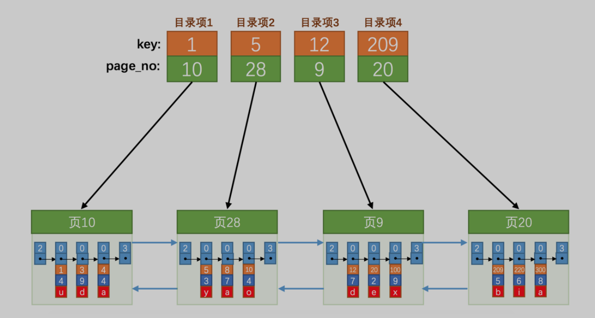
>     

### 2.2 InnoDB中的索引方案

- 简单方案的缺陷，因为我们要快速遍历这些目录项肯定要保证，目录项在物理上是挨着的

> 上面简单方案会产生几个问题：
> 
> 1. 当数据页过多时，会产生更多的目录项，物理上这么大量肯定是不现实的
> 2. 如果把目录项对应页的记录全部删除就会导致后面的记录都要进行移动，显然很费资源
- 解决方案

> 在InnoDB中就引入将目录项抽象成记录，全部包装成一个目录页。只不过 目录项 中的两个列是 主键和页号 而已，所以复用了之前存储用户记录的数据页来存储目录项
> 

> 也许你会有疑问，我遍历到目录页的时候怎么知道这是目录页，遍历到目录项记录怎么知道这是不是用户记录。这就回想一下行格式中的记录头信息，里面有一个record_type的属性，目录项记录为1，用户记录有0
> 
- 图示

> 现在就变成这样了
> 
> 
> 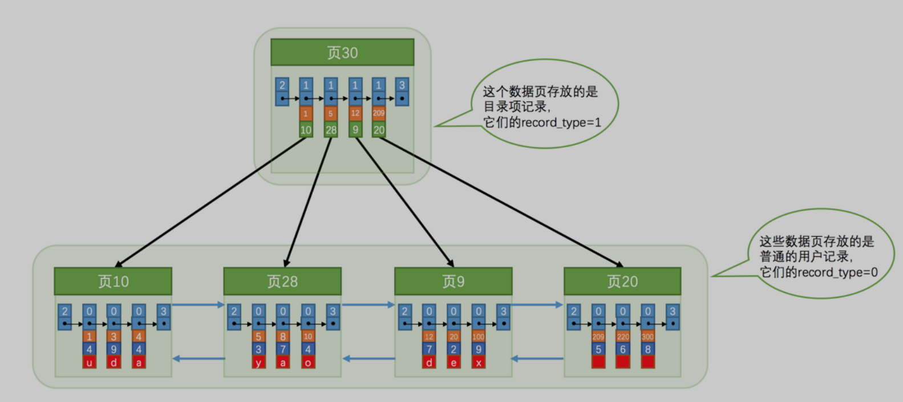
> 
- 那如果数据页太多怎么？

> 再来一页存放目录项记录的
> 
- 那如果目录页太多怎么?

> 因为页与页之间物理上可能不连续，目录页太多那我们怎么根据主键值快速定位一个存储 目录项记录 的页呢？其实也简单，为这些存储 目录项记录 的页再生成一个更高级的目录，就像是一个多级目录一样，大目录里嵌套小目录，小目录里才是实际的数据
> 
> 
> 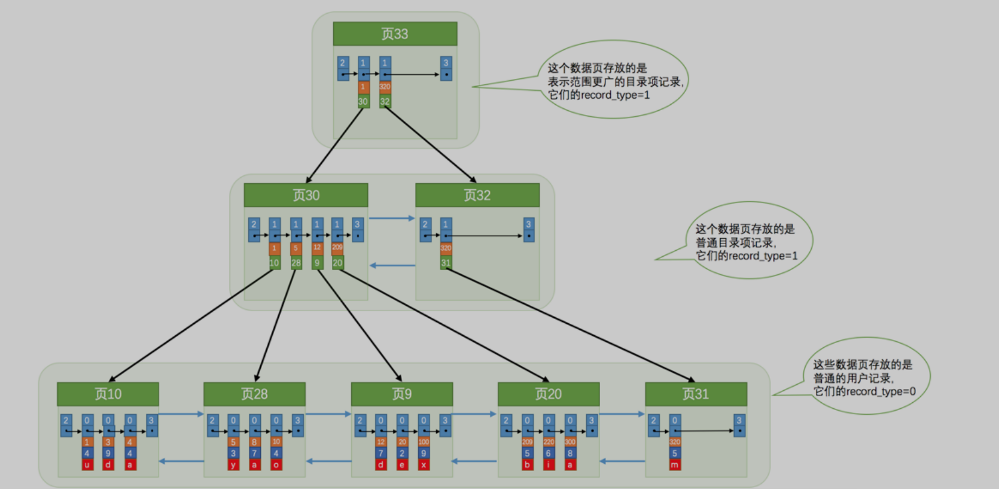
> 
- B+树

> 如果把上面的图抽象成一个一个的小点，倒过来就会发现很像一棵树，上头是树根，下头是树叶。其实这是一种组织数据的形式，或者说是一种数据结构，它的名称是 B+ 树
> 
- B+树的特点

> 不论是存放用户记录的数据页，还是存放目录项记录的数据页，我们都把它们存放到 B+ 树这个数据结构中了，所以我们也称这些数据页为 节点 。从图中可以看出来
> 
> - 我们的实际用户记录其实都存放在B+树的最底层的节点上，这些节点也被称为 叶子节点 或 叶节点 ，
> - 其余用来存放 目录项 的节点称为 非叶子节点 或者 内节点 ，其中 B+ 树最上边的那个节点也称为 根节点 。
- B+树能存放多少条数据（**假设**）

> 假设所有存放用户记录的叶子节点代表的数据页可以存放100条用户记录，所有存放目录项记录的内节点代表的数据页可以存放1000条目录项记录
> 
> - 如果 B+ 树只有1层，也就是只有1个用于存放用户记录的节点，最多能存放 100 条记录。
> - 如果 B+ 树有2层，最多能存放 1000×100=100000 条记录。
> - 如果 B+ 树有3层，最多能存放 1000×1000×100=100000000 条记录。
> - 如果 B+ 树有4层，最多能存放 1000×1000×1000×100=100000000000 条记录。

### 1.聚簇索引

- 特点

> 上面说了这么多我们可以汇聚成两个特点
> 
> 1. 使用记录主键值的大小进行记录和页的排序，这包括**三个方面**的含义：
> 
> > 页内的记录是按照主键的大小顺序排成一个单向链表。各个存放用户记录的页也是根据页中用户记录的主键大小顺序排成一个双向链表。存放目录项记录的页分为不同的层次，在同一层次中的页也是根据页中目录项记录的主键大小顺序排成一个双向链表。
> > 
> 1. B+ 树的叶子节点存储的是完整的用户记录
- 总结

> 我们把具有上面两种特性的B+树称为聚簇索引，所有完整的用户记录都存放在这个 聚簇索引 的叶子节点处。
> 

### 2.二级索引

- 概述

> 我们下面介绍的都是基于非聚簇索引来讲解的，可以发现聚簇索引只有在搜索主键值时才能发挥作用，没有都是按照主键排序的嘛，如果我们想以别的列为搜索条件还需要索引的速度要求那么就需要多建几颗B+树了
> 
- 与聚簇索引的不同

> 加入我们使用上面的表的c2列创建一个索引
> 
> - 使用记录 c2 列的大小进行记录和页的排序，这包括三个方面的含义：
> 
> > 页内的记录是按照 c2 列的大小顺序排成一个单向链表。各个存放用户记录的页也是根据页中记录的 c2 列大小顺序排成一个双向链表。存放目录项记录的页分为不同的层次，在同一层次中的页也是根据页中目录项记录的 c2 列大小顺序排成一个双向链表。
> > 
> - B+ 树的叶子节点存储的并不是完整的用户记录，而只是 `c2列+主键` 这两个列的值。
> - 目录项记录中不再是 主键+页号 的搭配，而变成了 `c2列+页号` 的搭配。
- 回表

> 如果你的搜索内容除了主键+创建索引的列这两个还有别的列（因为你需要完成的数据），那么在二级索引查到对应的记录还要根据主键值，再去聚簇索引查一遍，这个过程也被称为 回表 。也就是根据 c2 列的值查询一条完整的用户记录需要使用到 2 棵 B+ 树
> 
- 总结

> 也许你会想把全部数据放到二级索引的根节点上啊，但是太耗费与浪费空间了。即这种按照 非主键列 建立的 B+ 树需要一次 回表 操作才可以定位到完整的用户记录，所以这种 B+ 树也被称为 二级索引 （英文名 secondary index ）
> 

==联合索引==

> 我们也可以同时以多个列的大小作为排序规则，也就是同时为多个列建立索引，比方说我们想让 B+ 树按照 c2和 c3 列的大小进行排序，这个包含两层含义：
> 
> - **先把各个记录和页按照 c2 列进行排序。**
> - **在记录的 c2 列相同的情况下，采用 c3 列进行排序**
- 注意

> 以c2和c3列的大小为排序规则建立的B+树称为联合索引，本质上也是一个二级索引。它的意思与分别为c2和c3列分别建立索引的表述是不同的，不同点如下：
> 
> - 为c2和c3列分别建立索引会分别以 c2 和 c3 列的大小为排序规则建立2棵 B+ 树。

### 2.3 InnoDB的B+树索引的注意事项

### 1.根页面万年不动窝

- B+树建立的过程

> 每当为某个表创建一个 B+ 树索引（聚簇索引不是人为创建的，默认就有）的时候，都会为这个索引创建一个 根节点 页面。最开始表中没有数据的时候，每个 B+ 树索引对应的 根节点 中既没有用户记录，也没有目录项记录。随后向表中插入用户记录时，先把用户记录存储到这个 根节点 中。当 根节点 中的可用空间用完时继续插入记录，此时会将 根节点 中的所有记录复制到一个新分配的页，比如 页a 中，然后对这个新页进行 页分裂 的操作，得到另一个新页，比如 页b 。这时新插入的记录根据键值（也就是聚簇索引中的主键值，二级索引中对应的索引列的值）的大小就会被分配到 页a 或者 页b 中，而根节点 便升级为存储目录项记录的页。
> 
- 总结

> 一个B+树索引的根节点自诞生之日起，便不会再移动。这样只要我们对某个表建立一个索引，那么它的 根节点 的页号便会被记录到数据字典，然后凡是 InnoDB 存储引擎需要用到这个索引的时候，都会从那个固定的地方取出 根节点 的页号，从而来访问这个索引。
> 

### 2.内节点中目录项记录的唯一性

- 概述

> 前面我们说过目录项纪录有两项构成，一个是索引列值+页号，其实是不严谨的因为当出现下面的情况就会出现错误
> 

> 如果我们在加入一个c2列为1，它该插入到页4还是页5？答案是都不行，这个建立方式就是错的
> 
> 
> 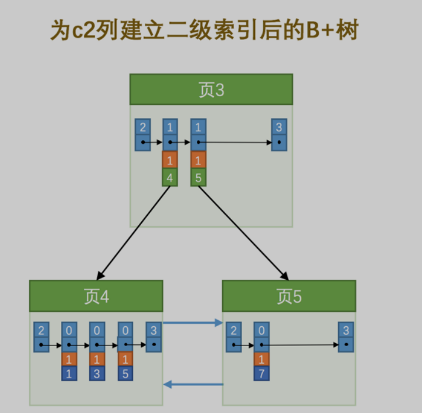
> 
- 解决

> 那么为了保证唯一性即我们需要保证在B+树的同一层内节点的目录项记录除 页号 这个字段以外是唯一的，我们就需要目录项记录存在三个内容
> 
> 1. 索引列的值
> 2. 主键值
> 3. 页号

### 3.一个页面最少存储2条记录

- 概述

> B+树在很多数据量的情况下还能保证速度，这是因为B+树本质上就是一个大的多层级目录，每经过一个目录时都会过滤掉许多无效的子目录，直到最后访问到存储真实数据的目录。
> 

> 但是如果每一级大目录下面只放一个子目录，那么由于记录很多，子目录就会有很多，而且最后的那个存放真实数据的目录中只能存放一条记录。那就反向事半功倍了。所以 InnoDB 的一个数据页至少可以存放两条记录
> 

### 2.4 MyISAM中的索引方案简单介绍（❤）

- 概述

> 我们知道聚簇索引的那棵 B+ 树的叶子节点中已经把所有完整的用户记录都包含了，而 MyISAM 的索引方案虽然也使用树形结构，但是却将索引和数据分开存储：
> 
> - 将表中的记录按照记录的插入顺序单独存储在一个文件中，称之为 `数据文件` 。这个文件并不划分为若干个数据页，有多少记录就往这个文件中塞多少记录就成了。我们可以通过行号而快速访问到一条记录。我们就以上面的表为例子，里面随便插点数据看看结构，可以看没有按照之间的顺序所以二分查找也是空谈
>     
>     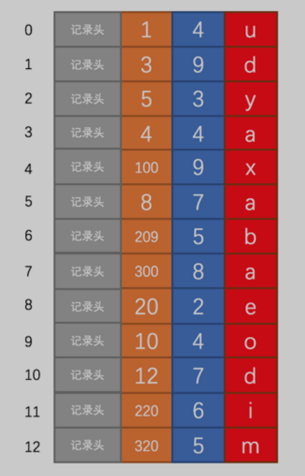
>     
> - 使用 MyISAM 存储引擎的表会把索引信息另外存储到一个称为 `索引文件` 的另一个文件中。 MyISAM 会单独为表的主键创建一个索引，只不过在索引的叶子节点中存储的不是完整的用户记录，而是 `主键值 + 行号` 的组合。也就是先通过索引找到对应的行号，再通过行号去找对应的记录。**在 MyISAM 中却需要进行一次 回表 操作，意味着 MyISAM 中建立的索引相当于全部都是 二级索引**
> - 如果有需要的话，我们也可以对其它的列分别建立索引或者建立联合索引，原理和 InnoDB 中的索引差不多，不过在叶子节点处存储的是 相应的列 + 行号 。这些索引也全部都是 二级索引 。
- 关于MyISAM的行格式

> MyISAM的行格式有定长记录格式（Static）、变长记录格（Dynamic）、压缩记录格式（Compressed）。上边用到的index_demo表采用定长记录格式，也就是一条记录占用存储空间的大小是固定的，这样就可以轻松算出某条记录在数据文件中的地址偏移量。但是变长记录格式就不行了，MyISAM会直接在索引叶子节点处存储该条记录在数据文件中的地址偏移量。通过这个可以看出，MyISAM的回表操作是十分快速的，因为是拿着地址偏移量直接到文件中取数据的
> 

> 反观InnoDB是通过获取主键之后再去聚簇索引里边儿找记录，虽然说也不慢，但还是比不上直接用地址去访问。
> 

> MyISAM中却是索引是索引、数据是数据
> 

### 2.5 MySQL中创建和删除索引的语句（❤）

- 概述

> 在MySQL中，InnoDB 和 MyISAM 会自动为主键或者声明为 UNIQUE 的列去自动建立 B+ 树索引。但是如果我们想为其他的列建立索引就需要我们显式的去指明。
> 
- 三种修改方式

```sql
CREATE TALBE 表名 (
 各种列的信息 ··· ,
 [KEY|INDEX] 索引名 (需要被索引的单个列或多个列)
)

ALTER TABLE 表名 ADD [INDEX|KEY] 索引名 (需要被索引的单个列或多个列);

ALTER TABLE 表名 DROP [INDEX|KEY] 索引名;

```

# B+树索引的使用

## 1.索引的代价

- 概述

> 索引主要有两个方面的代价：
> 
> 1. 空间上的代价：**这个是显而易见的，每建立一个索引都要为它建立一棵 B+ 树，每一棵 B+ 树的每一个节点都是一个数据页，一个页默认会占用 16KB 的存储空间，一棵很大的 B+ 树由许多数据页组成，那可是很大的一片存储空间呢。**
> 2. 每次对表中的数据进行增、删、改操作时，都需要去修改各个 B+ 树索引。因为记录与记录、页与页都是链表的形式进行连接，**而增、删、改操作可能会对节点和记录的排序造成破坏，所以存储引擎需要额外的时间进行一些记录移位，页面分裂、页面回收啥的操作来维护好节点和记录的排序**。

## 2.B+树索引适用的条件

- 先建个表

> 表中的主键是 id 列，它存储一个自动递增的整数。所以 InnoDB 存储引擎会自动为 id 列建立聚簇索引注意联合索引它是由3个列组成的联合索引。所以在这个索引对应的 B+ 树的叶子节点处存储的用户记录只保留name 、 birthday 、phone_number这三个列的值以及主键 id 的值，并不会保存 country 列的值。
> 

```sql
CREATE TABLE person_info(
	id INT NOT NULL auto_increment,
	name VARCHAR(100) NOT NULL,
	birthday DATE NOT NULL,
	phone_number CHAR(11) NOT NULL,
	country varchar(100) NOT NULL,
	PRIMARY KEY (id),
	KEY idx_name_birthday_phone_number (name, birthday, phone_number)
);

```

- 联合索引的示意图

> 联合索引对应的 B+ 树中页面和记录的排序方式就是这样的
> 
> - 先按照 name 列的值进行排序。
> - 如果 name 列的值相同，则按照 birthday 列的值进行排序。
> - 如果 birthday 列的值也相同，则按照 phone_number 的值进行排序。
>     
>     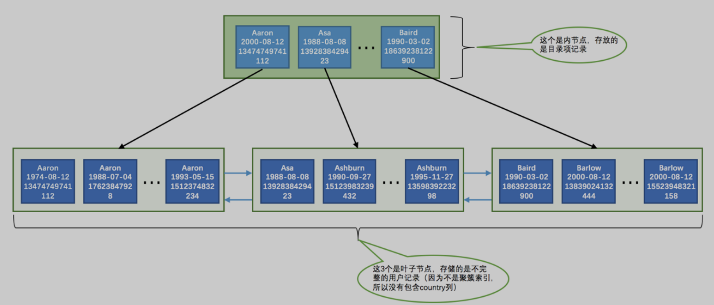
>     

### 2.1 全值匹配

- 概述

> 先来看两个sql，分析判断一下执行过程以及索引使用情况：
> 
> - 前者很显然后根据name到birthday到phone_number的顺序去匹配，正好跟我们联合索引的建立顺序一致，理所应当的使用到了索引
> - 后者可以看到查询条件顺序是不一样的跟二级索引，那么会使用到索引吗？**答案是肯定的，因为有查询优化器的存在（会分析这些搜索条件并且按照可以使用的索引中列的顺序来决定先使用哪个搜索条件，后使用哪个搜索条件。）**

```sql
SELECT * FROM person_info WHERE
			name = 'Ashburn' AND
			birthday = '1990-09-27' AND
			phone_number = '15123983239';

SELECT * FROM person_info WHERE
			birthday = '1990-09-27' AND
			phone_number = '15123983239' AND
			name = 'Ashburn';

```

### 2.2 匹配左边的列

- 概述

> 我们直接写出四条sql，逐一分析：
> 
> 1. 在我们的搜索语句中也可以不用包含全部联合索引中的列，只包含左边的就行，能够使用
> 2. 或者包含多个左边的列也能使用
> 3. 不能使用，因为因为 B+ 树的数据页和记录先是按照 name 列的值排序的，在 name 列的值相同的情况下才使用 birthday 列进行排序，也就是说 name 列的值不同的记录中 birthday 的值可能是无序的。而现在你跳过
> name 列直接根据 birthday 的值去查找，这是不可能滴，当然你可以选择单独为这一列创建索引
> 4. 这样只能用到 name 列的索引， `birthday 和 phone_number` 的索引就用不上了

```sql
SELECT * FROM person_info WHERE name = 'Ashburn';

SELECT * FROM person_info WHERE name = 'Ashburn' AND
								birthday = '1990-09-27';

SELECT * FROM person_info WHERE birthday = '1990-09-27';

SELECT * FROM person_info WHERE name = 'Ashburn' AND
								phone_number = '15123983239';

```

- 总结

> 如果我们想使用联合索引中尽可能多的列，搜索条件中的各个列必须是联合索引中从最左边连续的列
> 

### 2.3 匹配列前缀

- 概述

> 前面说到我们创建索引的目的大多就是想让对应列的值进行排列，比方说上面的name列创建索引，就会想下面的顺序进行排列
> 

```
Aaron
Aaron
...
Aaron
Asa
Ashburn
...
Ashburn
Baird
Barlow
...
Barlow

```

- 字符集与比较规则

> 这两个变量就是影响排序的因素，简单说一下比较两个字符串的大小的过程
> 
> - 先比较字符串的第一个字符，第一个字符小的那个字符串就比较小。
> - 如果两个字符串的第一个字符相同，那就再比较第二个字符，第二个字符比较小的那个字符串就比较小。
> - 如果两个字符串的第二个字符也相同，那就接着比较第三个字符，依此类推。
- 排序的特点

> 先按照字符串的第一个字符进行排序。如果第一个字符相同再按照第二个字符进行排序。如果第二个字符相同再按照第三个字符进行排序，依此类推。
> 
- 使用示例

> 我们分析两个sql
> 
> 1. 对于字符串类型的索引列来说，我们只匹配它的前缀也是可以快速定位记录的，比方说我们想查询名字以 `'As'` 开头的记录
> 2. 但对于只给出后缀或者中间的某个字符串，**MySQL 就无法快速定位记录位置了，因为字符串中间有`'As'`的字符串并没有排好序，所以只能全表扫描了。**

```sql
SELECT * FROM person_info WHERE name LIKE 'As%';

SELECT * FROM person_info WHERE name LIKE '%As%';

```

- URL示例

> 那么当我们存放URL时，如果选择正序存储，想要查询类似com后缀结尾的数据就不好查了，所以我们可以选择逆序存储
> 

```sql
# 使用不到索引
WHERE url LIKE '%com'
# 使用到了
WHERE url LIKE 'moc%'

```

> 
> 

### 2.4 匹配范围值

- 概述

> 回想我们联合索引的B+树结构，极大方便了我们查找索引列的值在某个范围内的记录，简单分析以下查询过程
> 
> - 找到 name 值为 Asa 的记录。
> - 找到 name 值为 Barlow 的记录。
> - 由于所有记录都是由链表连起来的（记录之间用单链表，数据页之间用双链表），所以他们之间的记录都可以很容易的取出来喽～
> - 找到这些记录的主键值，再到 聚簇索引 中 回表 查找完整的记录。

```sql
SELECT * FROM person_info WHERE name > 'Asa' AND
								name < 'Barlow';

```

- 使用事项

> 如果对多个列同时进行范围查找的话，只有对索引最左边的那个列进行范围查找的时候才能用到 B+ 树索引，过程如下
> 
> 1. 通过条件`name > 'Asa' AND name < 'Barlow'`来对 name 进行范围，查找的结果可能有多条 name 值不同的记录，
> 2. 对这些 name 值不同的记录继续通过 birthday > '1980-01-01' 条件继续过滤。

```sql
SELECT * FROM person_info WHERE name > 'Asa' AND
								name < 'Barlow' AND
								birthday > '1980-01-01';

```

### 2.5 精确匹配某一列并范围匹配另外一列

- 概述

> 对于同一个联合索引来说，虽然对多个列都进行范围查找时只能用到最左边那个索引列，但是如果左边的列是精确查找，则右边的列可以进行范围查找，下面的前面sql过程如下，后面的同样会使用索引：
> 
> 1. `name = 'Ashburn'` ，对 name 列进行精确查找，当然可以使用 B+ 树索引了。
> 2. `birthday > '1980-01-01' AND birthday < '2000-12-31'` ，由于 name 列是精确查找，所以通过 name ='Ashburn' 条件查找后得到的结果的 name 值都是相同的，它们会再按照 birthday 的值进行排序。所以此时对 birthday 列进行范围查找是可以用到 B+ 树索引的。
> 3. `phone_number > '15100000000'` ，**通过 birthday 的范围查找的记录的 birthday 的值可能不同，所以这个条件无法再利用 B+ 树索引了，只能遍历上一步查询得到的记录。**

```sql
SELECT * FROM person_info WHERE name = 'Ashburn' AND
								birthday > '1980-01-01' AND
								birthday < '2000-12-31' AND
								phone_number > '15100000000';

SELECT * FROM person_info WHERE name = 'Ashburn' AND
								birthday = '1980-01-01' AND
								phone_number > '15100000000';

```

### 2.6 用于排序

- 概述

> 在 MySQL 中，把这种在内存中或者磁盘上进行排序的方式统称为文件排序（英文名： filesort ）如果 ORDER BY 子句里使用到了我们的索引列，就有可能省去在内存或文件中排序的步骤，比如下边这个简单的查询语句
> 

```sql
SELECT * FROM person_info ORDER BY name, birthday, phone_number LIMIT 10;

```

### 1.使用联合索引进行排序注意事项

- 概述

> ORDER BY 的子句后边的列的顺序也必须按照索引列的顺序给出，如果给出ORDER BY phone_number, birthday, name 的顺序，那也是用不了 B+ 树索引。
> 

> 那么同理ORDER BY name 、 ORDER BY name, birthday 这种匹配索引左边的列的形式可以使用部分的 B+ 树索引。当联合索引左边列的值为常量，也可以使用后边的列进行排序
> 

```sql
# 能使用到
SELECT * FROM person_info WHERE name = 'A'
ORDER BY birthday, phone_number LIMIT 10;

```

### 2.不可以使用索引进行排序的几种情况

==ASC、DESC混用==

> 对于使用联合索引进行排序的场景，我们要求各个排序列的排序顺序是一致的，也就是要么各个列都是 ASC 规则排序，要么都是 DESC 规则排序。
> 
- 分析一个例子

> 如果我们查询的需求是先按照 name 列进行升序排列，再按照 birthday 列进行降序排列的话，那么使用索引排序的过程就如下，可以看到又累又不高效
> 
> - 先从索引的最左边确定 name 列最小的值，然后找到 name 列等于该值的所有记录，然后从 name 列等于该值的最右边的那条记录开始往左找10条记录。
> - 如果 name 列等于最小的值的记录不足10条，再继续往右找 name 值第二小的记录，重复上边那个过程，直到找到10条记录为止。

```sql
SELECT * FROM person_info ORDER BY name, birthday DESC LIMIT 10;

```

==WHERE子句中出现非排序使用到的索引列==

> 如果WHERE子句中出现了非排序使用到的索引列，那么排序依然是使用不到索引的，我们分析两个sql
> 
> - 前者只能先把符合搜索条件`country = 'China'`的记录提取出来后再进行排序，是使用不到索引。
> - 虽然这个查询也有搜索条件，但是 `name = 'A'` 可以使用到索引 `idx_name_birthday_phone_number` ，而且过滤剩下的记录还是按照 `birthday 、 phone_number` 列排序的，所以还是可以使用索引进行排序的。

```sql
SELECT * FROM person_info WHERE country = 'China' ORDER BY name LIMIT 10;

SELECT * FROM person_info WHERE name = 'A' ORDER BY birthday, phone_number LIMIT 10;

```

==排序列包含非同一个索引的列==

> 有时候用来排序的多个列不是一个索引里的，这种情况也不能使用索引进行排序，下面例子中country压根没有索引
> 

```sql
SELECT * FROM person_info ORDER BY name, country LIMIT 10;

```

==排序列使用了复杂表达式==

> 要想使用索引进行排序操作，必须保证索引列是以单独列的形式出现，而不是修饰过的形式，比方说这样：使用了 UPPER 函数修饰过的列就不是单独的列啦，这样就无法使用索引进行排序啦。
> 

```sql
SELECT * FROM person_info ORDER BY UPPER(name) LIMIT 10;

```

### 2.7 用于分组

- 概述

> 有时候我们为了方便统计表中的一些信息，会把表中的记录按照某些列进行分组。比如下边这个分组查询，会执行三次分组操作
> 
> 1. 先把记录按照 name 值进行分组，所有 name 值相同的记录划分为一组。
> 2. 将每个 name 值相同的分组里的记录再按照 birthday 的值进行分组，将 birthday 值相同的记录放到一个小分组里，所以看起来就像在一个大分组里又化分了好多小分组。
> 3. 再将上一步中产生的小分组按照 phone_number 的值分成更小的分组，所以整体上看起来就像是先把记录分	成一个大分组，然后把 大分组 分成若干个 小分组 ，然后把若干个 小分组 再细分成更多的 小小分组 。

```sql
SELECT name, birthday, phone_number, COUNT(*) FROM
person_info GROUP BY name, birthday, phone_number

```

- 总结

> 然后针对那些 小小分组 进行统计，比如在我们这个查询语句中就是统计每个 小小分组 包含的记录条数。如果没有索引的话，这个分组过程全部需要在内存里实现，而如果有了索引的话，恰巧这个分组顺序又和我们的 B+ 树中的索引列的顺序是一致的，而我们的 B+ 树索引又是按照索引列排好序的，这不正好么，所以可以直接使用B+ 树索引进行分组。
> 

## 3.回表的代价

- 顺序IO和随机IO

> 先来看一个SQL的执行过程
> 
> 1. 先根据联合索引，查到处于Asa到Barlow的所有记录，这个过程是在先根据name再根据birthday最后根据phone_number的排序，所以对于这个联合索引根据name在物理上的存储都是连续在一个或几个数据页，我们可以很快的把这些连着的记录从磁盘中读出来，这种读取方式我们也可以称为 `顺序I/O`
> 2. 然后拿到这些记录的主键值回表去查完整的记录，这些记录虽然name是连续的但是对应的主键值在聚簇索引里就不是连续的，分布在不同的数据页中这样读取完整的用户记录可能要访问更多的数据页，这种读取方式我们也可以称为`随机I/O`。

```sql
SELECT * FROM person_info WHERE name > 'Asa' AND
								name < 'Barlow';

```

- 总结

> 一般情况下，顺序I/O比随机I/O的性能高很多，对于这个联合索引来说：
> 
> - 会使用到两个 B+ 树索引，一个二级索引，一个聚簇索引。
> - 访问二级索引使用 顺序I/O ，访问聚簇索引使用 随机I/O 。
- 注意

> 需要回表的记录越多，使用二级索引的性能就越低，甚至让某些查询宁愿使用全表扫描也不使用 二级索引 。
> 
- 稍稍提一嘴查询优化器

> 对于使用二级索引+回表的方式还是全表扫描的方式就是优化器来决定的，优化器会分析其中的查询成本。查询优化器会事先对表中的记录计算一些统计数据，然后再利用这些统计数据根据查询的条件来计算一下需要回表的记录数，需要回表的记录数越多，就越倾向于使用全表扫描，反之倾向于使用 二级索引 + 回表 的方式。一般情况下，限制查询获取较少的记录数会让优化器更倾向于选择使用 二级索引 + 回表 的方式进行查询，因为回表的记录越少，性能提升就越高，具体可以转去这里查询优化器
> 

### 3.1 覆盖索引

- 概述

> 这个简单来说就是不进行回表就得到想要的数据，最好在查询列表里只包含索引列，比如这样，
> 

```sql
SELECT name, birthday, phone_number FROM person_info WHERE
name > 'Asa' AND name < 'Barlow'

```

- 总结

> 如果业务需要查询出索引以外的列，那还是以保证业务需求为重。但是我们很不鼓励用 * 号作为查询列表，最好把我们需要查询的列依次标明。
> 

## 4.如何挑选索引

- 概述

> 下边看一下我们在建立索引时或者编写查询语句时就应该注意的一些事项。
> 

### 4.1 只为用于搜索、排序或分组的列创建索引

- 概述

> 也就是说，只为出现在 WHERE 子句中的列、连接子句中的连接列，或者出现在 ORDER BY 或 GROUP BY 子句中的列创建索引。而出现在查询列表中的列就没必要建立索引了
> 

```sql
# 我们只需要给name建立索引
SELECT birthday, country FROM person name WHERE name = 'Ashburn';

```

### 4.2 考虑列的基数

- 列的基数

> 列的基数 指的是某一列中不重复数据的个数，比方说某个列包含值 2, 5, 8, 2, 5, 8, 2, 5, 8 ，虽然有 9 条记录，但该列的基数却是 3 。也就是说，在记录行数一定的情况下，列的基数越大，该列中的值越分散，列的基数越小，该列中的值越集中。
> 

> 这个在查询优化器篇就是储存索引统计数据中的一个属性Cardinality，会详细讲一下如果统计
> 
- 总结

> 假设某个列的基数为 1 ，也就是所有记录在该列中的值都一样，那为该列建立索引是没有用的，因为所有值都一样就无法排序，无法进行快速查找了。即最好为那些列的基数大的列建立索引，为基数太小列的建立索引效果可能不好
> 

### 4.3 索引列的类型尽量小

- 概述

> 我们这里所说的 类型大小 指的就是该类型表示的数据范围的大小。能表示的整数范围当然也是依次递增，如果我们想要对某个整数列建立索引的话，在表示的整数范围允许的情况下，尽量让索引列使用较小的类型，比如我们能使用 INT 就不要使用 BIGINT ，能使用 MEDIUMINT 就不要使用INT ～ 这是因为：
> 
> - 数据类型越小，在查询时进行的比较操作越快
> - 数据类型越小，索引占用的存储空间就越少，在一个数据页内就可以放下更多的记录，从而减少磁盘 I/O 带来的性能损耗，也就意味着可以把更多的数据页缓存在内存中，从而加快读写效率。
> - 也就意味着节省更多的存储空间和更高效的 I/O

### 4.4 索引字符串值的前缀

- 概述

> 就是只对字符串的前几个字符进行索引的建立，因为在MySQL默认的UTF-8中默认一个字符串是占1~3个字节，那么在索引中是需要把这个字符串的值完全保存，非常占空间；并且检索的时候比较这个动作也会花更长的时间
> 
- 注意

> 如果使用了索引列前缀，那么在排序的时候就有点尴尬。因为二级索引中不包含完整的 name 列信息，所以无法对前十个字符相同，后边的字符不同的记录进行排序，也就是使用索引列前缀的方式无法支持使用索引排序，只好乖乖的用文件排序喽。
> 

```sql
# 我们把name值的前10个字符进行了索引前缀
SELECT * FROM person_info ORDER BY name LIMIT 10;

```

### 4.5 让索引列在比较表达式中单独出现

- 概述

> 假设表中有一个整数列 my_col ，我们为这个列建立了索引。下边的两个 WHERE 子句虽然语义是一致的，但是在效率上却有差别：
> 
> 1. `WHERE my_col * 2 < 4`：my_col 列并不是以单独列的形式出现的，而是以 my_col * 2 这样的表达式的形式出现的，**存储引擎会依次遍历所有的记录，计算这个表达式的值是不是小于 4 ，所以这种情况下是使用不到为 my_col 列建立的 B+ 树索引的**
> 2. `WHERE my_col < 4/2`：而第2个 WHERE 子句中 my_col 列并是以单独列的形式出现的，这样的情况可以直接使用B+ 树索引。
- 总结

> 如果索引列在比较表达式中不是以单独列的形式出现，而是以某个表达式，或者函数调用形式出现的话，是用不到索引的。
> 

### 4.6 主键插入顺序

- 概述

> 就是要让主键按照顺序具有递增规律性，不能忽大忽小；我们提倡让主键具有AUTO_INCREMENT ，让存储引擎自己为表生成主键，而不是我们手动插入
> 

### 4.7 冗余和重复索引

- 概述

> 我们看下面的建表语句，我们知道，通过idx_name_birthday_phone_number 索引就可以对 name 列进行快速搜索，再创建一个专门针对name 列的索引就算是一个 冗余 索引，维护这个索引只会增加维护的成本，并不会对搜索有什么好处。
> 

```sql
CREATE TABLE person_info(
	id INT UNSIGNED NOT NULL AUTO_INCREMENT,
	name VARCHAR(100) NOT NULL,
	birthday DATE NOT NULL,
	phone_number CHAR(11) NOT NULL,
	country varchar(100) NOT NULL,
	PRIMARY KEY (id),
	KEY idx_name_birthday_phone_number (name(10), birthday, phone_number),
	KEY idx_name (name(10))
);

# c1 既是主键、又给它定义为一个唯一索引，还给它定义了一个普通索引，
#可是主键本身就会生成聚簇索引，所以定义的唯一索引和普通索引是重复的，
#这种情况要避免。
CREATE TABLE repeat_index_demo (
	c1 INT PRIMARY KEY,
	c2 INT,
	UNIQUE uidx_c1 (c1),
	INDEX idx_c1 (c1)
);

```