# MySQL是怎样运行的：从根儿上理解MySQL | redo日志（上）

type: Post
status: Published
date: 2022/03/20
slug: example-3
summary: 前面我们又说到，存储引擎修改数据的基本单位是以页来完成的，所以我们进行增删改查时就是在对页面进行读、写、创建页面。学习完缓冲池以后我们知道进行这些操作的时候需要把磁盘页缓存到缓冲池才可以，这时问题出现了，我们各式各样的一通操作过后只是修改了缓存页的信息啊，信息始终没有做到百分百持久化，如果突然出现断电或者服务器故障又或者是提交错误直接崩溃等。那么我们应该怎么做这个持久化呢，最简单粗暴的方法就是完成任务之前把该事务所修改的页面都刷新到磁盘
tags: Mysql
category: 数据库

# 前言：本博文是对MySQL是怎样运行的：从根儿上理解MySQL这本书的归纳和总结

# 20.redo日志（上）

## 1.redo日志是个啥

### 1.1 回忆回忆

- 前情回顾

> 前面我们又说到，存储引擎修改数据的基本单位是以页来完成的，所以我们进行增删改查时就是在对页面进行读、写、创建页面。学习完缓冲池以后我们知道进行这些操作的时候需要把磁盘页缓存到缓冲池才可以，这时问题出现了，我们各式各样的一通操作过后只是修改了缓存页的信息啊，信息始终没有做到百分百持久化，如果突然出现断电或者服务器故障又或者是提交错误直接崩溃等。那么我们应该怎么做这个持久化呢，最简单粗暴的方法就是完成任务之前把该事务所修改的页面都刷新到磁盘
> 
- 上述解决方式的弊端

> 刷新一个完整页面太浪费：如果只修改了几个字节的信息呢？随机IO刷起来很慢：一个事务可能包含很多语句，即使是一条语句也可能修改许多页面，倒霉催的是该事务修改的这些页面可能并不相邻，这就意味着在将某个事务修改的 Buffer Pool 中的页面刷新到磁盘时，需要进行很多的随机IO，随机IO比顺序IO要慢，尤其对于传统的机械硬盘来说。
> 

### 1.2 redo正式登场

- 概述

> 怎么克服这两个弊端呢？回归持久化的目的不就是想让数据的修改永久生效吗，即使发生了意想不到的意外，重启后依然能把这种修改回复过来，那么我们只需要将修改了那些东西记录下来就可以了，这样就可以修改多少就记录多少，这样日志的容量也得到了很好的控制，这个被称为 重做日志（redo log） 即为redo日志
> 
- 相比于直接刷新到磁盘的好处如下：

> redo 日志占用的空间非常小：存储表空间ID、页号、偏移量以及需要更新的值所需的存储空间是很小的redo 日志是顺序写入磁盘的在执行事务的过程中，每执行一条语句，就可能产生若干条 redo 日志，这些日志是按照产生的顺序写入磁盘的，也就是使用顺序IO。（结合执行成本理解）
> 

## 2.redo日志格式

- 概述

> 通过上边的内容我们知道， redo 日志本质上只是记录了一下事务对数据库做了哪些修改。 mysql针对不同的场景定义了多种类型的redo日志，但绝大多的结构都离不开通用结构
> 
- 通用结构

> type
> 
> 
> ```
> space ID
> ```
> 
> ```
> page number
> ```
> 
> ```
> data
> ```
> 
> 
> 

### 2.1 简单的redo日志类型

### 2.1.1 回忆回忆Data Dictionary Header页面（页号为七）

- 概述

> 系统表空间存放着四个系统表分别是SYS_TABLES、SYS_COLUMNS、SYS_INDEXES、SYS_FIELDS，通过这四个表可以获取其他系统表以及用户定义的表的所有元数据，那么这四个表的元数据要存放在哪里呢，这四个表的信息已经处于最高层了，mysql将四张表的元数据就是它们有哪些列、哪些索引等信息硬编码到代码中，然后又用一个固定的页面来记录，这4个表的聚簇索引和二级索引对应的 B+树 位置，这个页面就是页号为 7 的页面，类型为 SYS，记录了 Data Dictionary Header ，也就是数据字典的头部信息。除了这4个表的5个索引的根页面信息外，这个页号为 7 的页面还记录了整个InnoDB存储引擎的一些全局属性
> 
- 页面结构
    
    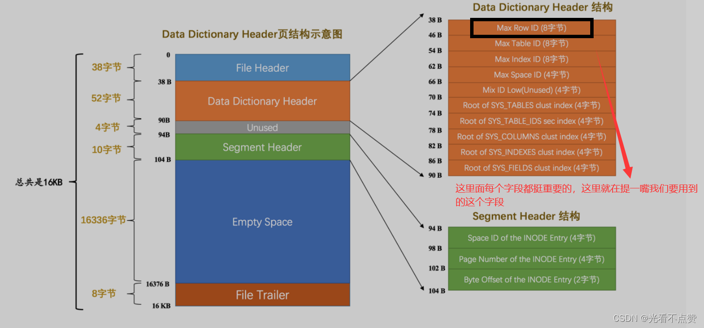
    
- Max Row ID ：

> 我们说过如果我们不显式的为表定义主键，而且表中也没有 UNIQUE 索引，那么 InnoDB 存储引擎会默认为我们生成一个名为 row_id 的列作为主键。因为它是主键，所以每条记录的row_id列的值不能重复。原则上只要一个表中的 row_id 列不重复就可以了，也就是说表a和表b拥有一样的row_id 列也没啥关系，不过设计InnoDB的大叔只提供了这个 Max Row ID 字段，不论哪个拥有 row_id 列的表插入一条记录时，该记录的 row_id 列的值就是Max Row ID对应的值，然后再把 Max Row ID 对应的值加1，也就是说这个 Max Row ID 是全局共享的。
> 

### 2.1.2 书回正文

- 概述

> 我们用一小节回忆了一下Max Row ID字段，是因为在redo的简单日志格式中就是对这个字段的记录，我们现在说一下这个为row_id 赋值的方式：
> 
> 1. 服务器会在内存中维护一个**全局变量**，每当向某个包含隐藏的 row_id 列的表中插入一条记录时，就会把该变量的值当作新记录的 row_id 列的值，并且把该变量自增1。
> 2. 每当这个变量的值为256的倍数时，就会将该变量的值刷新到系统表空间的页号为 7 的页面中一个称之为Max Row ID 的属性处
> 3. 当系统启动时，会将上边提到的 Max Row ID 属性加载到内存中，将该值加上256之后赋值给我们前边提到的全局变量（因为在上次关机时该全局变量的值可能大于 Max Row ID 属性值）。
- 与redo日志的联系

> 这个Max Row ID字段占用的存储空间8个字节，当某个事务向 包含row_id隐藏列插入一条数据时，并且分配的id值是256的倍数时，就会向7号页面相应偏移量写入8个字节的值，但是这个过程还是在缓冲池完成的，所以就需要为这个操作记录redo日志了，只需要记录一下在某个页面的某个偏移量处修改了几个字节的值，具体被修改的内容是啥就好了，这种极其简单的 redo 日志称之为 物理日志 ，并且根据在页面中写入数据的多少划分了几种不同的 redo 日志类型：
> 
> 1. `MLOG_1BYTE` （ type 字段对应的十进制数字为 1 ）：表示在页面的某个偏移量处写入1个字节的 redo 日志类型。
> 2. `2BYTE、4BYTE、8BYTE`同理，结构这四种都差不多哦
>     
>     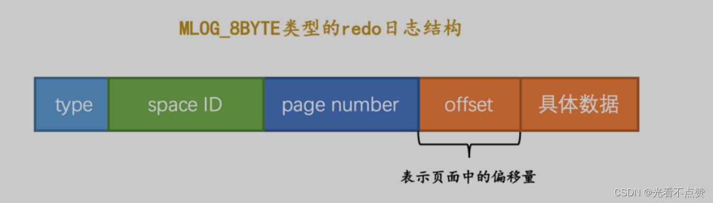
>     

> MLOG_WRITE_STRING （ type 字段对应的十进制数字为 30 ）：表示在页面的某个偏移量处写入一串数据。如果你len的地方正好是1、2、4、8又跟上面一样了
> 
- 小贴士（设置len的原因）

> 只要将MLOG_WRITE_STRING类型的redo日志的len字段填充上1、2、4、8这些数字，就可以分别替代MLOG_1BYTE、MLOG_2BYTE、MLOG_4BYTE、MLOG_8BYTE这些类型的redo日志，为啥还要多此一举设计这么多类型呢？还不是因为省空间啊，能不写len字段就不写len字段，省一个字节算一个字节。
> 

### 2.2 复杂的redo日志类型

### 2.2.1 我们面临的问题

- 前言

> 前面所说的情况只发生在小部分的表，大多数我们如果写一个语句就会牵一发而动全身，以一条 INSERT 语句为例，它除了要向 B+ 树的页面中插入数据，也可能更新系统数据Max Row ID 的值
> 
> - 表中包含多少个索引，一条 INSERT 语句就可能更新多少棵 B+ 树。
> - 针对某一棵 B+ 树来说，既可能更新叶子节点页面，也可能更新内节点页面，也可能创建新的页面（在该记录插入的叶子节点的剩余空间比较少，不足以存放该记录时，会进行页面的分裂，在内节点页面中添加 目录项记录 ）。

> 如果你以为这就结束了就太年轻了， 别忘了一个数据页中除了存储实际的记录之后，还有什么File Header 、 Page Header 、 Page Directory等等部分，所以每往叶子节点代表的数据页里插入一条记录时，还有其他很多地方会跟着更新，比如说：
> 
> - 可能更新`Page Directory`中的槽信息。
> - `Page Header` 中的各种页面统计信息，比如 `PAGE_N_DIR_SLOTS` 表示的槽数量可能会更改， `PAGE_HEAP_TOP`代表的还未使用的空间最小地址可能会更改， `PAGE_N_HEAP` 代表的本页面中的记录数量可能会更改，吧啦吧啦，各种信息都可能会被修改。
> - 我们知道在数据页里的记录是按照索引列从小到大的顺序组成一个单向链表的，每插入一条记录，还需要更新上一条记录的记录头信息中的 `next_record` 属性来维护这个单向链表。
> - 还有别的吧啦吧啦的更新的地方，就不一一唠叨了...
- 修改于未修改的数据页抽象图
    
    
    

### 2.2.2 解决方案

> 说了这么多意思就是将一条数据插入一个页面需要更改的地方非常多，以下有两种解决方案，你观看完就会发现两种方式都不怎么节约空间，所以mysql提出了很多不同情况不同的redo日志类型
> 
1. 在每个修改的地方都记录一条 redo 日志。也就是如上图所示，有多少个加粗的块，就写多少条物理 redo 日志。这样子记录 redo 日志的缺点是显而易见的，因为被修改的地方是在太多了，可能记录的 redo 日志占用的空间都比整个页面占用的空间都多了～
2. 将整个页面的 **第一个被修改的字节** 到 **最后一个修改的字节** 之间所有的数据当成是一条物理 redo日志中的具体数据。从图中也可以看出来， **第一个被修改的字节** 到 **最后一个修改的字节** 之间仍然有许多没有修改过的数据，我们把这些没有修改的数据也加入到 redo 日志中去岂不是太浪费了～

### 2.2.3 不同的redo日志类型

以下这些类型的 redo 日志既包含 **`物理` 层面的意思，也包含 `逻辑` 层面的意思**，具体指：

1. 物理层面看，这些日志都指明了对哪个表空间的哪个页进行了修改。
2. 逻辑层面看，在系统奔溃重启时，并不能直接根据这些日志里的记载，将页面内的某个偏移量处恢复成某个数据，而是需要调用一些事先准备好的函数，执行完这些函数后才可以将页面恢复成系统奔溃前的样子。
- `MLOG_REC_INSERT` （对应的十进制数字为 9 ）：表示插入一条使用非紧凑行格式的记录时的 redo 日志类型。
- `MLOG_COMP_REC_INSERT` （对应的十进制数字为 38 ）：表示插入一条使用紧凑行格式的记录时的 redo 日志类型。
    
    > 小贴士：
    Redundant是一种比较原始的行格式，它就是非紧凑的。而Compact、Dynamic以及Compressed行格式是较新的行格式，它们是紧凑的（占用更小的存储空间）。
    > 
- `MLOG_COMP_PAGE_CREATE` （ type 字段对应的十进制数字为 58 ）：表示创建一个存储紧凑行格式记录的页面的 redo 日志类型。
- `MLOG_COMP_REC_DELETE` （ type 字段对应的十进制数字为 42 ）：表示删除一条使用紧凑行格式记录的redo 日志类型。
- `MLOG_COMP_LIST_START_DELETE` （ type 字段对应的十进制数字为 44 ）：表示从某条给定记录开始删除页面中的一系列使用紧凑行格式记录的 redo 日志类型。
- `MLOG_COMP_LIST_END_DELETE` （ type 字段对应的十进制数字为 43 ）：与`MLOG_COMP_LIST_START_DELETE`类型的 redo 日志呼应，表示删除一系列记录直到 `MLOG_COMP_LIST_END_DELETE` 类型的 redo 日志对应的记录为止。
    
    > 小贴士：
    我们前边唠叨InnoDB数据页格式的时候重点强调过，数据页中的记录是按照索引列大小的顺序组成单向链表的。有时候我们会有删除索引列的值在某个区间范围内的所有记录的需求，这时候如果我们每删除一条记录就写一条redo日志的话，效率可能有点低，所以提出MLOG_COMP_LIST_START_DELETE和MLOG_COMP_LIST_END_DELETE类型的redo日志，可以很大程度上减少redo日志的条数。
    > 
- `MLOG_ZIP_PAGE_COMPRESS` （ type 字段对应的十进制数字为 51 ）：表示压缩一个数据页的 redo 日志类型。
- 当然还有很多类型

### 2.2.4 以MLOG_COMP_REC_INSERT的日志结构为例理解物理与逻辑层面

- 图示
    
    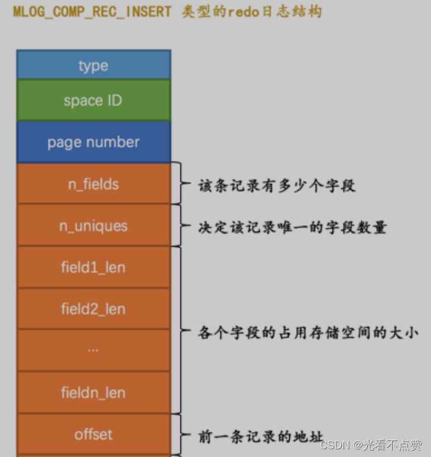
    
    
    

下面大致说一下里面有些字段的意思：

- `n_uniques`：这个字段表示的意思在一条数据中，需要几个字段才能保证记录的唯一性；对于聚簇索引只需要主键就可以了，但是对于二级索引就需要二级索引的索引列数+主键列
- `field1_len ~ fieldn_le`n：表示若干个字段占用存储空间的大小
- `offset`：就是记录不同记录的`next_record`，即记录本数据的上一条记录在页面的地址
- `end_seg_len`：我们都知道一个记录分为额外信息和真实数据组成，这个字段可以间接的计算出来这一条记录占总存储空间的大小，为什么不直接算？别问问就是节省空间
- `mismatch_index` ：它的值也是为了节省 redo 日志的大小而设立的，大家可以忽略
- 总结

> 很明显这些字段并没有记录像page header（页面头部）中的 PAGE_N_DIR_SLOTS 的值修改为了啥，
PAGE_HEAP_TOP 的值修改为了啥，PAGE_N_HEAP的值修改为了啥等等这些信息，而只是把在本页面中插入一条记录所有必备的要素记了下来，之后系统奔溃重启时，服务器会调用相关向某个页面插入一条记录的那个函数，而redo 日志中的那些数据就可以被当成是调用这个函数所需的参数，然后就恢复成以前的样子，这就是所谓的逻辑关系
> 

### 2.2.5 总结

> 其实读者不读过多纠结这里面的结构，说这么多目的还是想让大家明白：redo日志会把事务在执行过程中对数据库所做的所有修改都记录下来，在之后系统奔溃重启后可以把事务所做的任何修改都恢复出来。
> 

## 3 Mini-Transaction

### 3.1 以组的形式写入redo日志

- 概述

> 当我们修改若干个页面时，对应也要记录redo日志。在执行语句的过程中产生的 redo 日志被设计成一下几个不可分割的组
> 
> - 更新 Max Row ID 属性时产生的 redo 日志是不可分割的。
> - 向聚簇索引对应 B+ 树的页面中插入一条记录时产生的 redo 日志是不可分割的。
> - 向某个二级索引对应 B+ 树的页面中插入一条记录时产生的 redo 日志是不可分割的。
> - 还有其他的一些对页面的访问操作时产生的 redo 日志是不可分割的
- 解释不可分割

> 所谓不可分割你可以这样理解：当进行某个操作时，所有需要修改的参数、字段、记录等他们都属于宏观上一条redo记录，那么整个语句执行到结束的记录是必须具有原子性的，也就是说你要记录你就把这一条语句所改变的所有东西全纪录下来，记到一半这种情况不允许出现，这也就保证了恢复数据的时候，数据是完好无损的
> 

### 3.1.1 加深不可分割的理解

- 概述

> 当我们向某个索引对应的B+数插入一条记录为例，定位到数据页时会有两种情况
> 
- 情况一：

> 当插入页面有剩余空间能放下该条记录，那么只用记录一条类型为 MLOG_COMP_REC_INSERT 的 redo 日志就好了，我们把这种情况称之为
> 
> 
> **乐观插入**
> 
> 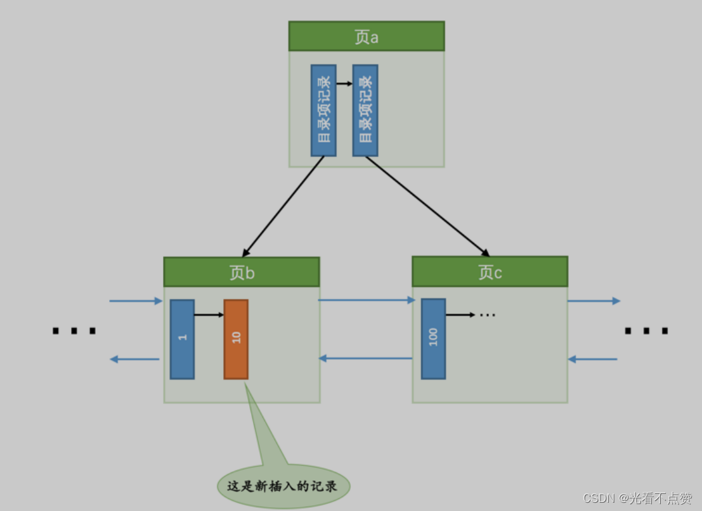
> 
- 情况二：

> 这个情况自然而然就是剩余空间不够，需要进行页分裂了，也就是新建一个叶子结点，这对于要修改的地方就很多了，包括你的free链表了，在表空间对应的所有东西基本都要改，
> 
> 
> **所以相比于乐观插入悲观插入所要记录的redo日志就非常多了**
> 
> 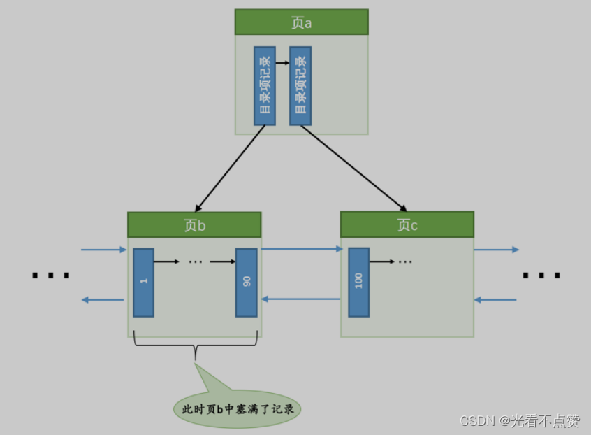
> 
> 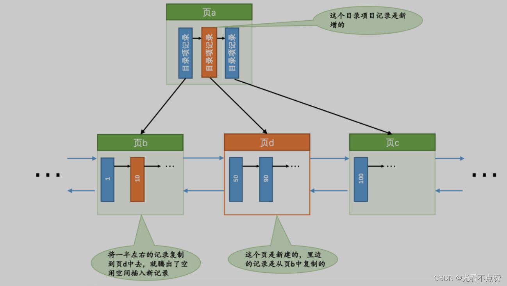
> 
- 小贴士

> 当然乐观插入也有记录很多的情况，深入了解的可自行查阅文档哦
> 
- 总结

> 根据上面的情况，mysql认为插入的整个过程必须是原子性的，不能说插了一半之后就停止了。比方说在悲观插入过程中，新的页面已经分配好了，数据也复制过去了，新的记录也插入到页面中了，可是没有向内节点中插入一条 目录项记录 ，这个插入过程就是不完整的，这样会形成一棵不正确的 B+ 树。我们知道 redo 日志是为了在系统奔溃重启时恢复崩溃前的状态，如果在悲观插入的过程中只记录了一部分 redo日志，那么在系统奔溃重启时会将索引对应的 B+ 树恢复成一种不正确的状态，这是设计 InnoDB 的大叔们所不能忍受的。所以他们规定在执行这些需要保证原子性的操作时必须以 组 的形式来记录的 redo 日志，在进行系统奔溃重启恢复时，针对某个组中的 redo 日志，要么把全部的日志都恢复掉，要么一条也不恢复。
> 

### 3.1.2 MLOG_MULTI_REC_END

- 概述

> 在悲观插入中会生成多条redo日志，那么如何把多条的redo日志分到一个组中呢，mysql提出一个新的redo日志类型
> 
> 
> ```
> MLOG_MULTI_REC_END
> ```
> 
> ```
> type字段为十进制的31
> ```
> 
> ```
> MLOG_MULTI_REC_END
> ```
> 
> **当发生崩溃时进行回复如果没有这个既不是一组完整的redo日志会放弃前面所解析恢复的日志**
> 
> 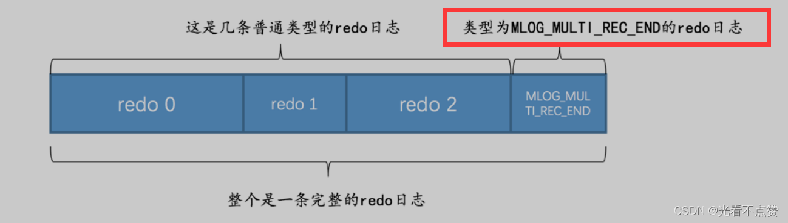
> 
- MLOG_MULTI_REC_END用不到的情况

> 有些需要原子操作的修改只会产生一个redo日志，例如更新Max Row ID属性，这时你以为会继续在末尾加上这个标志，但实则不会。mysql并不会追加而是会在type字段上下文章；前面聊到type字段占一个字节，即8个位可以表示256种状态，但是总共的redo类型也不过几十种，可以用7个位来表示，剩下一位就可以来标志该条redo日志是否为单一的日志
> 

> 1则表示为单一redo日志
> 
> 
> 
> 

### 3.2 Mini-Transaction的概念

- 概述

> MySQL把对底层页面中的一次原子访问的过程称之为一个 Mini-Transaction ，简称 mtr ，比如上边所说的修改一次 Max Row ID 的值算是一个 Mini-Transaction ，向某个索引对应的 B+ 树中插入一条记录的过程也算是一个 Mini-Transaction 。通过上边的叙述我们也知道，一个所谓的 mtr 可以包含一组 redo 日志，在进行奔溃恢复时这一组 redo 日志作为一个不可分割的整体。一个事务可以包含若干条语句，每一条语句其实是由若干个 mtr 组成，每一个mtr又可以包含若干条redo日志，画个图表示它们的关系就是这样：
> 
- 关系结构图
    
    
    

## 4.redo日志的写入过程

### 4.1 redo log block

- 概述

> 讲了这么半天我们一直没讲到这个redo日志究竟记在一个什么结构的载体上面，mysql将由mtr生成的redo日志都存放在了大小512字节的页中，但这与表空间的页是有一定区别的，所以我们称为redo log block
> 
- 结构图
    
    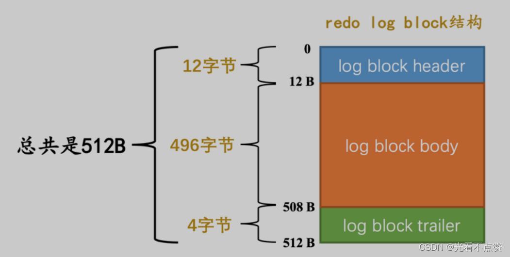
    
- `log block header 和 log block trailer` 存储的是一些管理信息。我们来看看这些所谓的 管理信息 都是啥：

> log block header 中属性的意思如下：
> 
> - `LOG_BLOCK_HDR_NO` ：每一个block都有一个大于0的唯一标号，本属性就表示该标号值。
> - `LOG_BLOCK_HDR_DATA_LEN` ：表示block中已经使用了多少字节，初始值为 12 （因为 `log block body` 从第12个字节处开始）。随着往block中写入的redo日志越来也多，本属性值也跟着增长。如果 `log block body`已经被全部写满，那么本属性的值被设置为 512 。
> - `LOG_BLOCK_FIRST_REC_GROUP` ：一条 redo 日志也可以称之为一条 redo 日志记录`（ redo log record ）`，一个 mtr 会生产多条 redo 日志记录，这些 redo 日志记录被称之为一个 redo 日志记录组`（ redo log record group ）`。 `LOG_BLOCK_FIRST_REC_GROUP` 就代表该block中第一个 mtr 生成的 redo 日志记录组的偏移量（其实也就是这个block里第一个 mtr 生成的第一条 redo 日志的偏移量）。
> - `LOG_BLOCK_CHECKPOINT_NO` ：表示所谓的`checkpoint`的序号， `checkpoint` 是我们后续内容的重点

> log block trailer 中属性的意思如下：
> 
> - `LOG_BLOCK_CHECKSUM` ：表示block的校验值，用于正确性校验，我们暂时不关心它。
>     
>     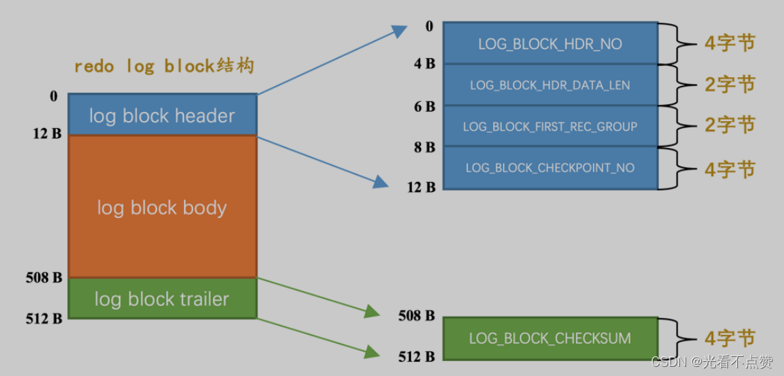
>     

### 4.2 redo日志缓冲区

- 概述

> 前面提到，我们修改某些数据或插入时会将对应的磁盘页加载到缓冲池中，为了就是提高速度；那么同样写redo日志的时候也不能直接写在磁盘中啊，速度太慢了，所以在启动服务器时也会想操作系统申请一片连续空间称为redo log buffer（redo日志缓冲区）简称log buffer，这个缓冲池被划分为很多个block
> 
- 结构如下
    
    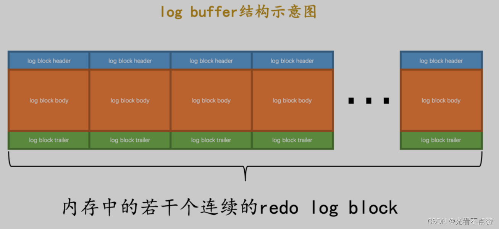
    
- 设置大小

> 可以通过设置启动参数 innodb_log_buffer_size来设置大小，默认为16MB
> 

### 4.3 redo日志写入log buffer

- 概述

> 既然要写入那么就要知道写在具体那个偏移值后面即那个
> 
> 
> ```
> mtr
> ```
> 
> ```
> mysq
> ```
> 
> ```
> buf_free
> ```
> 
> 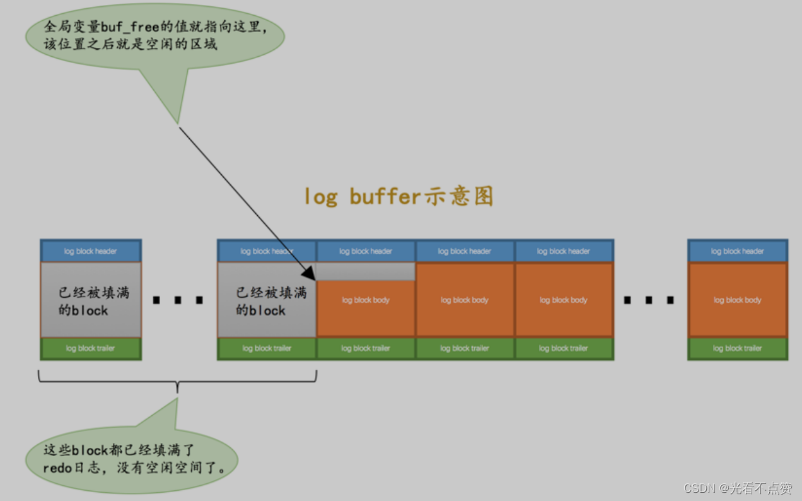
> 

### 4.3.1 当两个事务的mtr并发插入到log buffer

- 概述

> 前面说过一个mtr的执行过程会有很多的redo日志，不是有一条就往pool插入，而是构成一个mtr组以后在一起全部复制到pool中，现在假设有T1、T2两个事务，将T1的两个mtr命名为mtr_T1_1 和 mtr_T1_2，将T2的两个mtr命名为 mtr_T2_1 和 mtr_T2_2 。
> 
- 结构图如下
    
    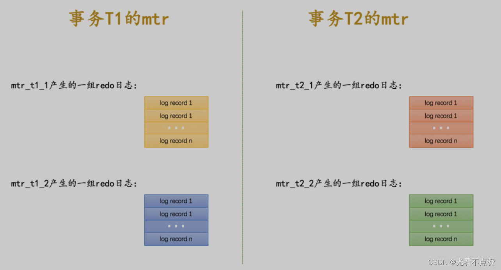
    
- 过程图如下

> 可以看到两个事务的mtr是交替复制到pool的，每一个mtr所占的空间也不一样
> 
> 
> **可以看到pool里有很多个block，每个block里面有很多mtr，每个mtr代表着一组redo日志**
> 
> 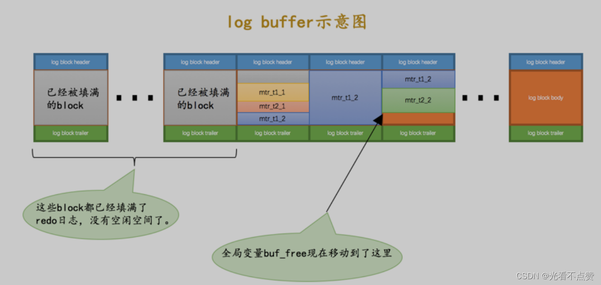
>