# MySQL是怎样运行的：从根儿上理解MySQL | redo日志（下）

type: Post
status: Published
date: 2022/03/21
slug: example-1
summary: 前面说过redo日志以mtr的形式存放在pool中，但这些数据不能一直待在内存里面啊，我们需要把这些数据持久化到磁盘中去，以下几种情况会引发持久化即刷新
tags: Mysql
category: 数据库

# 前言：本博文是对MySQL是怎样运行的：从根儿上理解MySQL这本书的归纳和总结

# 21.redo日志（下）

## 1.redo日志文件

### 1.1 redo日志刷盘时机

- 概述

> 前面说过redo日志以mtr的形式存放在pool中，但这些数据不能一直待在内存里面啊，我们需要把这些数据持久化到磁盘中去，以下几种情况会引发持久化即刷新
> 
1. log buffer 空间不足时

> 前面说到log buffer的容量是16MB，很快就会被填满，所以mysql规定当redo日志所占的大小超过了pool的一半左右时，就需要把这些日志刷新到磁盘上
> 
1. 事务提交时

> 我们前边说过之所以使用 redo 日志主要是因为它占用的空间少，还是顺序写，在事务提交时可以不把修改过的Buffer Pool页面刷新到磁盘，但是为了保证持久性，必须要把修改这些页面对应的 redo 日志刷新到磁盘。
> 
1. 后台线程不停地刷刷刷

> 后台有一个线程，大约每秒都会刷新一次log buffer中的redo日志到磁盘
> 
1. 正常关闭服务器时
2. 做所谓的checkpoint（后面会讲到这个概念）
3. 其他

### 1.2 redo日志文件组

- 概述

> 那么pool中的日志刷新到磁盘后都存放在哪里了呢？通过查看SHOW VARIABLES LIKE 'datadir'可以看到默认有两个名为ib_logfile0 和ib_logfile1的文件，日志默认都是存放到这里的，如果不满意设置可以通过以下几个参数调整
> 
> 1. `innodb_log_group_home_dir`
> 该参数指定了 redo 日志文件所在的目录，默认值就是当前的数据目录。
> 2. `innodb_log_file_size`
> 该参数指定了每个 redo 日志文件的大小，在 MySQL 5.7.21 这个版本中的默认值为 `48MB` ，
> 3. `innodb_log_files_in_group`
> 该参数指定 redo 日志文件的个数，默认值为2，最大值为100。
- 总结

> 如果两个文件存满了呢，那么就是新建一个
> 
> 
> ```
> ib_logfile（数字）这个可以0、1、2进行命名
> ```
> 
> **继续循环到ib_logfile0开始下个循环**
> 
> 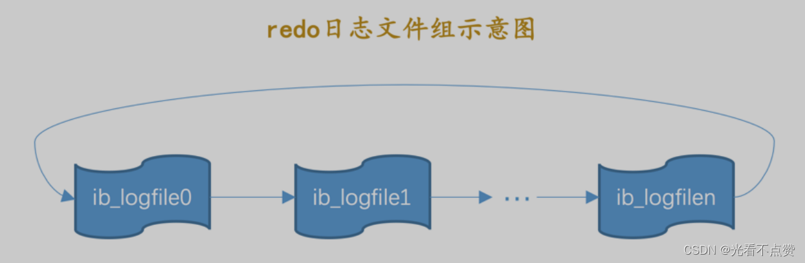
> 
- 总共的 redo 日志文件大小

> innodb_log_file_size × innodb_log_files_in_group
> 

### 1.3 redo日志文件格式

- 概述

> 前面说过pool中其实就是很多个block组成的，刷新到磁盘也是根据这个为单位存储，那么可以说redo日志其实就是由若干个512字节大小的block组成，在磁盘上存放这些redo日志的文件组（文件夹）就是上面的ib_logfile，每个这样的文件组都是统一的格式由两部分组成
> 
> - 前2048个字节，也就是前4个block是用来存储一些管理信息的。
> - 从第2048字节往后是用来存储 log buffer 中的block镜像的。

> 也就是说我们真正存放redo日志的是从第2048个字节开始算，结构图如下，那么请注意我们前面介绍的block的内部结构其实针对的是后面橙色block的通用结构，下面我们介绍蓝色的
> 
> 
> 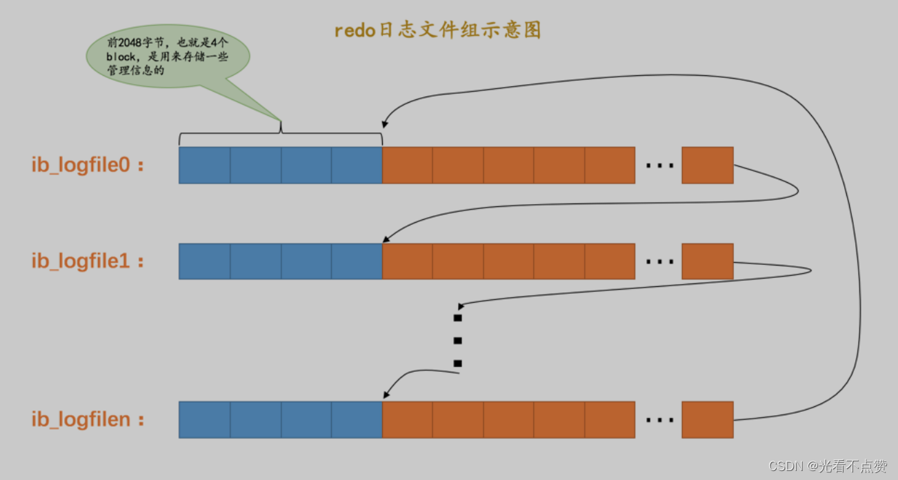
> 

### 1.3.1 日志文件前四个block示意图

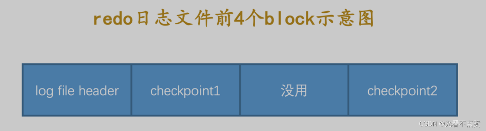

- log file header ：描述该 redo 日志文件的一些整体属性，看一下它的结构：
    
    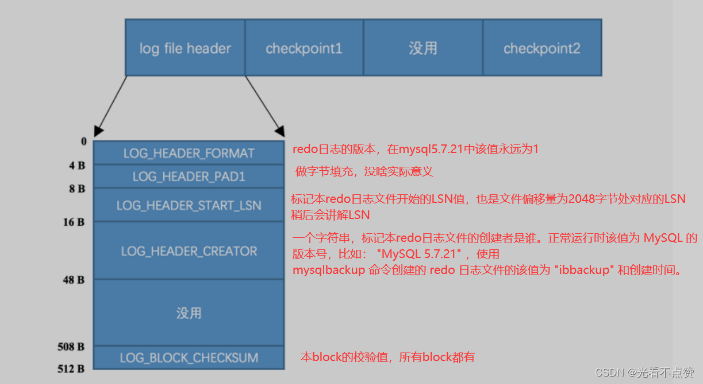
    
    > 注意：mysql后续版本对block的格式一直有在修改，以最新为准！
    > 
- checkpoint1 ：记录关于 checkpoint 的一些属性，看一下它的结构；checkpoint2 与之同理
    
    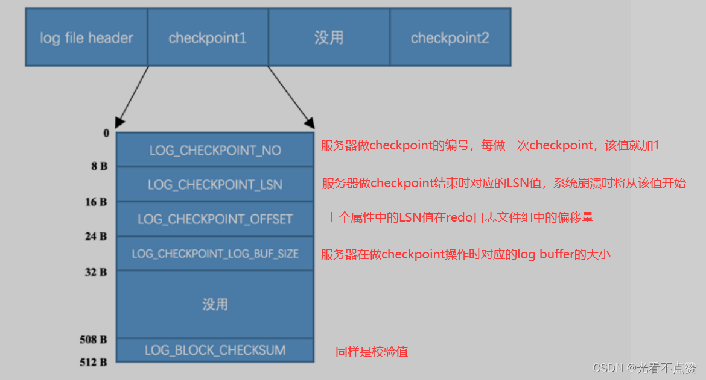
    

## 2.Log Sequeue Number

- 概述

> 自系统开始运行，就不断的修改页面也就是说一直在生成redo日志，日志的容量一直在不断递增永远不会缩减，mysql为记录写入redo日志的量设计一个称为Log Sequeue Number的全局变量，简称LSN，初始值为8704，也就是一条redo日志都没有的时候（大家不必解决初始值为啥是8704）
> 
- 变量如何指向

> 在存入block时，是以mtr生成的一组redo日志为单位进行写入的，写入到block的body处，而在统计LSN的值时是需要加上占用的log block header 和 log block trailer 来计算的，下面举三个例子
> 
1. **系统第一次初始化时，在pool中的buf_free（就是指向下一条redo写在哪里的变量）就会指向第一个block的偏移量为12字节（log block header的大小）的地方，相应LSN的值也会增加12**
    
    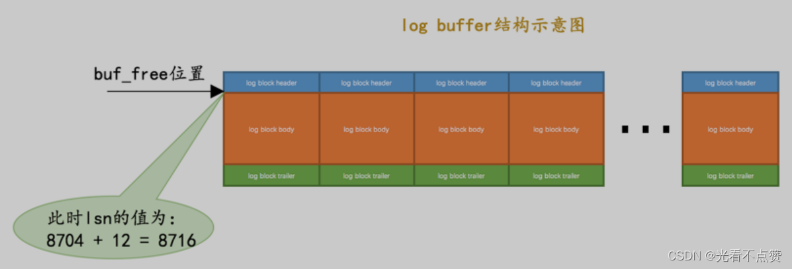
    
2. **如果某个 mtr 产生的一组 redo 日志占用的存储空间比较小（假设有200字节）**，也就是待插入的block剩余空闲空间能容纳这个 mtr 提交的日志时， lsn 增长的量就是该 mtr 生成的 redo 日志占用的字节数，就像这样：
    
    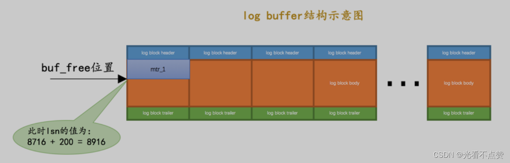
    
3. **如果某个 mtr 产生的一组 redo 日志占用的存储空间比较大（假设有1000字节）**，也就是待插入的block剩余空闲空间不足以容纳这个 mtr 提交的日志时， lsn 增长的量就是该 mtr 生成的 redo 日志占用的字节数加上额外占用的 `log block header 和 log block trailer` 的字节数，就像这样：
    
    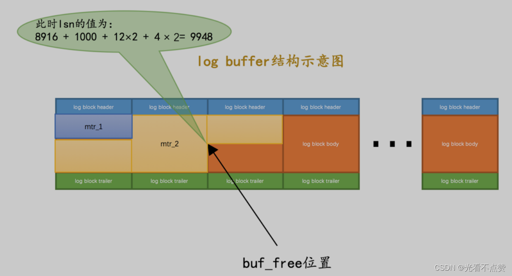
    
- 总结

> 每一个mtr都有一个唯一的LSN值对应，LSN值越小，说明redo日志产生的越早
> 

### 2.1 flushed_to_disk_lsn

- 概述

> 刚才我们提到一个
> 
> 
> ```
> buf_free
> ```
> 
> ```
> block
> ```
> 
> ```
> redo
> ```
> 
> ```
> redo
> ```
> 
> ```
> redo
> ```
> 
> ```
> buf_next_to_write
> ```
> 
> 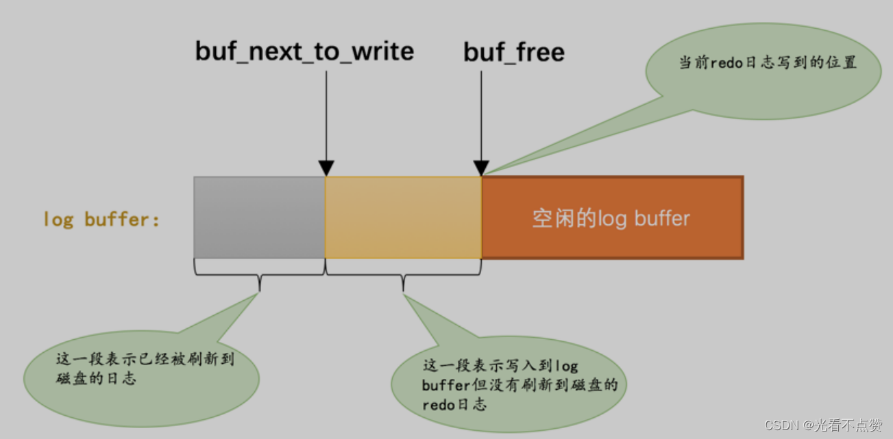
> 
- `flushed_to_disk_lsn`

> 我们前面还说LSN表示当前系统写入的redo日志量，里面包括了还未刷新到磁盘的日志，相对应mysql设计了一个叫flushed_to_disk_lsn的全局变量，表示刷新到磁盘的日志量，初始化与LSN一致，虽然redo日志的写入，LSN的值与flushed_to_disk_lsn拉开差距
> 
- 例子

> 系统第一次启动后，向log buffer中写入了mtr_1 、 mtr_2 、 mtr_3这三个 mtr 产生的 redo 日志，假设这三个 mtr 开始和结束时对应的lsn值分别是：
> 
> - mtr_1 ：8716 ～ 8916
> - mtr_2 ：8916 ～ 9948
> - mtr_3 ：9948 ～ 10000
> 1. 此时的 lsn 已经增长到了10000，但是由于没有刷新操作，所以此时 `flushed_to_disk_lsn` 的值仍为
> `8704` ，如图：
>     
>     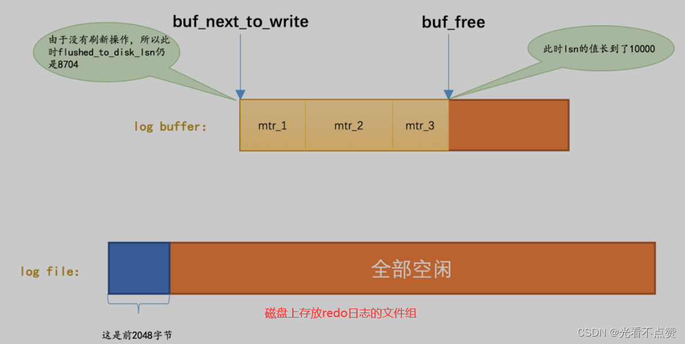
>     
> 2. 随后进行将`log buffer`中的block刷新到 redo 日志文件的操作，假设将 `mtr_1 和 mtr_2` 的日志刷新到磁盘，那么`flushed_to_disk_lsn`就应该增长`mtr_1 和 mtr_2`写入的日志量，所以 `flushed_to_disk_lsn` 的值增长到了 9948 ，如图：
>     
>     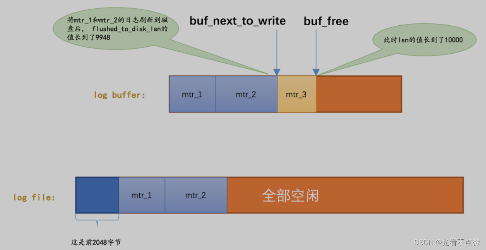
>     
- 总结

> 综上所述，当有新的 redo 日志写入到log buffer时，首先 lsn 的值会增长，但 flushed_to_disk_lsn 不变，随后随着不断有 log buffer 中的日志被刷新到磁盘上，flushed_to_disk_lsn的值也跟着增长。如果两者的值相同时，说明log buffer中的所有redo日志都已经刷新到磁盘中了。
> 
- 小贴士

> 应用程序向磁盘写入文件时其实是先写到操作系统的缓冲区中去，如果某个写入操作要等到操作系统确认已经写到磁盘时才返回，那需要调用一下操作系统提供的fsync函数。其实只有当系统执行了fsync函数后，flushed_to_disk_lsn的值才会跟着增长，当仅仅把log buffer中的日志写入到操作系统缓冲区却没有显式的刷新到磁盘时，另外的一个称之为write_lsn的值跟着增长。不过为了大家理解上的方便，我们在讲述时把flushed_to_disk_lsn和write_lsn的概念混淆了起来。
> 

### 2.2 lsn值和redo日志文件偏移量的对应关系

> 因为 lsn 的值是代表系统写入的 redo 日志量的一个总和，一个 mtr 中产生多少日志， lsn 的值就增加多少（当然有时候要加上 log block header 和 log block trailer 的大小），这样 mtr 产生的日志写到磁盘中时，很容易计算某一个 lsn 值在 redo
> 
> 
> ```
> 日志文件组（还记得ib_logfile吗）
> ```
> 
> 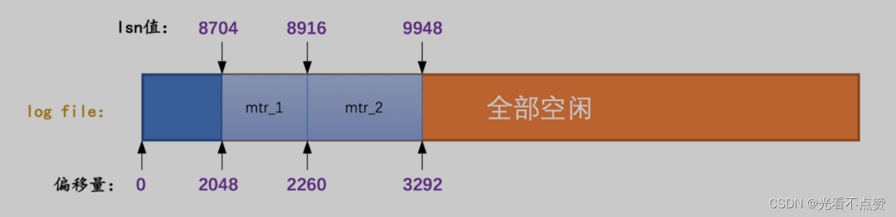
> 
> **初始时的 LSN 值是 8704 ，对应文件偏移量 2048 ，之后每个 mtr 向磁盘中写入多少字节日志， lsn 的值就增长多少**
> 

### 2.3 flush链表中的LSN

- 前情回顾

> 一个mtr代表一次对底层页面的原子操作，在访问过程中会产生redo日志，在mtr结束时，会把这一组redo日志写入到log buffer中，除此之外在 mtr 结束时还有一件非常重要的事情要做，就是把在mtr执行过程中可能修改过的页面加入到
> 
> 
> ```
> Buffer Pool
> ```
> 
> ```
> flush
> ```
> 
> 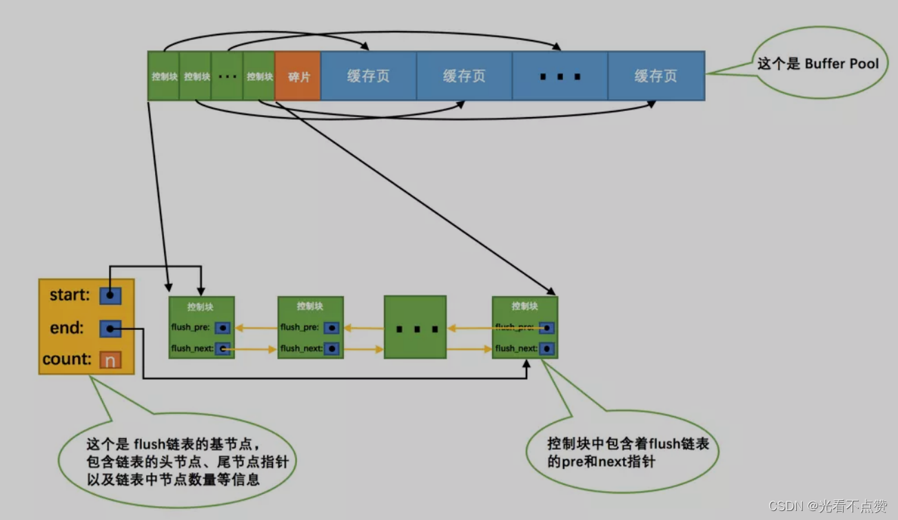
> 
> **就会将该页对应的控制块插入到flush链表的头部，之后再修改该页面时由于它已经在 flush 链表中了，就不再次插入了。也就是说flush链表中的脏页是按照页面的第一次修改时间从大到小进行排序的**
> 
> - `oldest_modification` ：如果某个页面被加载到`Buffer Pool`后进行第一次修改，那么就将修改该页面的mtr 开始时对应的 lsn 值写入这个属性。
> - `newest_modification` ：每修改一次页面，都会将修改该页面的 mtr 结束时对应的 lsn 值写入这个属性。也就是说该属性表示页面最近一次修改后对应的系统 lsn 值。

### 2.3.1 插入过程演示

1. 假设 `mtr_1` 执行过程中修改了`页a`，那么在`mtr_1`执行结束时，就会将 `页a` 对应的控制块加入到 `flush链表` 的头部。并且将 `mtr_1` 开始时对应的 `lsn` ，也就是 `8716` 写入 `页a` 对应的控制块的`oldest_modification` 属性中，把 `mtr_1` 结束时对应的 `lsn` ，也就是`8916`写入 `页a` 对应的控制块的`newest_modification` 属性中。画个图表示一下（为了让图片美观一些，我们把 `oldest_modification` 缩写成了`o_m`，把 `newest_modification` 缩写成了`n_m`）：
    
    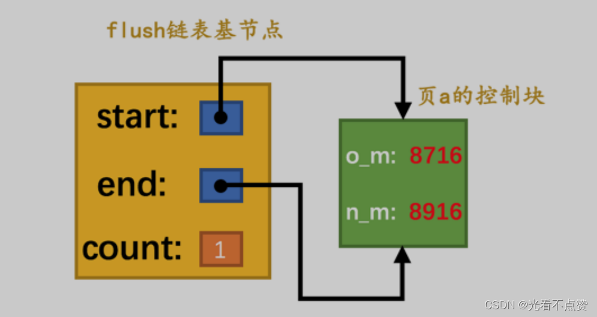
    
2. 接着假设 `mtr_2` 执行过程中又修改了 页b 和 页c 两个页面，那么在`mtr_2`执行结束时，就会将 页b 和 页c对应的控制块都加入到`flush链表`的头部。并且将 mtr_2 开始时对应的`lsn`，也就是`8916`写入 `页b 和 页c`对应的控制块的`oldest_modification`属性中，把`mtr_2`结束时对应的 lsn ，也就是`9948`写入 页b 和 页c对应的控制块的 `newest_modification` 属性中。画个图表示一下
    
    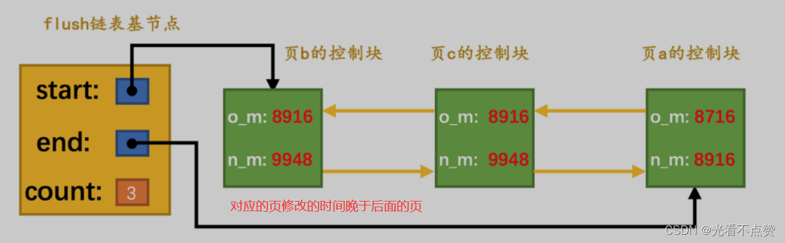
    
3. 接着假设`mtr_3`执行过程中修改了 `页b 和 页d` ，不过`页b`之前已经被修改过了，所以它对应的控制块已经被插入到了`flush`链表，所以在`mtr_3`执行结束时，只需要将`页d`对应的控制块都加入到 `flush链表` 的头部即可。所以需要将`mtr_3`开始时对应的`lsn`，也就是`9948`写入 页d 对应的控制块的`oldest_modification` 属性中，把 mtr_3 结束时对应的 lsn ，也就是10000写入 页d 对应的控制块的`newest_modification` 属性中。另外，由于 页b 在 mtr_3 执行过程中又发生了一次修改，所以需要更新 页 b 对应的控制块中`newest_modification`的值为`10000`。画个图表示一下：
    
    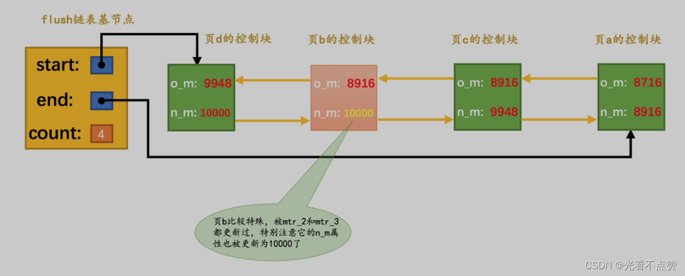
    
- 总结

> flush链表中的脏页按照修改发生的时间顺序进行排序，也就是按照oldest_modification代表的LSN值进行排序，被多次更新的页面不会重复插入到flush链表中，但是会更新newest_modification属性的值。
> 

## 3.checkpoint

- 概述

> 我们前面说过在磁盘存放redo日志的文件组是有限的，所以是循环利用里面的空间，ib_logfile（0、1、2...），当用到最后一个时会从0继续开始下一次的循环。那么redo日志只是为了系统奔溃后恢复脏页用的，如果对应的脏页已经刷新到了磁盘，也就是说即使现在系统奔溃，那么在重启后也用不着使用redo日志恢复该页面了，所以该redo日志也就没有存在的必要了，那么它占用的磁盘空间就可以被后续的redo日志所重用。也就是说：判断某些redo日志占用的磁盘空间是否可以覆盖的依据就是它对应的脏页是否已经刷新到磁盘里
> 
- 例子：

> 如图虽然mtr_1 和 mtr_2生成的 redo 日志都已经被写到了磁盘上，但是它们修改的脏页仍然留在 Buffer Pool 中，所以它们生成的 redo 日志在磁盘上的空间是不可以被覆盖的。之后随着系统的运行，如果 页a 被刷新到了磁盘，那么它对应的控制块就会从 flush链表 中移除
这样 mtr_1 生成的 redo 日志就没有用了，它们占用的磁盘空间就可以被覆盖掉了。设计 InnoDB 的大叔提出了一个全局变量checkpoint_lsn来代表当前系统中可以被覆盖的 redo 日志总量是多少，这个变量初始值也是8704 。
> 

### 3.1 checkpoint_lsn

- 概述

> 上面我们提到checkpoint_lsn这个全局变量是来代表系统中可以被覆盖的redo日志总量是多少，比如说在 页a 被刷新到了磁盘， mtr_1 生成的 redo 日志就可以被覆盖了，所以我们可以进行一个增加 checkpoint_lsn 的操作，我们把这个过程称之为做一次 checkpoint 。做一次 checkpoint 其实可以分为两个步骤：
> 
> 1. 计算一下当前系统中可以被覆盖的 redo 日志对应的 lsn 值最大是多少。
> 2. 将 `checkpoint_lsn` 和对应的 redo 日志文件组偏移量以及此次 checkpint 的编号写到日志文件的管理信息（就是 `checkpoint1 或者 checkpoint2` ）中。
- 解释步骤一

> redo日志可以被覆盖掉，那么就意味着它对应的脏页刷新到了磁盘页，那么该脏页就被移除掉flush链表了，现在需要找到该脏页的前驱节点，也就是现在当前系统中最早修改的脏页，将他的oldest_modification赋值给checkpoint_lsn，那么这个值之前的所有redo日志就代表可以被覆盖；可以看上图的页a被移除后，那么页c的oldest_modification就被赋值给了checkpoint_lsn也就是8916
> 
- 解释步骤二

> mysql维护了一个目前系统做了多少次checkpoint的变量checkpoint_no，每做一次checkpoint，该变量就加一，我们前边说过计算一个lsn值对应的redo日志文件组偏移量是很容易的，所以可以计算得到该 checkpoint_lsn 在 redo 日志文件组中对应的偏移量 checkpoint_offset ，然后把这三个值都写到 redo 日志文件组的管理信息中。
我们前面说过每个redo日志都有一个2048字节的管理信息，但是上述关于checkpoint的信息只会被写到所有日志文件组的第一个日志文件的管理信息中。不过我们是存储到 checkpoint1 中还是 checkpoint2 中呢？设计 InnoDB 的大叔规定，当 checkpoint_no 的值是偶数时，就写到 checkpoint1 中，是奇数时，就写到checkpoint2 中。
> 
- 经过一系列运算redo日志文件组中各个lsn关系就像这样
    
    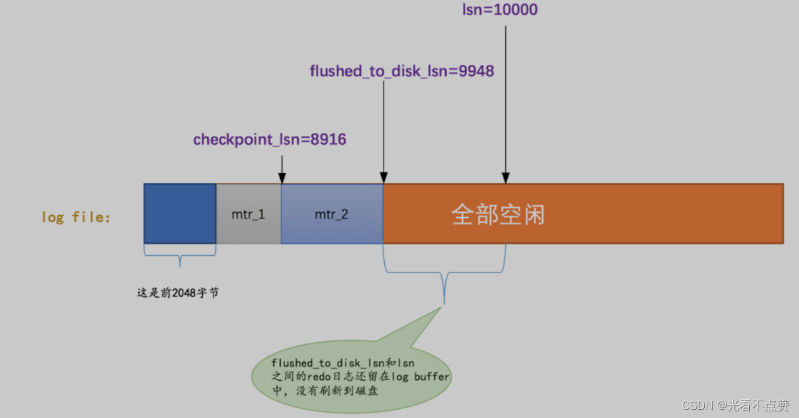
    

### 3.2 批量从flush链表中刷出脏页

- 概述

> 对于脏页的处理在数量不是很多的情况下，由后台线程在LRU链表和flush链表中进行刷新处理；这样虽然慢但是不影响用户线程；如果当前系统修改页面十分频繁这样写日志的操作十分频繁，系统lsn增值过快，如果后台无法及时将脏页刷出，checkpoint就无法及时做。可能就需要用户线程同步的从 flush链表 中把那些最早修改的脏页（ oldest_modification 最小的脏页）刷新到磁盘，这样这些脏页对应的 redo 日志就没用了，然后就可以去做checkpoint了。
> 

### 3.3 查看系统中的各种LSN值

> 在mysql命令行输入
> 
> 
> ```
> SHOW ENGINE INNODB STATUS
> ```
> 
> ```
>  InnoDB
> ```
> 
> ```
> LSN
> ```
> 
> 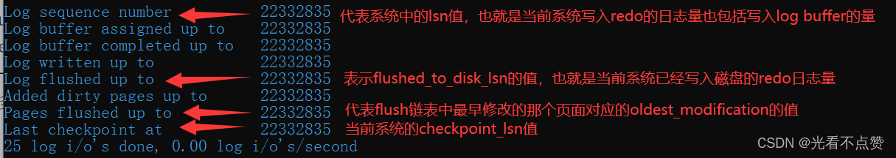
> 

## 4.innodb_flush_log_at_trx_commit的用法

> 让我们回归初心想一想redo日志到底是为了什么，不就是为了事务的持久性吗，但是如果频繁的修改有很影响性能，如果对持久性不是很敏感的同学可以设置innodb_flush_log_at_trx_commit这个系统变量的值，该变量有三个可选的值
> 
> - 0：当该系统变量值为0时，表示在事务提交时不立即向磁盘中同步 redo 日志，这个任务是交给后台线程做的。这样很明显会加快请求处理速度，但是如果事务提交后服务器挂了，后台线程没有及时将 redo 日志刷新到磁盘，那么该事务对页面的修改会丢失。
> - 1：当该系统变量值为1时，表示在事务提交时需要将 redo 日志同步到磁盘，可以保证事务的 持久性 。 **1 也是 innodb_flush_log_at_trx_commit 的默认值。**
> - 2 ：当该系统变量值为2时，表示在事务提交时需要将 redo 日志写到操作系统的缓冲区中，但并不需要保证将日志真正的刷新到磁盘。这种情况下如果数据库挂了，操作系统没挂的话，事务的 持久性 还是可以保证的，但是操作系统也挂了的话，那就不能保证 持久性 了。

## 5.崩溃恢复

- 概述

> 在服务器不挂的情况下， redo 日志简直就是个大累赘，不仅没用，反而让性能变得更差。但是万一，我说万一啊，万一数据库挂了，那 redo 日志可是个宝了，我们就可以在重启时根据 redo 日志中的记录就可以将页面恢复到系统奔溃前的状态。我们接下来大致看一下恢复过程是个啥样。
> 

### 5.1 确定恢复的起点

- 概述

> 对于已经在磁盘中的那些页对应的redo日志就没必要恢复了，我们直接从现在checkpoint_lsn指向的位置之后的redo日志进行恢复，对于这些日志对应的页可能没被刷新也可能被刷新了但具体并不清楚，所以我们就从这里开始读取。现在扩大视野想想日志文件组的第一个管理信息中的两个block（checkpoint1和checkpoint2）存储着checkpoint_lsn信息，我们肯定是要从最近发生的checkpoint开始恢复，通过比对两个block中checkpoint_no的值谁大谁就是最近的，这样我们就能拿到checkpoint_lsn 值以及它在 redo 日志文件组中的偏移量 checkpoint_offset
> 

### 5.2 确定恢复的终点

- 概述

> 起点找到，终点在哪里呢，想一想以前redo日志是顺序存放在block中的，每个填满的block都是512，那么只要找到小于512占用大小的就是终点了
> 

### 5.3 怎么恢复

### 5.3.1 例子

- 概述

> 假如现在有5条redo日志如下图，起点是checkpoint_lsn那么前面的就不用管了，我们直接能想到的就是按照这个顺序依次恢复，不过mysql想到了一个更加快速便捷的方法
> 
> 
> 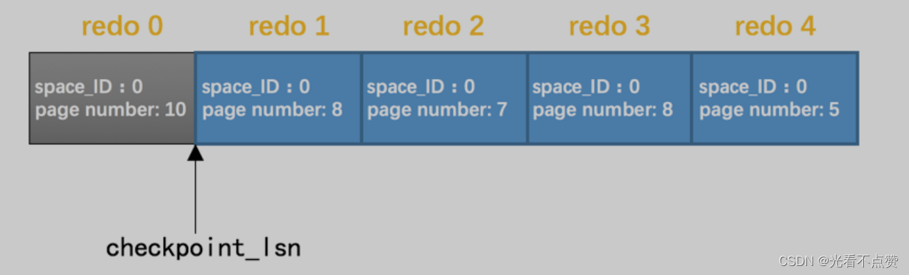
> 

### 5.3.2 使用哈希表

- 概述

> 我们可以根据redo日志的space ID和page number属性计算出散列值（即hash值），如果space ID和page number都相同也就意味着了hash碰撞，后来的就以链表的形式加入到表尾，这样一个页的就全在一条链表上了即都放在一个槽中，这样就避免了很多随机IO，而且顺序还正好是取出来的顺序
> 
- 结构
    
    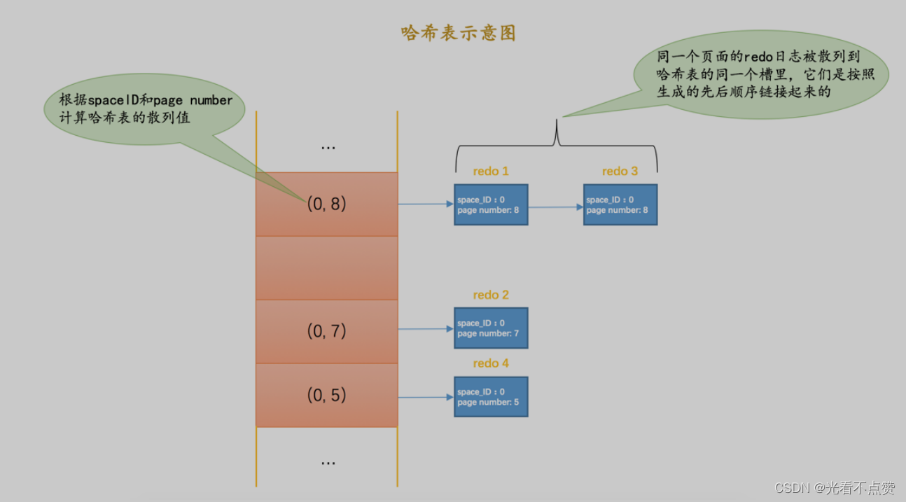
    

### 5.3.3 跳过已经刷新到磁盘的页面

- 概述

> 前面说到过checkpoint_lsn后面的redo日志对应的页我们不确定有没有刷新，因为可能在崩溃前的一瞬间刷新了一半或全部都刷新完了，此时我们就是在刷新的同时去检查每个页面称之为File Header的部分，在这个里面有一项FIL_PAGE_LSN的属性，该属性记录着最后一次修改页面对应的lsn值就是脏页控制快递newest_modification 值，如果将某脏页刷新了，那么FIL_PAGE_LSN肯定是大于 checkpoint_lsn 的值，但凡符合就不用恢复直接跳过
> 

## 6.LOG_BLOCK_HDR_NO是如何计算的

- 概述

> 我们前边说过，对于实际存储 redo 日志的普通的log block来说，在 log block header 处有一个称之为LOG_BLOCK_HDR_NO 的属性（忘记了的话回头再看看哈），我们说这个属性代表一个唯一的标号。这个属性是初次使用该block时分配的，跟当时的系统lsn值有关。使用下边的公式计算该block的 LOG_BLOCK_HDR_NO 值：((lsn / 512) & 0x3FFFFFFFUL) + 1
> 
- 0x3FFFFFFFUL的解释

> 可以看到前两位0，后三十位都是1，与0做与运算的结果为0，与1做与运算结果都为原值，那么
> 
> 
> ```
> （lsn/512）
> ```
> 
> ```
> （lsn/512）不大于0x3FFFFFFFUL。
> ```
> 
> ```
> lsn
> ```
> 
> ```
> 0 ~ 0x3FFFFFFFUL
> ```
> 
> ```
>  1 ~ 0x40000000UL
> ```
> 
> ```
> 0x40000000UL就代表1GB
> ```
> 
> ```
> 512GB
> ```
> 
> ```
> block512字节
> ```
> 
> ```
> 1GB的block块
> ```
> 
> ```
> LOG_BLOCK_HDR_NO
> ```
> 
> 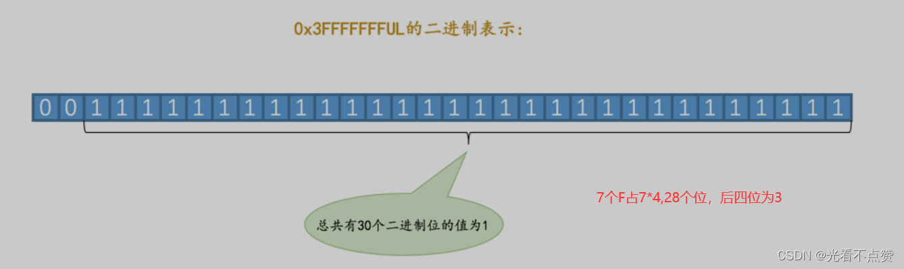
> 
- 小贴士

> LOG_BLOCK_HDR_NO 值的第一个比特位比较特殊，称之为flush bit ，如果该值为1，代表着本block是在某次将 log buffer中的block刷新到磁盘的操作中的第一个被刷入的block。
> 

## 7.redo日志和change buffer的对比

- redo日志

> 其实很好理解，redo日志为我们节省了随机写磁盘的IO消耗，因为redo日志上记录的都是顺序写，相同页上的修改记录都在redo日志中都是连贯的。
> 
- change buffer

> 而change buffer节省的是随机读磁盘的IO消耗，因为当你内存中没有对应页时将做的修改全部记录到change buffer，下次读取到这个页直接更新就好了
>