# MySQL是怎样运行的：从根儿上理解MySQL | undo日志（下）

type: Post
status: Published
date: 2022/03/26
slug: example-2
summary: 在写入undo日志的时候会使用到多个链表，每个链表都有相同的节点结构如下图：前面说过我们在表空间内，我们可以通过一个页的页号和页内的偏移量来定位到一个节点的位置，这两个信息也相当于指向这个节点的一个指针所以
tags: Mysql
category: 数据库

# 前言：本博文是对MySQL是怎样运行的：从根儿上理解MySQL这本书的归纳和总结

# 23.后悔了怎么办-undo日志（下）

## 1.通用链表结构

- 概述

> 在写入undo日志的时候会使用到多个链表，每个链表都有相同的节点结构如下图：前面说过我们在表空间内，我们可以通过一个页的页号和页内的偏移量来定位到一个节点的位置，这两个信息也相当于指向这个节点的一个指针所以：
> 
> - `Pre Node Page Number 和 Pre Node Offset` 的组合就是指向前一个节点的指针
> - `Next Node Page Number 和 Next Node Offset` 的组合就是指向后一个节点的指针。
>     
>     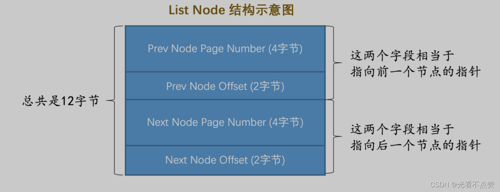
>     
- 基节点

> 为了更好的管理这些链表，mysql提出了一个基节点的结构，里面存储了这个链表的头节点和尾节点以及链表的长度信息，基节点的结构示意图如下
> 
> - `List Length`表明该链表一共有多少节点。
> - `First Node Page Number 和 First Node Offset` 的组合就是指向链表头节点的指针。
> - `Last Node Page Number 和 Last Node Offset` 的组合就是指向链表尾节点的指针。
>     
>     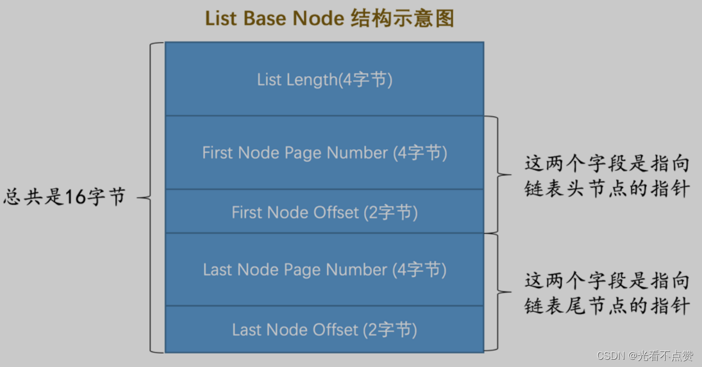
>     
- 总结

> List Base Node 和 List Node
> 
> 
> 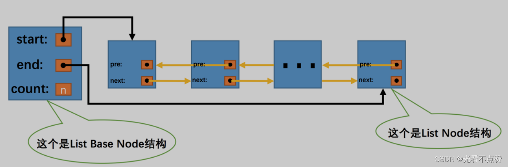
> 

## 2.FIL_PAGE_UNDO_LOG页面

- 概述

> 我们前面说到表空间是由很多很多个页面组成的，页面默认为
> 
> 
> ```
> 16kb
> ```
> 
> ```
> FIL_PAGE_INDEX
> ```
> 
> ```
> FIL_PAGE_TYPE_FSP_HDR
> ```
> 
> ```
> FIL_PAGE_UNDO_LOG
> ```
> 
> ```
> undo
> ```
> 
> ```
> 16KB
> ```
> 
> 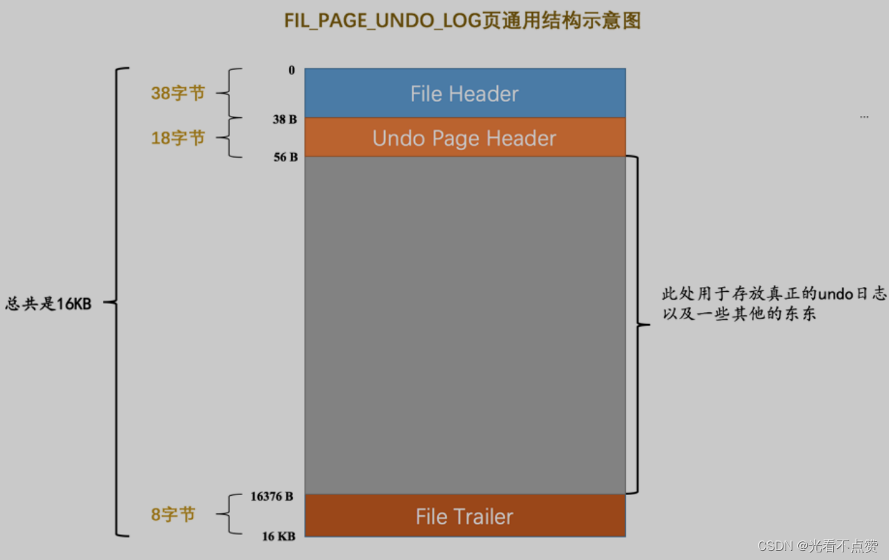
> 
- undo页面的Undo Page Header结构示意图
    
    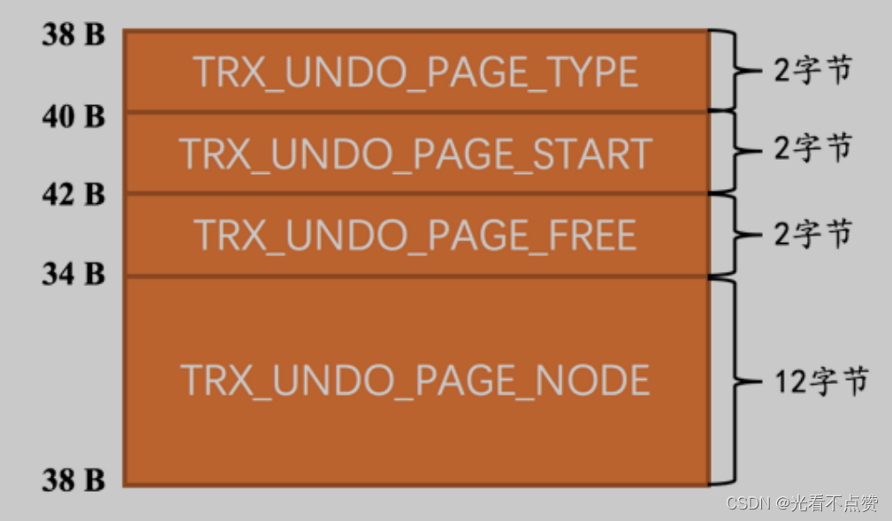
    
- `TRX_UNDO_PAGE_TYPE`：本页面准备存储什么种类的undo日志

> 结合我们前面讲的各种情况大致对于undo日志可以分为这么两大类
> 
> 1. `TRX_UNDO_INSERT （使用十进制 1 表示）`：类型为`TRX_UNDO_INSERT_REC 的 undo日志`属于此大类，一般由`INSERT`语句产生，或者在 `UPDATE` 语句中有更新主键的情况也会产生此类型的 `undo`日志 。
> 2. `TRX_UNDO_UPDATE （使用十进制 2 表示）`，除了类型为 `TRX_UNDO_INSERT_REC 的 undo日志` ，其他类型的 `undo日志` 都属于这个大类，比如我们前边说的 `TRX_UNDO_DEL_MARK_REC 、TRX_UNDO_UPD_EXIST_REC` 啥的，一般由`DELETE 、UPDATE`语句产生的 `undo日志` 属于这个大类。

> 这个 TRX_UNDO_PAGE_TYPE 属性可选的值就是上边的两个，用来标记本页面用于存储哪个大类的 undo日志 ，不同大类的 undo日志 不能混着存储，比如一个Undo页面的 TRX_UNDO_PAGE_TYPE 属性值为TRX_UNDO_INSERT ，那么这个页面就只能存储类型为 TRX_UNDO_INSERT_REC 的 undo日志 ，其他类型的 undo日志 就不能放到这个页面中了。
> 

> 之所以把undo日志分成两个大类，是因为类型为TRX_UNDO_INSERT_REC的undo日志在事务提交后可以直接删除掉，而其他类型的undo日志还需要为所谓的MVCC服务，不能直接删除掉，对它们的处理需要区别对待。
> 
- `TRX_UNDO_PAGE_START` ：表示在当前页面中是从什么位置开始存储 undo日志 的，或者说表示第一条 undo日志 在本页面中的起始偏移量。
- `TRX_UNDO_PAGE_FREE` ：与上边的 `TRX_UNDO_PAGE_START` 对应，表示当前页面中存储的最后一条 undo 日志结束时的偏移量，或者说从这个位置开始，可以继续写入新的 undo日志 。

> 例子：观察上面两个属性的位置，假设现在向页面中写入了3条 undo日志，当然，在最初一条 undo日志 也没写入的情况下，
> 
> 
> ```
> TRX_UNDO_PAGE_START 和 TRX_UNDO_PAGE_FREE
> ```
> 
> 
> 
- `TRX_UNDO_PAGE_NODE` ：代表一个 List Node 结构（链表的**普通节点**，我们上边刚说的）。

## 3.Undo页面链表

### 3.1 单个事务中的undo页面链表

- 概述

> 因为一个事务可能更改多条记录，一条记录的更改又会对应一条或两条的undo日志，所以产生的undo日志是非常多的，那么就存在很多不同的undo页面，这些页面通过
> 
> 
> ```
> TRX_UNDO_PAGE_NODE
> ```
> 
> 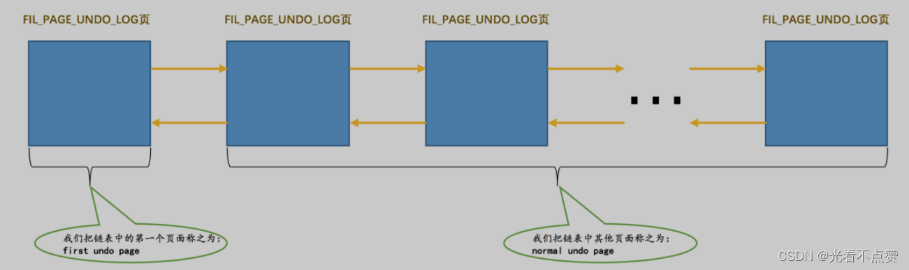
> 
> ```
> Undo页面
> ```
> 
> ```
>  first undo page
> ```
> 
> ```
>  normal undo page
> ```
> 
> ```
> first undo page
> ```
> 
> ```
> Undo Page Header
> ```
> 
- undo页面的唯一性

> 在一个事务执行过程中，可能混着执行
> 
> 
> ```
> INSERT 、 DELETE 、 UPDATE
> ```
> 
> ```
>  undo日志
> ```
> 
> **但是我们前边又强调过，同一个 `Undo页面` 要么只存储`TRX_UNDO_INSERT` 大类的 undo日志 ，要么只存储`TRX_UNDO_UPDATE` 大类的 undo日志 ，反正不能混着存**
> 
> ```
>  insert undo
> ```
> 
> ```
>  update undo链表
> ```
> 
> 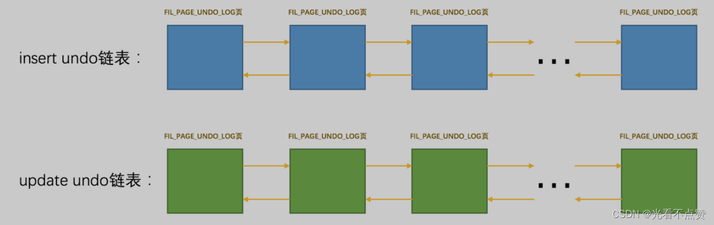
> 
- 普通表和临时表的undo页面

> 规定对普通表和临时表的记录改动时产生的 undo日志 要分别记录（我们稍后阐释为啥这么做），所以在一个事务中最多有4个以 Undo页面 为节点组成的链表：
> 
> 
> 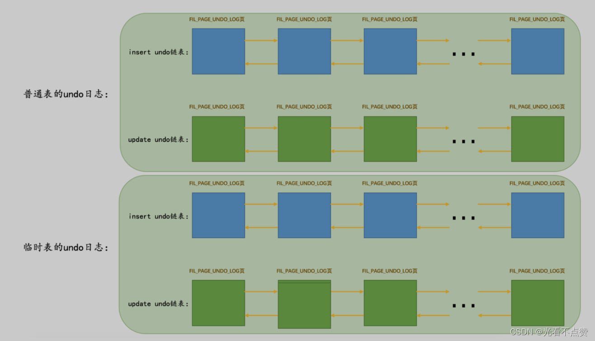
> 
- 链表分配策略

> 刚刚开启事务时，一个 Undo页面 链表也不分配。当事务执行过程中向普通表中插入记录或者执行更新记录主键的操作之后，就会为其分配一个 普通表的insert undo链表 。当事务执行过程中删除或者更新了普通表中的记录之后，就会为其分配一个 普通表的update undo链表 。当事务执行过程中向临时表中插入记录或者执行更新记录主键的操作之后，就会为其分配一个 临时表的insert undo链表 。当事务执行过程中删除或者更新了临时表中的记录之后，就会为其分配一个 临时表的update undo链表 。
> 

> 总结一句就是：按需分配，啥时候需要啥时候再分配，不需要就不分配。
> 

### 3.2 多个事务中的Undo页面链表

- 概述

> 为了尽可能提高undo日志的写入效率，不同的事务执行过程中产生的undo日志需要被写入到不同的undo页面链表中去，如果有更多的事务那就意味着可能会产生更多的undo页面链表
> 
- 例子

> 比方说现在有事务 id 分别为 1 、 2 的两个事务，我们分别称之为trx 1 和 trx 2，假设在这两个事务执行过程中：
> 

> 对trx 1 对普通表做了 DELETE 操作，对临时表做了 INSERT 和 UPDATE 操作。InnoDB 会为 trx 1 分配3个链表，分别是：
> 
> - 针对普通表的 `update undo`链表
> - 针对临时表的 `insert undo`链表
> - 针对临时表的 `update undo`链表 。
>     
>     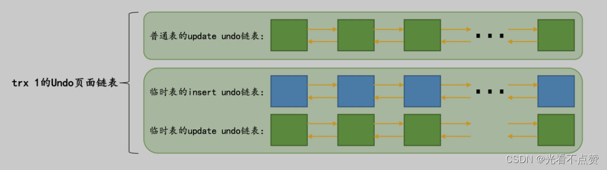
>     

> trx 2 对普通表做了 INSERT 、 UPDATE 和 DELETE 操作，没有对临时表做改动。InnoDB 会为 trx 2 分配2个链表，分别是：
> 
> - 针对普通表的 `insert undo`链表
> - 针对普通表的 `update undo`链表 。
>     
>     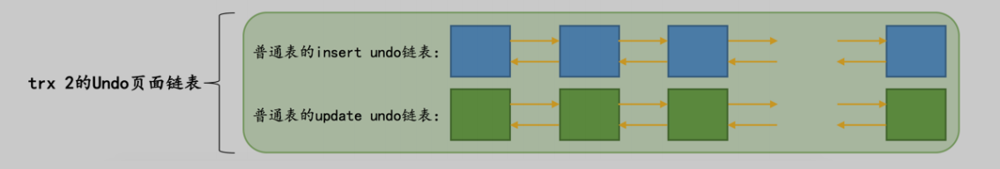
>     

## 4.undo日志具体写入过程

### 4.1 段（Segment）的概念

- 回忆

> 简单讲，这个段是一个逻辑上的概念，本质上是由若干个零散页面和若干个完整的区组成的。比如一个B+ 树索引被划分成两个段，一个叶子节点段，一个非叶子节点段，这样叶子节点就可以被尽可能的存到一起，非叶子节点被尽可能的存到一起。每一个段对应一个INODE Entry结构，这个 INODE Entry 结构描述了这个段的各种信息，比如段的 ID ，段内的各种链表基节点，零散页面的页号有哪些等信息（具体该结构中每个属性的意思大家可以到表空间那一章里再次重温一下）。我们前边也说过，为了定位一个INODE Entry，设计了一个 Segment Header 的结构：知道了这三个信息不随随便便知道对应Inode Entry
> 
> - `Space ID of the INODE Entry ： INODE Entry` 结构所在的表空间ID。
> - `Page Number of the INODE Entry ： INODE Entry` 结构所在的页面页号。
> - `Byte Offset of the INODE Ent ： INODE Entry` 结构在该页面中的偏移量
>     
>     ![>\[外链图片转存失败,源站可能有防盗链机制,建议将图片保存下来直接上传(img-KcTWM81O-1648115624239)(C:\Users\hp\AppData\Roaming\Typora\typora-user-images\image-20220324152248376.png)\]](https://i-blog.csdnimg.cn/blog_migrate/e1fd2756534d55036dd69bd1e37c137a.png)
>     

### 4.2 Undo Log Segment Header

- 概述

> 每一个
> 
> 
> ```
> Undo页面
> ```
> 
> ```
> Undo Log Segment
> ```
> 
> ```
> Undo页面
> ```
> 
> ```
> first undo page
> ```
> 
> ```
> Undo Log Segment Header
> ```
> 
> ```
> segment header
> ```
> 
> ```
> Undo 页面
> ```
> 
> 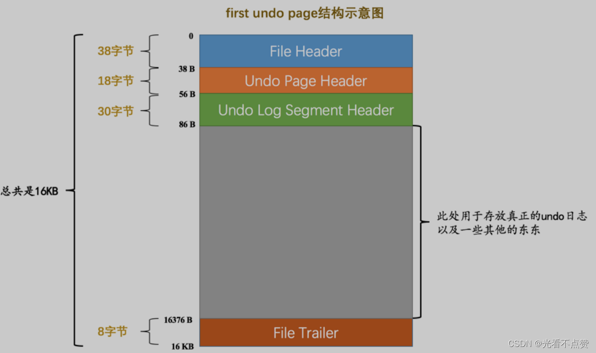
> 

### 4.2.1 Undo Log Segment Header结构的各个属性

- 结构：

> 这个属性的结构如下：
> 
> 
> 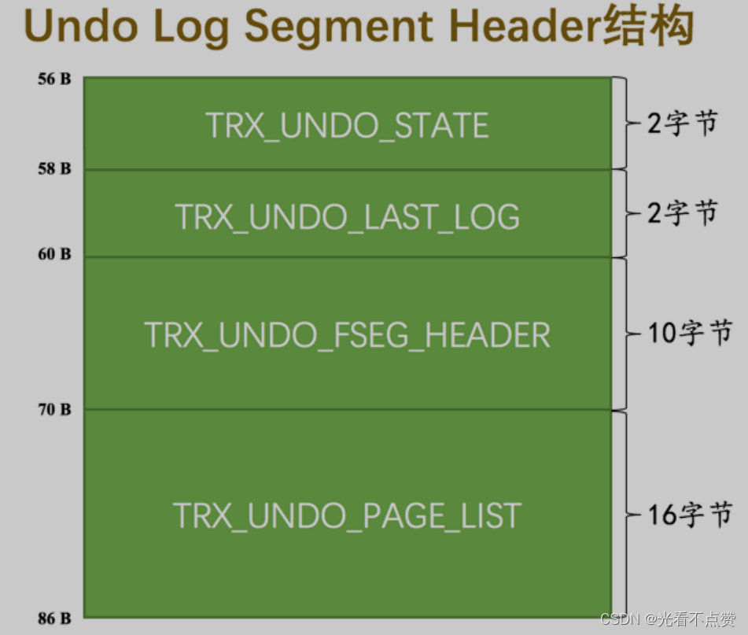
> 
- `TRX_UNDO_STATE` ：本 Undo页面 链表处在什么状态。

> 一个 Undo Log Segment 可能处在的状态包括：
> 
> - `TRX_UNDO_ACTIVE` ：活跃状态，也就是一个活跃的事务正在往这个段里边写入 `undo`日志 。
> - `TRX_UNDO_CACHED` ：被缓存的状态。处在该状态的 `Undo`页面 链表等待着之后被其他事务重用。
> - `TRX_UNDO_TO_FREE` ：对于 `insert undo` 链表来说，如果在它对应的事务提交之后，该链表不能被重用，那么就会处于这种状态。
> - `TRX_UNDO_TO_PURGE` ：对于`update undo`链表来说，如果在它对应的事务提交之后，该链表不能被重用，那么就会处于这种状态。
> - `TRX_UNDO_PREPARED` ：包含处于`PREPARE`阶段（这个阶段是在分布式事务中会出现）的事务产生的 undo日志
- `TRX_UNDO_LAST_LOG` ：本 `Undo`页面 链表中最后一个`Undo Log Header`的位置。
- `TRX_UNDO_FSEG_HEADER` ：本 `Undo`页面 链表对应的段的`Segment Header`信息（就是我们上一节介绍的那个`10`字节结构，通过这个信息可以找到该段对应的`INODE Entry`）。
- `TRX_UNDO_PAGE_LIST` ： `Undo`页面 链表的基节点。
- 注意

> 我们上边说 Undo页面 的Undo Page Header部分有一个12字节大小的 TRX_UNDO_PAGE_NODE 属性，这个属性代表一个 List Node 结构。每一个 Undo页面 都包含 Undo Page Header 结构，这些页面就可以通过这个属性连成一个链表。这个 TRX_UNDO_PAGE_LIST 属性代表着这个链表的基节点，当然这个基节点只存在于 Undo页面 链表的第一个页面，也就是first undo page中对应的就是normal undo page啦。
> 

### 4.3 Undo Log Header

- 概述

> 事务在undo页面进行写入undo日志时，写入方式顺序写入一条一条紧接着，写完一个页紧接着在从段中申请，然后将新申请的页面接入链表。mysql中会将同一个事务中向一个undo页面链表中写入的undo日志算作一个组
> 
- 例子

> 比方说我们上边介绍的 trx 1 由于会分配3个 Undo页面 链表，也就会写入3个组的 undo日志 ； trx 2 由于会分配2个 Undo页面 链表，也就会写入2个组的 undo日志 。在每写入一组 undo日志 时，都会在这组 undo日志 前先记录一下关于这个组的一些属性，那么存储这些属性的地方就是Undo Log Header所以 Undo页面 链表的第一个页面在真正写入 undo日志 前，其实都会被填充 Undo Page Header 、 Undo Log Segment Header 、 Undo Log Header 这3个部分
> 
- 页中所处结构
    
    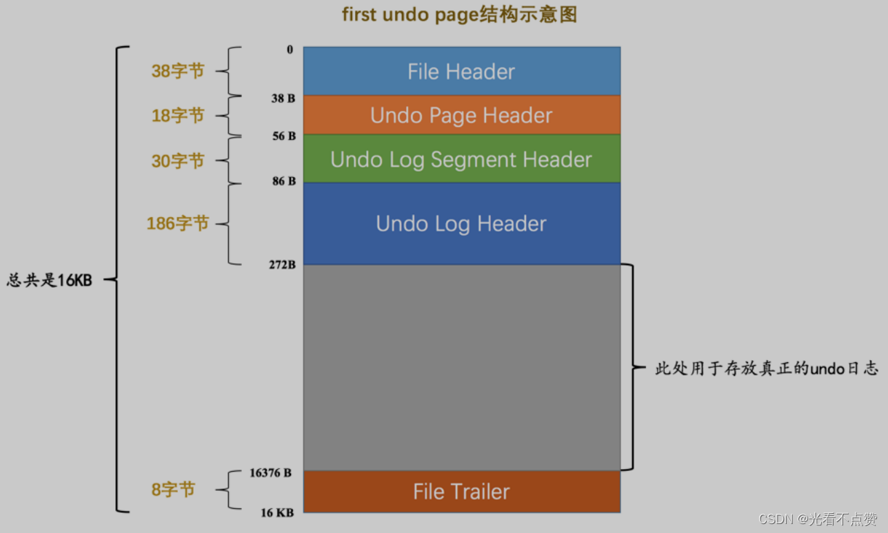
    
- Undo Log Header具体结构

> 一般来说一个
> 
> 
> ```
> Undo
> ```
> 
> ```
> undo日志
> ```
> 
> ```
> Undo
> ```
> 
> ```
> Undo页面
> ```
> 
> ```
> Undo日志
> ```
> 
> ```
> TRX_UNDO_NEXT_LOG和TRX_UNDO_PREV_LOG
> ```
> 
> **关于什么时候重用Undo页面链表，怎么重用这个链表我们稍后会详细说明的**
> 
> ```
> TRX_UNDO_NEXT_LOG和TRX_UNDO_PREV_LOG
> ```
> 
> 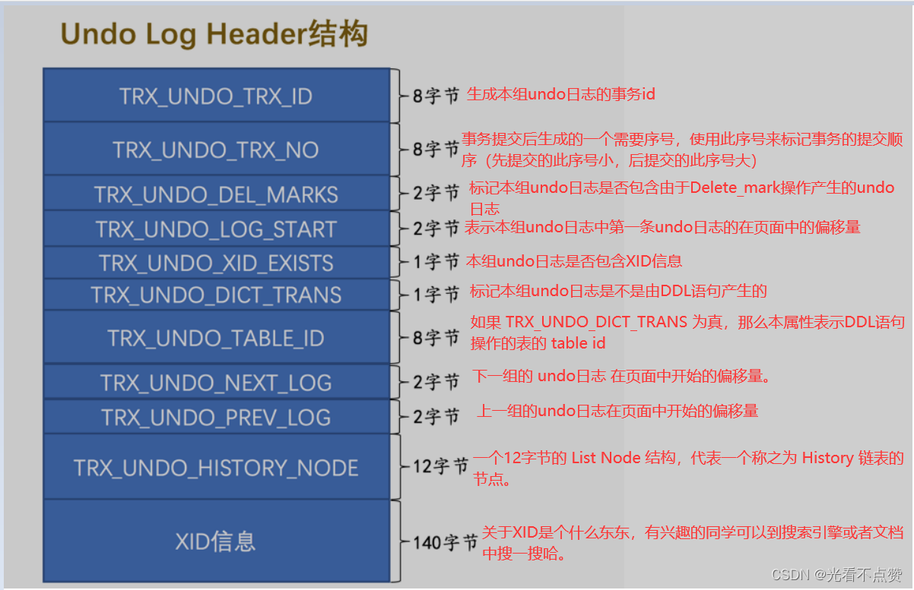
> 

### 4.4 小结

> 对于没有被重用的 Undo页面 链表来说，链表的第一个页面，也就是first undo page在真正写入 undo日志前，会填充Undo Page Header 、 Undo Log Segment Header 、 Undo Log Header这3个部分，之后才开始正式写入 undo日志 。对于其他的页面来说，也就是normal undo page在真正写入undo日志前，只会填充Undo Page Header。链表的List Base Node存放到 first undo page 的Undo Log Segment Header部分， List Node 信息存放到每一个 Undo页面 的 undo Page Header 部分，所以画一个 Undo页面 链表的示意图就是这样：
> 

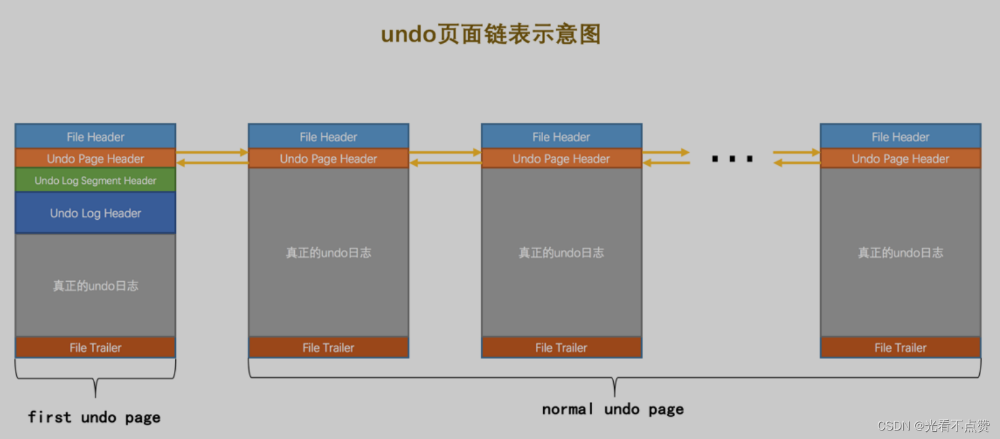

- 注意

> 一个页面不能存放不同类型事务，一个页面只能存放很多相同类型的事务（插入或更新），而同一个事务中向一个undo页面链表中写入的undo日志算作一个组，一个页面下可以有很多个组
> 

## 5.重用Undo页面

### 5.1 重用的条件

- 概述

> 我们前面说过，为了提高效率性能一个事务中会被分配相应的undo页面链表（最多有四条），那么如果只改变了一小点都要分配一个undo页面，里面只有很少的undo日志，而针对这个undo页面又需要创建一个undo页面链表，无数个事务中都只改了一点，都要这么来一遍？显然是不可能的，那么引入undo页面的重用就很好处理了，条件如下：
> 

### 5.1.1 该链表中只包含一个 Undo页面

- 概述

> 该链表中只包含一个 Undo页面 ：如果一个事务维护了很多undo页面，事务提交后，新事务如果只有很少的undo日志和页面需要维护，那也就是说这条链表还需要维护很多上个事务留下来的页面，因为新事务的日志量还不足以将后面大量的空间重用，那么又会造成浪费
> 

### 5.1.2 该 Undo页面 已经使用的空间小于整个页面空间的3/4

- 概述

> Undo页面 链表按照存储的 undo日志 所属的大类可以被分为 insert undo链表 和 update undo
链表 两种，这两种链表在被重用时的策略也是不同的，我们分别看一下：
> 
- insert undo链表

> insert
> 
> 
> ```
> TRX_UNDO_INSERT_REC
> ```
> 
> ```
> insert
> ```
> 
> **假设此刻该页面已使用的空间小于整个页面大小的3/4，那么下一个事务就可以重用这个 insert undo链表 （链表中只有一个页面）。假设此时有一个新事务重用了该 insert undo链表 ，那么可以直接把旧的一组 undo日志 覆盖掉，写入一组新的 undo日志 （当然除了这些结构中的其他属性也会得到调整）。**
> 
> 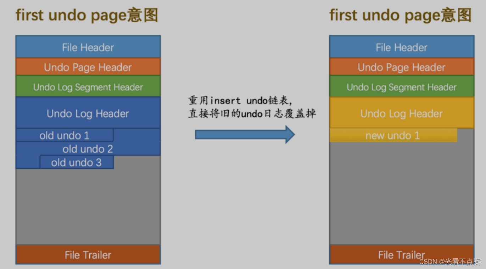
> 
- update undo链表

> 事务提交后，update链表中的undo日志不能被立即删除掉（这些日志用于MVCC），如果之后的事务想重用update链表时，就不能覆盖之前事务写入的undo日志，这样就相当于在旧的后面续写了
> 
> 
> 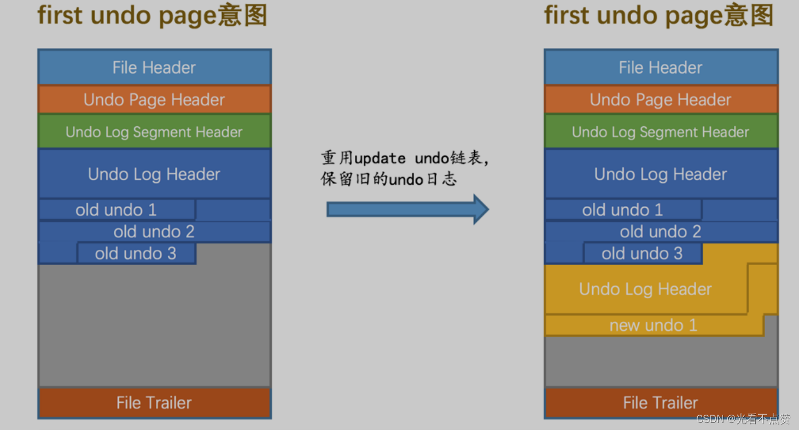
> 

## 6.回滚段

### 6.1 回滚段的概念

- 概述

> 一个事务在执行时可以最多被分配4个undo页面链表，在统一时刻不同事务拥有的链表是不一样的，在这一时刻系统内可能有很多很多的链表，为了很好的管理这些undo日志链表，mysql引入称为Rollback Segment Header 的页面，这个页面专门存放每个链表的头页面frist undo page的页号，这些页号称之为undo slot，可以这样加深理解，头页面是班长，后面的页面都是普通学生，整个链表为一个班级，这个Rollback Segment Header页面就可以理解为全是班长的会议室
> 
- 页面结构如下

> 每一个
> 
> 
> ```
> Rollback Segment Header
> ```
> 
> ```
> Rollback Segment
> ```
> 
> ```
> Rollback Segment
> ```
> 
> **只有一个页面**
> 
> 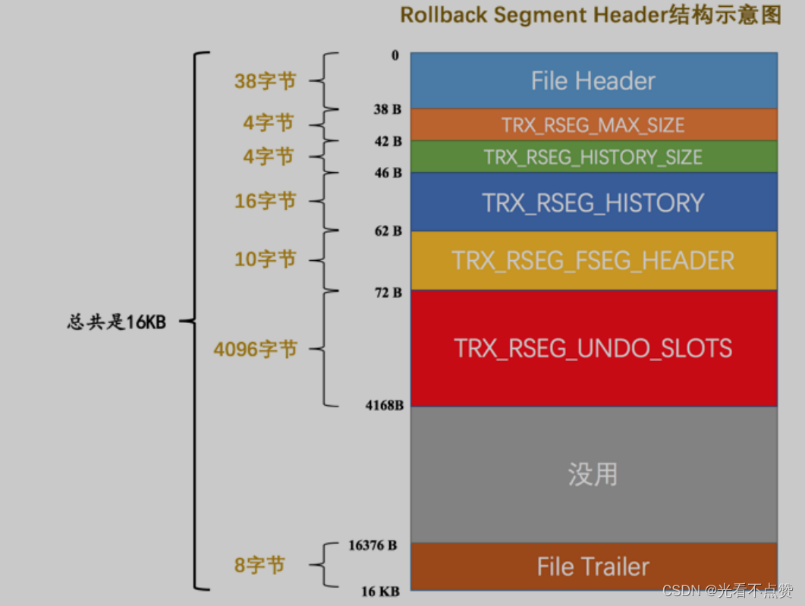
> 
> - `TRX_RSEG_MAX_SIZE`：本回滚段所管理的所有undo页面链表中undo数量之和的最大值，默认值已经为4个直接能表示的最大值减一，`0xFFFFFFFF`这个数有特殊用途，所以实际上`TRX_RSEG_MAX_SIZE的值为0xFFFFFFFE`。
> - `TRX_RSEG_HISTORY_SIZE` ： History 链表占用的页面数量。
> - `TRX_RSEG_HISTORY` ： History 链表的基节点。
> - `TRX_RSEG_FSEG_HEADER` ：本 `Rollback Segment` 对应的10字节大小的`Segment Header`结构，通过它可以找到本段对应的 `INODE Entry` 。
> - `TRX_RSEG_UNDO_SLOTS` ：各个 Undo页面 链表的 first undo page 的 页号 集合，也就是 undo slot 集合。一个页号占用 4 个字节，对于 16KB 大小的页面来说，这个`TRX_RSEG_UNDO_SLOTS`部分共存储了 `1024 个undo slot ，所以共需 1024 × 4 = 4096 个字节`。

### 6.2 从回滚段中申请Undo页面链表

### 6.2.1 分配undo slot

- 概述

> 在初始情况下，由于未向任何事务分配任何undo页面链表，所以对于回滚段来说里面的1024个undo slot都被设置成了特殊值（也就是前面所说的0xFFFFFFFF）FIL_NULL，虽然时间的流逝，越来越多的链表被申请，此时新事务想要分配undo页面链表了，就是从回滚段的第一个undo slot开始，看看该undo slot的值是不是FIL_NULL ，分为两种：
> 
- 情况一

> 是FIL_NULL，那么就需要从段中申请一段空间创建链表，然后将头页面的页号设置到undo slot中，此时这个slot就被分配事务了
> 
- 情况二

> 如果这个slot不是FIL_NULL那么就要依次开始找到为空的地方，然后重复进行判断，那如果1024个slot全部被占满了怎么办？此时mysql会给用户报错Too many active concurrent transactions，用户看到可以重新执行事务，因为此时可能已经有事务提交了
> 

### 6.2.2 事务提交后对应的slot的命运

- 命运一

> 就是slot对应的undo日志链表符合重用的条件（一个页面，undo日志已使用空间小于整个页面的3/4）那么该slot对应的那个头页面的TRX_UNDO_STATE 属性（该属性在 first undo page 的 Undo Log Segment Header 部分）会被设置为 TRX_UNDO_CACHED 。这些被标记的slot会被加入一个链表，通过undo页面链表类型的不同又会分为下面的两种情况：
> 
> - 对应的是`insert`页面链表，`slot`会被加入到`insert undo cached`链表 。
> - 对应的是`update`页面链表，`slot`会被加入到`update undo cached`链表
- 命运一总结

> 一个回滚段就对应着上述两个 cached链表 ，如果有新事务要分配 undo slot 时，先从对应的 cached链表 中找。如果没有被缓存的 undo slot ，才会到回滚段的 Rollback Segment Header 页面中再去找。
> 
- 命运二

> 如果该slot指向的undo页面链表不符合重用的条件，那么针对不同的undo日志链表类型也会有不同的处理：
> 
> - 如果是`insert`链表，那么该undo页面链表的的`TRX_UNDO_STATE`属性会被设置为 `TRX_UNDO_TO_FREE` ，**之后该 `Undo`页面 链表对应的段会被释放掉（也就意味着段中的页面可以被挪作他用），然后把该 `undo slot 的值设置为 FIL_NULL` 。**
> - 如果是`update`链表，则该`Undo页面`链表的 `TRX_UNDO_STATE` 属性会被设置为 `TRX_UNDO_TO_PRUGE` ，则会将该 `undo slot` 的值设置为 `FIL_NULL` ，然后将本次事务写入的一组`undo` 日志放到所谓的 `History链表` 中（**需要注意的是，这里并不会将 `Undo页面` 链表对应的段给释放掉，因为这些 undo 日志还有用呢～**）

### 6.3 多个回滚段

- 概述

> 我们来算算账，一个回滚段总共能装下1024个slot，那么也就是说能支持1024个读写事务同时执行，那么如果有几千个事务同时有需求呢，这就容不下了啊，所以mysql以下引入128个回滚段这就能以下支持128 * 1024 = 131072个事务同时进行了，
> 
- 注意

> 只读事务并不需要分配Undo页面链表，MySQL 5.7中所有刚开启的事务默认都是只读事务，只有在事务执行过程中对记录做了某些改动时才会被升级为读写事务。
> 

### 6.3.1 一个回滚段就对应一个 Rollback Segment Header 页面

- 概述

> 前面我们说过一个 Rollback Segment Header 页面对应一个回滚段，那么总共有128个回滚段自然而然也有128个Header，这128个页面存放在系统表空间的页号为5的某个区域包含了128个8字节大小的格子如下图：
> 
> 
> 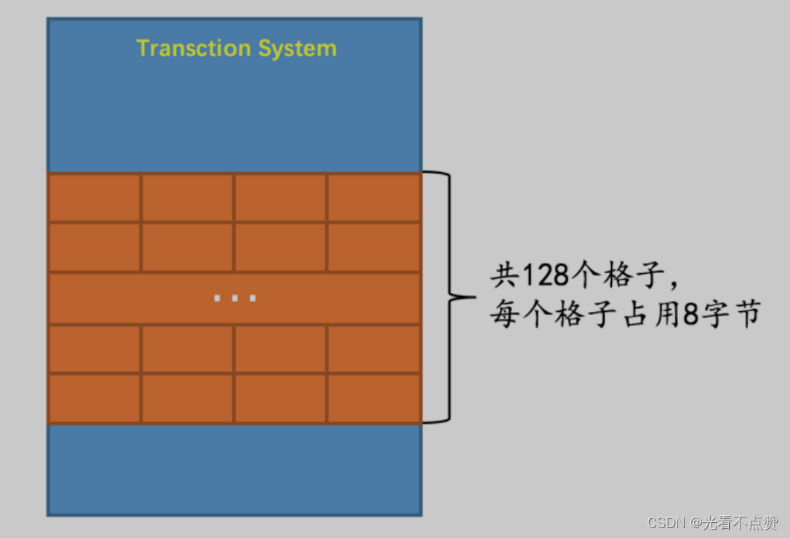
> 
- 而每个格子的构造如下图：

> 4字节大小的 Space ID ，代表一个表空间的ID。4字节大小的 Page number ，代表一个页号。
> 
- 每个格子的含义

> 根据两个属性的意思我们就能推测出这个格子代表着指针，指向不同的页面，这个页面就是Rollback Segment Header 。这里需要注意的一点事，要定位一个Rollback Segment Header还需要知道对应的表空间ID，这也就意味着不同的回滚段可能分布在不同的表空间中。
> 
- 总结

> 通过不断的深入我们了解到，系统表空间内的第五号页面有128个字节的地方存放在指向128个Rollback Segment Header的指针，每一个Rollback Segment Header对应一个回滚段，每一个回滚段中有1024个slot，而每个slot由对应着不同的undo页面链表
> 
> 
> 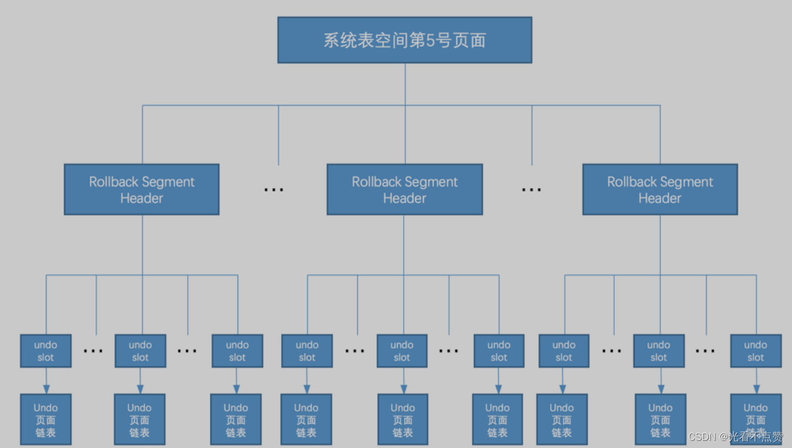
> 

### 6.4 回滚段的分类

- 概述

> 这128个回滚段是从0号开始到127号，大致分为以下两类：
> 
> - 第 `0` 号、第 `33～127` 号回滚段属于一类。其中第 `0` 号回滚段必须在系统表空间中（就是说第 `0` 号回滚段对应的 `Rollback Segment Header` 页面必须在系统表空间中），第 `33～127` 号回滚段既可以在系统表空间中，也可以在自己配置的 `undo` 表空间中，关于怎么配置我们稍后再说。**如果一个事务在执行过程中由于对普通表的记录做了改动需要分配 Undo页面 链表时，必须从这一类的段中分配相应的 undo slot 。**
> - 第 1～32 号回滚段属于一类。这些回滚段必须在临时表空间（对应着数据目录中的 ibtmp1 文件）中。**如果一个事务在执行过程中由于对临时表的记录做了改动需要分配 Undo页面 链表时，必须从这一类的段中分配相应的 undo slot 。**

> 也就是说如果一个事务在执行过程中既对普通表的记录做了改动，又对临时表的记录做了改动，那么需要为这个记录分配2个回滚段，再分别到这两个回滚段中分配对应的 undo slot 。
> 
- 总结

> 我们为什么需要依照普通表的修改以及临时表的修改对回滚段进行分类呢？因为undo页面本身也是页面，我们在向里面写入undo日志时也是需要先把对应的redo日志写上的，因为发生崩溃时我们通过redo日志来恢复undo日志，然后通过undo日志来恢复事务之前的样子；但是对于临时表来说，临时表是为了存储相应中间结果的表或是为了增加效率的表，我们需要把数据还原到最初的样子是根本不需要这些中间状态的也就是说并不需要记录到redo日志上去，只需要写对于临时表的undo日志就好了
总结一下针对普通表和临时表划分不同种类的 回滚段 的原因：在修改针对普通表的回滚段中的Undo页面时，需要记录对应的redo日志，而修改针对临时表的回滚段中的Undo页面时，不需要记录对应的redo日志。
> 
- 小贴士

> 实际上在MySQL 5.7.21这个版本中，如果我们仅仅对普通表的记录做了改动，那么只会为该事务分配针对普通表的回滚段，不分配针对临时表的回滚段。但是如果我们仅仅对临时表的记录做了改动，那么既会为该事务分配针对普通表的回滚段，又会为其分配针对临时表的回滚段（不过分配了回滚段并不会立即分配undo slot，只有在真正需要Undo页面链表时才会去分配回滚段中的undo slot）。
> 

### 6.5 为事务分配Undo页面链表详细过程

1. 事务在执行过程中对普通表的记录首次做改动之前，首先会到系统表空间的第 `5` 号页面中分配一个回滚段（其实就是获取一个 `Rollback Segment Header` 页面的地址）。一旦某个回滚段被分配给了这个事务，那么之后该事务中再对普通表的记录做改动时，就不会重复分配了。
    
    > 使用传说中的 round-robin （循环使用）方式来分配回滚段。比如当前事务分配了第 0 号回滚段，那么下一个事务就要分配第 33 号回滚段，下下个事务就要分配第 34 号回滚段，简单一点的说就是这些回滚段被轮着分配给不同的事务（就是这么简单粗暴，没啥好说的）。
    > 
2. 在分配到回滚段后，首先看一下这个回滚段的两个 `cached链表` 有没有已经缓存了的 `undo slot` ，比如如果事务做的是 `INSERT` 操作，就去回滚段对应的 `insert undo cached`链表 中看看有没有缓存的 `undo slot` ；如果事务做的是`DELETE`操作，就去回滚段对应的 `update undo cached`链表 中看看有没有缓存的 `undo slot` 。如果有缓存的`undo slot`，那么就把这个缓存的 `undo slot` 分配给该事务。
3. 如果没有缓存的`undo slot`可供分配，那么就要到 `Rollback Segment Header` 页面中找一个可用的 `undo slot` 分配给当前事务。
    
    > 从 Rollback Segment Header 页面中分配可用的undo slot的方式我们上边也说过了，就是从第 0 个 undo slot开始，如果该 undo slot 的值为 FIL_NULL ，意味着这个 undo slot 是空闲的，就把这个 undo slot分配给当前事务，否则查看第 1 个undo slot是否满足条件，依次类推，直到最后一个 undo slot 。如果这 1024 个 undo slot 都没有值为 FIL_NULL 的情况，就直接报错喽（一般不会出现这种情况）～
    > 
4. 找到可用的 `undo slot` 后，如果该 `undo slot` 是从 `cached链表` 中获取的，那么它对应的`Undo Log Segment`已经分配了，否则的话需要重新分配一个 `Undo Log Segment` ，然后从该 `Undo Log Segment` 中申请一个页面作为 Undo页面 链表的 `first undo page` 。
5. 然后事务就可以把 undo日志 写入到上边申请的 `Undo页面` 链表了！
- 再次强调

> 对临时表的记录做改动的步骤和上述的一样，就不赘述了。不错需要再次强调一次，如果一个事务在执行过程中既对普通表的记录做了改动，又对临时表的记录做了改动，那么需要为这个记录分配2个回滚段。并发执行的不同事务其实也可以被分配相同的回滚段，只要分配不同的undo slot就可以了。
> 

## 7.回滚段相关配置

### 7.1 配置回滚段数量

- 概述

> 我们前边说系统中一共有128个回滚段，其实这只是默认值，我们可以通过启动参数
innodb_rollback_segments 来配置回滚段的数量，可配置的范围是 1~128 。但是这个参数并不会影响针对临时表的回滚段数量，针对临时表的回滚段数量一直是 32 ，也就是说：
> 
- 例子

> 如果我们把innodb_rollback_segments的值设置为 1 ，那么只会有1个针对普通表的可用回滚段，但是仍然有32个针对临时表的可用回滚段。如果我们把innodb_rollback_segments的值设置为2～33之间的数，效果和将其设置为1是一样的。如果我们把innodb_rollback_segments设置为大于33的数，那么针对普通表的可用回滚段数量就是该值减去32。
> 

### 7.2 配置undo表空间

- 概述

> 默认情况下，针对普通表设立的回滚段（第 0 号以及第 33~127 号回滚段）都是被分配到系统表空间的。其中的第0号回滚段是一直在系统表空间的，但是第33~127号回滚段可以通过配置放到自定义的 undo表空间 中。但是这种配置只能在系统初始化（创建数据目录时）的时候使用，一旦初始化完成，之后就不能再次更改了。我们看一下相关启动参数：
> 
- 参数设置

> 通过 innodb_undo_directory 指定 undo表空间 所在的目录，如果没有指定该参数，则默认 undo表空间 所在的目录就是数据目录。通过 innodb_undo_tablespaces 定义 undo表空间 的数量。该参数的默认值为0，表明不创建任何 undo表空间 。
> 
- 例子

> 比如我们在系统初始化时指定的 innodb_rollback_segments 为 35 ， innodb_undo_tablespaces 为 2 ，这样就会将第33 、 34号回滚段分别分布到一个 undo表空间 中。
设立 undo表空间 的一个好处就是在 undo表空间 中的文件大到一定程度时，可以自动的将该 undo表空间 截断（truncate）成一个小文件。而系统表空间的大小只能不断的增大，却不能截断。
>