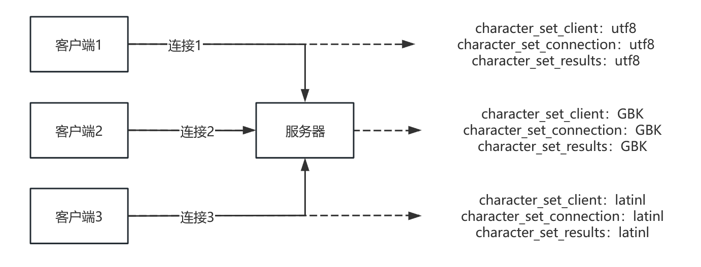

# MySQL是怎样运行的：从根儿上理解MySQL | 字符集和比较规则

type: Post
status: Published
date: 2022/09/15
summary: 在计算机中存储的都是字节，那么想要存储字符就肯定要把字符转换成字节，这个转换关系或者说是映射关系就是被称为字符集。例如现在创建一个名为"duoduo"的字符集，有着下面的映射规则，那就可以在底层存储一些数据了
tags: Mysql
category: 数据库

## 一、简介

### 1.什么是字符集和字符集的比较规则

在计算机中存储的都是字节，那么想要存储字符就肯定要把字符转换成字节，这个转换关系或者说是映射关系就是被称为字符集。例如现在创建一个名为`"duoduo"`的字符集，有着下面的映射规则，那就可以在底层存储一些数据了

> `'ab' -> 0000000100000010`（十六进制：0x0102）
`'cd' -> 不存在`
> 

```java
 'a' -> 00000001 (十六进制：0x01)
 'b' -> 00000010 (十六进制：0x02)
 'A' -> 00000011 (十六进制：0x03)
```

==比较规则==
除了字符集需要了解，那么在字符需要排列顺序时如何界定什么字符在前什么字符在后呢？简单来说就是转化为对应的二进制，看谁大谁小，但是在`'c'和'C'`时就比较难界定了

### 2.一些常用的字符集

1. `ASCII`字符集：最常见的字符集了，只有英文和一些常用符号，全部在编的字符才128个

> `'L' -> 01001100（十六进制：0x4C，十进制：76）'M' -> 01001101（十六进制：0x4D，十进制：77）`
> 
1. `ISO 8859-1`字符集：就是在ASCII的基础上扩充到了256个字符，加入一些欧洲国家字符支持
2. `GB2312`字符集：是一款变长编码字符集，对于一些简单字符采用一个字节，复杂字符采用两个字节的方式。加入了一些日文、中文等
3. `GBK`字符集：在上面的基础上做了扩充，并兼容前者
4. `Unicode`字符集：里面分为多个编码方案，都采用变长编码方式，比如最长用的UTF-8，其次就是UTF-16、UTF-32等，这是迄今为止包含最多最全的字符集，目前还在持续增加。

> utf8使用1～4个字节编码一个字符，utf16使用2个或4个字节编码一个字符，utf32使用4个字节编码一个字符。
> 

**总结：不同编码之间可能存在不兼容的情况，或者同一字符不同编码的情况等等，在编码过程中使用最全最通用的Unicode字符集即可**

## 二、MySQL中支持的字符集和比较规则

### 1.UTF8和UTF8mb4

在8.0之前的版本，默认的字符集都是latin1，即ISO-8859-1，如果想要永久修改则需要在配置文件中修改。
而设置成utf8时，即utf8mb3也就是只使用1~3字节编码。
想要使用4字节的则要特别表明utf8mb4，而在8.0之后的版本，mb4被深度优化并称为默认字符集，支持emoji表情等。

### 2.查看支持的字符集

使用命令

```sql
SHOW (CHARACTER SET|CHARSET) [LIKE 匹配的模式];
```

在8.0.22中，未截全的图总计有41中字符集

- 第三列default collation表示这个字符集采用的默认比较规则
- 第四列maxLen则表示这个字符集最多需要几个字节表示一个字符


### 3.查看字符集所支持的比较规则

使用命令

```sql
SHOW COLLATION [LIKE 匹配的模式];
```

在这里就查看utf8所支持的字符集，可以看到名字非常有规律，例如其中`spanish`就是西班牙语的比较规则，而后缀`_ci`则说明不区分大小写，其他还有一些后缀例如`_ai`，意思是不区分重音等

```sql
SHOW COLLATION LIKE 'utf8\\_%';
```


## 三、字符集和比较规则应用

### 1.四种级别的字符集和比较规则

==服务器级别==

| 系统变量 | 描述 |
| --- | --- |
| character_set_server | 服务器级别的字符集 |
| collation_server | 服务器级别的比较规则 |

```sql
SHOW VARIABLES LIKE 'character_set_server';
SHOW VARIABLES LIKE 'collation_server';
```


可以看到在8.0.22中采用的默认字符集是`utf8mb4`，比较规则是`utf8mb4_0900_ai_ci`。当你想要修改这个变量值时需要去配置文件中修改。

==数据库级别==
这个数据库级别就比较熟悉了，因为每当在建库时都需要注意一下，如果不指定则会使用**服务器**默认的。

```sql
CREATE DATABASE 数据库名
 [[DEFAULT] CHARACTER SET 字符集名称]
 [[DEFAULT] COLLATE 比较规则名称];
ALTER DATABASE 数据库名
 [[DEFAULT] CHARACTER SET 字符集名称]
 [[DEFAULT] COLLATE 比较规则名称];
```

假设我们将某个数据库改为`gb2312`的字符集和相对应的比较规则

> 注意：这两个变量在建库时可以被设置，但是当你想要后续修改时就不行了，这两个变量是只读的，不能通过修改这两个值而改变当前数据库的字符集和比较规则，同样也无法影响以前数据库所采用的字符集和比较规则。
> 


| 系统变量 | 描述 |
| --- | --- |
| character_set_database | 当前数据库的字符集 |
| collation_database | 当前数据库的比较规则 |

```sql
SHOW VARIABLES LIKE 'character_set_database';
SHOW VARIABLES LIKE 'collation_database';
```

使用这两条命令去查看刚才的修改是否生效


==表级别==
表级别就更熟悉了，对于两个变量也是上面同理只是将名字换为了table，你只需要知道如果不指定则会使用数据库的字符集和比较规则

```sql
CREATE TABLE 表名 (列的信息)
 [[DEFAULT] CHARACTER SET 字符集名称]
 [COLLATE 比较规则名称]]
ALTER TABLE 表名
 [[DEFAULT] CHARACTER SET 字符集名称]
 [COLLATE 比较规则名称]
```

我们可以通过下面命令查看，可以看到使用了数据库的字符集和比较规则

```sql
SHOW CREATE TABLE tableName;
show table status from database like 'tableName';
```


==列级别==
可以通过下面的命令创建或修改列的字符集和比较规则

```sql
CREATE TABLE 表名(
 列名 字符串类型 [CHARACTER SET 字符集名称] [COLLATE 比较规则名称],
 其他列...
);
ALTER TABLE 表名 MODIFY 列名 字符串类型 [CHARACTER SET 字符集名称] [COLLATE 比较规则名称];
```

同理在不指定时会使用列所在的表使用的字符集和比较规则

==仅修改字符集或者比较规则==
在四个级别下都遵循下面的规则：

- 只修改字符集，则比较规则将变为修改后的字符集默认的比较规则。
- 只修改比较规则，则字符集将变为修改后的比较规则对应的字符集。

==小结==
数据库中有四种级别的字符集和比较规则，同时有些设置变量的语句可能会不生效，需要修改配置文件。对于旧数据库来说，它的字符集和比较规则不受修改的影响，但是所占空间会受影响，想要统一只能导出再导入，并且修改的新字符集和比较规则必须兼容旧数据，否则在修改时就会报错。

修改高级别的字符集和比较规则不会影响已经存在的库和表。

### 2.MySQL的通信过程

==编解码的字符集不一致==
这就是最常见的乱码原因了，例如汉字“中”在utf8下的字节序列为0xE66666，发给别的程序可能就会被解析成莫名其妙的字“鯻”，或者别解析成一个半字符等等情况。我们使用的MySQL交互实际上是一个客户端，而管理存储执行命令的实际上服务端，就以这两个角色为例子分析一下通信过程。

==客户端发送请求==
MySQL客户端与服务器交互都是遵循了MySQL自己的通讯协议，但是客户端的种类繁多，例如linux、macOS、Windows等等，所以在客户端不同时采取的行为也会稍有不同。

- 类unix操作系统

> 使用三个命令可以查看字符集的环境变量，三者的优先级从上到下呈递减的关系，例如`LC_ALL`设置了，无论下面两个设置成什么样都不管用。在我自己的Linux中可以看到字符集是`en_US.UTF-8`，同理如果这三个环境变量都没设置就会使用操作系统默认的
> 

```bash
[root@xxx ~]# echo $LC_ALL

[root@xxx ~]# echo $LC_CTYPE

[root@xxx ~]# echo $LANG
en_US.UTF-8
```

- Windows操作系统

> 在Windows中字符集的概念被称为代码页，在控制到的菜单栏右键选择属性即可查看。可以看到图中的为936即当前控制台为GBK编码。或者还可以使用`chcp`命令直接查看
> 


在Windows中启动MySQL如果携带参数，则会使用设置的，这不适用于Unix系统

> 注意：如果设置了这个参数，OS使用的字符集就会被忽略
> 

```sql
mysql --default-character-set=utf8
```

==服务器接收请求==
对于服务器来说与每个客户端建立连接时，都会维护一个session级别的变量`（character_set_client ）`，来表明与某个客户端使用的字符集是哪个

> 注意：现在来说在整个通信过程中，客户端发送字节序列使用的字符集和服务器接收时以为的字符集可能会不相同，所以要尽可能的设置相同
> 

```sql
set character_set_client = xxx;
```

当客户端发送了这个变量设置字符集无法解释的字节序列时，服务器就会发出警告

==服务器处理请求==
上面说到`character_set_client`这个环境变量，意思是服务器以为客户端发送过来字节序列使用的字符集，但是真正要处理这个序列时又会转化成另一个session级别的环境变量（`character_set_connection`，与之配套的比较规则变量为`collation_connection`）所设置的字符集

- 为什么要多此一举

> 因为当处理下面这种情况时，结果是真是假，其实很难用单一的`character_set_client`进行处理，所以多一层保险，`character_set_connection`这个变量就起作用了，全部设置为对应的字符集
> 

```sql
mysql> SELECT ' a' = 'A';
```

通过设置上面两个环境变量`character_set_connection`和`collation_connection`就会得到两种不同的结果

```sql
mysql> SET character_set_connection = gbk;
Query OK, 0 rows affected (0.00 sec)
mysql> SET collation_connection = gbk_chinese_ci;
Query OK, 0 rows affected (0.00 sec)
```

- 假设：如果列和表设置的字符集和比较规则都是utf8，而这两个环境变量设置的是GBK，这时该怎么解释序列呢？

> 在MySQL中会采取列或者表的优先级，即将GBK转化为utf8
> 

==服务器生成响应==
这里生成的响应可不是简单采取上面两个变量设置的字符集就完事了，还涉及到了session级别的一个环境变量`character_set_results`，服务器会将结果序列转换成这个变量设置的字符集之后在发送给客户端，现在简单总结下这三个服务器中的session级别系统变量

| 系统变量 | 描述 |
| --- | --- |
| character_set_client | 服务器认为请求是按照该系统变量指定的字符集进行编码的 |
| character_set_connection | 服务器在处理请求时，会把请求字节序列从 character_set_client 转换 character_set_connection |
| character_set_results | 服务器采用该系统变量指定的字符集对返回给客户端的字符串进行编码 |
- 下图就是服务器如何维护每个session的变量

> 客户端发送时会将用户名和密码一起进行发送，服务器接收后会将这三个遍历的值初始化为客户端的默认字符集。在连接成功后可以使用命令将三个变量的值进行修改
> 
> 
> 
> 

```sql
# 这一条就相当于设置三个变量的命令
SET NAMES xxx;
# 也可单独进行设置
SET character_set_client = xxx;
....
```

对于客户端来说每次启动都会去看所处的操作系统所使用的字符集，**通常情况下就是OS使用什么字符集，客户端就映射什么字符集，即MySQL客户端的默认字符集**。

> 但也有些额外情况，例如OS使用的ASCII字符集，则会被MySQL映射为Latin1，一些不支持的OS字符集，MySQL也会映射为别的字符集。
**注意**：上面的`SET NAMES`不会影响客户端的默认字符集
> 

==客户端接收响应==
这里就没什么提别的了，就是将接收的序列用MySQL客户端的默认字符集（一般就是OS的字符集）进行解释并输出

==总结==
讲了这么多你只需要直到这么5件事：

- 客户端发送的请求字节序列是采用哪种字符集进行编码的；
- 服务器接收到请求字节序列后会认为它是采用哪种字符集进行编码的；
- 服务器在运行过程中会把请求的字节序列转换为以哪种字符集编码的字节序列；
- 服务器在向客户端返回字节序列时，是采用哪种字符集进行编码的；
- 客户端在收到响应字节序列后，是怎么把它们显示到控制台的。


### 3.比较规则

我们之前的表字符集为gb2312以及比较规则为gb2312_chinese_ci，插入几条数据


排序如图，可以看到是不区分大小写的。


若将排序更改为gb2312_bin

> **注意**：这时修改就要修改列的了，无论是遵循了表的规则还是常见字段时指定了，现在去修改表的排序规则，已经存在的列是不会受影响的。
> 


结果如下图，可以看到是区分大小写的


## 四、总结

如果对结果的排序结果有疑问或者出现乱码时就可以关注一下字符集和比较规则。

**在四种级别的字符集和比较规则的设置中，这是设置数据存储时采用什么字节序列而设置的；而对于通信时涉及到的变量是规定交互时大家遵循一种双方都听得懂的规则而设置的。**