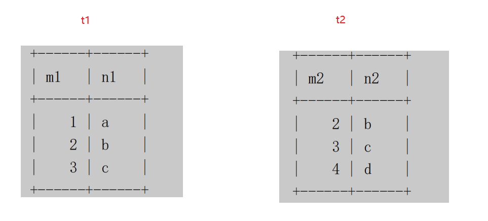
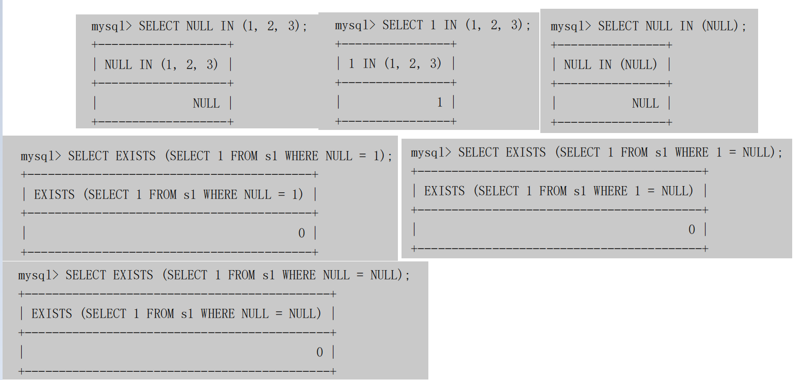
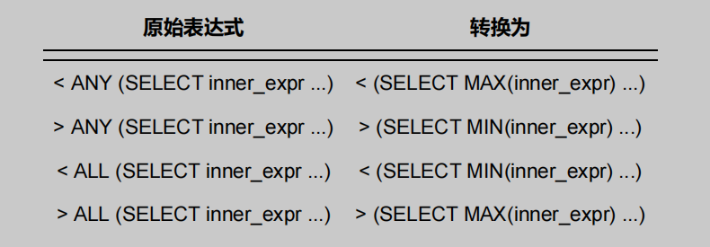

# MySQL是怎样运行的：从根儿上理解MySQL | 查询优化器（二）：基于规则的优化

type: Post
status: Published
date: 2022/09/14
summary: 我们无法避免某些同学写一些执行起来十分耗费性能的语句，所以会依据一些规则，竭尽全力的把这个很糟糕的语句转换成某种可以比较高效执行的形式，这个过程也可以被称作 查询重写 （就是人家觉得你写的语句不好，自己再重写一遍）
tags: Mysql
category: 数据库

# MySQL基于规则的优化（关于子查询优化二三事儿）

- 概述

> 我们无法避免某些同学写一些执行起来十分耗费性能的语句，所以会依据一些规则，竭尽全力的把这个很糟糕的语句转换成某种可以比较高效执行的形式，这个过程也可以被称作 查询重写 （就是人家觉得你写的语句不好，自己再重写一遍）。
> 

## 1. 条件化简（❤）

1. 移除不必要的括号
2. 常量传递

> a = 5 AND b > a就可以被转换为：a = 5 AND b > 5
> 
1. 等值传递

> a = b and b = c and c = 5这个表达式可以被简化为：a = 5 and b = 5 and c = 5
> 
1. 移除没用的条件
2. 表达式计算

> 如果某个列并不是以单独的形式作为表达式的操作数时，比如出现在函数中，出现在某个更复杂表达式中，优化器是不会尝试对这些表达式进行化简的。我们前边说过只有搜索条件中索引列和常数使用某些运算符连接起来才可能使用到索引，所以如果可以的话，最好让索引列以单独的形式出现在表达式中。
> 
1. `HAVING`子句和`WHERE`子句的合并

> 如果查询语句中没有出现诸如 SUM 、 MAX 等等的聚集函数以及 GROUP BY 子句，优化器就把 HAVING 子句和WHERE 子句合并起来。
> 
1. 常量表检测

> 在mysql中认为两种方式的查询运行的十分快
> 
> - 查询的表中一条记录没有，或者只有一条记录：这个对InnoDB没用，因为这个存储引擎很多统计数据都是不准确的，所以只能适用于使用Memory或者MyISAM存储引擎的表。
> - 使用主键等值匹配或者唯一二级索引列等值匹配作为搜索条件来查询某个表。

> 那么如果根据这两种方式查询的表被称为常量表，优化器在分析一个查询语句时，先首先执行常量表查询，然后把查询中涉及到该表的条件全部替换成常数，最后再分析其余表的查询成本，比方说这个查询语句：
> 

```sql
SELECT * FROM table1 INNER JOIN table2
 ON table1.column1 = table2.column2
 WHERE table1.primary_key = 1;

```

> 这个查询可以使用主键和常量值的等值匹配来查询 table1 表，也就是在这个查询中 table1 表相当于常量表 ，在分析对 table2 表的查询成本之前，就会执行对 table1 表的查询，并把查询中涉及 table1 表的条件都替换掉，也就是上边的语句会被转换成这样
> 

```sql
# 被替换为
SELECT table1表记录的各个字段的常量值, table2.* FROM table1 INNER JOIN table2
 ON table1表column1列的常量值 = table2.column2;

```

## 2.外连接消除

- 建表

```sql
CREATE TABLE t1 (
 m1 int,
 n1 char(1)
) Engine=InnoDB, CHARSET=utf8;

CREATE TABLE t2 (
 m2 int,
 n2 char(1)
) Engine=InnoDB, CHARSET=utf8;

```



- 内外连接的本质

> 对于外连接的驱动表的记录来说，如果无法在被驱动表中找到匹配ON子句中的过滤条件的记录，那么该记录仍然会被加入到结果集中，对应的被驱动表记录的各个字段使用NULL值填充；
> 

> 而内连接的驱动表的记录如果无法在被驱动表中找到匹配ON子句中的过滤条件的记录，那么该记录会被舍弃
> 
- 注意

> 右（外）连接和左（外）连接其实只在驱动表的选取方式上是不同的，其余方面都是一样的，所以优化器会首先把右（外）连接查询转换成左（外）连接查询。
> 
- 例子一

> 凡是不符合WHERE子句中条件的记录都不会参与连接。只要我们在搜索条件中指定关于被驱动表相关列的值不为 NULL ，那么外连接中在被驱动表中找不到符合 ON 子句条件的驱动表记录也就被排除出最后的结果集了，也就是说：在这种情况下：外连接和内连接也就没有什么区别了
> 

```sql
# 由于指定了被驱动表 t2 的 n2 列不允许为 NULL ，所以上边的 t1 和 t2 表的左（外）连接查询和内连接查询是一样一样的。
SELECT * FROM t1 LEFT JOIN t2 ON t1.m1 = t2.m2 WHERE t2.n2 IS NOT NULL;

```

- 例子二

> 我们也可以不用显式的指定被驱动表的某个列 IS NOT NULL ，只要隐含的有这个意思就行了
> 

```sql
# 在这个例子中，我们在 WHERE 子句中指定了被驱动表 t2 的 m2 列等于 2 ，也就相当于间接的指定了 m2 列不为NULL 值
SELECT * FROM t1 LEFT JOIN t2 ON t1.m1 = t2.m2 WHERE t2.m2 = 2;

```

- 总结

> 我们把这种在外连接查询中，指定的 WHERE 子句中包含被驱动表中的列不为 NULL 值的条件称之为 空值拒绝（英文名： reject-NULL ）。在被驱动表的WHERE子句符合空值拒绝的条件后，外连接和内连接可以相互转换。这种转换带来的好处就是查询优化器可以通过评估表的不同连接顺序的成本，选出成本最低的那种连接顺序来执行查询。
> 

## 3.子查询优化

### 3.1 子查询语法

- 子查询与外层查询

> 在一个查询语句里的某个位置也可以有另一个查询语句，这个出现在某个查询语句的某个位置中的查询就被称为 子查询，那个充当上级的查询也被称之为 外层查询 。
> 
- 子查询出现的位置

> SELECT 子句中
> 

```sql
SELECT (SELECT m1 FROM t1 LIMIT 1);

```

> FROM 子句中：这个放在 FROM 子句中的子查询本质上相当于一个 表 ，但又和我们平常使用的表有点儿不一样，把这种由子查询结果集组成的表称之为 派生表 。
> 

```sql
 SELECT m, n FROM (SELECT m2 + 1 AS m, n2 AS n FROM t2 WHERE m2 > 2) AS t;

```

> WHERE 或 ON 子句中：这个查询表明我们想要将 (SELECT m2 FROM t2) 这个子查询的结果作为外层查询的 IN 语句参数，整个查询语句的意思就是我们想找 t1 表中的某些记录，这些记录的 m1 列的值能在 t2 表的 m2 列找到匹配的值
> 

```sql
SELECT * FROM t1 WHERE m1 IN (SELECT m2 FROM t2);

```

> ORDER BY 子句中：虽然语法支持，但没啥子意义GROUP BY 子句中：也没啥意义
> 

### 1.按返回的结果集区分子查询

- 标量子查询

> 那些只返回一个单一值的子查询称之为 标量子查询
> 
- 行子查询

> 顾名思义，就是返回一条记录的子查询，不过这条记录需要包含多个列（只包含一个列就成了标量子查询了）
> 
- 列子查询

> 列子查询自然就是查询出一个列的数据喽，不过这个列的数据需要包含多条记录（只包含一条记录就成了标量子查询了）
> 
- 表子查询

> 就是子查询的结果既包含很多条记录，又包含很多个列
> 

```sql
# 标量子查询
SELECT (SELECT m1 FROM t1 LIMIT 1);
SELECT * FROM t1 WHERE m1 = (SELECT MIN(m2) FROM t2);
# 行子查询
SELECT * FROM t1 WHERE (m1, n1) = (SELECT m2, n2 FROM t2 LIMIT 1);
# 列子查询
SELECT * FROM t1 WHERE m1 IN (SELECT m2 FROM t2);
# 表子查询
SELECT * FROM t1 WHERE (m1, n1) IN (SELECT m2, n2 FROM t2);

```

### 2.按与外层查询关系来区分子查询

- 不相关子查询

> 如果子查询可以单独运行出结果，而不依赖于外层查询的值，我们就可以把这个子查询称之为 不相关子查询 。我们前边介绍的那些子查询全部都可以看作不相关子查询
> 
- 相关子查询

> 如果子查询的执行需要依赖于外层查询的值，我们就可以把这个子查询称之为 相关子查询
> 

> 可是这个查询中有一个搜索条件是n1 = n2，别忘了 n1 是表 t1 的列，也就是外层查询的列，也就是说子查询的执行需要依赖于外层查询的值，所以这个子查询就是一个 相关子查询 。
> 

```sql
SELECT * FROM t1 WHERE m1 IN (SELECT m2 FROM t2 WHERE n1 = n2);

```

### 3.子查询在布尔表达式中的使用

- 概述

> 我们平时用子查询最多的地方就是把它作为布尔表达式的一部分来作为搜索条件用在 WHERE 子句或者 ON 子句里
> 
- 使用`= 、 > 、 < 、 >= 、 <= 、 <> 、 != 、 <=>`作为布尔表达式的操作符

> 我们就把这些操作符称为 comparison_operator 吧，所以子查询组成的布尔表达式就长这样： 操作数 comparison_operator (子查询)。这里的 操作数 可以是某个列名，或者是一个常量，或者是一个更复杂的表达式，甚至可以是另一个子查询。但是需要注意的是，这里的子查询只能是标量子查询或者行子查询，也就是子查询的结果只能返回一个单一的值或者只能是一条记录
> 

```sql
SELECT * FROM t1 WHERE m1 < (SELECT MIN(m2) FROM t2);
# 或者这样（行子查询）：
SELECT * FROM t1 WHERE (m1, n1) = (SELECT m2, n2 FROM t2 LIMIT 1);

```

- `[NOT] IN/ANY/SOME/ALL`子查询

> 对于列子查询和表子查询来说，它们的结果集中包含很多条记录，这些记录相当于是一个集合，所以就不能单纯的和另外一个操作数使用 comparison_operator 来组成布尔表达式了， MySQL 通过下面的语法来支持某个操作数和一个集合组成一个布尔表达式
> 

==IN 或者 NOT IN==

> 操作数 [NOT] IN (子查询)，这个布尔表达式的意思是用来判断某个操作数在不在由子查询结果集组成的集合中，比如下边的查询的意思是找出 t1 表中的某些记录，这些记录存在于子查询的结果集中
> 

```sql
SELECT * FROM t1 WHERE (m1, n2) IN (SELECT m2, n2 FROM t2);

```

==ANY/SOME （ ANY 和 SOME 是同义词）==

> 操作数 comparison_operator ANY/SOME(子查询)，这个布尔表达式的意思是只要子查询结果集中存在某个值和给定的操作数做 comparison_operator 比较结果为 TRUE ，那么整个表达式的结果就为 TRUE ，否则整个表达式的结果就为 FALSE 。另外，=ANY相当于判断子查询结果集中是否存在某个值和给定的操作数相等，它的含义和IN是相同的。
> 

```sql
SELECT * FROM t1 WHERE m1 > ANY(SELECT m2 FROM t2);
# 等价于
SELECT * FROM t1 WHERE m1 > (SELECT MIN(m2) FROM t2);

```

==ALL==

> 操作数 comparison_operator ALL(子查询)，这个布尔表达式的意思是子查询结果集中所有的值和给定的操作数做 comparison_operator 比较结果为 TRUE ，那么整个表达式的结果就为 TRUE ，否则整个表达式的结果就为 FALSE 。
> 

```sql
SELECT * FROM t1 WHERE m1 > ALL(SELECT m2 FROM t2);
# 等价于
SELECT * FROM t1 WHERE m1 > (SELECT MAX(m2) FROM t2);

```

- EXISTS子查询

> 有的时候我们仅仅需要判断子查询的结果集中是否有记录，而不在乎它的记录具体是个啥，可以使用把EXISTS 或者 NOT EXISTS 放在子查询语句前边： [NOT] EXISTS (子查询)
> 

> 对于子查询 (SELECT 1 FROM t2) 来说，我们并不关心这个子查询最后到底查询出的结果是什么，所以查询列表里填 * 、某个列名，或者其他啥东西都无所谓，我们真正关心的是子查询的结果集中是否存在记录。也就是说只要 (SELECT 1 FROM t2) 这个查询中有记录，那么整个 EXISTS 表达式的结果就为 TRUE 。
> 

```sql
SELECT * FROM t1 WHERE EXISTS (SELECT 1 FROM t2);

```

### 4.子查询语法注意事项

- 子查询必须用小括号扩起来
- 在 `SELECT` 子句中的子查询必须是标量子查询：如果子查询结果集中有多个列或者多个行，都不允许放在 SELECT 子句中，也就是查询列表中，比如这样就是非法的

```java
mysql> SELECT (SELECT m1, n1 FROM t1);
ERROR 1241 (21000): Operand should contain 1 column(s)

```

- 在想要得到标量子查询或者行子查询，但又不能保证子查询的结果集只有一条记录时，应该使用`LIMIT 1`语句来限制记录数量
- 对于 `[NOT] IN/ANY/SOME/ALL` 子查询来说，子查询中不允许有 LIMIT 语句。
- `ORDER BY` 子句：子查询的结果其实就相当于一个集合，集合里的值排不排序一点儿都不重要
- `DISTINCT` 语句：集合里的值去不去重也没啥意义
- 没有聚集函数以及 `HAVING` 子句的 `GROUP BY` 子句：在没有聚集函数以及 `HAVING` 子句时， `GROUP BY` 子句就是个摆设
- 不允许在一条语句中增删改某个表的记录时同时还对该表进行子查询

### 3.2 子查询在MySQL中是怎么执行的

- 建表

> 我们假设有两个表s1 、 s2 与这个 single_table表的构造是相同的，而且这两个表里边儿有10000条记录，除id列外其余的列都插入随机值
> 

```sql
CREATE TABLE single_table (
	 id INT NOT NULL AUTO_INCREMENT,
	 key1 VARCHAR(100),
	 key2 INT,
	 key3 VARCHAR(100),
	 key_part1 VARCHAR(100),
	 key_part2 VARCHAR(100),
	 key_part3 VARCHAR(100),
	 common_field VARCHAR(100),
	 PRIMARY KEY (id),
	 KEY idx_key1 (key1),
	 UNIQUE KEY idx_key2 (key2),
	 KEY idx_key3 (key3),
	 KEY idx_key_part(key_part1, key_part2, key_part3)
) Engine=InnoDB CHARSET=utf8;

```

### 1.小白们眼中子查询的执行方式

- 如果子查询是不相关子查询：

> 先单独执行(SELECT common_field FROM s2)这个子查询。然后在将上一步子查询得到的结果当作外层查询的参数再执行外层查询 SELECT * FROM s1 WHERE key1 IN (...) 。
> 

```sql
SELECT * FROM s1
 WHERE key1 IN (SELECT common_field FROM s2);

```

- 如果子查询是相关子查询

> 先从外层查询中获取一条记录，本例中也就是先从 s1 表中获取一条记录。然后从上一步骤中获取的那条记录中找出子查询中涉及到的值，本例中就是从 s1 表中获取的那条记录中找出 s1.key2 列的值，然后执行子查询。最后根据子查询的查询结果来检测外层查询 WHERE 子句的条件是否成立，如果成立，就把外层查询的那条记录加入到结果集，否则就丢弃。再次执行第一步，获取第二条外层查询中的记录，依次类推
> 

```sql
SELECT * FROM s1
 WHERE key1 IN (SELECT common_field FROM s2 WHERE s1.key2 = s2.key2);

```

### 2.标量子查询、行子查询的执行方式

- 使用标量子查询和行子查询的场景

> SELECT 子句中，我们前边说过的在查询列表中的子查询必须是标量子查询。子查询使用= 、 > 、 < 、 >= 、 <= 、 <> 、 != 、 <=>等操作符和某个操作数组成一个布尔表达式，这样的子查询必须是标量子查询或者行子查询。
> 
- 对于不相关的标量或行子查询

> 先单独执行(SELECT common_field FROM s2 WHERE key3 = 'a' LIMIT 1)这个子查询。然后在将上一步子查询得到的结果当作外层查询的参数再执行外层查询 SELECT * FROM s1 WHERE key1 =..
> 

> 对于包含不相关的标量子查询或者行子查询的查询语句来说，MySQL会分别独立的执行外层查询和子查询，就当作两个单表查询就好了。
> 

```sql
SELECT * FROM s1
 WHERE key1 = (SELECT common_field FROM s2 WHERE key3 = 'a' LIMIT 1);

```

- 对于相关子查询

> 先从外层查询中获取一条记录，本例中也就是先从 s1 表中获取一条记录。然后从上一步骤中获取的那条记录中找出子查询中涉及到的值，本例中就是从 s1 表中获取的那条记录中找出 s1.key3 列的值，然后执行子查询。最后根据子查询的查询结果来检测外层查询 WHERE 子句的条件是否成立，如果成立，就把外层查询的那条记录加入到结果集，否则就丢弃。再次执行第一步，获取第二条外层查询中的记录，依次类推
> 

```sql
SELECT * FROM s1 WHERE
 key1 = (SELECT common_field FROM s2 WHERE s1.key3 = s2.key3 LIMIT 1);

```

### 3.IN子查询优化（❤）

- 不相关In子句的查询

> 这种不相关的 IN 子查询和不相关的标量子查询或者行子查询是非常不一样的，对于不相关的 IN 子查询来说，如果子查询的结果集中的记录条数很少，那么把子查询和外层查询分别看成两个单独的单表查询效率还是蛮高的，但是如果单独执行子查询后的结果集太多的话，就会导致这些问题：
> 
> - 结果集太多，可能内存中都放不下
> - 对于外层查询来说，如果子查询的结果集太多，那就意味着 IN 子句中的参数特别多，这就导致：**无法有效的使用索引，只能对外层查询进行全表扫描。在对外层查询执行全表扫描时，由于 IN 子句中的参数太多，这会导致检测一条记录是否符合和 IN 子句中的参数匹配花费的时间太长。**

==物化表==

> 不直接将不相关子查询的结果集当作外层查询的参数，而是将该结果集写入一个临时表里。写入临时表的过程是这样的
> 
> - 该临时表的列就是子查询结果集中的列。
> - 写入临时表的记录会被去重（为表中记录的所有列建立主键或者唯一索引）。我们说 IN 语句是判断某个操作数在不在某个集合中，集合中的值重不重复对整个 IN 语句的结果并没有啥子关系，所以我们在将结果集写入临时表时对记录进行去重可以让临时表变得更小，更省地方～
> - **一般情况下子查询结果集不会大的离谱（很大就要使用磁盘了，这里可跳转至[MySQL45讲](https://blog.csdn.net/weixin_49258262/article/details/123993721)），所以会为它建立基于内存的使用 Memory 存储引擎的临时表，而且会为该表建立哈希索引。**
- 总结

> 把这个将子查询结果集中的记录保存到临时表的过程称之为 物化 （英文名：Materialize ）。正因为物化表中的记录都建立了索引（基于内存的物化表有哈希索引，基于磁盘的有B+树索引），通过索引执行 IN 语句判断某个操作数在不在子查询结果集中变得非常快，从而提升了子查询语句的性能。
> 

==物化表转连接==

```sql
SELECT * FROM s1
 WHERE key1 IN (SELECT common_field FROM s2 WHERE key3 = 'a');

```

- 我们常规下的思路——从s1的角度

> 对于上面的语句我们在知道物化表的前提下，会这样想，先执行子查询然后所有符合子查询条件的记录成为一个物化表，然后在s1中使用key1去对比子查询结果集的列
> 
- 换个角度——从子查询物化表的角度

> 扫描物化表然后取出符合条件的某一列值，然后去对比在s1中找出这个值的记录；
> 

```sql
# m_val就是条件的某个值，materialized_table为物化表
SELECT s1.* FROM s1 INNER JOIN materialized_table ON key1 = m_val;

```

`总结`

> 也就是说其实上边的查询就相当于表 s1 和子查询物化表进行内连接
> 
- 计算成本

> 既然能转化成内连接，那么就可以统计不同驱动表所花费的成本了
> 

`使用s1作为驱动表的成本构成`：

> 物化子查询时需要的成本扫描 s1 表时的成本s1表中的记录数量 × 通过 m_val = xxx 对 materialized_table 表进行单表访问的成本（我们前边说过物化表中的记录是不重复的，并且为物化表中的列建立了索引，所以这个步骤显然是非常快的）。
> 

`使用物化表作为驱动表的成本构成`：

> 物化子查询时需要的成本扫描物化表时的成本物化表中的记录数量 × 通过 key1 = xxx 对 s1 表进行单表访问的成本（非常庆幸 key1 列上建立了索引，所以这个步骤是非常快的）。
> 

==将子查询转换为semi-join==

> 能不能不进行物化操作直接把子查询转换为连接呢？让我们重新审视一下上边的查询语句，我们可以把这个查询理解成：对于 s1 表中的某条记录，如果我们能在 s2 表（准确的说是执行完 WHERE s2.key3= 'a' 之后的结果集）中找到一条或多条记录，这些记录的 common_field 的值等于 s1 表记录的 key1 列的值，那么该条 s1 表的记录就会被加入到最终的结果集。这个过程其实和把 s1 和 s2 两个表连接起来的效果很像
> 

```sql
SELECT * FROM s1
 WHERE key1 IN (SELECT common_field FROM s2 WHERE key3 = 'a');

# 两表连接
SELECT s1.* FROM s1 INNER JOIN s2
 ON s1.key1 = s2.common_field
 WHERE s2.key3 = 'a';

```

- 注意

> 我们不能保证对于 s1 表的某条记录来说，在 s2 表（准确的说是执行完WHERE s2.key3 = 'a' 之后的结果集）中有多少条记录满足 s1.key1 = s2.common_field 这个条件，不过我们可以分三种情况讨论：
> 
> - `情况一`：对于 s1 表的某条记录来说， s2 表中没有任何记录满足 `s1.key1 = s2.common_field` 这个条件，那么该记录自然也不会加入到最后的结果集。
> - `情况二`：对于 s1 表的某条记录来说， s2 表中有且只有记录满足 `s1.key1 = s2.common_field` 这个条件，那么该记录会被加入最终的结果集。
> - `情况三`：对于 s1 表的某条记录来说， s2 表中至少有2条记录满足 `s1.key1 = s2.common_field` 这个条件，那么该记录会被多次加入最终的结果集。
- 半连接

> 对于 s1 表的某条记录来说，由于我们只关心 s2 表中是否存在记录满足 s1.key1 = s2.common_field 这个条件，而不关心具体有多少条记录与之匹配，又因为有 情况三 的存在，我们上边所说的 IN 子查询和两表连接之间并不完全等价。但是将子查询转换为连接又真的可以充分发挥优化器的作用
> 

> 所以MySQL 提出了一个新概念 --- 半连接 （英文名： semi-join ）。将 s1 表和 s2 表进行半连接的意思就是：对于 s1 表的某条记录来说，我们只关心在 s2 表中是否存在与之匹配的记录是否存在，而不关心具体有多少条记录与之匹配，最终的结果集中只保留 s1 表的记录。
> 

`实现半连接的几种方法`

- `Table pullout` （子查询中的表上拉）

> 当子查询的查询列表处只有主键或者唯一索引列时（主键或者唯一索引列中的数据本身就是不重复的嘛！所以对于同一条 s1 表中的记录，你不可能找到两条以上的符合 s1.key2 = s2.key2 的记录呀），可以直接把子查询中的表 上拉 到外层查询的 FROM 子句中，并把子查询中的搜索条件合并到外层查询的搜索条件中
> 

```sql
SELECT * FROM s1
 WHERE key2 IN (SELECT key2 FROM s2 WHERE key3 = 'a');

# 转化为
SELECT s1.* FROM s1 INNER JOIN s2
 ON s1.key2 = s2.key2
 WHERE s2.key3 = 'a';

```

- `DuplicateWeedout execution strategy` （重复值消除）

> 对于下面查询转换为半连接查询后， s1 表中的某条记录可能在 s2 表中有多条匹配的记录，所以该条记录可能多次被添加到最后的结果集中，为了消除重复，我们可以建立一个临时表，比方说这个临时表长这样
> 

```sql
SELECT * FROM s1
 WHERE key1 IN (SELECT common_field FROM s2 WHERE key3 = 'a');

CREATE TABLE tmp (
 id PRIMARY KEY
);

```

> 这样在执行连接查询的过程中，每当某条 s1 表中的记录要加入结果集时，就首先把这条记录的 id 值加入到这个临时表里，如果添加成功，说明之前这条 s1 表中的记录并没有加入最终的结果集，现在把该记录添加到最终的结果集；如果添加失败，说明这条之前这条 s1 表中的记录已经加入过最终的结果集，这里直接把它丢弃就好了，这种使用临时表消除 semi-join 结果集中的重复值的方式称之为 DuplicateWeedout 。
> 
- `LooseScan execution strategy` （松散索引扫描）

> 在子查询中，对于 s2 表的访问可以使用到 key1 列的索引，而恰好子查询的查询列表处就是 key1 列，这样在将该查询转换为半连接查询后，如果将 s2 作为驱动表执行查询的话，步骤如下：
> 
> - 由于key1不是唯一索引，那么在s2中查出来key1列的值肯定有重复的，我们只需要拿着每个重复的第一个记录去让s1的key3去对比就可以了

> 这种虽然是扫描索引，但只取值相同的记录的第一条去做匹配操作的方式称之为 松散索引扫描 。
> 

```sql
SELECT * FROM s1
 WHERE key3 IN (SELECT key1 FROM s2 WHERE key1 > 'a' AND key1 < 'b');

```

- Semi-join Materialization execution strategy

> 我们之前介绍的先把外层查询的 IN 子句中的不相关子查询进行物化，然后再进行外层查询的表和物化表的连接本质上也算是一种 semi-join ，只不过由于物化表中没有重复的记录，所以可以直接将子查询转为连接查询。
> 
- FirstMatch execution strategy （首次匹配）

> FirstMatch 是一种最原始的半连接执行方式，跟我们认为的相关子查询的执行方式是一样一样的，就是说先取一条外层查询的中的记录，然后到子查询的表中寻找符合匹配条件的记录，如果能找到一条，则将该外层查询的记录放入最终的结果集并且停止查找更多匹配的记录，如果找不到则把该外层查询的记录丢弃掉；然后再开始取下一条外层查询中的记录，重复上边这个过程。
> 

```sql
SELECT * FROM s1
 WHERE key1 IN (SELECT common_field FROM s2 WHERE s1.key3 = s2.key3);

# 转化为，SEMI JOIN是虚幻出来的，能够更好的理解
SELECT s1.* FROM s1 SEMI JOIN s2
 ON s1.key1 = s2.common_field AND s1.key3 = s2.key3;

```

> 由于相关子查询并不是一个独立的查询，所以不能转换为物化表来执行查询。
> 

==semi-join的适用条件==

> 只有形如这样的查询才可以被转换为semi-join ：
> 
> - 该子查询必须是和 IN 语句组成的布尔表达式，并且在外层查询的 WHERE 或者 ON 子句中出现。
> - 外层查询也可以有其他的搜索条件，只不过和 IN 子查询的搜索条件必须使用 AND 连接起来。
> - 该子查询必须是一个单一的查询，不能是由若干查询由 UNION 连接起来的形式。
> - 该子查询不能包含 GROUP BY 或者 HAVING 语句或者聚集函数。

```sql
SELECT ... FROM outer_tables
 WHERE expr IN (SELECT ... FROM inner_tables ...) AND ...

# 或者
SELECT ... FROM outer_tables
 WHERE (oe1, oe2, ...) IN (SELECT ie1, ie2, ... FROM inner_tables ...) AND ...

```

==不适用于semi-join的情况==

> 对于一些不能将子查询转位 semi-join 的情况，典型的比如下边这几种：
> 
> - 外层查询的WHERE条件中有其他搜索条件与IN子查询组成的布尔表达式使用 OR 连接起来

```sql
SELECT * FROM s1
 WHERE key1 IN (SELECT common_field FROM s2 WHERE key3 = 'a')
 OR key2 > 100;

```

> 使用 NOT IN 而不是 IN 的情况
> 

```sql
SELECT * FROM s1
 WHERE key1 NOT IN (SELECT common_field FROM s2 WHERE key3 = 'a')

```

> 在 SELECT 子句中的IN子查询的情况
> 

```sql
 SELECT key1 IN (SELECT common_field FROM s2 WHERE key3 = 'a') FROM s1 ;

```

> 子查询中包含 GROUP BY 、 HAVING 或者聚集函数的情况
> 

```sql
SELECT * FROM s1
 WHERE key2 IN (SELECT COUNT(*) FROM s2 GROUP BY key1);

```

> 子查询中包含 UNION 的情况
> 

```sql
SELECT * FROM s1 WHERE key1 IN (
 SELECT common_field FROM s2 WHERE key3 = 'a'
 UNION
 SELECT common_field FROM s2 WHERE key3 = 'b'
 );

```

- 对于不适用半连接的子查询的优化手段

> 对于不相关子查询来说，可以尝试把它们物化之后再参与查询；先将子查询物化，然后再判断 key1 是否在物化表的结果集中可以加快查询执行的速度。请注意这里将子查询物化之后不能转为和外层查询的表的连接，只能是先扫描s1表，然后对s1表的某条记录来说，判断该记录的key1值在不在物化表中。
> 

```sql
 SELECT * FROM s1
 WHERE key1 NOT IN (SELECT common_field FROM s2 WHERE key3 = 'a')

```

> 不管子查询是相关的还是不相关的，都可以把 IN 子查询尝试专为 EXISTS 子查询
> 

```sql
outer_expr IN (SELECT inner_expr FROM ... WHERE subquery_where)
# 可以被转换为：
EXISTS (SELECT inner_expr FROM ... WHERE subquery_where AND outer_expr=inner_expr)

```

`IN 子查询尝试专为 EXISTS 子查询的注意事项`

> 当通过in连接的两个列如果其中某个列查出来的值为null时，
> 
> 
> **可以发现因为有 NULL 值作为操作数的表达式结果往往是 NULL，但是幸运的是，我们大部分使用 IN 子查询的场景是把它放在 WHERE 或者 ON 子句中，而 WHERE 或者 ON 子句是不区分 NULL 和 FALSE 的**
> 
> 
> 
> ```
> IN -> EXISTS
> ```
> 
> **为啥要转换呢？这是因为不转换的话可能用不到索引**
> 

```sql
SELECT * FROM s1
 WHERE key1 IN (SELECT key3 FROM s2 where s1.common_field = s2.common_field)
 OR key2 > 1000;
# 转化为
SELECT * FROM s1
 WHERE EXISTS (SELECT 1 FROM s2 where s1.common_field = s2.common_field AND s2.ke
y3 = s1.key1)
 OR key2 > 1000;

```

> 需要注意的是，如果 IN 子查询不满足转换为 semi-join 的条件，又不能转换为物化表或者转换为物化表的成本太大，那么它就会被转换为 EXISTS 查询。
> 

==总结==

> 符合转化为半连接的条件，就去看五种半连接策略那个成本最低就执行那个不符合，那么就尝试将子查询物化之后在执行查询要不就是转换成exists执行
> 

### 4.ANY/ALL子查询优化

- 如果是不相关子查询

> 就会如图进行转换
> 
> 
> 
> 

### 5.[NOT] EXISTS子查询的执行

- 如果是不相关子查询

> 可以先执行子查询，得出该 [NOT] EXISTS 子查询的结果是 TRUE 还是 FALSE ，并重写原先的查询语句，比如下面的语句
> 

```sql
SELECT * FROM s1
 WHERE EXISTS (SELECT 1 FROM s2 WHERE key1 = 'a')
 OR key2 > 100;
# 优化器会首先执行该子查询，假设该EXISTS子查询的结果为TRUE ，那么接着优化器会重写查询为
SELECT * FROM s1
 WHERE TRUE OR key2 > 100;
# 进一步简化后就变成了
SELECT * FROM s1
 WHERE TRUE;

```

- 对于相关子查询

> 很不幸，这个查询就只能按照我们最古老的相关子查询的查询方法，在外层查询拿到一条数据，然后找出需要外层查询对比的列，执行子查询，然后检测where子句是否成立，成立就加入结果集
> 

```sql
SELECT * FROM s1
 WHERE EXISTS (SELECT 1 FROM s2 WHERE s1.common_field = s2.common_field);

```

### 6.对于派生表的优化

- 概述

> 我们前边说过把子查询放在外层查询的 FROM 子句后，那么这个子查询的结果相当于一个 派生表 ，比如下边这个查询：子查询 ( SELECT id AS d_id, key3 AS d_key3 FROM s2 WHERE key1 = 'a') 的结果就相当于一个派生表，这个表的名称是 derived_s1 ，该表有两个列，分别是 d_id 和 d_key3 。
> 

```sql
SELECT * FROM (
 SELECT id AS d_id, key3 AS d_key3 FROM s2 WHERE key1 = 'a'
 ) AS derived_s1 WHERE d_key3 = 'a';

```

- 优化派生表的两种策略

> MySQL 在执行带有派生表的时候，优先尝试把派生表和外层查询合并掉，如果不行的话，再把派生表物化掉执行查询。
> 
> - 最容易想到的就是把派生表物化。
> - 将派生表和外层的表合并，也就是将查询重写为没有派生表的形式

==派生表物化==

> 我们可以将派生表的结果集写到一个内部的临时表中，然后就把这个物化表当作普通表一样参与查询。当然，在对派生表进行物化时，MySQL使用了一种称为 延迟物化 的策略，也就是在查询中真正使用到派生表时才会去尝试物化派生表，而不是还没开始执行查询呢就把派生表物化掉。
> 

> 对于下面的sql，如果采用物化派生表的方式来执行这个查询的话，那么执行时首先会到 s1 表中找出满足 s1.key2 = 1 的记录，如果压根儿找不到，说明参与连接的 s1 表记录就是空的，所以整个查询的结果集就是空的，所以也就没有必要去物化查询中的派生表了。
> 

```sql
SELECT * FROM (
 SELECT * FROM s1 WHERE key1 = 'a'
 ) AS derived_s1 INNER JOIN s2
 ON derived_s1.key1 = s2.key1
 WHERE s2.key2 = 1;

```

==将派生表和外层的表合并==

> 可是并不是所有带有派生表的查询都能被成功的和外层查询合并，当派生表中有这些语句就不可以和外层查询合并：
> 
> - 聚集函数，比如MAX()、MIN()、SUM()啥的
> - DISTINCT
> - GROUP BY
> - HAVING
> - LIMIT
> - UNION 或者 UNION ALL
> - 派生表对应的子查询的 SELECT 子句中含有另一个子查询

```sql
 SELECT * FROM (SELECT * FROM s1 WHERE key1 = 'a') AS derived_s1;
# 重写为
 SELECT * FROM s1 WHERE key1 = 'a';

SELECT * FROM (
 SELECT * FROM s1 WHERE key1 = 'a'
 ) AS derived_s1 INNER JOIN s2
 ON derived_s1.key1 = s2.key1
 WHERE s2.key2 = 1;
# 重写为
SELECT * FROM s1 INNER JOIN s2
 ON s1.key1 = s2.key1
 WHERE s1.key1 = 'a' AND s2.key2 = 1;

```