# MySQL是怎样运行的：从根儿上理解MySQL | 锁

type: Post
status: Published
date: 2022/03/30
slug: example-5
summary: 我们说的这些锁啊，在事务中添加上以后，不是对应操作例如DDL或者DML执行完就释放的，而是要等整个事务提交以后才释放
tags: Mysql
category: 数据库

# 前言：本博文是对MySQL是怎样运行的：从根儿上理解MySQL这本书的归纳和总结

# 第25章 工作面试老大难-锁

- 前言

> 我们说的这些锁啊，在事务中添加上以后，不是对应操作例如DDL或者DML执行完就释放的，而是要等整个事务提交以后才释放
> 

## 1.解决并发事务带来问题的两种基本方式

### 1.1 并发事务访问相同记录的情况的三种情况

### 1.1.1 读-读 情况

- 即并发事务相继读取相同的记录。
    
    > 读取操作本身不会对记录有一毛钱影响，并不会引起什么问题，所以允许这种情况的发生。
    > 

### 1.1.2 写-写 情况

- 即并发事务相继对相同的记录做出改动。

> 这种情况下就会发生脏写，而mysql是不允许脏写的情况出现的，那么有这种情况时就要适用锁来让事务排队执行，这个锁其实是一个内存中的结构，在事务执行前本来是没有加锁的，也就是说一开始是没有锁结构和记录进行关联，如下图
> 
> 
> 
> 
- 当一个事务想对这条记录做改动时

> 首先会看看内存中有没有与这条记录关联的锁结构，当没有的时候就会在内存生成一个锁结构。例如某个事务T1对上面记录做改动，就会生成一个锁结构与之关联，锁结构中有很多属性，我们就挑出来最重要的两个属性看一下
> 
> - trx信息 ：代表这个锁结构是哪个事务生成的。
> - is_waiting ：代表当前事务是否在等待。
>     
>     
>     
- 事务T1修改后事务T2也想对该记录做修改

> 如上图，当T1事务改动了这条记录后，就生成了一个锁结构与该结构关联，因为之前没有别的事务为这条记录加锁，
> 
> 
> ```
> 所以is_waitting为false
> ```
> 
> **即获取锁成功或者加锁成功**
> 
> **就会先去检查有没有锁结构与这条记录进行关联，如果有则要也生成一个锁结构与这条记录关联，`不过锁结构的is_waitting属性值为true`，表示T2事务需要等待，即获取锁失败**
> 
> 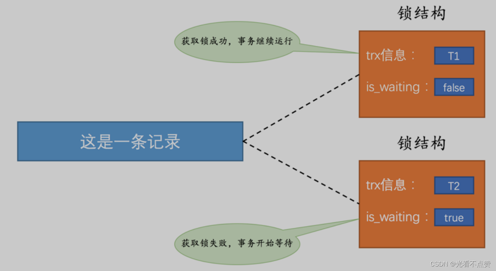
> 
- 事务T1提交后

> 当事务T1提交后，就会把该事务生成的锁结构释放掉，
> 
> 
> **然后看看还有没有别的事务在等待获取锁，发现了事务T2还在等待线程，所以T2的线程结构的is_waitting属性就会被设置成false，然后该事务把对应线程进行唤醒，使其继续执行，此时T2就获取到了锁**
> 
> 
> 
- 有关锁术语的解释

> 不加锁：意思就是不需要在内存中生成对应的 锁结构 ，可以直接执行操作。获取锁成功，或者加锁成功：意思就是在内存中生成了对应的 锁结构 ，而且锁结构的 is_waiting 属性为 false ，也就是事务可以继续执行操作。获取锁失败，或者加锁失败，或者没有获取到锁：意思就是在内存中生成了对应的 锁结构 ，不过锁结构的 is_waiting 属性为 true ，也就是事务需要等待，不可以继续执行操作。
> 

### 1.1.3 读-写 或 写-读 情况

- 概述

> 也就是一个事务进行读取操作，另一个进行改动操作，我们前面说过这种情况下可能发生脏读、不可重复读、幻读的问题；在国际标准的SQL隔离级别中对于 REPEATABLE READ是可以允许发生幻读；但在mysql的 REPEATABLE READ隔离级别实际上就已经解决了 幻读 问题。
> 
- 幻读问题注意

> 幻读问题的产生是因为某个事务读了一个范围的记录，之后别的事务在该范围内插入了新记录，该事务再次读取该范围的记录时，可以读到新插入的记录，所以幻读问题准确的说并不是因为读取和写入一条相同记录而产生的，这一点要注意一下。
> 
- 对于 脏读 、 不可重复读 、 幻读 这些问题究竟要怎么解决

> 对于这个方案我们有两种解决方案：下面我们详细说一下
> 
> 1. 读操作利用多版本并发控制（ MVCC ），写操作进行 加锁
> 2. 读、写操作都采用 加锁 的方式
- 读操作利用多版本并发控制（ MVCC ），写操作进行 加锁

> 所谓MVCC就是并发多版本控制，当我们进行写- 读，读-写时对应写操作时就会生成一个readView，然后通过readView来找到合适的版本（由undo日志构建）进行读取，以此来避免上面三个问题，其实你可以这么理解在生成这个readView时就像做了一次时间暂停，对此刻的各种状态做了一次快照，查询语句只能读到在生成 ReadView 之前已提交事务所做的更改，在生成 ReadView 之前未提交的事务或者之后才开启的事务所做的更改是看不到的。而写操作肯定针对的是最新版本的记录，读记录的历史版本和改动记录的最新版本本身并不冲突，也就是采用MVCC 时， 读-写 操作并不冲突。
> 

> 我们说过普通的SELECT语句在READ COMMITTED和REPEATABLE READ隔离级别下会使用到MVCC读取记录。在READ COMMITTED隔离级别下，一个事务在执行过程中每次执行SELECT操作时都会生成一个ReadView，ReadView的存在本身就保证了事务不可以读取到未提交的事务所做的更改，也就是避免了脏读现象；REPEATABLE READ隔离级别下，一个事务在执行过程中只有第一次执行SELECT操作才会生成一个ReadView，之后的SELECT操作都复用这个ReadView，这样也就避免了不可重复读和幻读的问题。
> 
- 读、写操作都采用 加锁 的方式

> 如果我们的一些业务场景不允许读取记录的旧版本，而是每次都必须去读取记录的最新版本，比方在银行存款的事务中，你需要先把账户的余额读出来，然后将其加上本次存款的数额，最后再写到数据库中。在将账户余额读取出来后，就不想让别的事务再访问该余额，直到本次存款事务执行完成，其他事务才可以访问账户的余额。这样在读取记录的时候也就需要对其进行 加锁 操作，这样也就意味着 读 操作和 写 操作也像 写-写 操作那样排队执行。
> 

> 我们说脏读的产生是因为当前事务读取了另一个未提交事务写的一条记录，如果另一个事务在写记录的时候就给这条记录加锁，那么当前事务就无法继续读取该记录了，所以也就不会有脏读问题的产生了。不可重复读的产生是因为当前事务先读取一条记录，另外一个事务对该记录做了改动之后并提交之后，当前事务再次读取时会获得不同的值，如果在当前事务读取记录时就给该记录加锁，那么另一个事务就无法修改该记录，自然也不会发生不可重复读了。我们说幻读问题的产生是因为当前事务读取了一个范围的记录，然后另外的事务向该范围内插入了新记录，当前事务再次读取该范围的记录时发现了新插入的新记录，我们把新插入的那些记录称之为幻影记录。采用加锁的方式解决幻读问题就有那么一丢丢麻烦了，因为当前事务在第一次读取记录时那些幻影记录并不存在，所以读取的时候加锁就有点尴尬 —— 因为你并不知道给谁加锁，下面会详细说明怎么处理幻读
> 

### 1.1.4 总结

> 很明显，采用 MVCC 方式的话， 读-写 操作彼此并不冲突，性能更高，采用 加锁 方式的话， 读-写 操作彼此需要排队执行，影响性能。一般情况下我们当然愿意采用 MVCC 来解决 读-写 操作并发执行的问题，但是业务在某些特殊情况下，要求必须采用 加锁 的方式执行，那也是没有办法的事。
> 

### 1.2 一致性读（Consistent Reads）

- 概述

> 事务利用 MVCC 进行的读取操作称之为 一致性读 ，或者 一致性无锁读 ，有的地方也称之为 快照读 。所有普通的 SELECT 语句（ plain SELECT ）在 READ COMMITTED 、 REPEATABLE READ 隔离级别下都算是 一致性读 ，比方说
一致性读 并不会对表中的任何记录做 加锁 操作，其他事务可以自由的对表中的记录做改动。
> 

```sql
SELECT * FROM t;
SELECT * FROM t1 INNER JOIN t2 ON t1.col1 = t2.col2

```

### 1.3 锁定读（Locking Reads）

### 1.3.1 共享锁和独占锁

- 概述

> 前面我们说到对于读-读的情况是不需要做什么同步操作的，而写-写，读-写和写-读都是需要MVCC或者加锁的方式来解决所引起的同步问题，对于使用锁的解决方式，想要在既不影响读-读，又要管制写-写，读-写和写-读的情况，mysql对于此给锁分了个类
> 
> - 共享锁 ，英文名： `Shared Locks` ，简称 `S锁` 。在事务要读取一条记录时，需要先获取该记录的 `S锁` 。
> - 独占锁 ，也常称 排他锁 ，英文名：`Exclusive Locks`，简称 `X锁` 。在事务要改动一条记录时，需要先获取该记录的`X锁`。
- 例子

> 假如事务T1首先获取了一条记录的S锁之后，事务 T2 接着也要访问这条记录：
> 
> - 如果事务 `T2` 想要再获取一个记录的 `S`锁 ，那么事务 `T2` 也会获得该锁，也就意味着事务 `T1` 和 `T2` 在该记录上同时持有 `S`锁 。
> - 如果事务`T2`想要再获取一个记录的 `X`锁 ，**那么此操作会被阻塞，直到事务 `T1` 提交之后将 `S`锁 释放掉。**

> 假如事务T1先获取了X锁，那么事务T2不管是想获取该记录的S锁还是X锁都会被阻塞直到事务T1提交
> 
> 
> 
> 

### 1.3.2 锁定读的语句

- 概述

> 我们前边说在采用加锁方式解决 脏读 、 不可重复读 、 幻读 这些问题时，读取一条记录时需要获取一下该记录的S锁，其实这是不严谨的，有时候想在读取记录时就获取记录的X锁，来禁止别的事务读写该记录，为此MySQL 提出了两种比较特殊的SELECT语句格式：
> 
- 对读取的记录加S锁

> 加上这个语句，读取到这的事务就会为他读取到的记录加S锁，另外允许别人也获取这些记录的S锁（比方说别的事务也使用SELECT ... LOCK IN SHARE MODE语句来读取这些记录），但是不能获取这些记录的 X锁 （比方说使用 SELECT ... FOR UPDATE语句来读取这些记录，或者直接修改这些记录）。如果别的事务想要获取这些记录的 X锁 ，那么它们会阻塞，直到当前事务提交之后将这些记录上的S锁释放掉。
> 

```sql
#对读取的记录加 S锁 ：
 SELECT ... LOCK IN SHARE MODE;

```

- 对读取的记录加 X锁

> 也就是在普通的SELECT语句后边加 FOR UPDATE ，如果当前事务执行了该语句，那么它会为读取到的记录加 X锁 ，这样既不允许别的事务获取这些记录的 S锁 （比方说别的事务使用 SELECT ... LOCK IN SHARE MODE 语句来读取这些记录），也不允许获取这些记录的 X锁 （比方也说使用 SELECT ... FOR UPDATE 语句来读取这些记录，或者直接修改这些记录）。如果别的事务想要获取这些记录的 S锁 或者 X锁 ，那么它们会阻塞，直到当前事务提交之后将这些记录上的 X锁 释放掉。
> 

```sql
 SELECT ... FOR UPDATE;

```

> 这里对于上面的语句进行扩充并提出一个问题：下面的语句序列，是怎么加锁的，加的锁又是什么时候释放的呢？
答：在重复读的隔离级别下，根据上面的基本概念我们知道，因为d没有索引，所以会进行全局查询，mysql会为每个查询到的记录加行锁，直到事务提交后这些锁才会释放（两阶段锁）
> 

> RC（提交读）隔离级别下，对非索引字段更新，有个锁全表记录的过程，不符合条件的会及时释放行锁，不必等事务结束时释放；而直接用索引列更新，只会锁索引查找值和行。update产生的X锁在不释放的情况下，DELETE语句无法执行，但是UPDATE语句能更新不符合之前X锁的记录。
RR（可重复读）隔离级别下，为保证binlog记录顺序，非索引更新会锁住全表记录，且事务结束前不会对不符合条件记录有逐步释放的过程。DELETE和UPDATE语句都不能执行
> 

```sql
CREATE TABLE `t` (
  `id` int(11) NOT NULL,
  `c` int(11) DEFAULT NULL,
  `d` int(11) DEFAULT NULL,
  PRIMARY KEY (`id`),
  KEY `c` (`c`)
) ENGINE=InnoDB;

insert into t values(0,0,0),(5,5,5),
(10,10,10),(15,15,15),(20,20,20),(25,25,25);

# 假设有这么个业务查询，d没有索引
begin;
select * from t where d=5 for update;
commit;

```

### 1.4 写操作

- 概述

> 我们平常用到的写操作无非三种：insert、update和delete
> 
- delete

> 对一条记录进行删除操作就是在B+数中找到这条记录，找到后获取这条记录的X锁，然后执行delete mark操作。我们也可以把这个定位待删除记录在 B+ 树中位置的过程看成是一个获取 X锁 的 锁定读
> 
- update

> 对于一条记录的更新操作分为三种情况
> 
> 1. **如果未修改该记录的键值并且被更新的列占用的存储空间在修改前后未发生变化**，则先在 `B+ 树`中定位到这条记录的位置，然后再获取一下记录的 `X锁` ，最后在原记录的位置进行修改操作。其实我们也可以把这个定位待修改记录在 `B+ 树`中位置的过程看成是一个获取 `X锁` 的 锁定读 。
> 2. **如果未修改该记录的键值并且至少有一个被更新的列占用的存储空间在修改前后发生变化**，则先在`B+` 树中定位到这条记录的位置，然后获取一下记录的 `X锁` ，**将该记录彻底删除掉（就是把记录彻底移入垃圾链表），最后再插入一条新记录**。这个定位待修改记录在 `B+` 树中位置的过程看成是一个获取 `X 锁` 的 锁定读 ，新插入的记录由 `INSERT` 操作提供的`隐式锁`进行保护。
> 3. **如果修改了该记录的键值**，则相当于在原记录上做 `DELETE` 操作之后再来一次 `INSERT` 操作，加锁操作就需要按照 `DELETE 和 INSERT` 的规则进行了。
- insert

> 一般情况下，新插入一条记录的操作并不加锁，mysql通过一种称之为 隐式锁 的东东来保护这条新插入的记录在本事务提交前不被别的事务访问。 当然，在一些特殊情况下INSERT操作也是会获取锁的，后面讲
> 

## 2.多粒度锁

- 概述

> 前面我们说的锁大多只局限于一条记录上面，可以称之为行锁或者行级锁，只会影响这一条记录而已，所以我们称这种锁的粒度比较细；其实事务也可以在一个表上面加锁，称为表锁或者表级锁。对一个表加锁影响整个表中的记录，我们就说这个锁的粒度比较粗。给表加的锁也可以分为 共享锁（ S锁 ）和 独占锁 （ X锁 ）：
> 
- 给表加S锁：

> 如果一个事务给表加了 S锁 ，那么：
> 
> - 别的事务可以继续获得该表的 S锁
> - 别的事务可以继续获得该表中的某些记录的 S锁
> - 别的事务不可以继续获得该表的 X锁
> - 别的事务不可以继续获得该表中的某些记录的 X锁
- 给表加X锁

> 如果一个事务给表加了 X锁 （意味着该事务要独占这个表），那么：
> 
> - 别的事务不可以继续获得该表的 S锁
> - 别的事务不可以继续获得该表中的某些记录的 S锁
> - 别的事务不可以继续获得该表的 X锁
> - 别的事务不可以继续获得该表中的某些记录的 X锁

### 2.1 行锁与表锁

- 概述

> 当我们想给一个表上锁时，无论是上S锁还是X锁，都需要检查里面行有没有锁
> 
- 对表上S锁

> 此时我们是不允许有行的X锁，如果有要等到这个行的X锁释放以后才能对表上S锁
> 
- 对表上X锁

> 此时我们不允许行有S锁或者X锁，如果有也是要全部等到释放后才能给表上X锁
> 

### 2.2 意向锁（英文名： Intention Locks ）

- 概述

> 当我们需要上表锁时，难道需要一个一个行的检查有没有锁吗，当然不可能存在遍历的情况太消耗资源了。所以mysql提出了意向锁来解决，意向锁也分类。也就是说当我们想要对表上锁就可以看看这个表有没有IS锁或者IX锁，注意这两种锁相互是不关心存在与否的！！！
> 
> - 意向共享锁，英文名：`Intention Shared Lock ，简称 IS锁`。当**事务准备在某条记录上加 `S锁` 时，需要先在表级别加一个`IS锁`。**
> - 意向独占锁，英文名： `Intention Exclusive Lock ，简称 IX锁` 。**当事务准备在某条记录上加`X锁`时，需要先在表级别加一个`IX锁`。**
- 总结

> IS、IX锁是表级锁，它们的提出仅仅为了在之后加表级别的S锁和X锁时可以快速判断表中的记录是否被上锁，以避免用遍历的方式来查看表中有没有上锁的记录，也就是说其实IS锁和IX锁是兼容的，IX锁和IX锁是兼容的
> 
> 
> 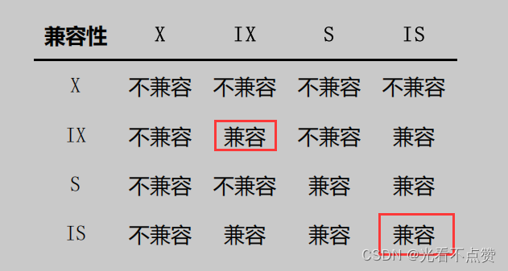
> 

## 3.MySQL中的行锁和表锁

- 概述

> 上边说的都算是些理论知识，其实 MySQL 支持多种存储引擎，不同存储引擎对锁的支持也是不一样的。当然，我们重点还是讨论 InnoDB 存储引擎中的锁，其他的存储引擎只是稍微提一下～
> 

### 3.1 其他存储引擎中的锁（❤）

- 概述

> 对于 MyISAM 、 MEMORY 、 MERGE 这些存储引擎来说，它们只支持表级锁，而且这些引擎并不支持事务，所以使用这些存储引擎的锁一般都是针对当前会话来说的。比方说在 Session 1 中对一个表执行 SELECT 操作，就相当于为这个表加了一个表级别的 S锁 ，如果在 SELECT 操作未完成时， Session 2 中对这个表执行 UPDATE 操作，相当于要获取表的 X锁 ，此操作会被阻塞，直到 Session 1 中的 SELECT 操作完成，释放掉表级别的 S锁 后，Session 2 中对这个表执行 UPDATE 操作才能继续获取 X锁 ，然后执行具体的更新语句。
> 
- 小贴士

> 因为使用MyISAM、MEMORY、MERGE这些存储引擎的表在同一时刻只允许一个会话对表进行写操作，所以这些存储引擎实际上最好用在只读，或者大部分都是读操作，或者单用户的情景下。另外，在MyISAM存储引擎中有一个称之为Concurrent Inserts的特性，支持在对MyISAM表读取时同时插入记录，这样可以提升一些插入速度。
> 

### 3.2 InnoDB存储引擎中的锁

- 概述

> 前面我们讲到行锁和表锁的时候默认就是在以InnoDB为存储引擎讲的。表锁实现简单，占用资源较少，不过粒度很粗，有时候你仅仅需要锁住几条记录，但使用表锁的话相当于为表中的所有记录都加锁，所以性能比较差。行锁粒度更细，可以实现更精准的并发控制。下边我们详细看一下。
> 

### 3.2.1 InnoDB中的表级锁

### 3.2.1.1 表级别的S锁和X锁

- 表级别的S锁和X锁的局限性

> 在对某个表执行SELECT 、 INSERT 、 DELETE 、 UPDATE 语句时， InnoDB 存储引擎是不会为这个表添加表级别的 S锁 或者 X锁 的。
> 

> 另外，在对某个表执行一些诸如 ALTER TABLE 、 DROP TABLE 这类的 DDL 语句（create（添加）、alter（修改）、drop（删除）和 truncate（删除） 四个关键字完成）时，其他事务对这个表并发执行诸如SELECT 、 INSERT 、 DELETE 、 UPDATE的语句会发生阻塞，同理，某个事务中对某个表执行SELECT 、 INSERT 、 DELETE 、 UPDATE 语句时，在其他会话中对这个表执行DDL语句也会发生阻塞。这个过程其实是通过在 server层 使用一种称之为 元数据锁 （英文名： Metadata Locks ，简称 MDL ）东东来实现的，一般情况下也不会使用InnoDB存储引擎自己提供的表级别的 S锁 和 X锁 。 在事务简介的章节中我们说过，DDL语句执行时会隐式的提交当前会话中的事务，这主要是DDL语句的执行一般都会在若干个特殊事务中完成，在开启这些特殊事务前，需要将当前会话中的事务提交掉。
> 

> 但其实对于表级的S锁和X锁很鸡肋，但是在某些特定情况下还是有用的比方说崩溃恢复过程中用到。不过我们还是可以手动获取一下的，比方说在系统变量 autocommit=0，innodb_table_locks =1 时，手动获取 InnoDB 存储引擎提供的表 t 的 S锁 或者 X锁 可以这么写：
> 
> - LOCK TABLES t READ ： InnoDB 存储引擎会对表 t 加表级别的 S锁 。
> - LOCK TABLES t WRITE ： InnoDB 存储引擎会对表 t 加表级别的 X锁 。
- 注意

> 不过请尽量避免在使用 InnoDB 存储引擎的表上使用 LOCK TABLES 这样的手动锁表语句，它们并不会提供什么额外的保护，只是会降低并发能力而已。 InnoDB 的厉害之处还是实现了更细粒度的行锁，关于表级别的 S锁 和 X锁 大家了解一下就罢了。
> 

### 3.2.1.2 表级别的 IS锁 、 IX锁

- 概述

> 当我们在对使用 InnoDB 存储引擎的表的某些记录加 S锁 之前，那就需要先在表级别加一个 IS锁 ，当我们在对使用 InnoDB 存储引擎的表的某些记录加 X锁 之前，那就需要先在表级别加一个 IX锁 。 IS锁 和 IX锁的使命只是为了后续在加表级别的 S锁 和 X锁 时判断表中是否有已经被加锁的记录，以避免用遍历的方式来查看表中有没有上锁的记录。更多关于 IS锁 和 IX锁 的解释我们上边都唠叨过了，就不赘述了。
> 

### 3.2.1.3 表级别的 AUTO-INC锁

- 概述

> 相信大家在建立一张表时会对主键设置则增列即自增属性（==AUTO_INCREMENT==），之后在插入数据时是不用管该列的值，系统会自动为它递增赋值，就比如下面建表的语句
> 

```sql
 CREATE TABLE t (
 id INT NOT NULL AUTO_INCREMENT,
 c VARCHAR(100),
 PRIMARY KEY (id)
 ) Engine=InnoDB CHARSET=utf8;

# 插入数据时就不用管自增列
 INSERT INTO t(c) VALUES('aa'), ('bb');

```

- 系统实现这种自动给 ==AUTO_INCREMENT== 修饰的列递增赋值的原理

> 这个原理主要有两个
> 
> 1. 采用`AUTO-INC`锁，也就是在执行插入语句时就在表级别加一个 `AUTO-INC` 锁，然后为每条待插入记录的 `AUTO_INCREMENT` 修饰的列分配递增的值，**在该语句执行结束后，再把 AUTO-INC 锁释放掉**。这样一个事务在持有 `AUTO-INC` 锁的过程中，其他事务的插入语句都要被阻塞，可以保证一个语句中分配的递增值是连续的。
> - 如果我们的插入语句在执行前不可以确定具体要插入多少条记录（无法预计即将插入记录的数量），比方说使用`INSERT ... SELECT 、 REPLACE ... SELECT 或者 LOAD DATA`这种插入语句，一般是使用`AUTO-INC 锁为 AUTO_INCREMENT` 修饰的列生成对应的值。**需要注意一下的是，这个`AUTO-INC`锁的作用范围只是单个插入语句，插入语句执行完成后，这个锁就被释放了，跟我们之前介绍的锁在事务结束时释放是不一样的。**

> 采用一个轻量级的锁，在为插入语句生成 AUTO_INCREMENT 修饰的列的值时获取一下这个轻量级锁，然后生成本次插入语句需要用到的 AUTO_INCREMENT 列的值之后，就把该轻量级锁释放掉，并不需要等到整个插入语句执行完才释放锁。
> 
> - 如果我们的插入语句在执行前就可以确定具体要插入多少条记录，比方说我们上边举的关于表`t`的例子中，在语句执行前就可以确定要插入`2`条记录，那么一般采用轻量级锁的方式对 `AUTO_INCREMENT` 修饰的列进行赋值。这种方式可以避免锁定表，可以提升插入性能。

> 底层原理：mysql提供了一个称之为innodb_autoinc_lock_mode的系统变量来控制到底使用上述两种方式中的哪种来为AUTO_INCREMENT修饰的列进行赋值，当innodb_autoinc_lock_mode值为0时，一律采用AUTO-INC锁；当innodb_autoinc_lock_mode值为2时，一律采用轻量级锁；当
innodb_autoinc_lock_mode值为1时，两种方式混着来（也就是在插入记录数量确定时采用轻量级锁，不确定时使用AUTO-INC锁）。不过当innodb_autoinc_lock_mode值为2时，可能会造成不同事务中的插入语句为AUTO_INCREMENT修饰的列生成的值是交叉的，在有主从复制的场景中是不安全的。
> 

### 3.2.1.4 元数据锁（MDL锁）

- 概述

> 我们前面说到当对表执行DDL语句之后在执行DML语句会被阻塞，相反执行顺序也会被阻塞，被阻塞的原因就是每个表都有默认的MDL锁来隐式的保护读写的正确性，即MDL作用是防止DDL和DML并发的冲突。所以对于正儿八经的表锁其实用的不多，但是MDL也是有局限性的，下面描述一个场景
> 
- 场景

> 给一个表加字段，或者修改字段，或者加索引，需要扫描全表的数据。在对大表操作的时候，你肯定会特别小心，以免对线上服务造成影响。而实际上，即使是小表，操作不慎也会出问题。我们来看一下下面的操作序列，假设表 t 是一个小表。
> 

> 可以看到十分的离谱，当第三个操作时写操作时会被阻塞，但第四个操作时读操作不影响一致性也同样会被阻塞，如果后面的请求激增，而这个情况又没有超时重试或放弃的操作，会让数据库的压力十分大，
> 
> 
> **所以你现在应该知道了，事务中的 MDL 锁，在语句执行开始时申请，但是语句结束后并不会马上释放，而会等到整个事务提交后再释放。**
> 
> 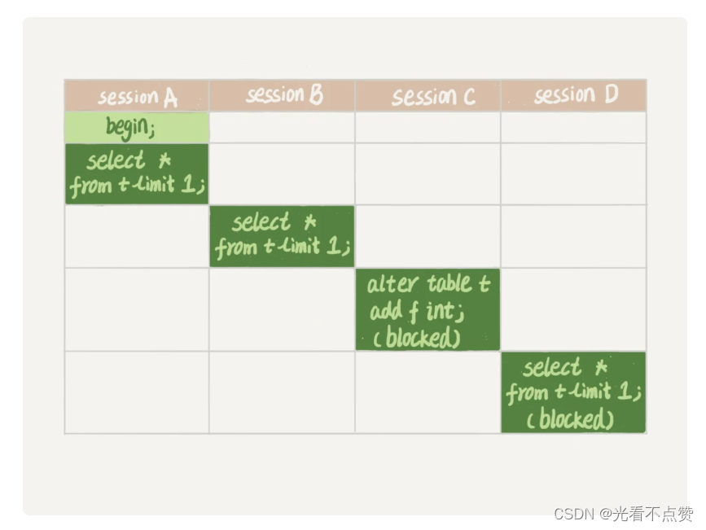
> 
- 解决思路：手动释放长连接

> 我们首先要解决长连接事务没提交无法释放锁的问题
> 

> 在 MySQL 的 information_schema 库的 innodb_trx 表中，你可以查到当前执行中的事务。如果你要做 DDL 变更的表刚好有长事务在执行，要考虑先暂停 DDL，或者 kill 掉这个长事务。
> 
- 弊端及优化

> 如果这个表的体量虽然小，但是请求是否频繁，这时kill就未必管用，因为新的请求很快就过来了。比较理想的机制是，在 alter table 语句里面设定等待时间，如果在这个指定的等待时间里面能够拿到 MDL 写锁最好，拿不到也不要阻塞后面的业务语句，先放弃。之后开发人员或者 DBA 再通过重试命令重复这个过程。
> 

> MariaDB 已经合并了 AliSQL 的这个功能，所以这两个开源分支目前都支持 DDL NOWAIT/WAIT n 这个语法。
> 

```sql
ALTER TABLE tbl_name NOWAIT add column ...
ALTER TABLE tbl_name WAIT N add column ...

```

### 3.2.2 InnoDB中的行级锁

- 概述

> 行锁 ，也称为 记录锁 ，顾名思义就是在记录上加的锁。一个 行锁 玩出了各种花样，也就是把 行锁 分成了各种类型。换句话说即使对同一条记录加 行锁 ，如果类型不同，起到的功效也是不同的。
> 
- 两阶段锁

> 在 InnoDB 事务中，行锁是在需要的时候才加上的，但并不是不需要了就立刻释放，而是要等到事务结束时才释放。这个就是两阶段锁协议。这个设定让我们再加事务的时候注意，如果你的事务中需要锁多个行，要把最可能造成锁冲突、最可能影响并发度的锁尽量往后放。即加锁语句执行的顺序哦
> 

> 由于有两阶段锁的存在，可能某些时候会造成不必要的等待，那么我们可以通过设置保存点，在业务写操作完成后立马通过语句回到保存点来提前释放锁
> 
- 事前准备

> 建表和插入数据，可以看到我们把姓名列每个值前面都加了字符（a~z），这是为了让他根据字符从大到小排序（由于UTF-8没有按照中文排序的比较规则），并且我们还把主键号码列的值搞得十分分散作用稍后讲到
> 

```sql
CREATE TABLE hero (
 number INT,
 name VARCHAR(100),
 country varchar(100),
 PRIMARY KEY (number),
 KEY idx_name (name)
) Engine=InnoDB CHARSET=utf8;

# 插入数据
INSERT INTO hero VALUES
 (1, 'l刘备', '蜀'),
 (3, 'z诸葛亮', '蜀'),
 (8, 'c曹操', '魏'),
 (15, 'x荀彧', '魏'),
 (20, 's孙权', '吴');

```

- 表的聚簇索引图

> 我们把 B+树 的索引结构做了一个超级简化，只把索引中的记录给拿了出来，
> 
> 
> **我们这里只是想强调聚簇索引中的记录是按照主键大小排序的，并且省略掉了聚簇索引中的隐藏列**
> 
> 
> 

### 3.2.2.1 Record Locks （基本行锁）

- 概述

> 我们前面提到的记录锁就是这种类型，也就是仅仅把一条记录锁上，我们可以称之为记录锁，官方名字叫
> 
> 
> ```
> LOCK_REC_NOT_GAP
> ```
> 
> ```
>  number 值为 8
> ```
> 
> **当一个事务获取了一条记录的 S型记录锁 后，其他事务也可以继续获取该记录的 S型记录锁 ，但不可以继续获取 X型记录锁 ；当一个事务获取了一条记录的 X型记录锁 后，其他事务既不可以继续获取该记录的 S型记录锁 ，也不可以继续获取 X型记录锁 ；**
> 
> 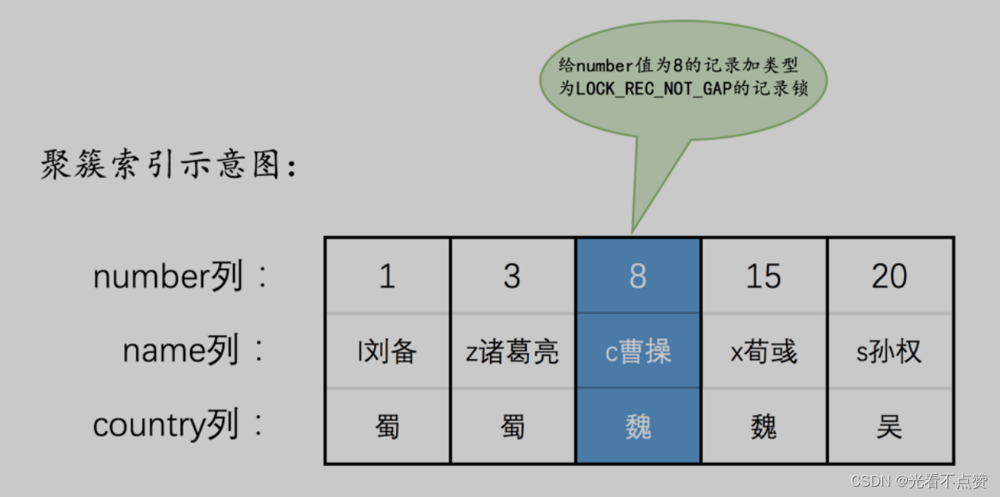
> 

### 3.2.2.2 Cap Locks：间隙锁（可重复读情况下的解决幻读）

- 概述

> 我们说
> 
> 
> ```
> MySQL
> ```
> 
> ```
> REPEATABLE READ
> ```
> 
> ```
> 幻读
> ```
> 
> ```
> MVCC
> ```
> 
> ```
> 加锁
> ```
> 
> **但是在使用 加锁 方案解决时有个大问题，就是事务在第一次执行读取操作时，那些幻影记录尚不存在，我们无法给这些幻影记录加上 记录锁**
> 
> ```
> mysql
> ```
> 
> ```
> Gap Locks
> ```
> 
> ```
> LOCK_GAP
> ```
> 
> ```
> gap锁
> ```
> 
> ```
> number 值为 8
> ```
> 
> ```
> gap锁
> ```
> 
> 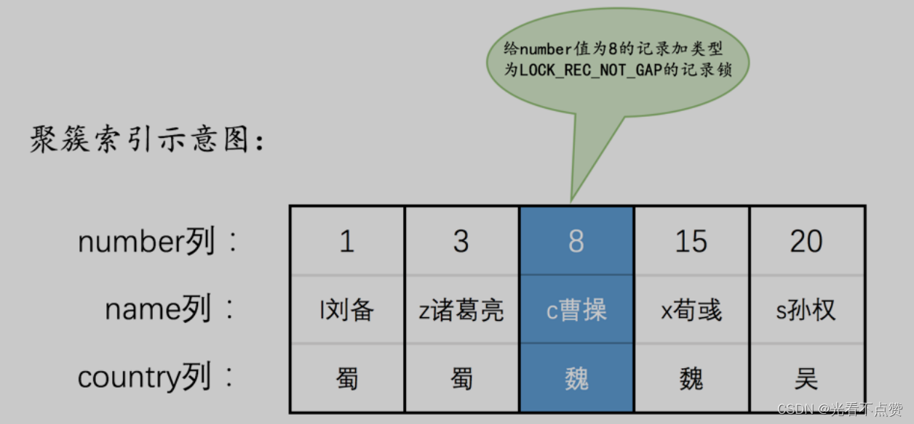
> 
> - 解释
> **如图中为 number 值为 8 的记录加了 gap锁 ，意味着不允许别的事务在 number 值为 8 的记录前边的 间隙插入新记录，其实就是 number 列的值 (3, 8) 这个区间的新记录是不允许立即插入的。比方说有另外一个事务再想插入一条 number 值为 4 的新记录，它定位到该条新记录的下一条记录的 number 值为8，而这条记录上又有一个 gap锁 ，所以就会阻塞插入操作，直到拥有这个 gap锁 的事务提交了之后， number 列的值在区间 (3, 8) 中的新记录才可以被插入。**
- gap锁存在的意义

> 这个 gap锁 的提出仅仅是为了防止插入幻影记录而提出的，虽然有 共享gap锁 和 独占gap锁 这样的说法，但是它们起到的作用都是相同的。而且如果你对一条记录加了 gap锁 （不论是 共享gap锁 还是 独占gap锁 ），并不会限制其他事务对这条记录加 记录锁 或者继续加 gap锁 ，再强调一遍， gap锁 的作用仅仅是为了防止插入幻影记录的而已。
> 
- 对于未占用的范围管理

> 不知道大家发现了一个问题没，给一条记录加了 gap锁 只是不允许其他事务往这条记录前边的间隙插入新记录，那对于最后一条记录之后的间隙，也就是 hero 表中 number 值为20的记录之后的间隙该咋办呢？也就是说给哪条记录加gap锁才能阻止其他事务插入 number 值在 (20, +∞) 这个区间的新记录呢？这时候应该想起我们在前边唠叨 数据页 时介绍的两条伪记录了：
> 
> - Infimum 记录，表示该页面中最小的记录。
> - Supremum 记录，表示该页面中最大的记录。

> 为了实现阻止其他事务插入 number 值在 (20, +∞) 这个区间的新记录，我们可以给索引中的最后一条记录，也就是number 值为 20的那条记录所在页面的 Supremum 记录加上一个 gap锁 ，画个图就是这样，这样就可以阻止其他事务插入 number 值在 (20, +∞) 这个区间的新记录。为了大家理解方便，之后的索引示意图中都会把这个 Supremum 记录画出来
> 
> 
> 
> 

### 3.2.2.3 Next-Key Locks

- 概述

> 有时候我们既想锁住某条记录，又想阻止其他事务在该记录前边的 间隙 插入新记录，所以
> 
> 
> ```
> mysql
> ```
> 
> ```
> Next-Key Locks
> ```
> 
> ```
> LOCK_ORDINARY
> ```
> 
> ```
> next-key
> ```
> 
> ```
> number 值为 8
> ```
> 
> ```
>  next-key
> ```
> 
> 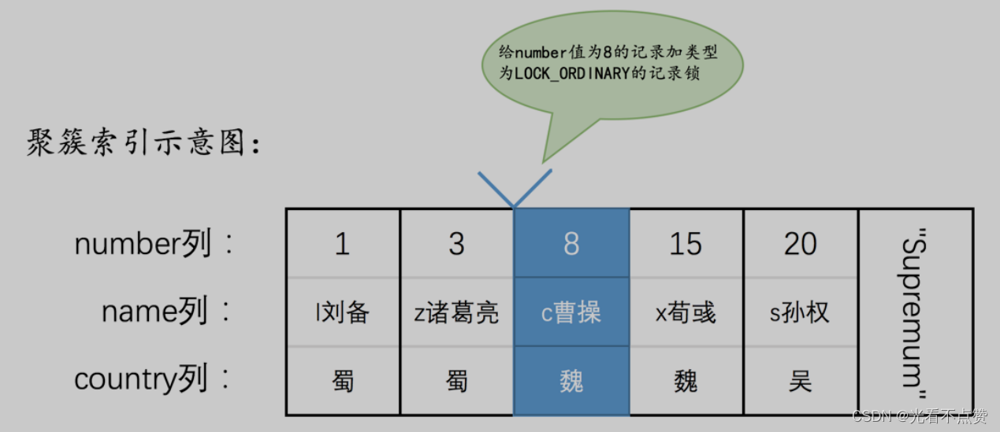
> 
- 总结

> next-key锁 的本质就是一个 记录锁 和一个 gap锁 的合体，它既能保护该条记录，又能阻止别的事务将新记录插入被保护记录前边的 间隙 。
> 

### 3.2.2.4 Insert Intention Locks

- 概述

> 我们说一个事务在插入一条记录时需要判断一下插入位置是不是被别的事务加了所谓的 gap锁 （ next-key锁 也包含 gap锁 ，后边就不强调了），如果有的话，插入操作需要等待，直到拥有 gap锁 的那个事务提交。但是mysql规定事务在等待的时候也需要在内存中生成一个 锁结构 ，表明有事务想在某个 间隙 中插入新记录，但是现在在等待
> 
> 
> ```
> mysql
> ```
> 
> ```
> Insert IntentionLocks
> ```
> 
> ```
> LOCK_INSERT_INTENTION
> ```
> 
> ```
> 插入意向锁
> ```
> 
> 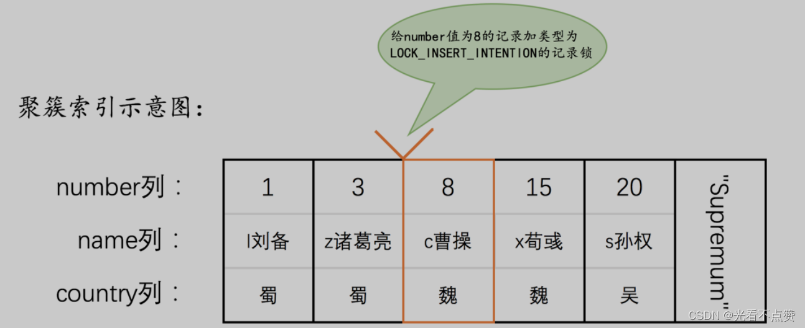
> 
- 举个例子加深理解

> 为了让大家彻底理解这个 插入意向锁 的功能，我们还是举个例子然后画个图表示一下。比方说现在 T1 为number 值为 8 的记录加了一个gap锁，然后 T2 和 T3 分别想向 hero 表中插入 number 值分别为 4 、 5 的两条记录，所以现在为 number 值为 8 的记录加的锁的示意图就如下所示：可以看到锁结构中又有新的属性type表明锁的类型。
> 

> 从图中可以看到，由于
> 
> 
> ```
> T1 持有 gap锁
> ```
> 
> ```
> T2 和 T3
> ```
> 
> ```
> 锁结构
> ```
> 
> ```
> T1
> ```
> 
> ```
> T2 和 T3
> ```
> 
> ```
> is_waiting 属性改为 false
> ```
> 
> ```
> T2 和 T3
> ```
> 
> ```
> number 值为8
> ```
> 
> **插入意向锁 就是这么鸡肋**
> 
> 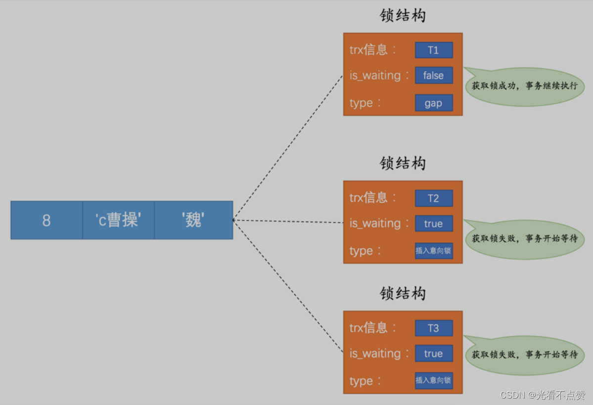
> 

### 3.2.2.5 隐式锁

- 概述

> 我们前边说一个事务在执行 INSERT 操作时，如果即将插入的 间隙 已经被其他事务加了 gap锁 ，那么本次INSERT 操作会阻塞，并且当前事务会在该间隙上加一个 插入意向锁 ，否则一般情况下 INSERT 操作是不加锁的。那如果一个事务首先插入了一条记录（此时并没有与该记录关联的锁结构），然后另一个事务做了如下的几种情况操作：
> 
> - 立即使用 `SELECT ... LOCK IN SHARE MODE` 语句读取这条事务，也就是在要获取这条记录的 `S锁` ，或者使用 `SELECT ... FOR UPDATE` 语句读取这条事务或者直接修改这条记录，也就是要获取这条记录的 `X 锁` ，该咋办？**如果允许这种情况的发生，那么可能产生 脏读 问题。**
> - **立即修改这条记录，也就是要获取这条记录的 `X锁` ，该咋办？如果允许这种情况的发生，那么可能产生 脏写 问题。**
- 对于上面的两种操作我们分别讨论一下聚簇索引和二级索引

> 情景一：对于聚簇索引记录来说，有一个trx_id隐藏列，该隐藏列记录着最后改动该记录的 事务id 。那么如果在当前事务中新插入一条聚簇索引记录后，该记录的 trx_id 隐藏列代表的的就是当前事务的事务id ，如果其他事务此时想对该记录添加 S锁 或者 X锁 时，首先会看一下该记录的 trx_id 隐藏列代表的事务是否是当前的活跃事务，如果是的话，那么就帮助当前事务创建一个X锁（也就是为当前事务创建一个锁结构， is_waiting 属性是 false ），然后自己进入等待状态（也就是为自己也创建一个锁结构，is_waiting 属性是 true）。
> 

> 情景二：对于二级索引记录来说，本身并没有trx_id隐藏列，但是在二级索引页面的 Page Header 部分有一个 PAGE_MAX_TRX_ID 属性，该属性代表对该页面做改动的最大的 事务id ，如果
PAGE_MAX_TRX_ID 属性值小于当前最小的活跃 事务id ，那么说明对该页面做修改的事务都已经提交了，否则就需要在页面中定位到对应的二级索引记录，然后回表找到它对应的聚簇索引记录，然后再重复 情景一 的做法。
> 
- 总结

> 通过上边的叙述我们知道，一个事务对新插入的记录可以不显式的加锁（生成一个锁结构），但是由于事务id 这个牛逼的东东的存在，相当于加了一个 隐式锁 。别的事务在对这条记录加 S锁 或者 X锁时，由于 隐式锁 的存在，会先帮助当前事务生成一个锁结构，然后自己再生成一个锁结构后进入等待状态。
> 

### 3.2.2.6 行锁的所遇到的问题

- 前言

> 前面我们说到行锁的两阶段锁，即需要加上，不需要不立即释放，当有如下场景：一个电影院卖票给用户，大致需要完成一下三步
> 
> 1. 扣用户余额（update）
> 2. 增加电影院余额（update）
> 3. 记录交易日志（insert）

> 这三个语句肯定放在一个事务里，那么我们怎么安排执行顺序来提高并发呢，其实很简单，就是将费时间的往后放，什么费时间肯定是对于同步数据的更新费时间，如果此时两个柜台的人再卖票，两个用户在同事买票，这三个操作显然是第二句发生了冲突，那么你就可以这么设计 3 、1、2，这样就可以减少锁等待
> 
- 后续

> 当你将业务逻辑设置成这样并且在影院当天有活动，也就是说会有大量的并发请求，卖票系统一上线你发现CPU占用率百分之百，系统直接宕机，出现这样的问题就是有了死锁
> 

### 3.2.2.7 死锁及死锁检测

- 概述

> 死锁大家很熟悉了，那么当死锁出现的时候应该采取什么策略，大致有下面这么两种
> 
> - 一种策略是，直接进入等待，直到超时。这个超时时间可以通过参数 `innodb_lock_wait_timeout` 来设置。
> - 另一种策略是，发起死锁检测，发现死锁后，主动回滚死锁链条中的某一个事务，让其他事务得以继续执行。将参数`innodb_deadlock_detect`设置为 on，表示开启这个逻辑。
- 策略一

> 对于这个参数，mysql默认是50s，对于在线服务这个时间往往是不能接收的，但是又不能设置成很小的时间，因为这时就无法分辨到底是死锁问题还是简单的锁等待
> 
- 策略二

> 这个主动检测死锁在mysql中默认是开启的，即在发生死锁的时候能够及时的处理，但是也会造成负担。因为当每个事务被锁以后，都会循环查看里面的依赖的线程有没有被别的事务锁住。如此循环判断，但是每个线程查询死锁的时间复杂度为O(n)，如果有1000个线程要同时更新同一行，那么每到一个新的线程都会检测，总共为100万个量级，这期间会消耗大量的CPU资源，因此你就会看到新上新系统会宕机的原因
> 
- 优化

> 我们可以看到上面两个策略都不能满足我们，我们可以拆分几条优化思路
> 
> - `关闭死锁检测`：**这个做法是十分有风险的，因为一旦有死锁超时以后对于业务是有损的（如果与有有死锁检测就会进行超时回滚，对于业务是无损的）**
> - `控制并发度`：可以利用中间件对请求进行排队处理
> - **将同一行的数据拆分成逻辑上的多行减少锁冲突，例如电影院的账户拆分成10条来进行更新，每天的进行记录的总和，但这个逻辑要经过特殊处理，例如如果有退票逻辑，这行记录变为0后怎么处理**
- 注意事项

> 对于死锁检测，当事务加锁访问的行上有锁，那么就会进行死锁检测。所以也就是说事务不是每访问一个记录都要进行死锁检测的，例如一致性读就不会，再比如某个时刻，事务等待状态是这样的：B在等A，D在等C，现在来了一个E，发现E需要等D，那么E就判断跟D、C是否会形成死锁，这个检测不用管B和A
> 

### 3.3 InnoDB锁的内存结构

- 概述

> 当我们对一条记录加锁实际上就是在内存中创建一个锁结构与之对应那如果执行下面的语句，难道说有10000条记录就是创建10000个锁结构？然后是不可能的，mysql规定当符合一定条件时，那么这些记录的锁就可以被放到一个 锁结构 中。
> 

```sql
# 事务T1
SELECT * FROM hero LOCK IN SHARE MODE;

```

- 需要满足的条件

> 在同一个事务中进行加锁操作被加锁的记录在同一个页面中加锁的类型是一样的等待状态是一样的
> 
- 看看放在一个锁结构时的样子

> 看看里面的各种属性信息
> 
> - 锁所在的事务信息 ：不论是 表锁 还是 行锁 ，都是在事务执行过程中生成的，哪个事务生成了这个 锁结构 ，这里就记载着这个事务的信息。
> - 索引信息 ：对于 行锁 来说，需要记录一下加锁的记录是属于哪个索引的。
> - 表锁／行锁信息 ：表锁结构 和 行锁结构 在这个位置的内容是不同的：
> 表锁：**记载着这是对哪个表加的锁，还有其他的一些信息。**
> 行锁：记载了`三个重要的信息`：**1. Space ID ：记录所在表空间。2. Page Number ：记录所在页号。3. n_bits ：对于行锁来说，一条记录就对应着一个比特位，一个页面中包含很多记录，用不同的比特位来区分到底是哪一条记录加了锁。为此在行锁结构的末尾放置了一堆比特位，这个 n_bits 属性代表使用了多少比特位。**
> - type_mode ：这是一个32位的数，被分成了 lock_mode 、 lock_type 和 rec_lock_type 三个部分，下面会有详解
> - 其他信息 ：为了更好的管理系统运行过程中生成的各种锁结构而设计了各种哈希表和链表，为了简化讨论，我们忽略这部分信息哈～
> - 一堆比特位 ，下面会有详解
>     
>     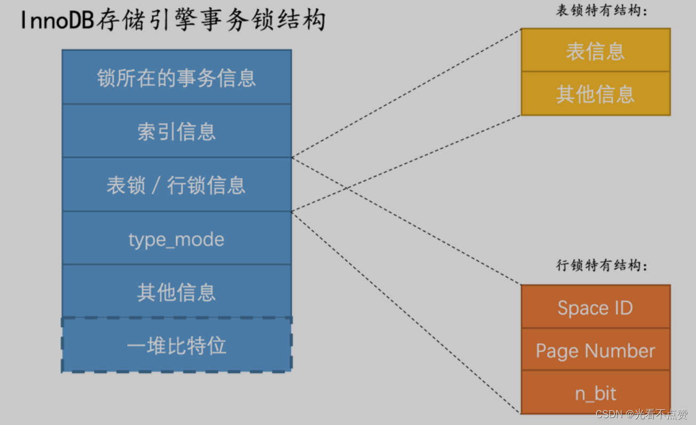
>     
- 属性小贴士

> 实际上这个所谓的锁所在的事务信息在内存结构中只是一个指针而已，所以不会占用多大内存
空间，通过指针可以找到内存中关于该事务的更多信息，比方说事务id是什么。下边介绍的所谓的
索引信息其实也是一个指针。并不是该页面中有多少记录，n_bits属性的值就是多少。为了让之后在页面中插入了新记
录后也不至于重新分配锁结构，所以n_bits的值一般都比页面中记录条数多一些。
> 

### 3.3.1 type_mode

- 概述

> 前面说到这个是由3个部分组成的如下图
> 
> 
> 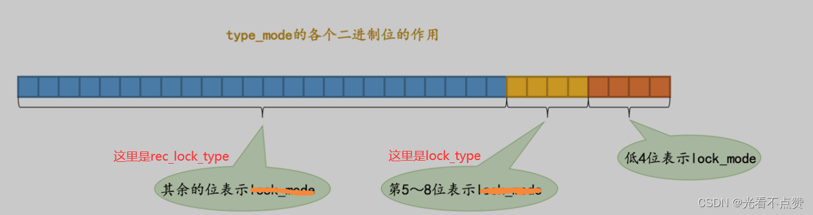
> 
- 锁的模式（ `lock_mode` ），占用低4位，可选的值如下：

> LOCK_IS （十进制的 0 ）：表示共享意向锁，也就是 IS锁 。LOCK_IX （十进制的 1 ）：表示独占意向锁，也就是 IX锁 。LOCK_S （十进制的 2 ）：表示共享锁，也就是 S锁 。LOCK_X （十进制的 3 ）：表示独占锁，也就是 X锁 。LOCK_AUTO_INC （十进制的 4 ）：表示 AUTO-INC锁 。
> 

> 在InnoDB存储引擎中，LOCK_IS，LOCK_IX，LOCK_AUTO_INC都算是表级锁的模式，LOCK_S 和LOCK_X既可以算是表级锁的模式，也可以是行级锁的模式。
> 
- 锁的类型（ `lock_type` ），占用第5～8位，不过现阶段只有第5位和第6位被使用：

> LOCK_TABLE （十进制的 16 ），也就是当第5个比特位置为1时，表示表级锁。LOCK_REC （十进制的 32 ），也就是当第6个比特位置为1时，表示行级锁。
> 
- 行锁的具体类型（ `rec_lock_type` ），使用其余的位来表示。只有在 `lock_type` 的值为 `LOCK_REC` 时，也就是只有在该锁为行级锁时，才会被细分为更多的类型：

> LOCK_ORDINARY （十进制的 0 ）：表示 next-key锁 。LOCK_GAP （十进制的 512 ）：也就是当第10个比特位置为1时，表示 gap锁 。LOCK_REC_NOT_GAP （十进制的 1024 ）：也就是当第11个比特位置为1时，表示 记录锁 。LOCK_INSERT_INTENTION （十进制的 2048 ）：也就是当第12个比特位置为1时，表示插入意向锁。其他的类型：还有一些不常用的类型我们就不多说了。
怎么还没看见 is_waiting 属性呢？这主要是mysql太想着节俭，一个比特位也不想浪费，所以把 is_waiting 属性也放到了 type_mode 这个32位的数字中：LOCK_WAIT （十进制的 256 ） ：也就是当第9个比特位置为1时，表示is_waiting 为 true，也就是当前事务尚未获取到锁，处在等待状态；当这个比特位为0时，表示is_waiting 为 false，也就是当前事务获取锁成功。
> 

### 3.3.2 一些比特位

- 概述

> 如果是 行锁结构 的话，在该结构末尾还放置了一堆比特位，比特位的数量是由上边提到的
> 
> 
> ```
> n_bits
> ```
> 
> ```
> InnoDB
> ```
> 
> ```
> heap_no
> ```
> 
> **伪记录 `Infimum 的 heap_no 值为 0` ，`Supremum 的 heap_no 值为 1`，之后每插入一条记录， `heap_no值就增1`。 锁结构 最后的一堆比特位就对应着一个页面中的记录，一个比特位映射一个 `heap_no` ，不过为了编码方便，映射方式有点怪**
> 
> 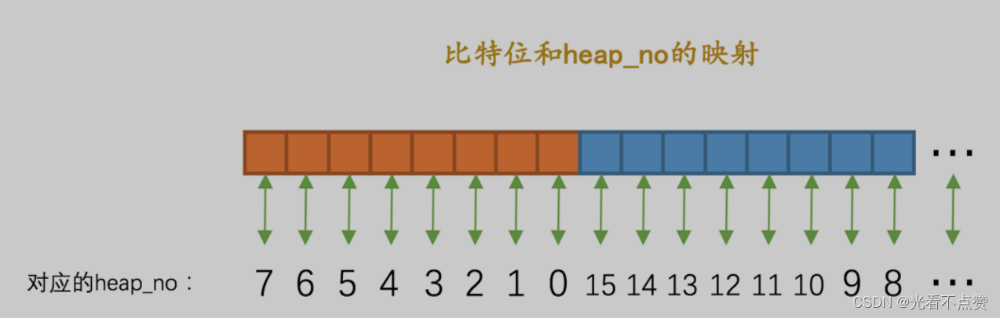
> 
> **这么怪的映射方式纯粹是为了敲代码方便，大家不要大惊小怪，只需要知道一个比特位映射到页
> 内的一条记录就好了。**
> 

### 3.3.3 带入例子来展示锁结构的各个属性的意思

- 前言

> 比方说现在有两个事务 T1 和 T2 想对hero 表中的记录进行加锁， hero 表中记录比较少，假设这些记录都存储在所在的表空间号为 67 ，页号为 3 的页面上，那么如果
> 

### 3.3.3.1 T1 想对 number 值为 15 的这条记录加 S型正常记录锁

- 概述

> 在对记录加行锁之前，需要先加表级别的 IS 锁，也就是会生成一个表级锁的内存结构，不过我们这里不关心表级锁，所以就忽略掉了哈～ 接下来分析一下生成行锁结构的过程：
> 
- 事务 `T1` 要进行加锁，所以锁结构的 锁所在事务信息 指的就是 `T1` 。
- 直接对聚簇索引进行加锁，所以索引信息指的其实就是 `PRIMARY` 索引。
- 由于是行锁，所以接下来需要记录的是三个重要信息：

> Space ID ：表空间号为 67 。Page Number ：页号为 3 。n_bits ：我们的 hero 表中现在只插入了5条用户记录，但是在初始分配比特位时会多分配一些，
这主要是为了在之后新增记录时不用频繁分配比特位。其实计算n_bits有一个公式：
==n_bits = (1 + ((n_recs + LOCK_PAGE_BITMAP_MARGIN) / 8)) * 8==
> 

> 其中 n_recs 指的是当前页面中一共有多少条记录（算上伪记录和在垃圾链表中的记录），比方说现在 hero 表一共有7条记录（5条用户记录和2条伪记录），所以n_recs的值就是 7 ，
LOCK_PAGE_BITMAP_MARGIN 是一个固定的值 64 ，所以本次加锁的 n_bits 值就是：
==n_bits = (1 + ((7 + 64) / 8)) * 8 = 72==
> 
- type_mode 是由三部分组成的：

> lock_mode ，这是对记录加 S锁 ，它的值为 LOCK_S 。lock_type ，这是对记录进行加锁，也就是行锁，所以它的值为LOCK_REC。rec_lock_type ，这是对记录加 记录锁 ，也就是类型为 LOCK_REC_NOT_GAP 的锁。另外，由于当前没有其他事务对该记录加锁，所以应当获取到锁，也就是 LOCK_WAIT 代表的二进制位应该是0。
> 

> 综上所属，此次加锁的 type_mode 的值应该是：
==type_mode = LOCK_S | LOCK_REC | LOCK_REC_NOT_GAP==
也就是：==type_mode = 2 | 32 | 1024 = 1058==
> 
- 其他信息

> 略～
> 
- 一堆比特位

> 因为
> 
> 
> ```
> number 值为 15 的记录 heap_no 值为 5
> ```
> 
> ```
> heap_no
> ```
> 
> ```
> 6
> ```
> 
> ```
> 1
> ```
> 
> 
> 
- 这么多信息杂糅进这个锁结构就如图所示
    
    
    

### 3.3.3.2 T2 想对 number 值为 3 、 8 、 15 的这三条记录加 X型的next-key锁

- 概述

> 在对记录加行锁之前，需要先加表级别的 IX 锁，也就是会生成一个表级锁的内存结构，不过我们这里不关心表级锁，所以就忽略掉了哈
> 

> 现在 T2 要为3条记录加锁， number 为 3 、 8 的两条记录由于没有其他事务加锁，所以可以成功获取这条记录的 X型next-key锁 ，也就是生成的锁结构的 is_waiting 属性为 false ；但是 number 为 15 的记录已经被 T1 加了 S型记录锁 ，T2是不能获取到该记录的 X型next-key锁 的，也就是生成的锁结构的is_waiting 属性为 true 。因为等待状态不相同，所以这时候会生成两个 锁结构 。这两个锁结构中相同的
> 
- 事务 T2 要进行加锁，所以锁结构的 锁所在事务信息 指的就是 T2 。
- 直接对聚簇索引进行加锁，所以索引信息指的其实就是 PRIMARY 索引。
- 由于是行锁，所以接下来需要记录是三个重要信息：
- Space ID ：表空间号为 67 。
- Page Number ：页号为 3 。
- n_bits ：此属性生成策略同 T1 中一样，该属性的值为 72 。
- type_mode 是由三部分组成的：

> lock_mode ，这是对记录加 X锁 ，它的值为 LOCK_X 。lock_type ，这是对记录进行加锁，也就是行锁，所以它的值为 LOCK_REC 。rec_lock_type ，这是对记录加 next-key锁 ，也就是类型为 LOCK_ORDINARY 的锁
> 
- 其他信息：略

### 3.3.3.3 对比着来看看（这里书中乱码了，博主因为今天失恋也不想自己画图整理了，就这样 大家再见）

- 为`number`为`3`、`8`的记录生成的`锁结构`：
- `type_mode`值。

> 由于可以获取到锁，所以is_waiting属性为false，也就是LOCK_WAIT代表的二进制位被
置0。所以：
> 

```
type_mode = LOCK_X | LOCK_REC |LOCK_ORDINARY
也就是
type_mode = 3 | 32 | 0 = 35

```

- `一堆比特位`
因为`number`值为`3`、`8`的记录`heap_no`值分别为`3`、`4`，根据上边列举的比特位和`heap_no`的映射图来看，应该是第一个字节从低位往高位数第4、5个比特位被置为1，就像这样：

综上所述，事务`T2`为`number`值为`3`、`8`两条记录加锁生成的锁结构就如下图所示：

- 为`number`为`15`的记录生成的`锁结构`：
- `type_mode`值。
由于可以获取到锁，所以`is_waiting`属性为`true`，也就是`LOCK_WAIT`代表的二进制位被
置1。所以：

```
type_mode = LOCK_X | LOCK_REC |LOCK_ORDINARY | LOCK_WAIT
也就是
type_mode = 3 | 32 | 0 | 256 = 291

```

- `一堆比特位`
因为`number`值为`15`的记录`heap_no`值为`5`，根据上边列举的比特位和`heap_no`的映射
图来看，应该是第一个字节从低位往高位数第6个比特位被置为1，就像这样：

综上所述，事务`T2`为`number`值为`15`的记录加锁生成的锁结构就如下图所示：

### 3.3.3.4 总结

> 综上所述，事务 T1 先获取 number 值为 15 的 S型记录锁 ，然后事务T2 获取 number 值为 3 、 8 、 15 的X型记录锁共需要生成3个锁结构。
> 

> 上边事务T2在对number值分别为3、8、15这三条记录加锁的情景中，是按照先对number值为3的记录加锁、再对number值为8的记录加锁，最后对number值为15的记录加锁的顺序进行的，如果我们一开始就对number值为15的记录加锁，那么该事务在为number值为15的记录生成一个锁结构后，直接就进入等待状态，就不为number值为3、8的两条记录生成锁结构了。在事务T1提交后会把在number值为15的记录上获取的锁释放掉，然后事务T2就可以获取该记录上的锁，这时再对number值为3、8的两条记录加锁时，就可以复用之前为number值为15的记录加锁时生成的锁结构了。
> 

## 4.查缺补漏之全局锁

### 4.1 MySQL的锁分类

- 概述

> 根据加锁的范围，MySQL 里面的锁大致可以分成全局锁、表级锁和行锁三类。
> 

### 4.2 全局锁

- 概述

> 在mysql中提供了一种全局加锁的方法，命令是 Flush tables with read lock (FTWRL)。当你需要让整个库处于只读状态的时候，可以使用这个命令，之后其他线程的以下语句会被阻塞：数据更新语句（数据的增删改）、数据定义语句（包括建表、修改表结构等）和更新类事务的提交语句。这个锁的粒度我们说是非常重的，因为能够影响的记录非常多
> 
- 使用场景

> 全局锁的典型使用场景是，做全库逻辑备份。也就是把整库每个表都 select 出来存成文本。
> 
- 局限性

> 如果你在主库上备份，那么在备份期间都不能执行更新，业务基本上就得停摆；如果你在从库上备份，那么备份期间从库不能执行主库同步过来的 binlog，会导致主从延迟。
> 

### 4.2.1 为什么要对备份加锁

- 概述

> 当你不对备份进行加锁时，如果中间出现了异常，就会发生意想不到的结果，比如现在有一个订单，用户表维护余额和购买的商品，假设期初余额为200，而商品为null。此时他购买了一个99的商品，业务逻辑表（用户商品表）就要扣除余额并且在已购商品上面添加商品，
> 
> - 此时如果先备份用户表，再备份用户商品表就会出现用户余额没有扣除，因为mysql有时并不会把这两个操作看做一个事务，而是分开执行，造成了数据一致性问题
> - 两个操作相反顺序会造成钱扣了，商品没有的情况
- 总结

> 也就是说，不加锁的话，备份系统备份的得到的库不是一个逻辑时间点，这个视图是逻辑不一致的。
> 

### 4.2.2 如何在备份中开启事务

- 概述

> 官方自带的逻辑备份工具是 mysqldump。当 mysqldump 使用参数–single-transaction 的时候，导数据之前就会启动一个事务，来确保拿到一致性视图。而由于MVCC的支持，这个过程中数据是可以正常更新的。
> 
- 那为什么还需要FTWRL呢

> 你也许有疑问，在备份时能引入MVCC，为什么还需要FTWRL，原因是不同的存储引擎支持这些功能的情况是不一样的，在MyISAM这种不支持事务的引擎。如果备份过程中有更新，总是只能取到最新的数据（一旦更新就备份，如果两个操作的更新间隔中发生了崩溃那就完了），那么就破坏了备份的一致性。这时，我们就需要使用 FTWRL 命令了。
> 
- –single-transaction的使用

> 所以，single-transaction 方法只适用于所有的表使用事务引擎的库。如果有的表使用了不支持事务的引擎，那么备份就只能通过 FTWRL 方法。这往往是 DBA 要求业务开发人员使用 InnoDB 替代 MyISAM 的原因之一。
> 

### 4.2.3 全局锁与set global readonly=true的对比

- 概述

> 即使能用set global readonly=true让库变为已读状态，但是还是建议你用全局锁，原因有二：
> 
> - 一是，在有些系统中，`readonly` 的值会被用来做其他逻辑，比如用来判断一个库是主库还是备库。因此，修改 global 变量的方式影响面更大，我不建议你使用。
> - 二是，在异常处理机制上有差异。如果执行 FTWRL 命令之后由于客户端发生异常断开，那么 `MySQL` 会自动释放这个全局锁，整个库回到可以正常更新的状态。而将整个库设置为 `readonly` 之后，如果客户端发生异常，则数据库就会一直保持 `readonly` 状态，这样会导致整个库长时间处于不可写状态，风险较高。

### 4.3 总结

> 业务的更新不只是增删改数据（DML)，还有可能是加字段等修改表结构的操作（DDL）。不论是哪种方法，一个库被全局锁上以后，你要对里面任何一个表做加字段操作，都是会被锁住的。
>