# 关于Mybatis-Plus的查缺补漏

### **注解**

- @TableLogic(delval = "1", value = "0")：这个注解可以帮助我们在做逻辑删除时减去代码层面的过滤，在dao层会自动加入过滤sql

> value参数的意思就是未删除时标志位的值，默认就是为0；而delval则是删除时标志位的值
> 
> - 删除：调用BaseMapper的deleteById(id)或者调用IService的removeById(id)，走Update方法。此时没有注解就是真正的物理删除，而加上这个注解就是逻辑删除
> - **更新：当时用了该注解，调用update方法，是不会将该字段放入修改字段中，而是默认添加在where条件字段中。即使你给被修饰的字段赋值也不能修改字段**
> - 查询：使用了@TableLogic注解，使用queryWapper等查询时，没有筛选是否删除的条件，但是sql还是自动加上了条件：SELECT * from xxxtable where is_delete =0
- @TableField(value = "is_test", fill = FieldFill.INSERT, select = false)：这个注解可以先对应数据库的字段名，然后根据属性的设置进行相应的操作

> 在这里的fill属性，就是设置在插入操作时该字段会自动填充当时环境变量，例如时间；
> 
> 
> 而select属性则是查询时不返回该字段的值
> 
> 下面这两个属性一般是用于这个字段配合wrapper通过json过滤数据筛选数据的
> 
> - insertStrategy = FieldStrategy.NEVER：这个属性意思就是不执行插入，这个字段多半不是实体数据库的字段
> - updateStrategy = FieldStrategy.NEVER：与上面同理更新时不插入

注意：当使用了@TableField(fill = FieldFill.UPDATE)以后，一定要注意在使用自定义MetaObjectHandler时，当满足某些条件更新时，例如下面是没什么问题时，但是如果为空且你的实体上被注解标注的没有值，那么目标记录会被更新为null

```java
@Component
public class BaseModelFillHandler implements MetaObjectHandler {
 
    @Override
    public void insertFill(MetaObject metaObject) {
        LoginUserInfo loginUserInfo = UserContext.getCurrentUser();
        if (null != loginUserInfo) {
            this.strictInsertFill(metaObject, "createEn", String.class, loginUserInfo.getUsername());
            this.strictInsertFill(metaObject, "createCn", String.class, loginUserInfo.getName());
 
            this.strictUpdateFill(metaObject, "updateEn", String.class, loginUserInfo.getUsername());
            this.strictUpdateFill(metaObject, "updateCn", String.class, loginUserInfo.getName());
        }
    }
 
    @Override
    public void updateFill(MetaObject metaObject) {
        LoginUserInfo loginUserInfo = UserContext.getCurrentUser();
        if (null != loginUserInfo) {
            this.strictUpdateFill(metaObject, "updateEn", String.class, loginUserInfo.getUsername());
            this.strictUpdateFill(metaObject, "updateCn", String.class, loginUserInfo.getName());
        }
    }
}
```

---

- @TableName("t_cb_bill_annual")：这个注解就是标记Java实体与数据库实体名字的对应关系，默认属性为value

> 还有个schema属性，代表你要采用的模式，即数据库的名字（这个名词的意思在不同场景下会有所不同）
> 

### **Mybatis-Plus内部快捷sql方法**

| **方法** | **含义** | **方法** | **含义** | **方法** | **含义** |
| --- | --- | --- | --- | --- | --- |
| eq | equal等于 | **allEq** | 代表全部eq(或个别isNull) | **orderBy** | ORDER BY 字段, 默认正序 |
| ne | not equal不等于 | **notLike** | 代表notLike '%值%' | **having** | 代表聚合函数HAVING ( sql语句 ) having 子句的作用是筛选满足条件的组，
即在分组之后过滤数据，条件中经常包含聚组函数，使用having 条件显示特定的组，
也可以使用多个分组标准进行分组，通常与group by联合使用 |
| gt | greater than大于 | **likeLeft** | 代表左模糊查询 like '%值' | **or** | 代表拼接 OR |
| lt | less than小于 | **likeRight** | 代表右模糊查询 like '值%' | **and** | 代表AND 嵌套 |
| ge | greater than or equal 大于等于 | **isNotNull** | 代表字段不为空 is not null |  |  |
| le | less than or equal 小于等于 | **notIn** | 代表字段 NOT IN  与IN反理 |  |  |
| in | IN(m1,m2,m3) 包含（数组） | **inSql** | 代表字段 IN ( sql语句 ) |  |  |
| isNull | 等于null | **notInSql** | 代表字段 NOT IN ( sql语句 ) |  |  |
| between | 在2个条件之间(包括边界值>=&<=) | **groupBy** | 代表分组：GROUP BY 字段 |  |  |
| like | 模糊查询 | **orderByAsc** | 代表正序：ORDER BY 字段, ... ASC |  |  |
| **notBetween** | 在2个条件之间(包括边界值<=&>=) | **orderByDesc** | 代表倒序：ORDER BY 字段, ... DESC |  |  |

### **SQL**

分析一个sql

```java
<select>
    select ifnull(sum(case customer_check_status when 1 then 1 else 0 end),0) check_bill_count,ifnull( sum(case
    customer_check_status
    when 0 then 1 else 0 end),0) un_check_bill_count,
    ifnull(count(customer_check_status),0 )bill_count
    from t_cb_bill
    where is_deleted = 0
    <if test="compName!=null and compName!='' ">
        and company_name like concat('%',#{compName},'%')
    </if>
    <if test="compId!=null">
        and comp_id = #{compId}
    </if>
</select>
```

- **ifnull(x1, x2)**：这个函数类似于三元表达式，用来判断第一个表达式是否为NULL，如果为NULL则返回第二个表达式，不为NULL则返回自身。ifnull的结果就是check_bill_count的结果
- **sum(case 列名 when then else end)**：首先sum是支持条件语句，而count不支持，在上面的sql中的意思，就是统计customer_check_status这个字段的值为1的总数，总计出来的数会作为ifnull的第一个参数
- **count(列名)**：就是统计这个列有多少条记录
- **<if>标签**：test的属性就是if中的条件表达式，后面则是使用and来追加条件过滤
- **#{}**：这个标签就是老生常谈的防止SQL注入的写法了，不能写成${}，前者是占位符替换，后者是直接进行替换

分析一个sql

展开源码

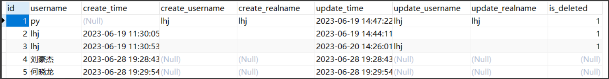

- concat(str1,str2...)：将多个字段名结果连接成一个字符串

> 假设上图的表数据，使用sql：SELECT CONCAT(id,username) FROM `user`，结果为
> 
> 
> 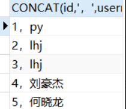
> 

还可以在列名之间使用分隔符例如：SELECT CONCAT(id,'，',username) FROM `user`，结果为：

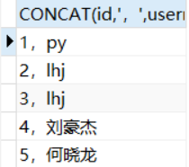

但是如果列太多，分隔符就要写好多次，所以就引入下面的函数

- concat_ws(separator, str1, str2, ...)：这次你就可以就写一次分隔符了，若把分隔符指定为null，结果全部变成了null
- group_concat( [distinct] 要连接的字段 [order by 排序字段 asc/desc ] [separator '分隔符']：将group by产生的同一个分组中的值连接起来，返回一个字符串结果。

> 通过使用distinct可以排除重复值；如果希望对结果中的值进行排序，可以使用order by子句；separator是一个字符串值，缺省为一个逗号。
> 
> 
> 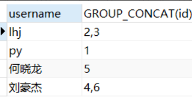
> 

### **Mybatis-Plus自动生成代码插件使用**

下载插件后使用

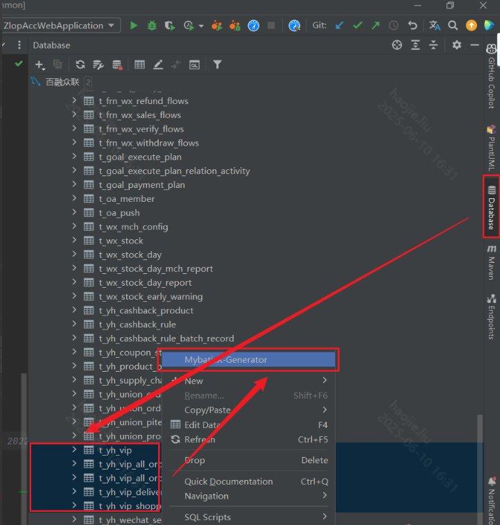

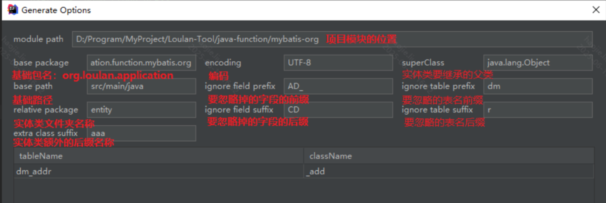

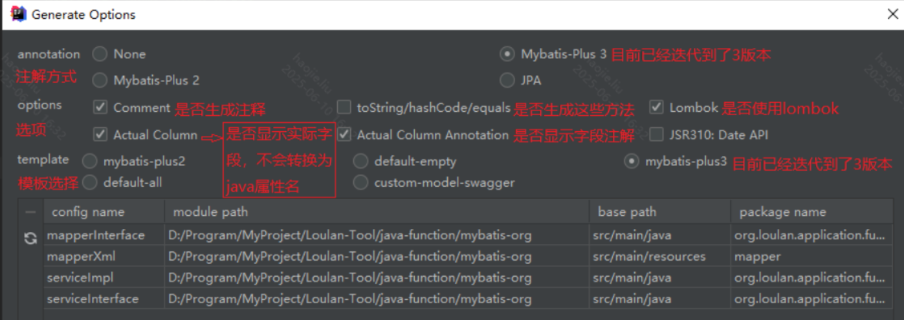

解析问题：

- 字段在数据库中是decimal(x,x)，通过这个插件生成实体类会被解析成Long类型

### **遇到的BUG**

- 在xml写复杂sql时：### Cause: java.sql.SQLSyntaxErrorException: FUNCTION zlop_system.SUM does not exist. Check the 'Function Name Parsing and Resolution' section in the Reference Manual

> 使用函数时函数名和括号之间不能有空格
> 
> 
> 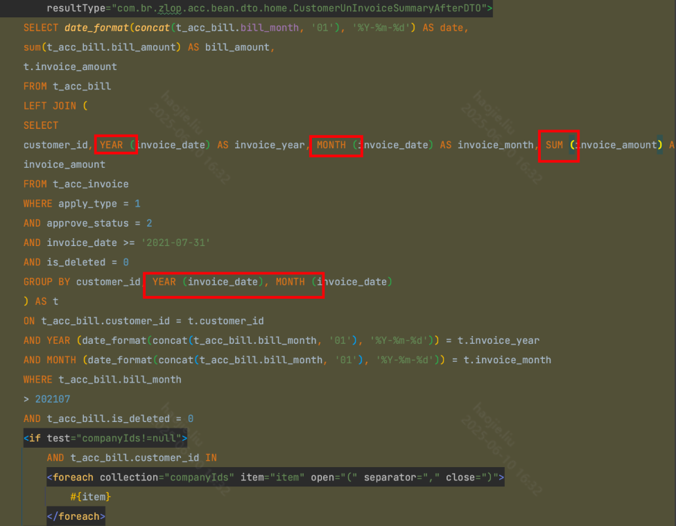
> 
- order by在书写的时候如果需要排序多个字段，只需要写一个orderBy即可

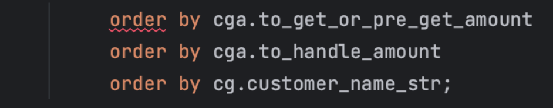

### **用法：**

### **当想使用一些聚合函数时，不想写xml这时就可以使用以下简单的方式，去手动置顶select并配合实体类中声明不为表中字段的聚合结果字段使用**

```java
private BigDecimal getSumTotalAmount(QueryWrapper<Contract> queryWrapper) {
    queryWrapper.eq("is_unlimited", YnEnum.NO.getCode());
    queryWrapper.select("sum(total_amount) as sumTotalAmount");
    Contract contract = this.contractBizService.getOne(queryWrapper);
    if (Objects.isNull(contract)) {
        return BigDecimal.ZERO;
    }
    log.info("getSumTotalAmount amount={}", contract.getSumTotalAmount());
    return contract.getSumTotalAmount();
}
```

---

### **当需要一个组合条件进行判断时，如何使用mybatisplus提供的lambda进行书写呢**

这个需求是选定开始结束时间，查询的字段也同样是开始和结束时间，把只要符合交集的时间所对应的记录查询出来，使用and或者or时，相当于在遇到下一个and或or之前的所有内容实用左右括号进行隔离  and xxxxx and   = (xxx)

图中的三个方块就代表三种类型的记录，左右顶点就代表记录的开始结束时间

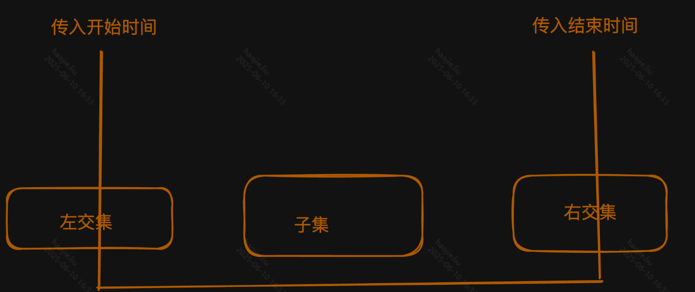

```java
if (StringUtils.isNotBlank(startTime)) {
    lambda.and(l -> {
        // startTime = JavaKit.doStandardStartTime(startTime);
        l.le(Contract::getStartDate, startTime);
        l.ge(Contract::getEndDate, startTime);
 
        //endTime = JavaKit.doStandardEndTime(endTime);
        l.or().le(Contract::getStartDate, endTime);
        l.ge(Contract::getEndDate, endTime);
 
        l.or().ge(Contract::getStartDate, startTime);
        l.le(Contract::getEndDate, endTime);
    });
}
```

---

### **当XML中需要用非实体对象接收结果集，规范来说需要自己定义一个新的map映射，如果有新字段要加，也要注意维护映射关系**

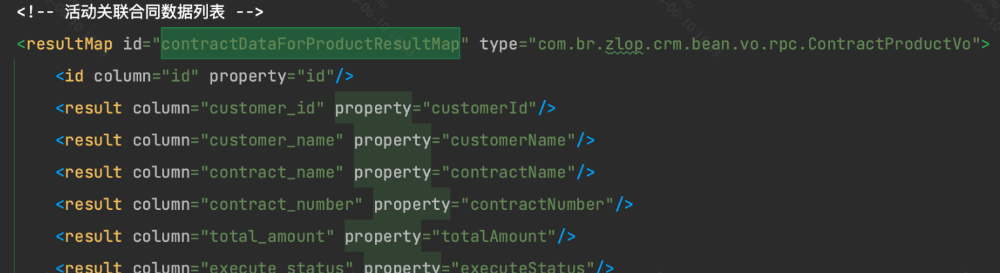

### **Mapper.xml中大于号与小于号**

大于号不需要转义符号

### **深分页**

深分页是指在数据库查询中，用户需要查看结果集的后面部分，例如第100页或更后面的数据。在大数据量的情况下，深分页可能会导致性能问题。

传统的分页查询通常使用`LIMIT`和`OFFSET`语句，例如`SELECT * FROM table LIMIT 10 OFFSET 900`来获取第91页的数据（每页10条）。但是，`OFFSET`语句会导致数据库扫描过多的行，如果`OFFSET`的值很大，那么性能会很差。

### **1、Seek Method**

为了解决深分页的性能问题，可以使用"Seek Method"（寻找方法）。这种方法不使用`OFFSET`，而是记住上一页的最后一条记录，然后查询大于这条记录的数据。例如，如果上一页的最后一条记录的ID是900，那么可以使用`SELECT * FROM table WHERE id > 900 LIMIT 10`来获取下一页的数据。这种方法的性能会比使用`OFFSET`好很多。

但是，"Seek Method"也有一些限制，例如它需要有一个唯一且有序的列（如自增的ID），并且如果数据更新频繁，那么分页结果可能会不准确。

### **2、利用索引提前大量数据操作的多表连接性能损失**

如果`t_frn_wx_verify_flows`表的数据量非常大，且符合查询条件的记录也非常多，那么第二个查询可能会比第一个查询更快，因为它减少了需要进行连接操作的记录数量。然而，如果`t_frn_wx_verify_flows`表的数据量不大，或者符合查询条件的记录不多，那么这两个查询的性能可能会相近。

```java
# 优化前
select xxx
FROM t_frn_wx_verify_flows wxv
         left join ztb_xwsc.t_wechat_send_coupon wsc
                   on wxv.voucher_id = wsc.coupon_id and wxv.batch_no = wsc.coupon_stock_id
         left join t_yh_union_order uo on wsc.BUSINESS_ORDER_NO = uo.order_no and uo.is_deleted = 0
         left join t_yh_boc_pay_order bpo on uo.order_no = bpo.business_order_no and bpo.is_deleted = 0
         left join ztb_xwsc.t_union_order_ext uoe on wsc.BUSINESS_ORDER_NO = uoe.order_no
WHERE wxv.is_deleted = 0
  and batch_no = '18368510'
  and wxv.trans_time between '2024-01-01 00:00:00' and '2024-03-31 23:59:59'
  and wxv.data_status in (1, 2)
  and wxv.id > 1154931130
order by wxv.id asc
limit 20000;
 
# 优化后
select xxx
FROM t_frn_wx_verify_flows wxv
         inner join (select id
                     FROM t_frn_wx_verify_flows
                     where is_deleted = 0
                       and batch_no = '18368510'
                       and trans_time between '2024-01-01 00:00:00' and '2024-03-31 23:59:59'
                       and data_status in (1, 2)
                       and id > 1154931130
                     order by id asc
                     limit 20000) t2 on wxv.id = t2.id
         left join ztb_xwsc.t_wechat_send_coupon wsc
                   on wxv.voucher_id = wsc.coupon_id and wxv.batch_no = wsc.coupon_stock_id
         left join t_yh_union_order uo on wsc.BUSINESS_ORDER_NO = uo.order_no and uo.is_deleted = 0
         left join t_yh_boc_pay_order bpo on uo.order_no = bpo.business_order_no and bpo.is_deleted = 0
         left join ztb_xwsc.t_union_order_ext uoe on wsc.BUSINESS_ORDER_NO = uoe.order_no;
```

### **分页排序时需要注意地方**

当使用一个不唯一的字段进行排序，当重复数据超过当页的条数，那么在翻页时前一页的数据就会出现在第二页导致分页出错

### **LambdaUpdate的注意事项**

不能并发对这个wrapper进行set，sqlSet是一个arrayList，并不是线程安全的

```java
private final List<String> sqlSet;
 
public LambdaUpdateWrapper(T entity) {
    super.setEntity(entity);
    super.initNeed();
    this.sqlSet = new ArrayList<>();
}
 
@Override
public LambdaUpdateWrapper<T> set(boolean condition, SFunction<T, ?> column, Object val) {
    if (condition) {
        sqlSet.add(String.format("%s=%s", columnToString(column), formatSql("{0}", val)));
    }
    return typedThis;
}
```

反例，下面这段就会有概率出现线程安全问题

```java
private void updateBillingStatementIfPresent(Activity activity) {
    BillingStatement billingStatement = billingStatementCrudService.getByActivityId(activity.getId());
    if (billingStatement == null) {
        return;
    }
 
    LoginUserInfo loginUserInfo = LoginUserHelper.getCurrentUser();
    LambdaUpdateWrapper<BillingStatement> updateWrapper = Wrappers.lambdaUpdate(BillingStatement.class)
            .eq(BillingStatement::getId, billingStatement.getId())
            .set(BillingStatement::getActivityName, activity.getName())
            .set(BillingStatement::getProjectId, activity.getProjectId())
            .set(BillingStatement::getProjectName, activity.getProjectName())
            .set(BillingStatement::getProjectManagerEn, activity.getProjectManagerEn())
            .set(BillingStatement::getProjectManagerCn, activity.getProjectManagerCn())
            .set(BillingStatement::getUpdateEn, loginUserInfo.getUsername())
            .set(BillingStatement::getUpdateCn, loginUserInfo.getName())
            .set(BillingStatement::getUpdateTime, new Date())
            .set(BillingStatement::getOperatorEn, loginUserInfo.getUsername())
            .set(BillingStatement::getOperatorCn, loginUserInfo.getName())
            .set(BillingStatement::getOperatorTime, new Date());
 
    CompletableFuture<List<CustomerInfo>> cf1 =
            CompletableFuture.supplyAsync(() -> {
                List<CustomerInfo> customerInfos = remoteContractService.listCustomersByIds(Arrays.asList(activity.getCustomerId()));
                return customerInfos;
            });
    cf1.whenComplete((customerInfos, t) -> {
        CustomerInfo customerInfo = CollectionUtils.isEmpty(customerInfos) ? new CustomerInfo() : customerInfos.get(0);
        CustomerUser customerUser = CollectionUtils.isEmpty(customerInfo.getCustomerUser()) ? new CustomerUser() : customerInfo.getCustomerUser().get(0);
        updateWrapper.set(BillingStatement::getCustomerId, customerInfo.getId())
                .set(BillingStatement::getCustomerNum, customerInfo.getNumber())
                .set(BillingStatement::getCustomerName, customerInfo.getName())
                .set(BillingStatement::getCustomerManagerEn, customerUser.getUsername())
                .set(BillingStatement::getCustomerManagerCn, customerUser.getName());
    });
 
    CompletableFuture<String> cf2 =
            CompletableFuture.supplyAsync(() -> getContractGroupName(activity));
    cf2.whenComplete((vo, t) -> {
        String contractGroupName = Optional.ofNullable(vo).orElse(null);
        updateWrapper.set(BillingStatement::getContractGroupName, contractGroupName);
    });
 
    CompletableFuture.allOf(cf1, cf2).join();
    billingStatementCrudService.update(updateWrapper);
}
```

### **手写SQL排序时，注意要用${}，而不是#{}**

原因：如果用了后者，在解析sql时是引用，会把你需要排序的字段和顺序前后都加上引号；但是如果用了后者，就要注意sql注入的风险，所以在方法入口处需要校验是不是用的能够排序的字段，如果不是则直接报错

```java
//#{}
order by 'amount' 'asc'
//${}
order by amount asc
```

---

### 临时表

mysql在from后面跟着的子查询一般被称为派生表，

- 如果把派生表放到了一个实际有表结构的临时表中则被称为物化派生表，派生表在内存中固然好但是如果太大导致落盘就不好了
- 那么相反子查询中的优化有谓词下推、联接重写等操作，这些操作更加偏向于合并。但查询中有窗口函数就会导致物化

```xml
<?xml version="1.0" encoding="UTF-8" ?>
<!DOCTYPE mapper
        PUBLIC "-//mybatis.org//DTD Mapper 3.0//EN"
        "http://mybatis.org/dtd/mybatis-3-mapper.dtd">
<mapper namespace="com.example.mapper.TempQueryMapper">

    <!--
      Set session-level thresholds so internal temp tables are more likely to stay in memory.
      Not strictly required for explicit ENGINE=MEMORY temp table.
    -->
    <update id="setSessionTmpVars">
        SET SESSION tmp_table_size = 67108864;
        SET SESSION max_heap_table_size = 67108864;
    </update>

    <!-- Create MEMORY temporary table in current session -->
    <update id="createMemTemp">
        CREATE TEMPORARY TABLE IF NOT EXISTS tmp_ids (
            id BIGINT PRIMARY KEY
        ) ENGINE=MEMORY;
    </update>

    <!-- Batch fill ids -->
    <insert id="fillMemTemp">
        INSERT INTO tmp_ids (id)
        VALUES
        <foreach collection="ids" item="id" separator=",">
            (#{id})
        </foreach>
    </insert>

    <!-- Join with business table (example: table `user`) -->
    <select id="selectJoinFromTemp" resultType="com.example.dto.UserDTO">
        SELECT
            u.id,
            u.name
        FROM user u
        INNER JOIN tmp_ids t ON t.id = u.id
    </select>

    <!-- Optional: drop temp table proactively -->
    <update id="dropMemTemp">
        DROP TEMPORARY TABLE IF EXISTS tmp_ids;
    </update>

</mapper>
```

优化器 Hint 影响策略：可以使用Merge或No merge来控制

```sql
-- 物化倾向（不允许合并 d）
SELECT /*+ NO MERGE(d) */
       u.id, u.name
FROM users u
JOIN (
  SELECT user_id
  FROM orders
  WHERE status = 'PAID'
  GROUP BY user_id
) AS d
ON d.user_id = u.id;

-- 合并倾向（允许合并 d）
SELECT /*+ MERGE(d) */
       u.id, u.name
FROM users u
JOIN (
  SELECT user_id
  FROM orders
  WHERE status = 'PAID'
) AS d
ON d.user_id = u.id;
```