# 关于极客时间 | MySQL实战45讲的部分总结（上）

type: Post
status: Published
date: 2022/06/23
summary: mysql选择索引无非就是优化器觉得哪一种索引的成本执行低，优化器会从该索引的扫描行数、是否会用到临时表及是否要进行排序来进行综合判断
tags: Mysql
category: 数据库

# MySQL为什么有时候会选错索引

## 1.MySQL选择索引的依据

- 概述

> mysql选择索引无非就是优化器觉得哪一种索引的成本执行低，优化器会从该索引的扫描行数、是否会用到临时表及是否要进行排序来进行综合判断
> 

### 1.1 基于主键的成本计算

- 概述

> 对于主键来说就是计算全表扫描的成本，取决于下面两个方面
> 
> - 聚簇索引占用的页面数
> - 该表中的记录数
- 该表中的记录数

> 对于这个数据的获取，mysql使用的是统计数据中的估计值，每个表都会有一些列的统计信息，本选项表示表中的记录条数。对于使用 MyISAM 存储引擎的表来说，该值是准确的，对于使用 InnoDB 存储引擎的表来说，该值是一个估计值。SHOW TABLE STATUS 展示出的 Rows 值
> 

### 1.2 对于二级索引+回表方式的成本计算

- 概述

> 对于这个方式主要取决于
> 
> - 范围区间数量
> - 需要回表的数量：这个会寻找需要回表记录中第一满足这个条件的记录和最后一个满足这个条件的记录（例如一个范围0~100，会找第一个大于0的最左边界，和找第一个满足小于100的最右边界），这两个记录如果位于不同的页面（对于二级索引列在B+树中是连续的），那么就找父结点来计算总共有几页

## 2.基于索引统计数据的成本计算

### 2.1 index dive

- 概述

> 前面说到的根据左右区别计算回表的数量（记录条数少的时候可以做到精确计算，多的时候只能估算）。 MySQL把这种通过直接访问索引对应的 B+ 树来计算某个范围区间对应的索引记录条数的方式称之为 index dive 。直接利用索引对应的B+树来计算某个范围区间对应的记录条数
> 
- 局限性

> 有零星几个单点区间的话，使用 index dive 的方式去计算这些单点区间对应的记录数也不是什么问题，可是你架不住有的孩子憋足了劲往 IN 语句里塞东西呀，我就见过有的同学写的 IN 语句里有20000个参数的🤣🤣，这就意味着 MySQL 的查询优化器为了计算这些单点区间对应的索引记录条数，要进行20000次 index dive 操作，这性能损耗可就大了，搞不好计算这些单点区间对应的索引记录条数的成本比直接全表扫描的成本都大了
> 
- 解决

> mysql提供了一个系统变量eq_range_index_dive_limit，默认值为200，如果需要做的dive量超过这个，就要使用统计数据来进行估算
> 

### 2.2 Cardinality（基数）属性

- 概述

> 该属性是存储索引统计数据中的某个属性，你可以通过 SHOW INDEX FROM 表名 的语法来查看某个表的各个索引的统计数据，这个属性值表达索引列中不重复值的数量，对于InnoDB存储引擎来说，使用SHOW INDEX语句展示出来的某个索引列的**Cardinality属性是一个估计值，并不是精确的**
> 
- 统计方式

> 采样统计的时候，InnoDB 默认会选择 N 个数据页，统计这些页面上的不同值，得到一个平均值，然后乘以这个索引的页面数，就得到了这个索引的基数。
> 

### 2.3 对于超过dive的系统变量的情况

- 概述

> 此时就要用到两个属性来估算此次的成本
> 
> - 使用 SHOW TABLE STATUS 展示出的 Rows 值，也就是一个表中有多少条记录。
> - 使用 SHOW INDEX 语句展示出的 Cardinality 属性。

### 2.3.1 MySQL选错索引后的优化

- 概述

> 当上面两个属性统计出来及其不准确，mysql就会放弃使用当前索引，转为优化器自身认为的最优，当然宏观上我们看来并不是最优
> 
1. 对于统计信息非常不准确（例如并发另外一个线程删除后又重新插入这种类似的就会导致统计信息的错误，因为删除只是把delete mark改一下，并没有真正的删除）我们可以使用analyze table来矫正，实在不行在用下面的
2. 使用force index指定索引：在用在生产环境上灵活性太差
3. 我们可以考虑修改语句，引导 MySQL 使用我们期望的索引（例如limit语句的限制）
4. 在有些场景下，我们可以新建一个更合适的索引，来提供给优化器做选择，或删掉误用的索引

# 怎么给字符串字段加索引

- 概述

> 当今越来越多的用户名可以使用邮箱来创建，那么给邮箱等比较复杂的字符串创建索引也成了刚需，那么如何给字符串加索引能提高效率呢
> 

## 1.加索引的两种思路

### 1.1 不指定长度的索引

- 概述

> 当你使用下列语句创建时就会将字符串全部包含，当进行查询时步骤如下，也就是只回表了一次
> 
> - 从 index1 索引树找到满足索引值是’zhangssxyz@xxx.com’的这条记录，取得 ID2 的值；
> - 到主键上查到主键值是 ID2 的行，判断 email 的值是正确的，将这行记录加入结果集；
> - 取 index1 索引树上刚刚查到的位置的下一条记录，发现已经不满足 email='zhangssxyz@xxx.com’的条件了，循环结束。

```sql
alter table SUser add index index1(email);
# 查询
select id,name,email from SUser where email='zhangssxyz@xxx.com';

```

### 1.2 指定长度的前缀索引

- 概述

> 当你使用下列指定字符串长度建立索引时，查询过程如下，可以看到回了四次表
> 
> - 从 index2 索引树找到满足索引值是’zhangs’的记录，找到的第一个是 ID1；
> - 到主键上查到主键值是 ID1 的行，判断出 email 的值不是’zhangssxyz@xxx.com’，这行记录丢弃；
> - 取 index2 上刚刚查到的位置的下一条记录，发现仍然是’zhangs’，取出 ID2，再到 ID 索引上取整行然后判断，这次值对了，将这行记录加入结果集；
> - 重复上一步，直到在 idxe2 上取到的值不是’zhangs’时，循环结束。

```sql
# 我们指定了前六个字节
alter table SUser add index index1(email(6));
# 查询
select id,name,email from SUser where email='zhangssxyz@xxx.com';

```

### 1.3 存在的问题

- 两种方式对于空间的占用是不一样的

> 索引选取的越长，占用的磁盘空间就越大，相同的数据页能放下的索引值就越少，搜索的效率也就会越低。
> 
- 我们需要合理的规定前缀长度

> 也就是说使用前缀索引，定义好长度，就可以做到既节省空间，又不用额外增加太多的查询成本。
> 
- 规定长度对覆盖索引的影响

> 当查询的列都在二级索引中我们不需要回表查询，但由于你规定了长度，这时还是需要回表确认的，就算你定义的长度正好是邮箱的全部长度也是要回表进行确认的
> 
- 对于区分度不够好的字符串怎么办（例如身份证）

> 采用倒序存储喽：不会额外占用空间，调用反转函数比hash函数资源消耗小一点，但是查询性能可能会相对来说不稳定，因为还是前缀使用hash字段：添加一个额外字段来存储散列值，不过有冲突的可能性，所以查询出来需要对身份证进行等值匹配，缺点有额外占用空间
> 

# 为什么表数据删掉一半，表文件大小不变？

## 1.空洞

- 概述

> 当删除表记录、表、数据库时，这些数据占用的空间只是被标记是删除的，但是实际上并没有删除，等待下一次符合条件的数据插入后来复用，此时这些空间就被称为空洞
> 
- 插入数据也会造成空洞

> 比如，如果按照主键递增的方式插入的，注意为啥不能将550留在pageA呢，此时就要说明页分裂是非常消耗资源的，同时又要满足主键递增排序，所以就会造成这样的结果
> 
> 
> 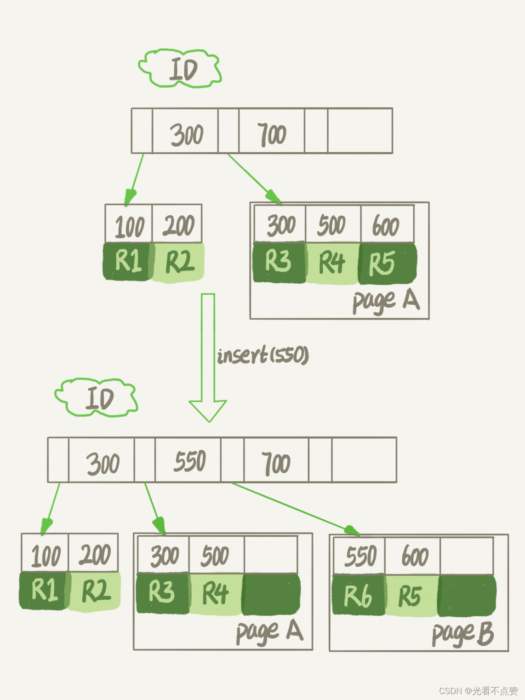
> 

### 1.1 如何处理空洞

- 重建表

> 此时我们要把表A进行重建，第一步建立一个相同表结构的表B，然后进行顺序插入。由于表 B 是新建的表，所以表 A 主键索引上的空洞，在表 B 中就都不存在了。显然地，表 B 的主键索引更紧凑，数据页的利用率也更高。如果我们把表 B 作为临时表，数据从表 A 导入表 B 的操作完成后，用表 B 替换 A，从效果上看，就起到了收缩表 A 空间的作用。
> 
- 如何重建表

> 使用如下的语句mysql会为你自动完成转存数据、交换表名、删除旧表的操作。但是这个操作不支持并发，此时如果对原表A进行修改就会造成数据丢失。因此，在整个 DDL 过程中，表 A 中不能有更新。也就是说，这个DDL 不是 Online的。也就是说这个语句是强制转换，会在sever层创建一个临时表
> 

```sql
alter table A engine=InnoDB

```

- Online DDL

> MySQL 5.6 版本开始引入的 Online DDL，对这个操作流程做了优化。这就是为了解决不能修改原表的问题，与前面的有所不同的是由于日志文件记录和重放操作这个功能的存在，这个方案在重建表的过程中，允许对表 A 做增删改操作。这也就是 Online DDL 名字的来源。
> 

> 这里说一下注意事项，在进行Online时，能进行修改那肯定是进行了加锁操作，这个MDL写锁获取后会在真正开始拷贝数据之前退化成读锁，并且这个读锁不会阻塞插入、更新等DML语句，为什么不直接解锁，因为为了保护自己只允许当前线程进行，其他线程无法同时做DDL
> 

### 1.2 Online和inplace

- inplace

> inplace的意思是在移动数据时，是原地操作，意思是对于server没有拷贝到临时表的操作。而是根据表 A 重建出来的数据是放在“tmp_file”里的，这个临时文件是 InnoDB 在内部创建出来的。整个 DDL 过程都在 InnoDB 内部完成。这跟不是Online的DDL的区别
> 
- online和inplace的关系

> DDL 过程如果是 Online 的，就一定是 inplace 的；反过来未必，也就是说 inplace 的 DDL，有可能不是 Online 的。截止到 MySQL 8.0，添加全文索引（FULLTEXT index）和空间索引 (SPATIAL index) 就属于这种情况。
> 

### 1.3 什么情况下会造成重建完表还变大的情况

- 情况一

> 在 DDL 期间，如果刚好有外部的DML在执行，这期间可能会引入一些新的空洞。
> 
- 情况二

> 在重建表的时候，InnoDB 不会把整张表占满，每个页留了 1/16 给后续的更新用。也就是说，其实重建表之后不是“最”紧凑的。假如是这么一个过程：将表 t 重建一次；插入一部分数据，但是插入的这些数据，用掉了一部分的预留空间；这种情况下，再重建一次表 t，就可能会出现问题中的现象。
> 

# count(*)这么慢，我该怎么办？

## 1.count(*) 的实现方式

- 概述

> 对于不同的存储引擎实现方式是不同的
> 
> - `MyISAM` 引擎把一个表的总行数存在了磁盘上，因此执行 `count(*)` 的时候会直接返回这个数，效率很高；**如果加了 where 条件的话，MyISAM 表也是不能返回得这么快的。**
> - 而 `InnoDB` 引擎就麻烦了，它执行 `count(*)` 的时候，需要把数据一行一行地从引擎里面读出来，然后累积计数。

## 2.为什么InnoDB也不把总行数存起来呢

- 概述

> 这是因为即使是在同一个时刻的多个查询，由于多版本并发控制（MVCC）的原因，InnoDB 表“应该返回多少行”也是不确定的。
> 

## 3.InnoDB对count(*)的优化

- 针对索引的优化

> 对于InnoDB的表来说，聚簇索引的叶子结点存储的是一条记录的全部数据，而对于普通的索引来说叶子结点存储的是主键值等，相对于聚簇索引的体量小很多，所以在遍历记录数都会选择普通索引
> 
- show table status

> 还记命令吗，这个会把表的通用信息给展示出来，其中会有一个属性TABLE_ROWS显示这个表当前有多少行，但是你别忘了这个值是估算出来的。实际上，TABLE_ROWS 就是从这个采样估算得来的，因此它也很不准。有多不准呢，官方文档说误差可能达到 40% 到 50%。所以，show table status 命令显示的行数也不能直接使用。
> 

## 4.所以怎么优化才能提高效率呢

- 概述

> 这时就只能通过我们自己计数了，下面介绍几种方法
> 

### 4.1 用缓存系统保存计数

- 概述

> 对于更新很频繁的库来说，你可能会第一时间想到，用缓存系统来支持。你可以用一个 Redis 服务来保存这个表的总行数。这个表每被插入一行 Redis 计数就加 1，每被删除一行 Redis 计数就减 1。这种方式下，读和更新操作都很快
> 
- 缺点

> 缓存缓存，那么肯定有几率会造成数据的丢失。即使你通过方法解决了丢失的问题，但Redis就算能正常工作这个值还是逻辑上不精确的。例如下面两个时序图
> 
> 
> 
> 
> 
> 

### 4.2 在数据库保存计数

- 概述

> 根据上面的分析，用缓存系统保存计数有丢失数据和计数不精确的问题。那么我们把这个计数直接放到数据库里单独的一张计数表 C 中，由于数据库的本身就支持崩溃恢复的功能，所以不用担心数据丢失的问题，但是对于计数不精准的问题，我们怎么解决
> 
- 通过事务

> 我们前面说过就是因为
> 
> 
> ```
> MVCC
> ```
> 
> ```
> count(*)
> ```
> 
> **会话B读取的计数值和记录都是会话A开启之前的旧数据所以互相不影响**
> 
> 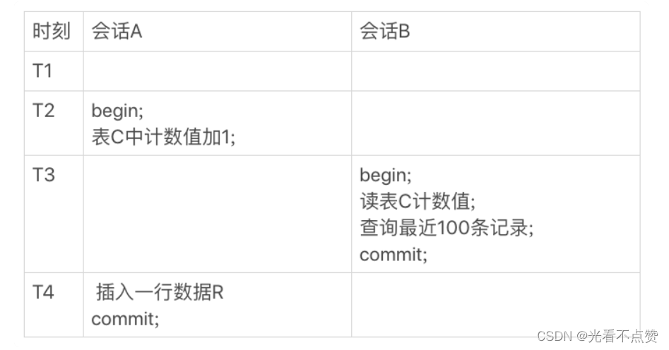
> 

## 5.基于InnoDB不同的count用法效率

- count是什么

> 对于不同的用法，我们还需要先搞清楚count到底是什么。count() 是一个聚合函数，对于返回的结果集，一行行地判断，如果 count 函数的参数不是 NULL，累计值就加 1，否则不加。最后返回累计值。
> 

> 所以，count(*)、count(主键 id) 和 count(1) 都表示返回满足条件的结果集的总行数；而 count(字段），则表示返回满足条件的数据行里面，参数“字段”不为 NULL 的总个数。
> 
- 分析不同性能差别的原则

> server 层要什么就给什么；InnoDB 只给必要的值；现在的优化器只优化了 count(*) 的语义为“取行数”，其他“显而易见”的优化并没有做。
> 
- count(主键)

> InnoDB 引擎会遍历整张表，把每一行的 id 值都取出来，返回给 server 层。server 层拿到 id 后，判断是不可能为空的，就按行累加。
> 
- count(1)

> InnoDB 引擎遍历整张表，但不取值。server 层对于返回的每一行，放一个数字“1”进去，判断是不可能为空的，按行累加。
> 
- count(主键)和count(1)

> 单看这两个用法的差别的话，你能对比出来，count(1) 执行得要比 count(主键 id) 快。因为从引擎返回 id 会涉及到解析数据行，以及拷贝字段值的操作。
> 
- count(字段)

> 对于count字段分为两种情况，履行server需要什么就返回什么
> 
> - 如果这个“字段”是定义为`not null`的话，一行行地从记录里面读出这个字段，判断不能为 `null`，按行累加；
> - 如果这个“字段”定义允许为 `null`，那么执行的时候，判断到有可能是 `null`，还要把值取出来再判断一下，不是 `null` 才累加。
- count(*)

> count(*) 是例外，并不会把全部字段取出来，而是专门做了优化，不取值。count(*) 肯定不是 null，按行累加。也许你会有疑问为啥count(主键)达不到跟count(*)一样的效率，优化器难道就不能将主键自动优化成*因为主键也是非空的啊，但是别忘了如果优化那就需要优化的门类太多了，还不如直接用count(*)来的实惠
> 

# order by 是怎么工作的？

```sql
CREATE TABLE `t` (
  `id` int(11) NOT NULL,
  `city` varchar(16) NOT NULL,
  `name` varchar(16) NOT NULL,
  `age` int(11) NOT NULL,
  `addr` varchar(128) DEFAULT NULL,
  PRIMARY KEY (`id`),
  KEY `city` (`city`)
) ENGINE=InnoDB;

```

## 使用order by产生排序的情况

- 概述

> 使用explain查看执行计划，Extra 这个字段中的“Using filesort”表示的就是需要排序，MySQL 会给每个线程分配一块内存用于排序，称为 sort_buffer。
> 

### 1.全字段排序

- 概述

> 当我们使用如下的查询，当一行的记录足够长，但还又没太长时，mysql会选择全字段排序。这个排序分为两类：一种是在内存中完成，另一种则需要借助排序文件在磁盘中完成
> 

```sql
select city,name,age from t where city='杭州' order by name limit 1000  ;

```

### 1.1 完全在内存中完成

- 取决因素

> “按 name 排序”这个动作，可能在内存中完成，也可能需要使用外部排序，这取决于排序所需的内存和参数 sort_buffer_size。当要排序的数据量小于这个值，就会完全在内存中进行排序，你可以通过查看OPTIMIZER_TRACE 的结果来确认的，你可以从number_of_tmp_files中看到是否使用了临时文件。如果这个值等于0时就证明在内存中完成了排序
> 
- 流程图
    
    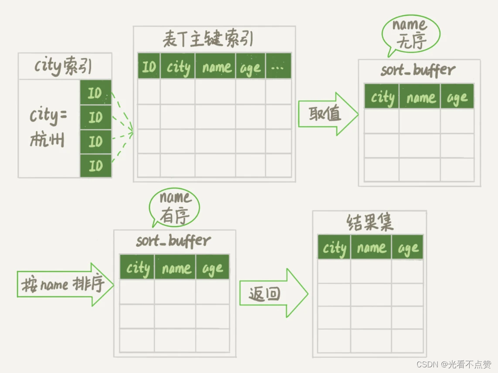
    

### 1.2 借助磁盘进行排序

- 概述

> 当排序的数据大于 sort_buffer_size这个值时，就会发现排序借助了磁盘的排序文件，同样你可以通过查看OPTIMIZER_TRACE 的结果来确认的，你可以从number_of_tmp_files中看到是否使用了临时文件。如果这个值大于0时就证明在内存中完成了排序。sort_buffer_size 越小，需要分成的份数越多，number_of_tmp_files 的值就越大。
> 

> 可以看到为12，也就是说mysql将待排序的问分成12份，并适应归并排序最后合成一份
> 
> 
> 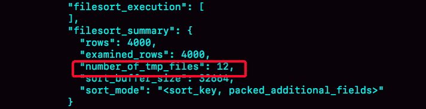
> 
- 其他参数解释

> 我们的示例表中有 4000 条满足 city='杭州’的记录，所以你可以看到 examined_rows=4000，表示参与排序的行数是 4000 行。sort_mode 里面的 packed_additional_fields 的意思是，排序过程对字符串做了“紧凑”处理。即使 name 字段的定义是 varchar(16)，在排序过程中还是要按照实际长度来分配空间的。
> 

### 2.rowid排序

- 概述

> 上面的排序只对原表的数据读了一遍，剩下的操作都是在sort_buffer和临时文件中执行的。但这个算法有一个问题，就是如果查询要返回的字段很多的话，那么 sort_buffer 里面要放的字段数太多，这样内存里能够同时放下的行数很少，要分成很多个临时文件，排序的性能会很差。也就是说一行数据量太多，并且还有很多行，就要适用rowid来排序
> 
- 触发阈值

> max_length_for_sort_data，是 MySQL 中专门控制用于排序的行数据的长度的一个参数。它的意思是，如果单行的长度超过这个值，MySQL 就认为单行太大，要换一个算法。
> 
- 执行查询语句

> 此时与全排序不同，加入内存参与排序的字段只会是name和id，下面看一下执行流程，可以看到多了一个回表操作，里面可能需要回表很多次
> 

```sql
select city,name,age from t where city='杭州' order by name limit 1000  ;

```

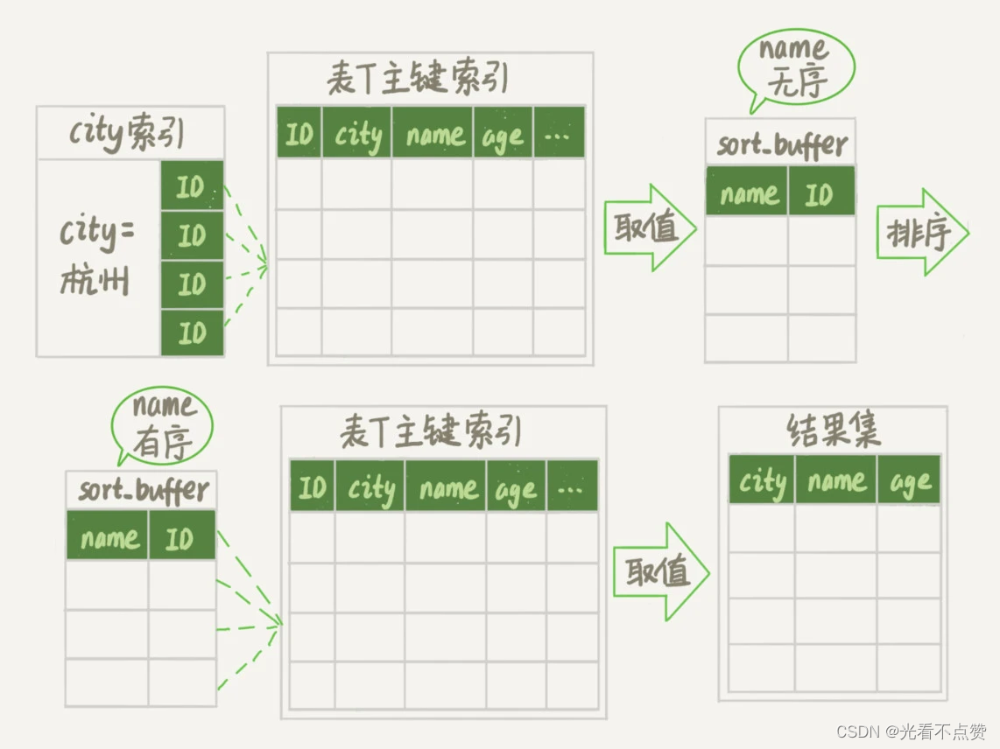

- 结果分析

> 现在，我们就来看看结果有什么不同。首先，图中的 examined_rows 的值还是 4000，表示用于排序的数据是 4000 行。但是 select @b-@a 这个语句的值变成 5000 了。因为这时候除了排序过程外，在排序完成后，还要根据 id 去原表取值。由于语句是 limit 1000，因此会多读 1000 行。
> 

> sort_mode 变成了 ，表示参与排序的只有 name 和 id 这两个字段。number_of_tmp_files 变成 10 了，是因为这时候参与排序的行数虽然仍然是 4000 行，但是每一行都变小了，因此需要排序的总数据量就变小了，需要的临时文件也相应地变少了。
> 

### 3.两种排序的对比

- 概述

> 如果 MySQL 实在是担心排序内存太小，会影响排序效率，才会采用 rowid 排序算法，这样排序过程中一次可以排序更多行，但是需要再回到原表去取数据。如果 MySQL 认为内存足够大，会优先选择全字段排序，把需要的字段都放到 sort_buffer 中，这样排序后就会直接从内存里面返回查询结果了，不用再回到原表去取数据。
> 

> 对于 InnoDB 表来说，rowid 排序会要求回表多造成磁盘读，因此不会被优先选择。
> 

> 可以看到mysql的策略就是能在内存中完成就在内存中完成
> 

## 2.使用order by但没有进行排序的情况

- 概述

> 当你合理进行索引的设置，比如你建立了(city,name)的联合索引，那么直接查到范围，回表查别的字段就好了
> 
- 流程图

> 可以看到流程省略了很多
> 
> 
> 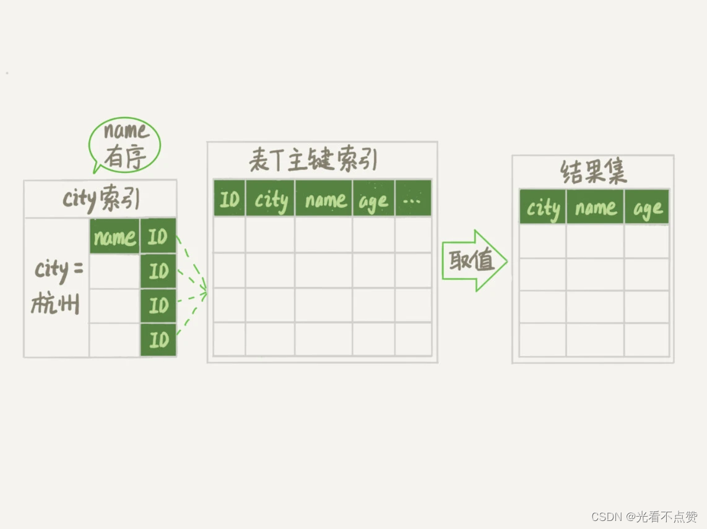
> 
- 查看执行计划

> 从图中可以看到，Extra 字段中没有 Using filesort 了，也就是不需要排序了。而且由于 (city,name) 这个联合索引本身有序，所以这个查询也不用把 4000 行全都读一遍，只要找到满足条件的前1000条记录就可以退出了。也就是说，在我们这个例子里，只需要扫描 1000 次。
> 
> 
> 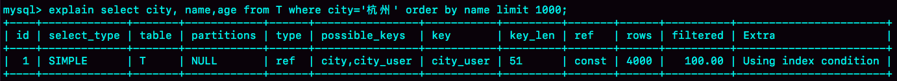
> 

# 如何正确的使用随机排序

- 可以通过查看慢查询语句，来看扫描的行数之类的
[慢查询日志的开启方式](https://www.yisu.com/zixun/551775.html)

## 1.order by rand()

- 概述

> 当有类似根据用户的学过的单词库今日随机推荐几个单词时，随着单词库越来越大效率会越来越低，一般这种的查询采用的是order by rand()，这个语句需要 Using temporary 和 Using filesort（Using temporary，表示的是需要使用临时表；Using filesort，表示的是需要执行排序操作。），查询的执行代价往往是比较大的。所以，在设计的时候你要尽量避开这种写法。
> 

```sql
mysql> select word from words order by rand() limit 3;

```

- 过程分析

> 默认有10000条数据，每行数据仅有id和word两个字段。首先mysql会在全字段排列或者rowid排列中挑选一个，对于内存表，回表过程只是简单地根据数据行的位置，直接访问内存得到数据，根本不会导致多访问磁盘。优化器没有了这一层顾虑，那么它会优先考虑的，就是用于排序的行越小越好了，所以，MySQL 这时就会选择 rowid 排序。
> 

> 创建一个临时表。这个临时表使用的是memory引擎，表里有两个字段，第一个字段是 double 类型，为了后面描述方便，记为字段 R，第二个字段是varchar(64)类型，记为字段 W。并且，这个表没有建索引。从 words 表中，按主键顺序取出所有的word值。对于每一个 word 值，调用 rand() 函数生成一个大于 0 小于 1 的随机小数，并把这个随机小数和word分别存入临时表的R 和 W字段中，到此，扫描行数是 10000。现在临时表有 10000 行数据了，接下来你要在这个没有索引的内存临时表上，按照字段R排序。初始化 sort_buffer。sort_buffer 中有两个字段，一个是double类型，另一个是整型。从内存临时表中一行一行地取出R值和位置信息（位置信息就是rowid，因为是没有索引的表，行数据中会自动生成这个隐藏列），分别存入 sort_buffer 中的两个字段里。这个过程要对内存临时表做全表扫描，此时扫描行数增加 10000，变成了 20000。在 sort_buffer 中根据 R 的值进行排序。注意，这个过程没有涉及到表操作，所以不会增加扫描行数。排序完成后，取出前三个结果的位置信息，依次到内存临时表中取出word值，返回给客户端。这个过程中，访问了表的三行数据，总扫描行数变成了 20003。
> 
- 注意

> 在mysql5开头写个扫描行数是20003，但在mysql8.0会变成10003，也就是说8版本对排序过程进行了优化
> 
- 总结

> order by rand() 使用了内存临时表，内存临时表排序的时候使用了 rowid 排序方法。
> 

## 2.磁盘临时表

- 概述

> 上面介绍过orderby的工作原理提到过这么一个参数tmp_table_size（默认为16M），让内存临时表超过这个值会转变为磁盘临时表来进行业务处理，我们可以通过执行完语句查看optimizer trace，具体的执行优化都在里面
> 
- 优先队列排序（堆排序）

> 在上面那个场景如果内存临时表超出也不会用到磁盘临时表，这时因为mysql5.6引入了优先队列排序，我们可以设置堆的大小使之全部数据对比完里面的数据就是排好序的规定数量的升序或降序（看你用大根堆还是小根堆）
> 
- 归并和堆排序

> mysql在rowid中默认采用的是归并排序，我们的需求是在10000个中随机取出几个，使用归并排序后前几个取出，但是后面的9000多个都是排好序但用不到的，非常浪费资源。但如果使用堆排序规定容量对比完全部数据后是没有多余数据的
> 

## 3.随机排序算法

- 概述

> 上面介绍的sql写法无论怎么优化执行都是十分缓慢的，那么我们自己可以在sql中自己规划随机排序算法（或在业务层面规定，而不再查询层）
> 
- 例子

> 由于 limit 后面的参数不能直接跟变量，所以我在上面的代码中使用了 prepare+execute 的方法。你也可以把拼接 SQL 语句的方法写在应用程序中，会更简单些。MySQL 处理 limit Y,1 的做法就是按顺序一个一个地读出来，丢掉前Y个，然后把下一个记录作为返回结果，因此这一步需要扫描Y+1行。再加上，第一步扫描的 C 行，总共需要扫描C+Y+1行。这个执行代价如果进行计算的话其实在某些情况下会跟order by rand差不过，但是为什么效率会高？是因为我们查询数据使用到了索引，比使用rowid+临时表的要快上不少
> 

```sql
mysql> select count(*) into @C from t;
set @Y = floor(@C * rand());
set @sql = concat("select * from t limit ", @Y, ",1");
prepare stmt from @sql;
execute stmt;
DEALLOCATE prepare stmt;

```

# 为什么sql逻辑一样但执行效率却不同

## 1.前言

> 我们知道当对条件进行函数修饰时，无论如何都使用不到索引，即排序列使用了复杂的表达式要想使用索引进行排序操作，必须保证索引列是以单独列的形式出现，而不是修饰过的形式，比方说这样：使用了UPPER函数修饰过的列就不是单独的列啦，这样就无法使用索引进行排序啦。
> 

```sql
SELECT * FROM person_info ORDER BY UPPER(name) LIMIT 10;

```

> 其底层原理就是索引是B+数的结构，那么如果你使用函数传入一个值，会破坏树每一层的有序性，例如下面第一条语句，会消耗很长的时间去t_modified这个索引进行全局遍历，因为mysql根据7一下子就傻了；而不是根据这个索引建立的有序性一下就能找到
> 

```sql
mysql> select count(*) from tradelog where month(t_modified)=7;
mysql> select count(*) from tradelog where t_modified='2018-7-1’

```

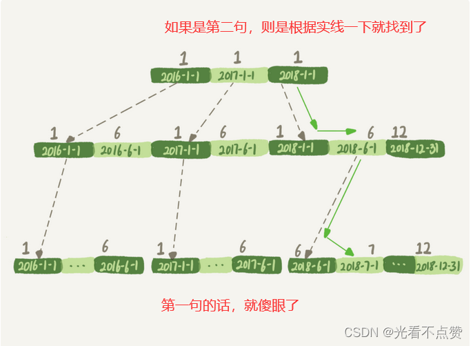

## 2.隐式类型转换

- 概述

> 如下sql语句，在进行查询时你会发现进行了全表扫描，明明有索引。这时因为在mysql中字符串跟数字进行比较会将字符串转换成数字来进行比较。看到下面第二句用到了函数，同理是使用不了索引的
> 

```sql
# 注意我们tradeid的字段类型为varchar
mysql> select * from tradelog where tradeid=110717;

# 根据上面，也就是说sql语句会被优化成这样
mysql> select * from tradelog where  CAST(tradid AS signed int) = 110717;

```

- 思考

> 如果反过来，id字段时整型，但是查询的时候条件使用字符串会使用到索引吗？
> 

```sql
select * from tradelog where id="83126";

```

> 此时根据上面类型转换，字符串会转化成整型，但是由于这个字符串只有一个，只用转换这一次。不会像上面查询时，会对字段中符合最左条件的都进行转换从而放弃使用索引。对于id的转换，是从左到右进行转换，遇到不能转换的字符会默认将其本身和后面的全部转换成0，如果第一个字符就是0即全部成0
> 

## 3.隐式字符编码转换

- 概述

> 对于两个表又是会进行联合查询什么连接之类的，这时如果两个表的字符编码不一样同样是用不了索引的，同理sql语句隐式调用了函数进行字符串编码的转换，注意这里表达的意思是要具体看优化器认为最快，最不消耗资源的，如下面第一条sql会对每个detail表中的值都进行转换，那么自然而然就用不到log中的索引了，而第二个查询虽然也有函数转换但用到了索引，是因为只对条件右边的驱动表做函数还是会用到索引的
> 

```sql
# 是从 tradelog 表中取 tradeid 字段，再去 trade_detail 表里查询匹配字段。因此，
# 我们把 tradelog 称为驱动表，把 trade_detail 称为被驱动表，把 tradeid 称为关联字段。
mysql> select d.* from tradelog l, trade_detail d where
d.tradeid=l.tradeid and l.id=2; /*语句Q1*/

select * from trade_detail  where
CONVERT(traideid USING utf8mb4)=$L2.tradeid.value;

# 这个语句里 trade_detail 表成了驱动表，但是 explain 结果的第二行显示，
# 这次的查询操作用上了被驱动表 tradelog 里的索引 (tradeid)，扫描行数是 1。
mysql>select l.operator from tradelog l , trade_detail d where
d.tradeid=l.tradeid and d.id=4;

select operator from tradelog  where
traideid =CONVERT($R4.tradeid.value USING utf8mb4);

```

- 总结

> 字符集不同只是条件之一，连接过程中要求在被驱动表的索引字段上加函数操作，是直接导致对被驱动表做全表扫描的原因。
> 
- 优化方向

> 那么就显而易见的有两种：
> 
> 1. 就是建表就使用统一字符编码，也不用考虑什么驱动表和被驱动表了
> 2. 就是避免被驱动表上使用函数操作

# 查一行也会很慢？

## 1.查询长时间不返回

## 等MDL锁

- 概述

> 当形如这个的时候，我们就需要查询拿锁的这个线程时那个，然后kill掉就行（注意show processlist可看不出是哪个线程持有锁）
> 
> 
> 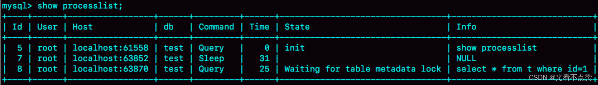
> 
- 如何查看那个线程持有锁

> 有了
> 
> 
> ```
> performance_schema 和 sys
> ```
> 
> ```
> MySQL
> ```
> 
> ```
> performance_schema=on
> ```
> 
> ```
> off
> ```
> 
> ```
> 10%
> ```
> 
> ```
> sys.schema_table_lock_waits
> ```
> 
> ```
> process id
> ```
> 
> ```
> kill
> ```
> 
> 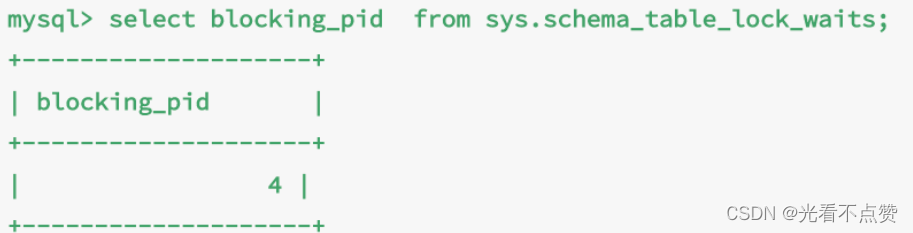
> 

## 等flush

- 概述

> 在前面介绍缓冲池的时候，会有脏页集中刷新到磁盘的情况，此时用户线程将会被阻塞直到刷新完成，但是这种情况会很快，如果查询语句很长时间没有返回可能的原因是flush这个语句也被堵住了
> 
> 
> 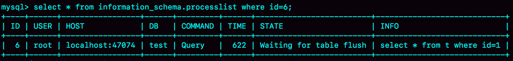
> 
- MySQL 里面对表做 flush 操作的用法

> flush tables t with read lock; 指定表的刷新flush tables with read lock;	不指定，即刷新全部mysql的表
> 

## 等行锁

- 概述

> 例如以下场景B就会被阻塞，
> 
> 
> **也许你会想使用MVCC中readView直接读取以前版本的数据就可以了啊，但是注意看语句，B中sql语句显式的说明自己需要共享锁并且B没有显式开启事务！！！，但此时的这个锁被A拿了（A拿了读写锁），所以就要进行等待**
> 
> 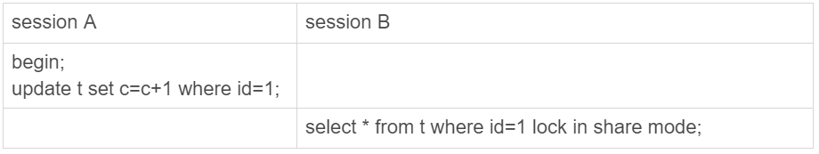
> 
- 解决

> 查出是谁占着这个写锁。如果你用的是 MySQL 5.7 版本，可以通过 sys.innodb_lock_waits 表查到。查询方法是：可以看到PId为4
> 

```sql
mysql> select * from sys.innodb_lock_waits where locked_table='`test`.`t`'\\G

```

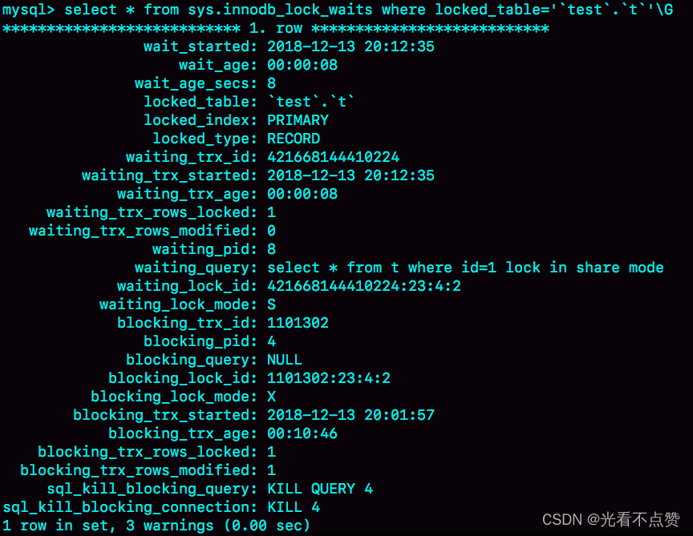

> 可以看到，这个信息很全，4 号线程是造成堵塞的罪魁祸首。而干掉这个罪魁祸首的方式，就是 KILL QUERY 4 或 KILL 4。不过，这里不应该显示“KILL QUERY 4”。这个命令表示停止 4 号线程当前正在执行的语句，而这个方法其实是没有用的。因为占有行锁的是 update 语句，这个语句已经是之前执行完成了的，现在执行 KILL QUERY，无法让这个事务去掉 id=1 上的行锁。实际上，KILL 4 才有效，也就是说直接断开这个连接。这里隐含的一个逻辑就是，连接被断开的时候，会自动回滚这个连接里面正在执行的线程，也就释放了 id=1 上的行锁。
> 

## 2.查询慢

- 场景描述

> 在一张id（主键）和age两个字段的表中，按顺序（从1,1开始）连续插入10000条记录后，开启两个线程会进行如下操作：
> 
> 
> 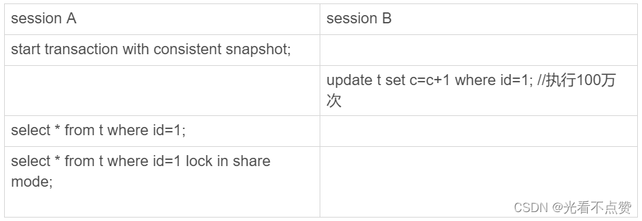
> 
> 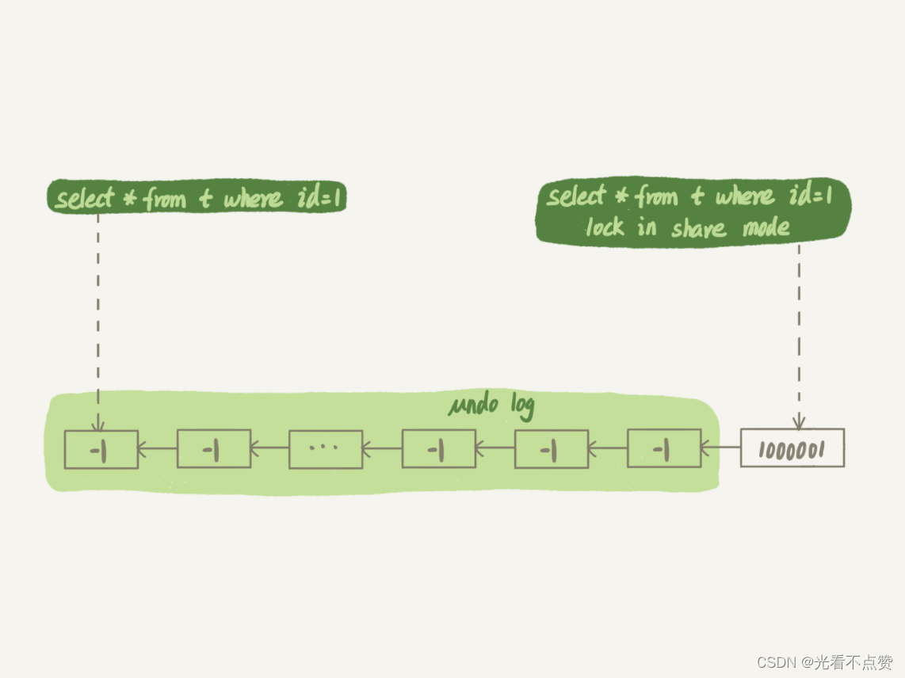
> 
- 查询结果
    
    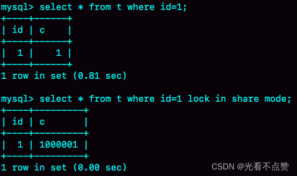
    
- 结果分析

> 没有加锁的查询使用的一致性读，也就是配合MVCC和readView来读取，由于事务未提交读取到最早的数据。加速的查询使用的当前读，因此会读到1000001这个结果
> 

# 幻读问题究极解决方法

- 幻读

> 我们说幻读问题的产生是因为当前事务读取了一个范围的记录，然后另外的事务向该范围内插入了新记录，当前事务再次读取该范围的记录时发现了新插入的新记录，我们把新插入的那些记录称之为幻影记录。
> 

## 1.读操作利用MVCC，写操作加锁

- 概述

> 此操作什么都好就是不能会当前读（也就是加了排他锁的读操作）进行限制，只会对一致性读（也就是没有任何修饰的查询）进行限制
> 

## 2.读写操作都进行加锁

- 概述

> 也就是无论你什么操作都进行加锁，这样能解决语义上的问题和数据一致性的问题
> 

### 2.1 语义上的问题

- 例子

```sql
CREATE TABLE `t` (
  `id` int(11) NOT NULL,
  `c` int(11) DEFAULT NULL,
  `d` int(11) DEFAULT NULL,
  PRIMARY KEY (`id`),
  KEY `c` (`c`)
) ENGINE=InnoDB;

insert into t values(0,0,0),(5,5,5),
(10,10,10),(15,15,15),(20,20,20),(25,25,25);

```

- 概述

> 根据下图的执行表，当在Q1语句进行加锁后，在T2时刻还是会对id为0的值进行修改成功，原因是在 T1 时刻，session A 还只是给 id=5 这一行加了行锁， 并没有给 id=0 这行加上锁。虽然是后面修改的d，但是整体上还是破坏了加锁的语义
> 
> 
> 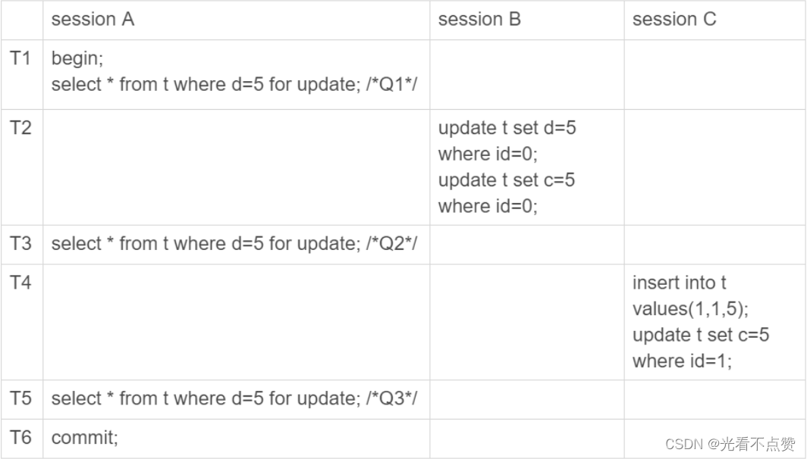
> 

### 2.2 数据一致性的问题

- 下图时序上面发生的数据改变

> 经过 T1 时刻，id=5 这一行变成 (5,5,100)，当然这个结果最终是在 T6 时刻正式提交的 ;经过 T2 时刻，id=0 这一行变成 (0,5,5);经过 T4 时刻，表里面多了一行 (1,5,5);
> 
- binlog中发生的改变，执行完的结果变为： `(0,5,100)、(1,5,100) 和 (5,5,100)`。跟我们上面期望的完全不一样，也就是说，`id=0 和 id=1` 这两行，发生了数据不一致。这个问题很严重，是不行的。**也许你有疑惑为什么sessionA的更新在binlog中最后才执行，这是因为binlong日志是在commit提交时进行记录的**

> T2 时刻，session B 事务提交，写入了两条语句；T4 时刻，session C 事务提交，写入了两条语句；T6 时刻，session A 事务提交，写入了 update t set d=100 where d=5 这条语句。
> 

```sql
update t set d=5 where id=0; /*(0,0,5)*/
update t set c=5 where id=0; /*(0,5,5)*/

insert into t values(1,1,5); /*(1,1,5)*/
update t set c=5 where id=1; /*(1,5,5)*/

update t set d=100 where d=5;/*所有d=5的行，d改成100*/

```

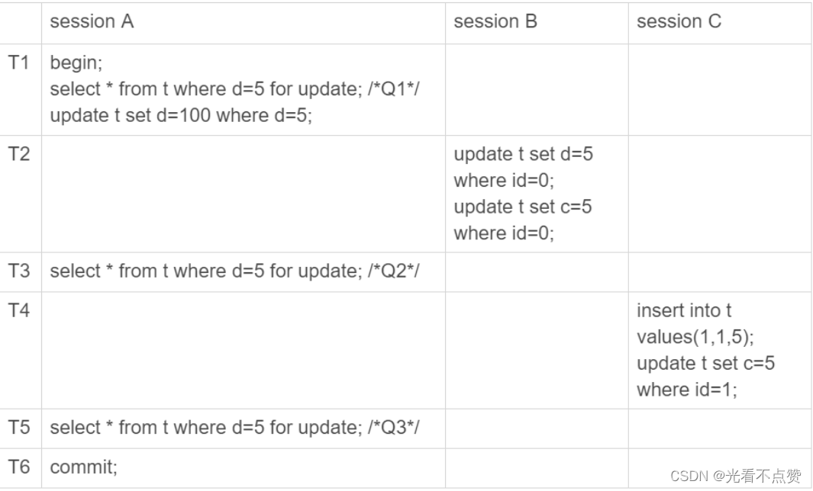

- 原因分析及解决

> 这时因为在执行select * from t where d=5 for update 这句sql时是给d=5这一行加上了锁，也就是id=5这一行加了锁。如果我对扫描到的每一行都加锁，那么到T2时刻SessionB和C的操作会被阻塞到整个SessionA完全提交，而不是改变了但未提交导致实际生效的时间是最晚的
> 

## 3.间隙锁（Gap lock）

- 详情

> 转去看自己总结的！真的离谱 学了就忘
> 
- 前情回顾

> 对于上面的第二种方式你如果仔细分析查看，如果对每一行扫描到的数据都加锁对别的Session进行阻塞，在binlog中执行顺序就会变成如下，可以看到对于id为0的幻读问题是解决了，但是对于id为1还是会变成(1,5,100)，也就是说还是存在幻读问题
> 

```sql
insert into t values(1,1,5); /*(1,1,5)*/
update t set c=5 where id=1; /*(1,5,5)*/

update t set d=100 where d=5;/*所有d=5的行，d改成100*/

update t set d=5 where id=0; /*(0,0,5)*/
update t set c=5 where id=0; /*(0,5,5)*/

```

- 原因分析

> 对于全部加锁的解决方式还是有漏洞，原因是你对于id为1这条记录不可能存在限制的，因为加都没加进来你加什么锁，你根本不知道给谁加锁
> 

### 3.1 间隙锁引入所带来的问题

### 3.1.1 死锁问题

- sql语句如下

```sql
begin;
select * from t where id=N for update;

/*如果行不存在*/
insert into t values(N,N,N);
/*如果行存在*/
update t set d=N set id=N;

commit;

```

- 死锁场景模拟

> 可以看到不用update就已经死锁了，原因是我们分析步骤就可以了，由于间隙锁的获取并不会冲突，谁来都可以获取，这就导致了死锁
> 
> 1. session A 执行 select … for update 语句，由于 id=9 这一行并不存在，因此会加上间隙锁 (5,10);
> 2. session B 执行 select … for update 语句，同样会加上间隙锁 (5,10)，间隙锁之间不会冲突，因此这个语句可以执行成功；
> 3. session B 试图插入一行 (9,9,9)，被 session A 的间隙锁挡住了，只好进入等待；
> 4. session A 试图插入一行 (9,9,9)，被 session B 的间隙锁挡住了。
>     
>     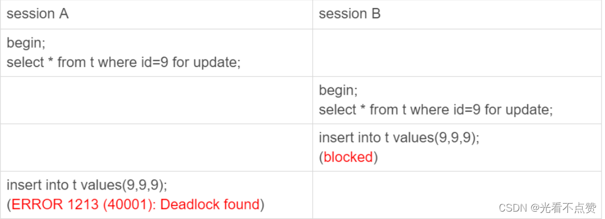
>     
- 总结

> 间隙锁的引入，可能会导致同样的语句锁住更大的范围，这其实是影响了并发度的。
> 

# 为什么改一条记录这么多锁？

## 1.加锁原则

- 前言

> 根据不同的版本会发生些许变化
> 
- 概述

> 原则 1：加锁的基本单位是 next-key lock。希望你还记得，next-key lock 是前开后闭区间。原则 2：查找过程中访问到的对象才会加锁（即加锁只会给对于涉及到正儿八经访问的索引加锁）。优化 1：索引上的等值查询，给唯一索引加锁的时候，next-key lock 退化为行锁（前开后开）。优化 2：索引上的等值查询，向右遍历时且最后一个值不满足等值条件的时候，next-key lock 退化为间隙锁（前开后开）。一个 bug：唯一索引上的范围查询会访问到不满足条件的第一个值为止（mysql8.0.25已修复）。
> 
- 注意

> 在可重复读中采用幻读的问题，所以引入了间隙锁，但是在提交读的隔离下幻读问题是得到解决的，所以只有行锁没有间隙锁
> 

## 2.根据加锁原则得到的优化

- 概述

> 删除尽量限制行数我们在分析加锁规则的时候可以用 next-key lock 来分析。但是要知道，具体执行的时候，是要分成间隙锁和行锁两段来执行的。
> 

# MySQL有哪些“饮鸩止渴”提高性能的方法？

- 短风暴连接

> 正常的短连接模式就是连接到数据库后，执行很少的 SQL 语句就断开，下次需要的时候再重连。如果使用的是短连接，在业务高峰期的时候，就可能出现连接数突然暴涨的情况。
> 
- 风险

> 短连接模型存在一个风险，就是一旦数据库处理得慢一些，连接数就会暴涨。max_connections 参数，用来控制一个 MySQL 实例同时存在的连接数的上限，超过这个值，系统就会拒绝接下来的连接请求，并报错提示“Too many connections”。对于被拒绝连接的请求来说，从业务角度看就是数据库不可用。在机器负载比较高的时候，处理现有请求的时间变长，每个连接保持的时间也更长。这时，再有新建连接的话，就可能会超过 max_connections 的限制。
> 
- 增加这个参数的限制？

> 不可能这样来，因为大量的资源耗费在权限验证等逻辑上，结果可能是适得其反，已经连接的线程拿不到 CPU 资源去执行业务的 SQL 请求。
> 

## 1.先处理掉那些占着连接但是不工作的线程。

- 概述

> 通过配合show processlist和查 information_schema 库的 innodb_trx 表，来断开事务外的空闲连接，之所以要看innodb_trx 表去确认那个具体是哪个线程，是因为两个语句如下图，在空闲后只查看show processlist是一模一样的，但删除两个连接的后果有不同
> 
> 
> 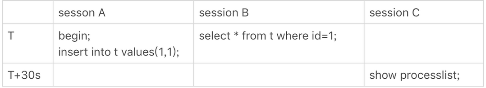
> 
> 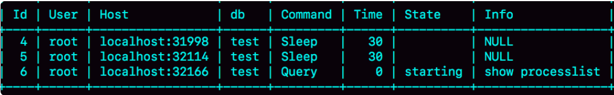
> 
> ```
> kill connection + id
> ```
> 
> ```
> sleep
> ```
> 
> ```
> “ERROR 2013 (HY000): Lost connection to MySQL server during query”
> ```
> 
> ```
> “MySQL 一直没恢复”
> ```
> 

## 2.减少连接过程的消耗。

- 概述

> 就是通过加入参数–skip-grant-tables，来启动数据库，整个 MySQL 会跳过所有的权限验证阶段，包括连接过程和语句执行过程在内。这是非常危险的及其不推荐
> 

## 3.慢查询导致的性能问题及解决方法

- 概述

> 导致慢查询的原因大体由下面三种
> 
> 1. 索引没有设计好；
> 2. SQL 语句没写好；
> 3. MySQL 选错了索引。

### 3.1 索引没有设计好

- 概述

> 在这种情况下效率最高的补救措施就是直接利用Online DDL进行添加索引的操作，例如一主一备的过程如下：
> 
> 1. 在备库 B 上执行 set sql_log_bin=off，也就是不写 binlog，然后执行 alter table 语句加上索引；
> 2. 执行主备切换；
> 3. 这时候主库是 B，备库是 A。在 A 上执行 set sql_log_bin=off，然后执行 alter table 语句加上索引。
- 总结

> 这是一个“古老”的 DDL 方案。平时在做变更的时候，你应该考虑类似 gh-ost 这样的方案，更加稳妥。但是在需要紧急处理时，上面这个方案的效率是最高的。
> 

### 3.2 SQL 语句没写好

- 概述

> SQl语句没有写好导致的没有正确使用索引，我们可以通过提供了 query_rewrite 功能（5.7加入），可以把输入的一种语句改写成另外一种模式。比如，语句被错误地写成了 select * from t where id + 1 = 10000，你可以通过下面的方式，增加一个语句改写规则。
> 

```sql

mysql> insert into query_rewrite.rewrite_rules
(pattern, replacement, pattern_database) values
("select * from t where id + 1 = ?", "select * from t where id = ? - 1", "db1");

call query_rewrite.flush_rewrite_rules();

```

### 3.3 mysql自己选错了索引

- 概述

> 这种情况下就去看看这篇博文的开头
> 

### 3.4 总结

- 概述

> 对于前两种情况我们是完全能够避免的
> 
- 过程

> 上线前，在测试环境，把慢查询日志（slow log）打开，并且把 long_query_time 设置成 0，确保每个语句都会被记录入慢查询日志；在测试表里插入模拟线上的数据，做一遍回归测试；观察慢查询日志里每类语句的输出，特别留意 Rows_examined 字段是否与预期一致。
> 
- 后续

> 如果新增的 SQL 语句不多，手动跑一下就可以。而如果是新项目的话，或者是修改了原有项目的 表结构设计，全量回归测试都是必要的。这时候，你需要工具帮你检查所有的 SQL 语句的返回结果。比如，你可以使用开源工具 pt-query-digest(<https://www.percona.com/doc/percona-toolkit/3.0/pt-query-digest.html>)。
> 

## 4.QPS激增问题

- 概述

> 有时候由于业务突然出现高峰，或者应用程序 bug，导致某个语句的 QPS 突然暴涨，也可能导致 MySQL 压力过大，影响服务。我之前碰到过一类情况，是由一个新功能的 bug 导致的。当然，最理想的情况是让业务把这个功能下掉，服务自然就会恢复。
> 
1. 一种是由全新业务的 bug 导致的。**假设你的 DB 运维是比较规范的（万事做好准备，应对困难也会更加从容）**，也就是说白名单是一个个加的。这种情况下，如果你能够确定业务方会下掉这个功能，只是时间上没那么快，那么就可以从数据库端直接把白名单去掉。
2. 如果这个新功能使用的是单独的数据库用户，可以用管理员账号把这个用户删掉，然后断开现有连接。这样，这个新功能的连接不成功，由它引发的 `QPS` 就会变成 0。
3. 如果这个新增的功能跟主体功能是部署在一起的，那么我们只能通过处理语句来限制。这时，我们可以使用上面提到的查询重写功能，把压力最大的 `SQL` 语句直接重写成`"select 1"`返回。
    
    > 对于这一种解决方式，会有两种后果：
    > 
    > - 如果别的功能里面也用到了这个 `SQL` 语句模板，会有误伤；
    > - 很多业务并不是靠这一个语句就能完成逻辑的，所以如果单独把这一个语句以 `select 1` 的结果返回的话，可能会导致后面的业务逻辑一起失败。

## 5.类似饮鸩止渴的场景

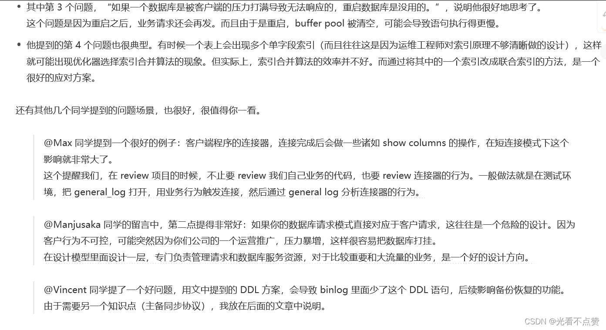

# binlog

## WAL

[！！！！](https://blog.csdn.net/u010900754/article/details/106630704)


## 1.binlog写入机制

- 概述

> 其实，binlog 的写入逻辑比较简单：事务执行过程中，先把日志写到 binlog cache，事务提交的时候，再把 binlog cache 写到 binlog 文件中（这里牢记就是写在了文件管理中page cache中即还是在内存，没有进行同步。这个过程就是write）。
一个事务的 binlog 是不能被拆开的，因此不论这个事务多大，也要确保一次性写入。这就涉及到了 binlog cache 的保存问题。
> 
- binlog_cache_size

> 系统给 binlog cache 分配了一片内存，每个线程一个，参数 binlog_cache_size 用于控制单个线程内 binlog cache 所占内存的大小。如果超过了这个参数规定的大小，就要暂存到磁盘。
> 
- 事务提交的binlog的过程

> 事务提交的时候，执行器把 binlog cache 里的完整事务写入到 binlog 中，并清空 binlog cache。
> 
> 
> 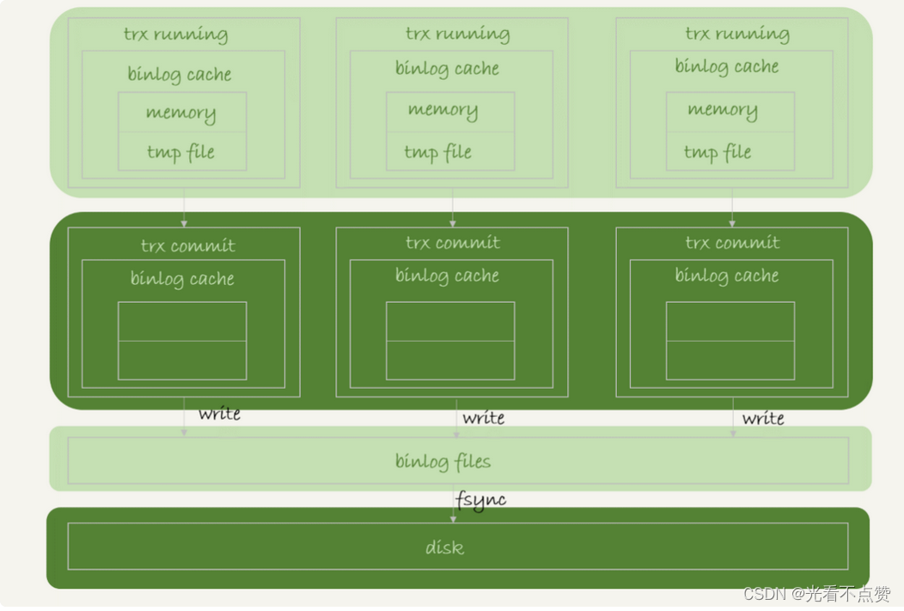
> 
- 状态图分析（`fsync`函数同步内存中所有已修改的文件数据到储存设备）

> 可以看到，每个线程有自己 binlog cache，但是共用同一份 binlog 文件。
> 
> - 图中的 write，**指的就是指把日志写入到文件系统的 page cache，并没有把数据持久化到磁盘，所以速度比较快。**
> - 图中的 fsync，才是将数据持久化到磁盘的操作。一般情况下，我们认为 fsync 才占磁盘的 IOPS。write 和 fsync 的时机，是由参数 sync_binlog 控制的：
- sync_binlog

> sync_binlog=0 的时候，表示每次提交事务都只 write，不 fsync；sync_binlog=1 的时候，表示每次提交事务都会执行 fsync；sync_binlog=N(N>1) 的时候，表示每次提交事务都 write，但累积 N 个事务后才 fsync。
> 
- sync_binlog的设置推荐

> 因此，在出现 IO 瓶颈的场景里，将 sync_binlog 设置成一个比较大的值，可以提升性能。在实际的业务场景中，考虑到丢失日志量的可控性，一般不建议将这个参数设成 0，比较常见的是将其设置为 100~1000 中的某个数值。
> 

> 但是，将 sync_binlog 设置为 N，对应的风险是：如果主机发生异常重启，会丢失最近 N 个事务的 binlog 日志。
> 

## 2.配合redo log的参数设置以优化IO带来的性能瓶颈问题

- redo log的相关参数

> innodb_flush_log_at_trx_commit：
> 
> - 0 ：当该系统变量值为0时，表示在事务提交时不立即向磁盘中同步 redo 日志，这个任务是交给后台线程做的。**这样很明显会加快请求处理速度，但是如果事务提交后服务器挂了，后台线程没有及时将 redo 日志刷新到磁盘，那么该事务对页面的修改会丢失。所以不建议这样做**
> - 1 ：当该系统变量值为1时，表示在事务提交时需要将 redo 日志同步到磁盘，可以保证事务的 持久性 。 1也是 innodb_flush_log_at_trx_commit 的默认值。
> - 2 ：当该系统变量值为2时，表示在事务提交时需要将 redo 日志写到操作系统的缓冲区中，但并不需要保证将日志真正的刷新到磁盘。
- bin log的相关参数

> binlog_group_commit_sync_delay 参数，表示延迟多少微秒后才调用fsync;binlog_group_commit_sync_no_delay_count 参数，表示累积多少次以后才调用 fsync。
这两个条件是或的关系，也就是说只要有一个满足条件就会调用 fsync。
> 

> sync_binlog：上面我们提到过
> 

### 2.1 优化参考

1. 设置 `binlog_group_commit_sync_delay` 和 `binlog_group_commit_sync_no_delay_count` 参数，减少`binlog`的写盘次数。这个方法是基于“额外的故意等待”来实现的，因此可能会增加语句的响应时间，但没有丢失数据的风险。
2. 将 `sync_binlog` 设置为大于`1`的值（比较常见是 `100~1000`）。这样做的风险是，主机掉电时会丢 `binlog` 日志。
3. 将`innodb_flush_log_at_trx_commit`设置为 `2`。这样做的风险是，主机掉电的时候会丢数据。