# Redis设计与实现（一）| 数据结构 & 对象

type: Post
status: Published
date: 2022/06/26
summary: 在redis中，没有直接使用c的字符串，而是在此基础上创建了自己的字符串结构SDS，每个SDS结构表示一个SDS的值
tags: Redis
category: 缓存

# Redis中的数据结构

## 1.SDS（动态简单字符串）

### 1.1 SDS的定义

> 在redis中，没有直接使用c的字符串，而是在此基础上创建了自己的字符串结构SDS，每个SDS结构表示一个SDS的值：
> 

```cpp
struct sdshdr {
	//记录buf数组中已使用字节的数量
	//等于SDS所保存字符串的长度
	int len;
	//记录buf数组中未使用字节的数量
	int free;
	//字节数组，用于保存字符串
	char buf[];
};

```

==记录长度值的两个好处==：

> 常数复杂度获取字符串长度：这个不用解释因为数据结构中维护了长度的指针防止缓存区溢出：API会预先检查SDS的剩余空间是否够用
> 
- 实例

> free属性的值为0，表示这个SDS没有分配任何未使用空间。len属性的值为5，表示这个SDS保存了一个五字节长的字符串。buf属性是一个char类型的数组，数组的前五个字节分别保存了'R'、'e'、 'd'、'i '、's'五个字符，而最后一个字节则保存了空字符'\\0'。
> 

> 
> 

### 1.2 减少修改字符串时带来的内存重分配次数

- 概述

> 一般情况对于修改字符串有两种：拼接和截断，这两者都有可能引发异常；前者如果不进行内存的重分配会造成缓存区溢出；后者如果不释放不再使用的则会内存泄漏，SDS为此引入两个机制
> 

==空间预分配==：

> 预分配是根据两种情况来的
> 
> 1. 对SDS修改之后如果长度小于1MB，系统会分配与len属性一样大小的未使用空间，例如修改后为9，那么长度就会变成9+9+1=19（空白字符）
> 2. 如果修改后大于1MB，系统会分配1MB的未使用空间，例如修改为24MB，长度会变为24MB+1MB+1Bytes

==惰性空间释放==：

> 当SDS的API需要缩短时，系统会把缩短的长度保存到free属性中，并等待下次符合条件的复用
> 

### 1.3 与C字符串的对比


## 2.链表（linkedlist）

### 2.1 链表和链表节点的实现

- 概述

> 链表是列表对象底层实现之一
> 

==每个节点结构如下==：

> 可以看到构成的是一个双向链表
> 

```cpp
typedef struct listNode {
	//前置节点
	struct listNode * prev;
	//后置节点
	struct listNode * next;
	//节点的值
	void * value;
}listNode;

```

==链表的结构如下==：

```cpp
typedef struct list {
	//表头节点
	listNode *head;
	//表尾节点
	listNode *tail;
	//链表所包含的节点数量
	unsigned long len;
	//节点值复制函数
	void * (*dup)(void *ptr);
	//节点值释放函数
	void (*free)(void *ptr);
	//节点值对比函数
	int (*match)(void *ptr,void *key);
]list;

```

==总体形象化构成及特点==：

> 双向五环头指针和表尾指针链表有长度计数器多态：可以保存不能类型的值
> 

## 3.字典（哈希）以hashtable为底层

### 3.1 字典的实现

- 概述

> 字典在Redis中的应用相当广泛，比如Redis 的数据库就是使用字典来作为底层实现的，对数据库的增、删、查、改操作也是构建在对字典的操作之上的。除了用来表示数据库之外，字典还是哈希键的底层实现之一，当一个哈希键包含的键值对比较多，又或者键值对中的元素都是比较长的字符串时，Redis就会使用字典作为哈希键的底层实现。
> 
- 哈希表的结构

> 例如一个大小为4的空哈希表
> 
> 
> 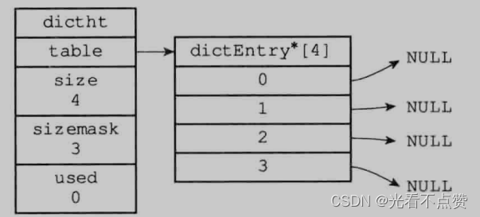
> 

```cpp
typedef struct dictht {
	//哈希表数组
	dictEntry **table;
	//哈希表大小
	unsigned long size;
	//哈希表大小掩码，用于计算索引值
	//总是等于size-1
	unsigned long sizemask;
	//该哈希表已有节点的数量
	unsigned long used;
}dictht;

```

- 哈希节点的结构

> 与哈希表的联合结构
> 
> 
> 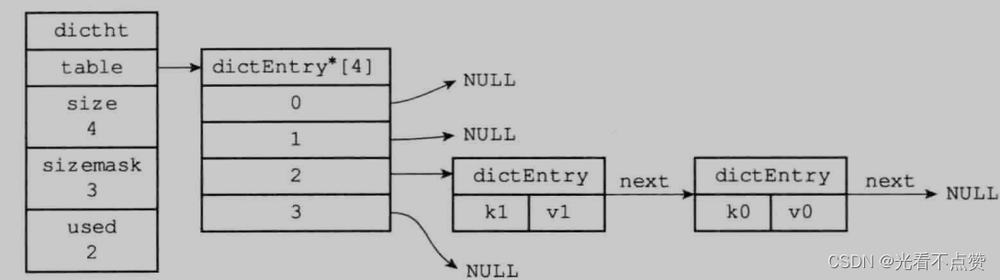
> 

```cpp
typedef struct dictEntry {
	//键
	void *key;
	//值
	union{
	void *val;
	uint64_tu64;
	int64_ts64;
	} v;
	//指向下个哈希表节点，形成链表
	struct dictEntry *next;
}dictEntry;

```

- 字典的结构

> 普通状态下的字典（未进行rehash）
> 
> 
> 
> 

```cpp
typedef struct dict {
	//类型特定函数：每个字典类型都会提供对应的函数
	dictType *type;
	//私有数据：保存需要传给那些类型特定函数的可选参数
	void *privdata;
	//哈希表
	dictht ht[2];
	//rehash索引
	//当rehash不在进行时，值为-1
	in trehashidx;
}dict;

```

### 3.2 哈希算法

- 概述

> 无论是作为数据库的底层实现往里面添加k-v，还是作为哈希表的底层实现添加k-v，都需要计算出哈希值和索引值，再根据索引值将包含新的键值对哈希节点放入哈希数组的对应位置上
> 
> 
> 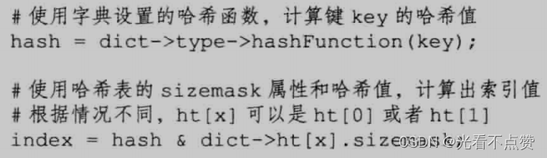
> 

==使用算法==：

> MurmurHash2算法进行哈希值的计算，该算法优点在于即使输入的键是有规律的，也能将键值对打的很散，并且计算速度也很快
> 

### 3.3 解决键冲突

- 概述

> 键的冲突就是打在了一个索引上，一般有两种解决方案：开放地址法和拉链法，Redis中使用的是拉链法，使用next指针构成一个单向链表；注意添加冲突节点时是添加到对头即头插法
> 

### 3.4 rehash（重新散列）

- 概述

> 任何字典的k-v都会维护一个负载因子，让其内部达到平衡，元素不会太多也不会太少（维持一个范围），当出现太多或太少系统就会对哈希表的大小进行扩展或收缩
> 
> 
> 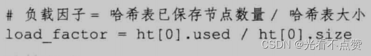
> 
- rehash的步骤如下：

==①.分配==：为字典的另一个哈希表`ht[1]`分配空间，这个分配的空间取决于存储元素的`ht[1]`（键值对的数量即`ht[0].used`属性的值）

> 如果执行的是扩展操作：那么1号表的大小为第一个大于等于0号表使用的空间乘2的2的n次方幂即ht[0].used*2的2"(2的n次方幂);，例如ht [0].used当前的值为4，4*2=8，而8（2^3^）恰好是第一个大于等于4的2的
> 

> 如果是收缩，那么1号表的大小就是第一个大于等于0号表使用空间的2的n次方幂
> 

==②.迁移重新hash==：将0号表的键值对全部rehash到1号表中，即重新计算哈希值和索引值
==③.迁移后==：迁移迁移完成之后，0号表为空表，释放0号表，将1号设置为0号，并创建一个新的1号表（未分配空间）为下一次迁移做准备

- 哈希表的扩展与收缩发生的条件（前2位扩展、后1为收缩）

> 服务器目前没有在执行BGSAVE命令或者BGREWRIIEAUF饰令，开且喧布衣的贝载因子大于等于1。服务器目前正在执行BGSAVE命令或者BGREWRITEAOF命令，并且哈希表的负载因子大于等于5。当哈希表的负载因子小于0.1时，程序自动开始对哈希表执行收缩操作。
> 

### 3.5 渐进式rehash

- 概述

> 上一节说到在第二步骤中将0号表移动到1号表的操作，这个操作不是一下就完成的，而是分多次、渐进式的完成；当键值对很多很多时这样对服务器的压力很小很多
> 
- 步骤如下

==①.分配==：

> 为1号表分配空间，字典同时持有两个哈希表
> 

==②.开始==：

> 字典中维持一个计数器，初始化为0，rehash开始
> 

==③.计数==：

> 在rehash的期间，除了正常的CRUD，数据库还会顺带将ht [0]哈希表在rehashidx索引上的所有键值对rehash 到ht[1]，当rehash 工作完成之后，程序将rehashidx属性的值增一。
> 

==④.完成==：

> 在某个时间点，迁移完毕，计数器被设置为-1，表示rehash完成
> 
- 渐进式rehash时的CRUD

> 在渐进式的CRUD时，字典同时拥有两个哈希表，所以执行对应操作时其实数据是分布在两个表中的，查询时会先去0号表中查询，再去1号表；同时添加键也是直接添加到1号
> 

## 4.跳跃表（zskiplist）

- 概述

> 跳跃表（skiplist）是一种有序数据结构，它通过在每个节点中维持多个指向其他节点的指针,从而达到快速访问节点的目的。跳跃表支持平均O(1ogN)、最坏O(N)复杂度的节点查找，还可以通过顺序性操作来批量处理节点。某些场景下效率甚至可以和平衡树向媲美
> 

> 当使用有序集合中的元素的成员即value太长底层就会使用跳表来作为有序集合的底层实现
> 

### 4.1 跳跃表的实现

- 跳跃表的结构
    
    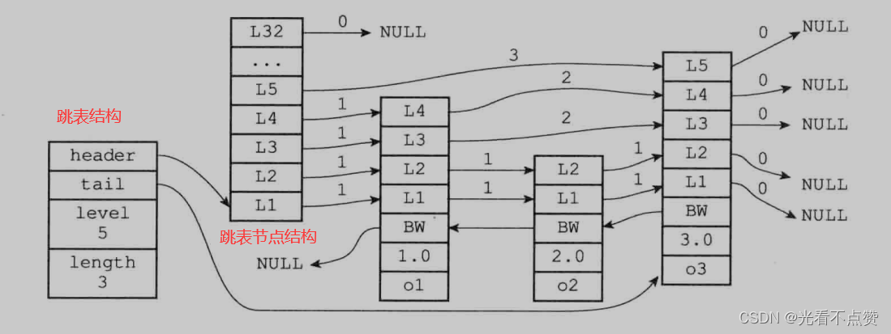
    

```cpp
typedef struct zskiplist {
	//表头节点和表尾节点
	structz skiplistNode *header,*tail;
	//跳表的长度，即表中节点的数量
	unsigned long length;
	//表中层数最大的节点的层数（表头不算）
	int level;
}zskiplist;

```

- 跳表中的名词解释

==层（Level）==：

> 节点中用L1、L2、L3等字样标记节点的各个层，L1代表第一层，L2代表第二层，以此类推。每个层都带有两个属性：前进指针和跨度。在上面的图片中，连线上带有数字的箭头就代表前进指针，而那个数字就是跨度。当程序从表头向表尾进行遍历时，访问会沿着层的前进指针进行。
> 
> - 前进指针：用于访问位于表尾方向的其他节点，
> - 跨度：则记录了前进指针所指向节点和当前节点的距离。

==后退指针(backward)==：

> 标记当前节点的前一个节点，从表尾向表头方向遍历一次只能移动一格
> 

==分值(score)==:

> 各个节点中的1.0、2.0和3.0是节点所保存的分值。在跳跃表中，节点按各自所保存的分值从小到大排列。
> 

==成员对象（obj）==:

> 各个节点中的o1、o2和o3是节点所保存的成员对象。
> 
- 跳表节点的结构

```cpp
typedef struct zskiplistNode {
	//层
	struct zskiplistLevel {
		//前进指针
		struct zskiplistNode *forward;
		//跨度
		unsigned int span;
	} level[];
	//后退指针
	struct zskiplistNode *backward;
	//分值
	double score;
	//成员对象
	robj*obj;
}zskiplistNode;

```

- 对于名词的含义的详解

> 
> 
1. 层：

> 跳跃表节点的level数组可以包含多个元素，每个元素都包含一个指向其他节点的指针，程序可以通过这些层来加快访问其他节点的速度，一般来说，层的数量越多，访问其他节点的速度就越快。
> 

> 每次创建一个新跳跃表节点的时候，程序都根据幂次定律（power law，越大的数出现的概率越小）随机生成一个介于1和32之间的值作为level数组的大小，这个大小就是层的“高度”。
> 
1. 前进指针：

> 每一层都一个指向表尾方向的前进指针，用来访问别的节点
> 
1. 跨度

> 层的跨度（level[i].span属性）用于记录两个节点之间的距离:
> 
> - 口两个节点之间的跨度越大,它们相距得就越远。
> - 指向NULL的所有前进指针的跨度都为0，因为它们没有连向任何节点。

> 初看上去，很容易以为跨度和遍历操作有关，但实际上并不是这样，遍历操作只使用前进指针就可以完成了，跨度实际上是用来计算排位（rank）的:在查找某个节点的过程中,将沿途访问过的所有层的跨度累计起来，得到的结果就是目标节点在跳跃表中的排位。
> 

`例子`：

> 上图用虚线标记了在跳跃表中查找分值为3.0、成员对象为o3的节点时，沿途经历的层:查找的过程只经过了一个层，并且层的跨度为3，所以目标节点在跳跃表中的排位为3。
> 
1. 分值和成员

> 注意：当分值相同，排序的依据就靠成员对象的大小，小的靠前大的靠后
> 
> - 节点的分值`（score属性）`是一个double类型的浮点数，**跳跃表中的所有节点都按分值从小到大来排序。**
> - 节点的成员对象`（obj属性）`是一个指针，它指向一个字符串对象，而字符串对象则保存着一个SDS 值。
1. 查询过程

如图所示，我们基于原始链表的第1层索引，抽出了第2层更为稀疏的索引，结点数量是第1层索引的一半。这样的多层索引可以进一步提升查询效率，那么它是如何进行查询的呢？假如这次要查找DataNode-27，让我们来演示一下检索过程：

- 首先，我们从最上层(第二层)的HeadIndex-7开始查找，**HeadIndex-7指向DataNode-7比DataNode-27小**，所以继续向右查询找到第二个索引节点IndexNode-20。
    
    
    
- IndexNode-20指向DataNode-20也比DataNode-27小，但是此时第二层已经没有后续的索引节点，所以我们需要顺着IndexNode-20访问下一层索引，即第一层的IndexNode-20。
从索引节点访问方式可知，索引节点保存着“数据节点”、“下层索引节点”的指针。
    
    
    
- 通过第一层的IndexNode-20继续向右检索找到IndexNode-27便检索到了DataNode-27。
    
    
    

## 5.整数集合（intset）

- 概述

> 整数集合（intset）是集合键的底层实现之一，当一个集合只包含整数值元素，并且这个集合的元素数量不多时，Redis就会使用整数集合作为集合键的底层实现。
> 

### 5.1 整数集合的实现

- 整数集合结构

> 其中编码方式可以为int16_t、int32_t或者int64_t的整数值，根据不同的编码方式相对应的属性单位也会发生变化，每个元素所占的位数也不一样
例如：如果encoding属性的值为INTSET ENC INT16，那么contents就是一个int16_t类型的数组，数组里的每个项都是一个int16_t类型的整数值最小（值为-32768，最大值为32767 )。
> 

```cpp
typedef struct intset {
//编码方式
uint32_t encoding;
//集合包含的元素数量
uint32_t length;
//保存元素的数组
int8_t contents[];intset;

```

### 5.2 升级

- 概述

> 每当我们要将一个新元素添加到整数集合里面，并且新元素的类型比整数集合现有所有元素的类型都要长时，整数集合需要先进行升级(upgrade )，然后才能将新元素添加到整数集合里面。所以整体时间复杂度为On
> 
- 过程如下：

==①.分配==：

> 根据新元素的类型，扩展整数集合底层数组的空间大小，并为新元素分配空间
> 

==②.转换==：

> 将底层数组的所有元素的类型转换成与新加入元素的数据类型，并将转换后元素放到正确的位置上，放置过程中要保持数组的有序性
> 

==③.添加==：

> 将新元素添加到底层数组里面
> 
- 升级的好处

> 提高灵活性：通过升级我们可以将不同编码的元素添加到相同数组中去节约内存：这个就很显而易见了，只有我们加入不同编码的元素才会扩容
> 

`注意`：

> 底层数组升级后不支持降级会一直保持升级后的编码状态
> 

## 6.压缩列表（ziplist）

- 概述

> 压缩列表（ziplist）是列表键和哈希键的底层实现之一。当一个列表键只包含少量列表项，并且每个列表项要么就是小整数值，要么就是长度比较短的字符串，那么 Redis就会使用压缩列表来做列表键的底层实现。
> 

### 6.1 压缩列表的构成

- 概述

> 压缩列表是Redis为了节约内存而开发的，是由一系列特殊编码的连续内存块组成的顺序型（ sequential ）数据结构。一个压缩列表可以包含任意多个节点 （entry），每个节点可以保存一个字节数组或者一个整数值。
> 
- 压缩表的整体结构

> ==zlbytes==：4字节，记录整个压缩列表占用的内存字节数:在对压缩列表进行内存重分配，或者计算zlend的位置时使用==zltail==：4字节，记录压缩列表表尾节点距离压缩列表的起始地址有多少字节:通过这个偏移量，程序无须遍历整个压缩列表就可以确定表尾节点的地址==zllen==：2字节，记录了压缩列表包含的节点数量:当这个属性的值小于UINT16_MAX(65535）时，这个属性的值就是压缩列表包含节点的数量;当这个值等于UINT16 MAX时，节点的真实数量需要遍历整个压缩列表才能计算得出==entryx==：列表节点，大小不定。压缩列表包含的各个节点，节点的长度由节点保存的内容决定==zlend==：1字节，特殊值0xFF（十进制255)，用于标记压缩列表的末端
> 

### 6.2 压缩列表节点的构成

- 概述

> 每个压缩列表节点可以保存一个字节数组或者一个整数值，数组和整数值的存放都有限制
> 
- 节点的结构

==previous_entry_length==：
    
    
    

> 该属性单位为字节，记录列表中前一个节点的长度：该属性就是列表从后向前遍历的原理实现
> 
> - 长度小于254字节，则该属性为占1个字节
> - 长度大于等于，则该属性占5个字节，其中属性的第一字节会被设置为0xFE（**十进制值254显式表示该属性占5个字节**)，而之后的四个字节则用于保存前一节点的实际长度。

==encoding==：

> 节点的encoding属性记录了节点的content属性所保存数据的类型以及长度:
> 

==content==：

> 节点的content属性负责保存节点的值，节点值可以是一个字节数组或者整数，值的类型和长度由节点的encoding属性决定。
> 

### 6.3 连锁更新

- 概述

> 前面我们说过previous_entry_length属性，如果多个节点的都处于250到253的极限长度，每个节点的该属性都占1个字节，如果此时我们将一个大于254的节点设置到表头，因为原来是表头的节点的该属性为1个字节肯定存不下5个字节的需求，所以我们会扩展到5个字节，多出来的四个字节会继续向后，使其后面的每个节点都改变，直到符合规定
> 
- 注意

> 除了添加结点，同理删除结点也会引发连锁更新；因为连锁更新在最坏情况下需要对压缩列表执行N次空间重分配操作，而每次空间重分配的最坏复杂度为O(N)，所以连锁更新的最坏复杂度为O(N )，但实际上出现这样的情况并不是很多
> 

## 7.快表：quicklist（链表+压缩表的集合）

- 概述

> Redis在后期引入跳表，为了平衡链表和压缩表的空间效率和时间效率，他是一个双向列表，每个节点是一个压缩表节点
> 
> - 当节点过多，快表会退化成双向列表
> - 当节点过少，快表会退化成压缩列表

### 7.1 快表的实现

- 快表的结构

```cpp
typedef struct quicklist {
    //指向头部(最左边)quicklist节点的指针
    quicklistNode *head;

    //指向尾部(最右边)quicklist节点的指针
    quicklistNode *tail;

    //ziplist中的entry节点计数器
    unsigned long count;        /* total count of all entries in all ziplists */

    //quicklist的quicklistNode节点计数器
    unsigned int len;           /* number of quicklistNodes */

    //保存ziplist的大小，配置文件设定，占16bits
    int fill : 16;              /* fill factor for individual nodes */

    //保存压缩程度值，配置文件设定，占16bits，0表示不压缩
    unsigned int compress : 16; /* depth of end nodes not to compress;0=off */
} quicklist;

```

- 快表节点的结构

```cpp
typedef struct quicklistNode {
    struct quicklistNode *prev;     //前驱节点指针
    struct quicklistNode *next;     //后继节点指针

    //不设置压缩数据参数recompress时指向一个ziplist结构
    //设置压缩数据参数recompress指向quicklistLZF结构
    unsigned char *zl;

    //压缩列表ziplist的总长度
    unsigned int sz;                  /* ziplist size in bytes */

    //ziplist中包的节点数，占16 bits长度
    unsigned int count : 16;          /* count of items in ziplist */

    //表示是否采用了LZF压缩算法压缩quicklist节点，1表示压缩过，2表示没压缩，占2 bits长度
    unsigned int encoding : 2;        /* RAW==1 or LZF==2 */

    //表示一个quicklistNode节点是否采用ziplist结构保存数据，2表示压缩了，1表示没压缩，默认是2，占2bits长度
    unsigned int container : 2;       /* NONE==1 or ZIPLIST==2 */

    //标记quicklist节点的ziplist之前是否被解压缩过，占1bit长度
    //如果recompress为1，则等待被再次压缩
    unsigned int recompress : 1; /* was this node previous compressed? */

    //测试时使用
    unsigned int attempted_compress : 1; /* node can't compress; too small */

    //额外扩展位，占10bits长度
    unsigned int extra : 10; /* more bits to steal for future usage */
} quicklistNode;

```

- 结构示例图
    
    
    

# Redis中的高级数据类型

## Bitmap

- 概述

> 这里说明一下bitmap底层是采用了SDS的数据结构来实现，如下图，看着每行数据都是一个字节，保存进行的顺序其实跟图中展示的顺序不一样，是逆序的因为计算机的读取与人的习惯不一样哦，也许你会担心在setbit要指明偏移量，而偏移量是从高位到低位的，会不会也要考虑逆序呢？其实不用redis底层会为你自动转换，你就按你的习惯来
对于偏移值，通过整除8来定位那个字节，通过取余8加1来定位这个字节的那个二进制位，通过整除8加1来确定字节数量
> 
> 
> 
> 
- 集中基本操作的底层实现

> bitset：GETBIT 用于返回在该位数组中某偏移量上的二进制位。
通过计算字节数len，来对比SDS结构中的len，SDS的小于将要添加进去的话就会进行扩展（别忘记空间预分配哦，如果长度小于1MB则分配长度双倍的空间，如果大于 1MB，则多分配1MB的空间。），然后获取定位修改值并返回
> 

```sql
GETBIT <bitarray> <offset>

```

> bitget：SETBIT 操作可以将位数组的某个偏移量上的二进制位设置为value
> 

```sql
SETBIT <bitarray> <offset> <value>

```

> bitcount：BITCOUNT命令用于统计给定位数组中，值为1的二进制位的数量。
> 

```sql
BITCOUNT key [start end]

```

> 几种二进制统计的算法：
> 
> - 遍历法：遍历整个数组通过计数器计算二进制位数。
> - 查表法：维护一张表，表中每个键是对应位数组，而值是1的数量，如果键是八位的位数组，则一次可以检查8个二进制位。
> - variable-precision SWAR算法：具体可以看JDK 实现的 Integer.bitCount() ;
> - Redis 的实现：如果二进制数量小于128位，则通过查表法来统计，如果大于，则使用SWAR算法。

> bitop：该命令会创建一个新的空白位数组，然后将与，或，异或运算的结果，放到新数组中。
对指定key按位进行交、并、非、异或操作，并将结果保存到destKey中
> 

```sql
bitop op destKey key1 [key2...]

```

```
and：交
or：并
not：非
xor：异或

```

## hyperloglog

- 概述

> 通过牺牲准确率来换取空间，对于不要求绝对准确率的场景下可以使用，因为概率算法不直接存储数据本身.通过一定的概率统计方法预估基数值，同时保证误差在一定范围内，由于又不储存数据故此可以大大节约内存。
> 

> hyperloglog就是一种概率算法的实现。
> 
> - 用于进行基数统计，不是集合，不保存数据，只记录数量而不是具体数据
> - 核心是基数估算算法，最终数值存在一定误差
> - 误差范围：基数估计的结果是一个带有 0.81% 标准错误的近似值
> - 耗空间极小，每个hyperloglog key占用了12K的内存用于标记基数
> - pfadd命令不是一次性分配12K内存使用，会随着基数的增加内存逐渐增大
> - Pfmerge命令合并后占用的存储空间为12K，无论合并之前数据量多少

> 添加数据
> 

```sql
PFADD key element1, element2...

```

> 统计数据
> 

```sql
PFCOUNT key1 key2....

```

> 合并数据
> 

```sql
PFMERGE destkey sourcekey [sourcekey...]

```

> 具体示例，主要应用于大数量的访问网站人数的统计
> 

```sql
127.0.0.1:6379> PFADD taobao:uv 1 2 3	# 例如1 2 3 是用户ip 添加taobao 当天uv（Unique Visitor 独立访客）
(integer) 1
127.0.0.1:6379> PFCOUNT taobao:uv	# 获取当日访问人数
(integer) 3
127.0.0.1:6379> PFADD jd:uv1 1 2 3	# 添加jd 第一天uv
(integer) 1
127.0.0.1:6379> PFADD jd:uv2 1 2 3 4 5	# 添加jd 第二天uv
(integer) 1
127.0.0.1:6379> PFMERGE total:uv jd:uv1 jd:uv2	# 合并jd两天uv
OK
127.0.0.1:6379> PFCOUNT total:uv	# 获取jd两天uv总和
(integer) 5

```

> HyperLogLog是大数据基数统计中的常见方法，无论是Redis，Spark还是 Flink都提供了这个功能，其目的就是在一定的误差范围内，用最小的空间复杂度来估算一个数据流的基数。HyperLogLog 的结构也是raw编码形式的string
> 

## GEO

### 1.基本操作

```sql
# 添加多个经度(longitude)、纬度(latitude)、位置名称(member)添加到指定的 key 中
GEOADD key longitude latitude member [longitude latitude member ...]

# 从键里面返回所有给定位置元素的位置（经度和纬度）
GEOPOS key member [member ...]

# 返回两个给定位置之间的距离。
GEODIST key member1 member2 [unit]

# 以给定的经纬度为中心， 返回与中心的距离不超过给定最大距离的所有位置元素。
GEORADIUS key longitude latitude radius m|km|ft|mi [withcoord] [withdist] [withhash] [count count]

# GEORADIUSBYMEMBER 跟GEORADIUS类似
GEORADIUSBYMEMBER key member radius m|km|ft|mi [withcoord] [withdist] [withhash] [count count]

# 返回一个或多个位置元素的 Geohash 表示
GEOHASH key member [member ...]

```

### 2.数据结构

- 概述

> 查询可知，GEO使用的数据类型是zset，底层结构采用的是ziplist ，因为我的数据量小，所以应该在数据量大的情况下，采用dict+ skiplist（字典保证O（1）的查询单个位置的效率，skiplist保证范围查找或者排序的效率）
> 

# 对象

- 概述

> 上面的数据结构要具体操作很异常的繁琐，为了解决这种繁琐可以在数据结构上面封装一层对象，让其的操作性变好 ，通过这五种不同类型的对象，Redis可以在执行命令之前，根据对象的类型来判断一个对象是否可以执行给定的命令。我们可以针对不同的使用场景，为对象设置多种不同的数据结构实现，从而优化对象在不同场景下的使用效率
> 
- 字符串对象（SDS实现）`---->` 编码有：`int、raw或embstr`

> 
> 
> 
> 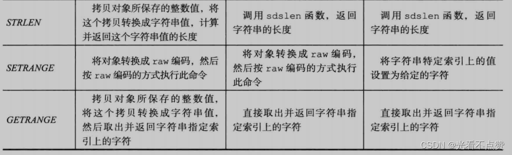
> 
- 列表对象（在3.2版本之前是linkedlist或ziplist，之后就被quicklist替代）

> 
> 
- 哈希对象（ziplist或hashtable为底层编码）

> 
> 
> 
> 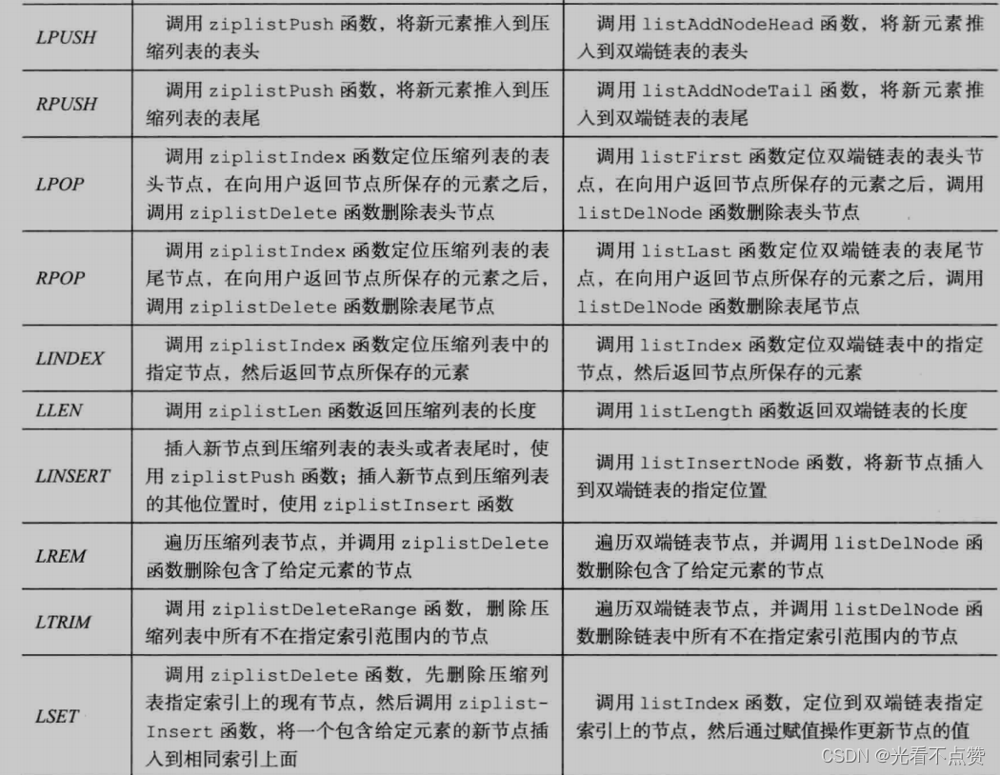
> 
- 集合对象（intset或hashtable为底层编码）

> 
> 
> 
> 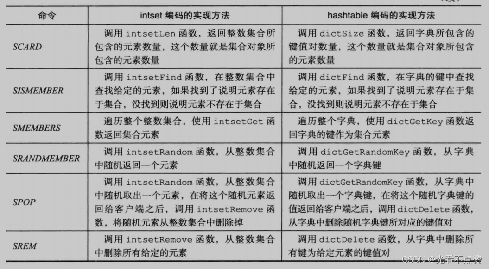
> 
- 有序对象（ziplist或skiplist为底层编码的zset结构）

> 以跳表为底层的zset，会加入字典再存一份来互补；而以压缩为底层的zset就不会加入字典
> 
> 
> 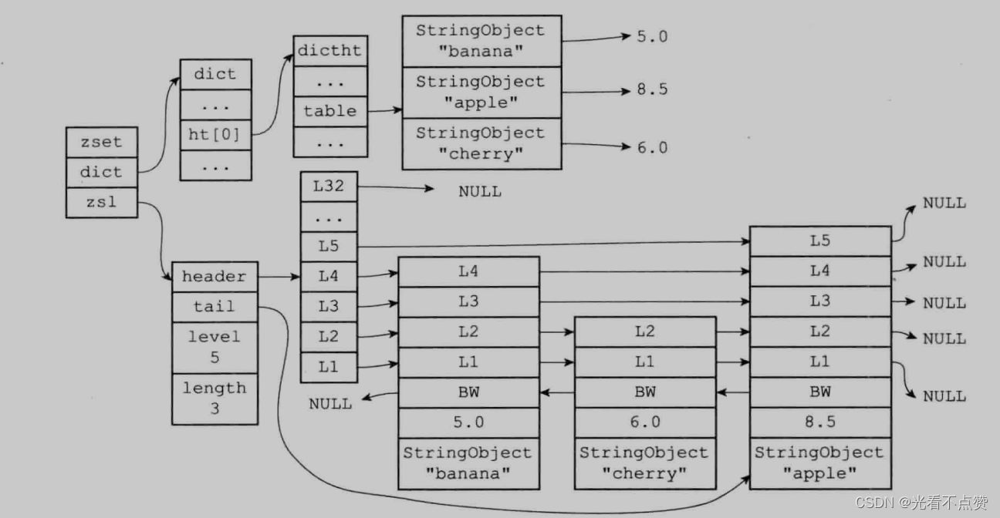
> 
> 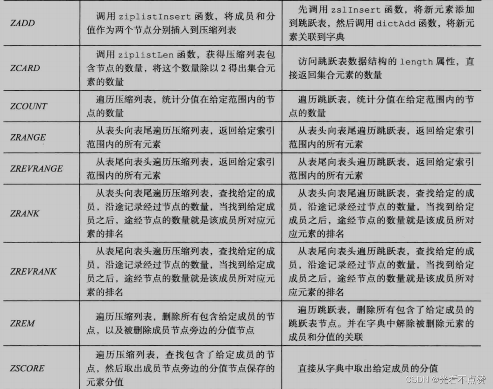
> 
- 通用命令

> 上面列出来的都是对于某个数据对象特定的指令，而有一些通用指令可以用在所有对象中
> 
> 
> 
> 
- 检查命令的对应性

> 除了通用命令外，其他特定命令在使用前都会对结构的类型和底层的编码进行核对
> 
- 对于对象共享的概述

> 在 Redis中，让多个键共享同一个值对象需要执行以下两个步骤:
> 
> - 1）将数据库键的值指针指向一个现有的值对象;
> - 2）将被共享的值对象的引用计数增一。

> 例子：
> 
> 
> 
> 

> 新版本的改动
> 
> 
> 
> 
- 为什么redis不共享字符串对象

> 
> 
- redis对象的空转时长

> 前面一共介绍了redisObject也就是所有redis对象的超类，拥有的四个属性：type（对象类型）、encoding（底层使用的数据结构编码）、ptr（对象的值引用地址）、refcount（该对象被别的对象引用的数量）。现在我们来介绍最后一个属性lru，即保存着该对象最后一次被命令程序访问的时间。当服务器的占用内存超过maxmoney时，会主动清理lru值过大的对象
> 

> 可以看到图中查看这个属性的命令，注意使用这个命令并不更新对象的lru属性哦
> 
> 
> 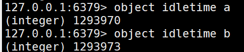
>