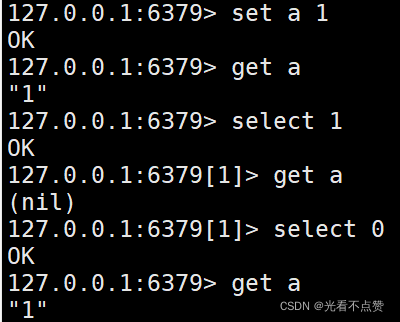
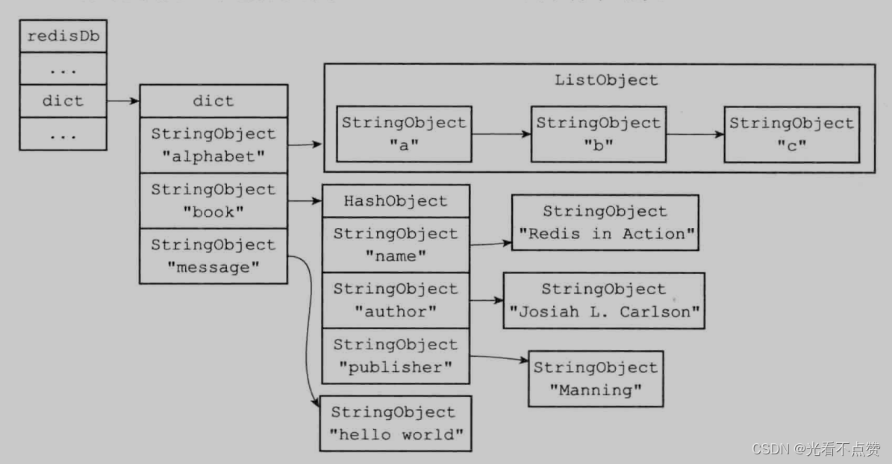
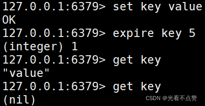
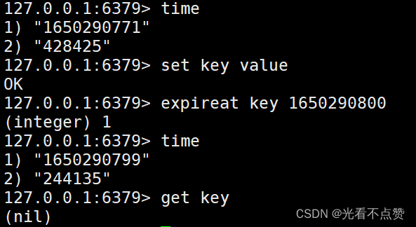

# Redis设计与实现（二）| 数据库（删除策略&过期淘汰策略）

type: Post
status: Published
date: 2022/06/27
summary: redis中服务器和客户端共同维护着16个数据库，默认为0号，可以通过select（底层是通过修改redisClient.db指针来修改）来改变客户端的数据库指向
tags: Redis
category: 缓存

# 数据库

## 1.服务器中的数据库

- 结构

```cpp
struct redisServer {
    // 一个数组保存服务器所有的数据库
    redisDb *db;
    // 服务器的数据库的数量
    int dbnum;
    // 记录客户端正在使用的数据库
	redisDb *db;
}

```

### 1.1 切换数据库

- 概述

> redis
> 
> 
> ```
> 16
> ```
> 
> ```
> 0
> ```
> 
> ```
> select
> ```
> 
> ```
> redisClient.db
> ```
> 
> 
> 

### 1.2 数据库键空间

- 概述

> Redis是一个键值对(key-value pair)数据库服务器，服务器中的每个数据库都由一个redis.h/redisDb结构表示，其中，redisDb结构的dict字典保存了数据库中的所有键值对，我们将这个字典称为键空间(key space ):
> 
> - 键空间的键也就是数据库的键,每个键都是一个字符串对象。
> - 键空间的值也就是数据库的值，每个值可以是字符串对象、列表对象、哈希表对象、集合对象和有序集合对象中的任意一种 Redis对象。

```cpp
typedef struct redisDb {
	// ...
	//数据库键空间，保存着数据库中的所有键值对
	dict *dict;
	//保存数据库的整数表示号码
	redisDb *id;
	//保存键的过期时间
	redisDb *expires;
}redisDb;

```

- 例子

```sql
redis>SET message "hello world"
OK
redis> RPUSH alphabet "a" "b" "c"
(integer) 3
redis> HSET book name "Redis in Action"
(integer) 1
redis> HSET book author "Josiah L.Carlson"
(integer) 1
redis>HSET book publisher "Manning"
(integer) 1

```



### 查找键的过程（❤）

- 概述

> 这里就不说增删改了，很简单，找到位置执行对应操作就行了，我们前面说到redis整个数据都是以k-v的形式存储的，那么redisDb结构中的字典Dict底层就是哈希表来实现的，Dict指向哈希表的地址，我们前面还说过，哈希表分为0号和1号；0号用来存储元素，1号是rehash的时候进行使用
> 

==查找（寻址）过程==：

> 先判断0号哈希表，1号哈希表是否为空，如果0号为空则直接返回null。判断0号是否在进行rehash，如果处于rehashing阶段，那么2个表都可能存在key。如果正在进行 rehash，将调用一次_dictRehashStep 方法，_dictRehashStep 用于对数据库字典、以及哈希键的字典进行被动 rehash。先计算hash值，根据当前字典和key值，计算出hash值。计算出索引，根据当前字典和hash值，计算出key所在的索引。根据索引值，找到对应的链表，遍历链接找到key匹配的数据。当 ht[0] 查找完了之后，再进行了次 rehash 判断，如果未在 rehashing，则直接结束，否则对 ht[1]重复 3 4 5步骤。（如果处于rehashing阶段，则ht[1]可能也存在key，此时需要在ht[1]上重复345步骤， 如果没有处于rehash阶段，则ht[1]是空的也就没有判断的必要）
> 

### 1.4 设置键的生存时间或过期时间

- 设置键的过期时间

> expire和expireat
> 
> 
> ```
> setex
> ```
> 
> **这个是设置一个字符串键的同时为键设置过期时间，`setex`只限于字符串键**
> 
> 
> 
> 
> 
- 得到键的过期时间

> TTL和PTTL命令可以得到一个键的剩余过期时间，这些剩余的过期时间被保存在redisDB的expires字典（过期字典）中
> 
> 
> 
> 

==过期键的判定==：

- 通过过期字典，程序可以用以下步骤检查一个给定键是否过期

> 检查给定键是否存在于过期字典；如果存在，那么取得键的过期时间
> 
- 检查当前UNIX时间戳是否大于键的过期时间

> 是的话，那么键已经过期不是的话，键未过期
> 
- 总结四种设置过期时间的命令

> EXPIRE<key> <ttl>：命令用于将键key的生存时间设置为ttl秒。PEXPIRE<key> <ttl>：命令用于将键key的生存时间设置为ttl毫秒。EXPIREAT<key> <timestamp>：命令用于将键key的过期时间设置为timestamp所指定的秒数时间戳。PEXPIREAT<key> <timestamp>：命令用于将键key的过期时间设置为timestamp所指定的毫秒数时间截。
> 
- 总结

> 虽然有多种不同单位和不同形式的设置命令，但实际上EXPIRE、PEXPIRE、EXPIREAT三个命令都是使用PEXPIREAT命令来实现的：无论客户端执行的是以上四个命令中的哪一个，经过转换之后，最终的执行效果都和执行PEXPIREAT命令一样。
> 


- 移除过期时间

> persist命令
> 
- 两种持久化策略下的过期键

> 对于ROB文件的生成与载入都是忽略过期键的即不受过期键的影响，只不过这个过程有些许不同，比如对于ROB文件的载入时，如果载入到从服务器就会将全部键加载，但同步到主服务器时又会过滤掉过期键等对于AOF文件的写入和重写同理也是过滤掉过期键
> 
- 复制

> 当主从服务器处于复制时，过期键删除与否全部由主服务器来操作，当主服务器进行查询后检查到此键是一个过期键要进行删除执行DEL命令，这个命令同步到从服务器上然后从服务器的对应的键也进行删除，由于这个机制的存在，当主从服务器都存在一个相同过期键且没有在主服务器上对改建进行查询检查DEL时，你对从服务器查询这个过期键是会返回对应的value值的，但如果先访问主服务器就会返回null，并对主从服务器的该键进行删除
> 
- 数据库通知

> 键空间通知：注重对该键执行了什么命令键时间通知：注重某个命令被什么键给执行了
> 

### 1.5 过期删除策略 & Redis使用的过期的策略

### 过期删除策略

- 过期键的三种删除策略，第一第三种为主动删除策略，第二种为被动删除

> 定时删除：在设置键的过期时间的同时，创建一个定时器(timer)，让定时器在键的过期时间来临时,立即执行对键的删除操作。惰性删除：放任键过期不管，但是每次从键空间中获取键时，都检查取得的键是否过期，如果过期的话，就删除该键;如果没有过期，就返回该键。定期删除：每隔一段时间，程序就对数据库进行一次检查，删除里面的过期键。至于要删除多少过期键,以及要检查多少个数据库，则由算法决定。
> 
- 定时删除

> ==优点==：定时对于内存是十分友好的，
> 

> ==缺点==：
> 
> - 但是对于CPU的占用会增加资源消耗，当有大量的过期键需要建立定时器去记录删除，那么CPU的处理时间会很长，当有很多连接需要处理时CPU的资源应该放在处理连接上而不是删除过期键，
> - 并且这个创建定时器需要redis中间件来辅助实现，这是一个链表需要其中的定时器要On的复杂度，那就优点捡了芝麻丢了西瓜**
- 惰性删除

> ==优点==：这个对CPU是友好的，可以在取到键在检查过期时间，这可以保证删除过期键的操作只会在非做不可的情况下进行，并且删除的目标仅限于当前处理的键，这个策略不会在删除其他无关的过期键上花费任何CPU时间
> 

> ==缺点==：但是对于内存就不够友好，因为一个键过期会仍然保存在数据库中，只要这个键不删除会一直留在内存中，当未删除的过期键足够多时可以看做内存泄漏，服务器也不会主动去释放。所以尤其对于log日志，当超过一定时间就要自动删除等
> 
- 定期删除

> 对于上面两个策略的互补，但是对于时长和频率需要找到一个平衡点，不然会造成严重的后果
> 
> - 定期删除策略每隔一段时间执行一次删除过期键操作，并通过限制删除操作执行的时长和频率来减少删除操作对CPU时间的影响
> - 通过定期删除过期键，定期删除策略有效地减少了因为过期键而带来的内存浪费

### Redis使用的过期的策略

- Redis使用的过期的策略

> Redis使用惰性删除和定期删除配合，服务器可以合理分配资源
> 

==惰性删除策略的实现==：

> 过期键的惰性删除策略由expireIfNeeded函数实现，所有读写数据库的Redis命令在执行之前都会调用expireIfNeeded函数对输入键进行检查（该函数就像一个AOP的前置通知，在真正执行命令之前删除过期的键）
> 

> 如果输入键已经过期，那么expireIfNeeded函数将输入键从数据库中删除如果输入键未过期，那么expireIfNeeded函数不做动作
> 

==定期删除策略的实现==：

> 过期键的定期删除策略由activeExpireCycle函数实现，每当Redis的服务器周期性操作serverCron函数执行时，activeExpireCycle函数就会被调用，它在规定的时间内，分多次遍历服务器中的各个数据库，从数据库的expires字典中随机检查一部分键的过期时间，并删除其中的过期键
> 
- 函数的运行步骤：

> 函数每次运行时，都从一定数量的数据库中取出一定数量的随机键进行检查，并删除其中的过期键全局变量current_db会记录当前activeExpireCycle函数检查的进度，并在下一次activeExpireCycle函数调用时，接着上一次的进度进行处理。比如说，如果当前activeExpireCycle函数在遍历10号数据库时返回了，那么下次activeExpireCycle函数执行时，将从11号数据库开始查找并删除过期键随着activeExpireCycle函数的不断执行，服务器中的所有数据库都会被检查一遍，这时函数将current_db变量重置为0，然后再次开始新一轮的检查工作
> 

### 1.6 Redis过期淘汰策略

- 概述

> 有了过期时间以后仍有可能存在大量的key清理不到而导致的OOM，所以为了解决这个问题，Redis构建了8中过期淘汰策略，来与过期删除进行互补
> 
- 分类如下

> volatile-lru（least recently used）：从已设置过期时间的数据集（server.db[i].expires）中挑选最近最少使⽤的数据淘汰。allkeys-lru（least recently used）：当内存不⾜以容纳新写⼊数据时，在键空间中，移除最近最少使⽤的 key（这个是最常⽤的）。
3. volatile-lfu（least frequently used）：从已设置过期时间的数据集(server.db[i].expires)中挑选最不经常使⽤的数据淘汰。allkeys-lfu（least frequently used）：当内存不⾜以容纳新写⼊数据时，在键空间中，移除最不经常使⽤的 key。volatile-random：从已设置过期时间的数据集（server.db[i].expires）中任意选择数据淘汰。allkeys-random：从数据集（server.db[i].dict）中任意选择数据淘汰。volatile-ttl（time to live）：从已设置过期时间的数据集（server.db[i].expires）中挑选将要过期的数据淘汰。no-eviction：禁⽌驱逐数据，也就是说当内存不⾜以容纳新写⼊数据时，新写⼊操作会报错。（默认配置，但是不应该用这个）。
> 

==LRU 的实现==：

> Redis 内部维护了一个24位时钟，每个对象也维护了一个时钟，每次使用对象的时候，该时钟就会变成当前系统的时间戳，当需要进行LRU的时候，就选择时钟举例当前系统时间最长的对象淘汰。
> 

==LFU 的实现==：

> 将24位的时钟分成两部分，前16位代表时间，后8位代表使用的次数，如果以前使用的次数很多，而最近一直不使用会根据时间进行衰减，另外，为了防止某个key刚加入就被删除，所以会对新加入的key赋上一个值初始值5。
>