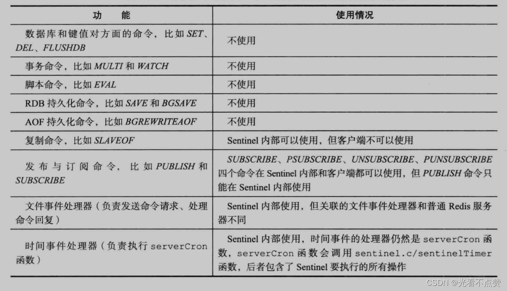
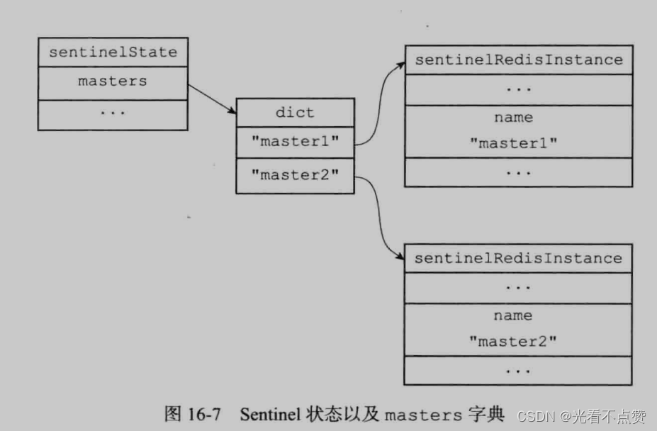
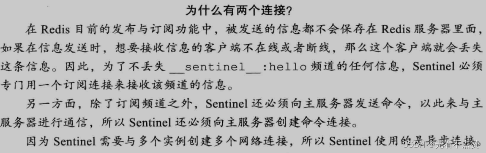
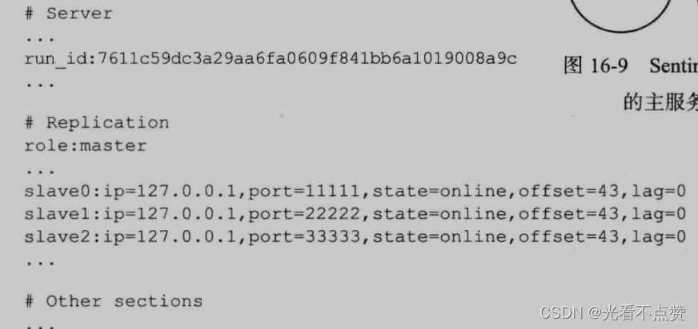
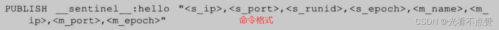
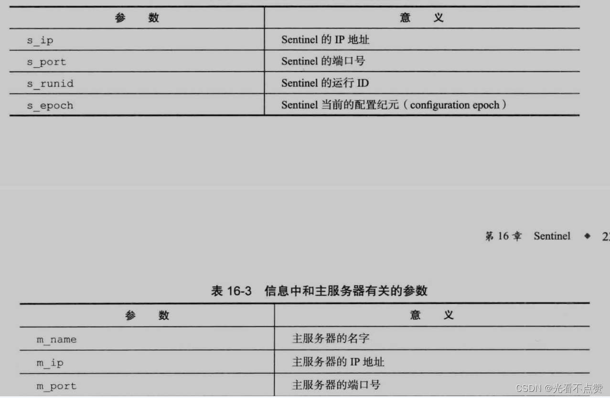
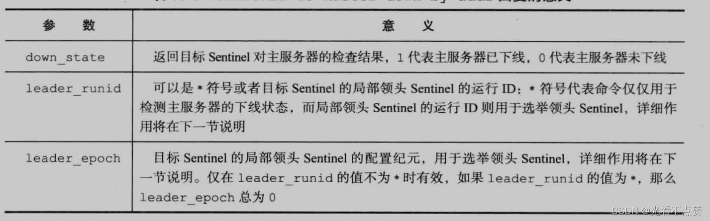
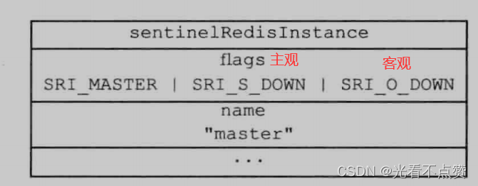

# Redis设计与实现（五）| Sentinel哨兵

type: Post
status: Published
date: 2022/06/30
summary: sentinel中文译为哨兵，是redis实现高可用的关键机制，可以有单个或多个的方式组成一套观察整个服务器组（主服务器以及他们的从服务器）的观察形势，可以监视服务器的上线与下线，并且在主服务器下线超过用户设置的时长时，自动挑选某个从服务器升级为主服务器，继而处理命令；若该主服务器上线时又会被哨兵设置成从服务器。
tags: Redis
category: 缓存

# Sentinel

- 概述

> sentinel中文译为哨兵，是redis实现高可用的关键机制，可以有单个或多个的方式组成一套观察整个服务器组（主服务器以及他们的从服务器）的观察形势，可以监视服务器的上线与下线，并且在主服务器下线超过用户设置的时长时，自动挑选某个从服务器升级为主服务器，继而处理命令；若该主服务器上线时又会被哨兵设置成从服务器。
> 

## 1.启动并初始化Sentinel

- 概述

> 可以使用如下的命令启动Sentinel，启动Sentinel时一般需要执行以下步骤：
> 
> 1. 初始化服务器
> 2. 将普通redis服务器使用的代码替换成Sentinel专用代码
> 3. 初始化Sentinel状态
> 4. 根据给定的配置文件，初始化Sentinel的监视主服务器列表
> 5. 创建连向主服务器的网络连接

```sql
$ redis-sentinel /path/to/your/ sentinel.conf
# 或者命令:
$ redis-server /path/to/your/sentinel.conf --sentinel

```

### 1.1 初始化服务器

- 概述

> Sentinel是一个特殊的redis服务器，所以我们要先启动一个普通的redis服务器对其进行初始化，跟平常的初始化较为不同，为了实现特点的某些功能其余多余的功能就不会进行初始化加载进来，详情如下图
> 
> 
> 
> 

### 1.2 使用Sentinel专用代码

- 概述

> 启动Sentinel的第二个步骤就是将普通的redis服务器使用的代码转换成专用的，例如普通服务器默认的端口是6379而要转换成Sentinel的端口26379，例如会把使用不到的命令直接不载入只会载入PING、SENTINEL、INFO、SUBSCRIBE、UNSUBSCRIBE、PSUBSCRIBE和PUNSUBSCRIBE
> 

### 1.3 初始化Sentinel状态

- 概述

> 替换成专用代码后，服务器会初始化一个SentinelState（Sentinel状态）的结构，专门存放服务器中所有和Sentinel功能有关的结构（当然常规的还是放到redisServer中）
> 

```cpp
struct sentinelState {
    char myid[CONFIG_RUN_ID_SIZE+1]; /* This sentinel ID. */

    // 当前纪元，用于故障转移
    uint64_t current_epoch;         /* Current epoch. */

    // 保存了被该哨兵监视的主服务器（多个）
    // 使用字典，键是主服务器的名字，值是指向主服务器（sentinelRedisInstance 结构）的指针
    dict *masters;      /* Dictionary of master sentinelRedisInstances.
                           Key is the instance name, value is the
                           sentinelRedisInstance structure pointer. */
    // 是否进入TILT模式
    int tilt;           /* Are we in TILT mode? */

    // 目前正在执行的脚本数量
    int running_scripts;    /* Number of scripts in execution right now. */

	// 进入TILT时间
    mstime_t tilt_start_time;       /* When TITL started. */

	// 最后一次执行时间处理器时间
	mstime_t previous_time;         /* Last time we ran the time handler. */

	// 一个队列，保存所有需要执行的用户脚本
    list *scripts_queue;            /* Queue of user scripts to execute. */
    char *announce_ip;  /* IP addr that is gossiped to other sentinels if
                           not NULL. */
    int announce_port;  /* Port that is gossiped to other sentinels if
                           non zero. */
    unsigned long simfailure_flags; /* Failures simulation. */
    int deny_scripts_reconfig; /* Allow SENTINEL SET ... to change script
                                  paths at runtime? */
    char *sentinel_auth_pass;    /* Password to use for AUTH against other sentinel */
    char *sentinel_auth_user;    /* Username for ACLs AUTH against other sentinel. */
} sentinel;

```

### 1.4 初始化Sentinel状态的masters属性

- 概述

> 刚才介绍的Sentinel状态中的masters字典记录了所有被Sentinel监视的主服务器的相关信息，其中字典的键时被监视主服务器的名字，字典的值则是被监视主服务器对应的sentinelRedisInstance（实例结构）结构，这个结构代表着被sentinel监视的redis服务器实例，这个实例可以是主服务器、从服务器或者是另一个sentinel
> 
- 实体结构如下

```cpp
typedef struct sentinelRedisInstance {
	// 标识值，记录了示例的类型，以及该实例的当前状态
    int flags;

    // 实例的名字
   	// 主服务器的名字由用户在配置文件中设置，从服务器以及哨兵由哨兵自动设置
    char *name;

    // 实例的运行时id
    char *runid;

	// 配置纪元，用于实现故障转移
    uint64_t config_epoch;  /* Configuration epoch. */

    // 实例的运行时地址（IP+端口号）。通过该变量来寻找主服务器
    sentinelAddr *addr; /* Master host. */

	// 实例无响应多少毫秒之后才会被判断为主观下线
	mstime_t down_after_period;

	// 判断这个实例为客观下线所需的支持投票数量
	int quorunm;

	// 在执行故障转移操作时，可以同时对新的主服务器进行同步的从服务器数量
	int parallel_sync;

	// 刷新故障迁移状态的最大时限
	mstime_t failover_timeout;

    ...

    // 从服务器的字典
    dict *slaves;       /* Slaves for this master instance. */

    // 其他哨兵的字典
    dict *sentinels;    /* Other sentinels monitoring the same master. */
} sentinelRedisInstance;

```

- 说明

> 对sentinel的初始化将引起对masters字典的初始化，对masters字典的初始化是根据被载入的Sentinel配置文件进行的，配置文件，根据配置文件加载的实例结构如下图
> 
> 
> 
> 
> 
> 
- 假如有两个这样的结构，那么宏观上就是如下图
    
    
    

### 1.5 创建连向主服务器的网络连接

- 概述

> 此处Sentinel与被监视主服务器建立网络连接后，Sentinel成为主服务器的客户端可以发送命令并接收回传信息，对于每个被监视的主服务器来说，Sentinel会创建两个连向主服务器的异步网络连接
> 
> - 一个是命令连接，专用于向主服务器发送命令，并接收命令回复
> - 一个是订阅连接，这个连接专门用于订阅主服务器的`_sentinel_:hello`频道
>     
>     
>     
>     
>     

## 2.获取主服务器信息

- 概述

> Sentinel每10秒一次的频率向主服务器发送INFO命令，根据回复来获取主服务器当前信息，这个当前信息可以分为两个方面，根据这两个方面例如当主服务器重启时，会将新的ID进行更新等
> 
> - 主服务器本身的信息，比如runid、role域记录的服务器角色
> - 从服务器的信息，根据此Sentinel不需要用户提供地址就能自动发现从服务器
>     
>     
>     
- 更新slaves字典

> Sentinel会根据返回的从服务器信息，用于更新主服务器实例结构中的slaves字典（键是从服务器的名字、值是从服务器对应的实例结构），这个字典记录该主服务器的从服务器，分析这个信息，会检查从服务器对应的实例结构是否已经存在于salves
> 
> - 如果存在，则根据信息更新字典
> - 如果不存在，则根据信息在字典中开辟新的添加进去
- 结构如下
    
    
    

## 3.获取从服务器的信息

- 概述

> 前面说到Sentinel发现回复信息有新的从服务器信息，会为他在slaves字典中创建新的实例结构，但除了这个还会给从服务器创建命令连接和订阅连接，同样会通过命令连接每隔10秒发送INFO命令来获取从服务器信息
> 

> 根据回复的信息，Sentinel会更新从服务器的实例结构
> 

## 4.向主服务器和从服务器发送消息

- 概述

> 在默认情况下，Sentinel会以2秒一次的频率向通过命令向hello订阅连接发送信息，这个命令会向这个订阅连接发送一条信息，会根据情况里面的信息参数有所不同
> 
> 
> 
> 
- 信息有关参数
    
    
    

## 5.接收来自主服务器和从服务器的频道信息

- 概述

> 上面说到Sentinel会使用命令在hello频道发消息，这里又会通过订阅连接从hello频道接收消息，这个订阅连接会一直持续到Sentinel与服务器断开连接为止
> 
> 
> 
> 
- 多Sentinel

> 在多Sentinel节点的情况下，如果都监视同一个主服务器，说明都订阅了同一个hello频道，那么其中一个Sentinel节点向频道发送信息，别的节点还可以拿这个信息更新自己的主服务器实例结构中的信息，保持了各个节点的数据一致性
> 
> 
> 
> 

### 5.1 更新Sentinels字典

- 概述

> 在Sentinel中的结构中存放在很多个主服务器实体结构，实体结构中会有从服务器字典，存放该主服务器的所有从服务器实体结构，主服务器的实体结构中同样还有Sentinels字典，存放着监视自己的所有哨兵的实体结构，这个字典在每次，某个Sentinel发送信息会附带自己的主服务器、从服务器、订阅同一频道的其他Sentinel信息，而其他Sentinel也是接收该消息会更新自己的结构，就这样利用发送接收来更新Sentinels字典
> 
> 
> 
> 

### 5.2 创建连向其他Sentinel的命令连接

- 概述

> 上述过程除了目标Sentinel使用channel中的信息来更新自己的实体结构外，发送消息的Sentinel如果是一个新的Sentinel，目标Sentinel还会为这个新的在字典创建实体结构，并且还会创建一个命令连接，反向的新的也会创建这个命令连接连向目标Sentinel，最终监视同一服务器的Sentinel将形成相互连接的网络
> 
> 
> 
> 
- Sentinel只会使用订阅同一个频道会传送信息，或者直接使用命令连接来传送，而不会两个Sentinel专门创建订阅连接
    
    
    

## 6.检测主观下线状态

- 概述

> 默认情况下，Sentinel会以1秒的频率发送给所有建立命令连接的实例（主从、sentinel）发送PING命令，注意这里是PING命令而不是上面以10秒发送的来获取信息的INFO命令；通过实例返回的命令来判断是否在线
> 
> - 实例返回`+PONG、-LOADING、-MASTERDOWN`三种中的某一种为有效回复
> - 回复了除了上面三种或者超过规定时间未回复的称为无效回复

> 这个规定的时间由Sentinel中的配置文件down-after-milliseconds选项指定，如果这个时间内，实例连续回复无效回复，那么Sentinel会修改这个实例对应结构中的flags属性，打开SRI_S_DOWN，以表示为主观下线的状态。Sentinel不光会根据此选项的值判断master，还会判断其下面任何实例结构，每个大的Sentinel结构设置的这个选项值可能不同，因此当一个Sentinel认为有个服务器下线，但对同样监视这个服务器的另一个Sentinel来说由于这个选项值的不同，这个服务器并未下线
> 

## 7.检查客观下线状态

### 7.1 发送检查命令

- 概述

> 当前Sentinel认为主服务器下线后，为了确保真的下线了，会发送一个命令向其他也监视了这个主服务器的Sentinel来确认，当这些Sentinel都认为这个主服务器下线了，这个主服务器客观上也就下线了
> 

```sql
# 参数意义如下
SENTINEL is-master-down-by-addr <ip> <port> <current_epoch> <runid>

```


### 7.2 接收检查命令

- 概述

> 当目标Sentinel接收到这个命令后，会分析命令所包含的参数，然后根据IP+端口去检查主服务器是否下线，然后返回一个带有
> 
> 
> ```
> <down state><leader runid><leader epoch>
> ```
> 
> 
> 

### 7.3 is-master-down-by-addr发送方的后续处理

- 概述

> 发送方会统计收到目标Sentinel同意主服务器已下线的数量，当这一数量达到配置的指定客观下线所需要的数量，Sentinel就会为该主服务器的实例结构的flags属性中表示SRI_O_DOWN，表示客观下线状态
> 
> 
> 
> 
- 注意

> 当然不同的Sentinel发起者会有不同的配置标准，你认为是两台同意下线，我认为是五台同意下线之类的，以自己为准
> 

## 8.选举领头Sentinel和故障转移

- 概述

> 当一个主服务器被判断为客观下线时，监视这个下线主服务器的各个Sentinel会进行协商，选出一个领头的Sentinel，来进行下线主服务器的故障处理善后
> 

### 8.1 选举规则

- 每个`Sentinel`都有机会
- 开始选举，每个`Sentinel`向外发送`is-master-down-by-addr`命令，不过所携带参数跟检查主服务器是否下线的时候不同，发送方就是有意向成为局部领头，不管选举成功与否，配置纪元都会`+1`，所以配置纪元就是一个计数器
- 接收方会根据先到先得的原则，设置第一个来到的命令对应的`Sentinel`，设置完成后，被设置的`Sentinel`就成为局部领头，并且设置方的配置纪元不在发生变化，并且之后来的都拒绝
- 当以监视同一个主服务器的所有`Sentinel`完成设置选举，某个局部领头如果被半数的目标`Sentinel`设置，那么此局部领头称为领头
- 如果没有选出来则暂停一段时间继续

### 8.2 故障转移

- 概述

> 选出领头后，要进行故障转移，总共有三个步骤：
> 
> 1. 在所属以前主服务器的所有从服务器中挑选一个从服务器作为新的主服务器，向这个从服务器发送SLAVEOF no one：**领头Sentinel会维护一个列表，所有从服务器都在里面，不过会通过一个定规则淘汰，你就记住只有活跃的留下，并通过一定的优先级算法最终选出一个新主服务器**
> 2. 让其他从服务器更改复制新的主服务器：**让其他没有选上的从服务器执行SLAVEOF，参数携带新的主服务的IP+端口**
> 3. 让下线的主服务器改为新主服务器的从服务器，使其上线后继续工作：重新上线后让其执行SLAVEOF命令同上