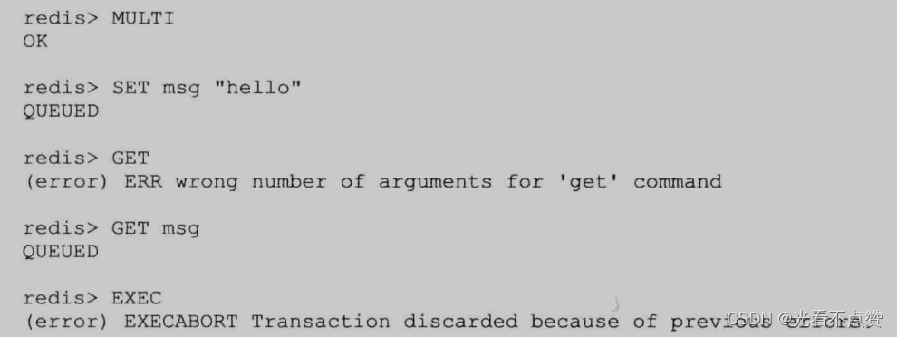
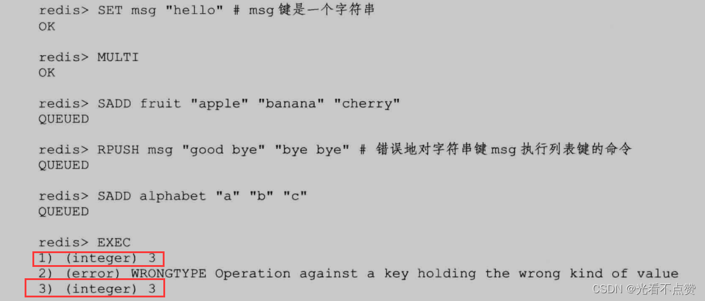
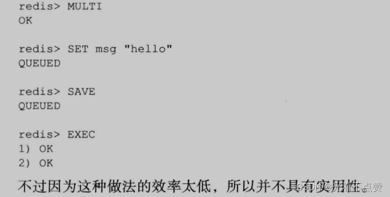

# Redis设计与实现（八）| 事务

type: Post
status: Published
date: 2022/07/03
summary: Redis通过MULTI、EXEC、WATCH等命令来实现事务（transaction)功能。事务提供了一种将多个命令请求打包，然后一次性、按顺序地执行多个命令的机制并且在事务执行期间，服务器不会中断事务而改去执行其他客户端的命令请求，它会将事务中的所有命令都执行完毕，然后才去处理其他客户端的命令请求
tags: Redis
category: 缓存


# 事务

- 概述

> Redis通过MULTI、EXEC、WATCH等命令来实现事务（transaction)功能。事务提供了一种将多个命令请求打包，然后一次性、按顺序地执行多个命令的机制并且在事务执行期间，服务器不会中断事务而改去执行其他客户端的命令请求，它会将事务中的所有命令都执行完毕，然后才去处理其他客户端的命令请求。
> 

> 但凡是事务都需要满足ACID，即原子性，一致性，隔离性和持久性
> 

```sql
127.0.0.1:6379> multi
OK
127.0.0.1:6379> set "name" "lhj"
QUEUED
127.0.0.1:6379> get "name"
QUEUED
127.0.0.1:6379> set "py" "sb"
QUEUED
127.0.0.1:6379> get "py"
QUEUED
127.0.0.1:6379> exec
1) OK
2) "lhj"
3) OK
4) "sb"

```

## 1.事务的实现

- 事务三阶段

> 事务开始：MULTI，会加上事务的标识命令入队事务执行：EXIT、EXEC，将事务的标识去除
> 

### 1.1 命令入队

- 概述

> 在事务阶段内，对于发送的不同命令会有不同的反应
> 
> - 如果客户端发送的命令为`EXEC、DISCARD、WATCH、MULTI`四个命令的其中一个，那么服务器立即执行这个命令。
> - 与此相反，如果客户端发送的命令是`EXEC、DISCARD、WATCH、MULTI`四个命令以外的其他命令，那么服务器并不立即执行这个命令，而是将这个命令放人一个事务队列里面，然后向客户端返回`QUEUED`回复。

### 1.2 事务队列

- 概述

> 每个客户端在自己的redisClient结构中都有事务状态，事务状态中，有事务队列和已入队命令计数，事务队列以FIFO的方式保存入队的命令
> 

```cpp
typedef struet multiState {
	//事务队列，FIFO顺序
	multiCmd *commands;
	//已入队命令计数
	int count;
}multistate;

//队列的结构
typedef struct multiCmd {
	//参数
	robj **argv;
	//参数数量
	int argc;
	//命令指针
	struct redisCommand *cmd;
}multiCmd;

```

### 1.3 执行事务

- 概述

> 当一个处于事务状态的客户端向服务器发送EXEC命令时，这个EXEC命令将立即被服务器执行。服务器会遍历这个客户端的事务队列，执行队列中保存的所有命令，最后将执行命令所得的结果全部返回给客户端。
> 
- 执行过程

> 创建空白回复队列、读取参数和参数数量以及要执行的命令，执行并将结果加入回复队列，移除事务标识，清空客户端事务状态（计数器和释放队列）
> 

## 2.WATCH命令的实现

- 概述

> WATCH命令是一个乐观锁（optimistic locking )，它可以在EXEC命令执行之前，监视任意数量的数据库键，并在EXEC命令执行时，检查被监视的键是否至少有一个已经被修改过了，如果是的话，服务器将拒绝执行事务，并向客户端返回代表事务执行失败的空回复。
> 

```sql
watch "xx" "xx" "xx"

```

- 例子

> 可以看到在T4执行完后，在T5会拒接执行事务
> 
> 
> 
> 

### 2.1 使用WATCH命令监视数据库键

- 概述

> 16个数据库中的redisDb结构中都保存了一个watch_keys的字典，键是被监视的键，值为一个链表，链表中记录了所有监视相应数据库键的客户端
> 

> 从图中可以看到，name键被c1和c2监视，其他同理
> 
> 
> 
> 
- 注意

> 只用当客户端使用了watch，才会出现才对应键的链表中
> 

### 2.2 监视机制的触发

- 概述

> 所有对数据库进行修改的命令，比如SET、LPUSH、SADD、ZREM、DEL、FLUSHDB等等，在执行之后都会调用multi.c/touchWatchRey函数对watched keys字典进行检查，查看是否有客户端正在监视刚刚被命令修改过的数据库键，如果有的话，那么touchwatchKey函数会将监视被修改键的全部客户端的REDIS_DIRTY_CAS标识打开，表示该客户端的事务安全性已经被破坏。
> 

### 2.3 判断事务是否安全

- 概述

> 当某个客户端执行EXEC命令时，都会去检查监视其中执行命令对应的客户端，他的REDIS_DIRTY_CAS标识是否打开，打开与否会决定执行与否
> 

> 如果被打开了，那么说明至少有一个键被修改过了，拒绝执行如果没有打开则提交事务，执行
> 

## 3.事务的ACID性质

- 概述

> 在传统的关系式数据库中，常常用ACID性质来检验事务功能的可靠性和安全性。在Redis中，事务总是具有原子性（Atomicity)、一致性（Consistency）和隔离性( Isolation )，并且当Redis运行在某种特定的持久化模式下时，事务也具有持久性（Durability )。
> 
- 为什么不支持回滚

> 因为要保证Redis的简单高效
> 

### 3.1 原子性（Atomicity)

- 概述

> 原子性是指，在一个事务的所有命令是当做一个整体执行的，要不一个都不执行要么全部执行
在Redis中，事务队列中的命令那么全部执行，要么一个都不执行
> 
- 执行失败

> 执行失败是命令错误而被服务器拒接执行，导致整个事务都不会执行
> 
> 
> 
> 
- 执行完才报错（即不支持回滚）

> Redis的事务和传统的关系型数据库事务的最大区别在于，Redis不支持事务回滚机制( rollback )，即使事务队列中的某个命令在执行期间出现了错误，整个事务也会继续执行下去，直到将事务队列中的所有命令都执行完毕为止。
> 
> 
> 
> 

### 3.2 一致性（Consistency）

- 概述

> 事务具有一致性指的是，如果数据库在执行事务之前是一致的，那么在事务执行之后,无论事务是否执行成功,数据库也应该仍然是一致的。“一致”指的是数据符合数据库本身的定义和要求，没有包含非法或者无效的错误数据。Redis通过谨慎的错误检测和简单的设计来保证事务的一致性，
> 

### 3.2.1 入队错误

- 概述

> 如果一个事务入队命令过程中，出现了命令不存在或者命令格式不正确Redis拒绝执行这个事务；更老的版本不会执行错误的命令，正确的会执行
> 

### 3.2.2 执行错误

- 概述

> 这种错误一般在入队错误中发现不了，比如命令的格式正确但是不规范，只有在执行的时候才能检查出来；并且执行出错的命令不会中断事务，会继续执行余下的命令，并且已执行的不会被出错的影响
> 

### 3.2.3 服务器停机

- 概述

> 总之你记住，无论是运行在没有持久化的内存还是RDB或是AOF都不会造成数据不一致，单论你没有持久化方案的因为重启以后数据库会变空那么数据总是一致的
> 

### 3.3 隔离性( Isolation )

- 概述

> 事务的隔离性指的是，即使数据库中有多个事务并发地执行，各个事务之间也不会互相影响，并且在并发状态下执行的事务和串行执行的事务产生的结果完全相同。
> 

> 因为Redis使用单线程的方式来执行事务（以及事务队列中的命令)，并且服务器保证，在执行事务期间不会对事务进行中断，因此，Redis的事务总是以串行的方式运行的，并且事务也总是具有隔离性的。
> 

### 3.4 持久性

- 概述

> 事务的耐久性指的是，当一个事务执行完毕时，执行这个事务所得的结果已经被保存到永久性存储介质（比如硬盘）里面了，即使服务器在事务执行完毕之后停机，执行事务所得的结果也不会丢失。
> 

> 因为Redis的事务不过是简单地用队列包裹起了一组Redis命令，Redis并没有为事务提供任何额外的持久化功能，所以Redis事务的耐久性由Redis所使用的持久化模式决定:
> 
> - 没有开始持久化那么自然而然也就没有持久性
> - RDB模式下，也不能保证，因为BGSAVE通常是设定时间并且是在子进程执行的具有异步，那么就不能保证第一时间保存在硬盘中，所以不具备
> - AOF模式中，如果就算是每一秒同步一次也有可能发生数据丢失，如果把频率交还给操作系统即appendfsync选项的值为no时，更不具备持久性了
- 唯有一种情况

> 不论Redis在什么模式下运作，在一个事务的最后加上SAVE命令总可以保证事务的耐久性:
> 
> 
> 
>