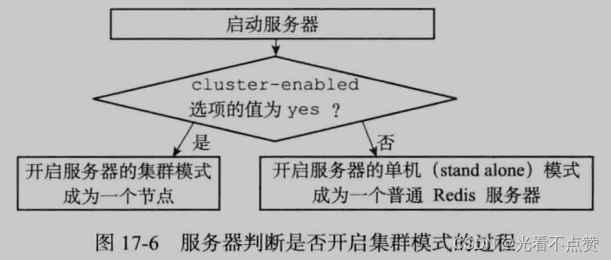
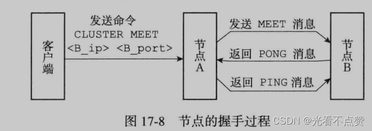
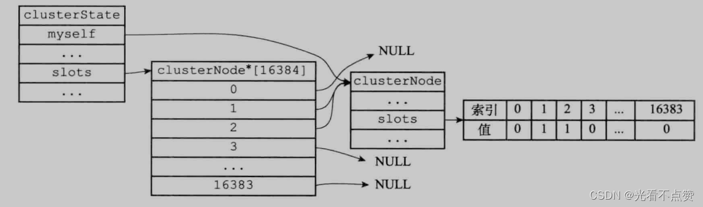
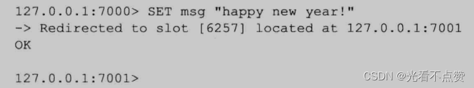
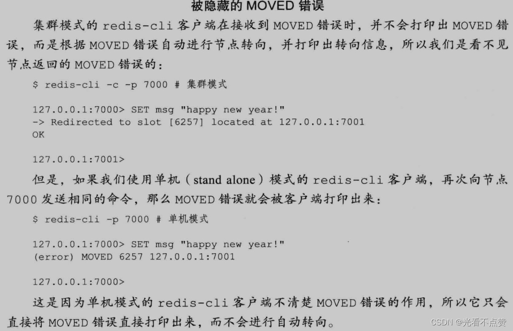
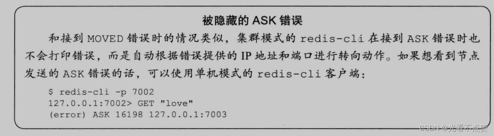
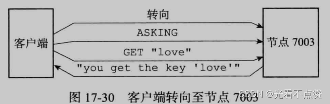
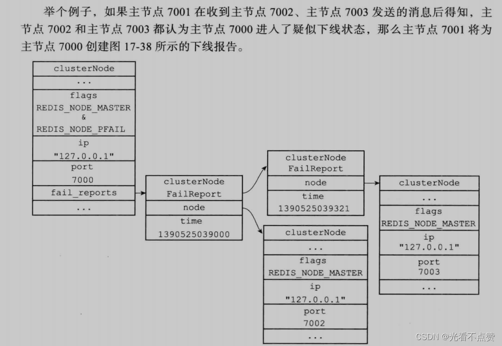

# Redis设计与实现（六）| 集群（分片）

type: Post
status: Published
date: 2022/07/01
summary: 一个Redis集群有多个节点组成，在刚开始的时候每个节点都是独立的，每个节点都处于一个只包含自己的集群当中，使用CLUSTER MEET来让别的节点加入自己的集群
tags: Redis
category: 缓存

# 集群

## 1.节点

- 概述

> 一个Redis集群有多个节点组成，在刚开始的时候每个节点都是独立的，每个节点都处于一个只包含自己的集群当中，使用CLUSTER MEET来让别的节点加入自己的集群
> 
- 例子，假设现在有三个结点分别为`127.0.0.1:7000 127.0.0.1:7001 127.0.0.1:7002`

> 当使用这个命令时，当前节点与所指定的节点进行握手，握手成功后则加入当前的集群
> 

```sql
CLUSTER MEET <ip> <port>

# 我们将7001和7002加入7000
127.0.0.1:7000> CLUSTER MEET 127.0.0.1 7001
# 然后你查看CLUSTER NODES就可以看到原来一个节点变成两个了
# 信息有结点id ip port 是主是从等
127.0.0.1:7000> CLUSTER MEET 127.0.0.1 7002

```


- Docker中随机分配集群命令

> 进到某个节点的docker的bin/bash命令行中
> 

```
# 这个命令就会创建6个节点的结构，并且开启主从模式，会随机挑选三个主节点以及他们的从节点
redis-cli --cluster create 192.168.56.10.7001
192.168.56.10:7002 192.168.56.10.7003
192.168.56.10:7004 192.168.56.10.7005
192.168.56.10.7006 --cluster-replicas 1

```

### 1.1 启动节点

- 概述

> 一个节点是在一个集群模式下的
> 
> 
> ```
> Redis
> ```
> 
> ```
> cluster-enabled
> ```
> 
> ```
> Redis
> ```
> 
> 
> 

### 1.2 集群数据结构

- 概述

> 既然成为了节点，那自然而然就会有集群节点的结构，总共有三个clusterNode、clusterLink、clusterState，这三个结构都在cluster的头结构中
> 

> 我们先介绍clusterNode，每个节点都使用一个clusterNode结构来记录自己的状态，并为集群中的其他主节点或从节点都创建一个这样的结构
> 

```cpp
struct clusterNode(

	//创建节点时间
    mstime_t ctime;

    //节点的名字
    //由40个十六进制字符组成
    char name[REDIS_CLUSTER_NAMELEN];

    //节点标识
    //用来区分节点是主还是从节点
    //以及区分节点的状态（上线还是下线）
    int flags;

    //节点当前的配置纪元，用于实现故障转移
    unit64_t configEpoch;

    //节点的ip地址
    char ip[REDIS_IP_STR_LEN];

    //节点的端口号
    int port;

    //保存连接节点所需的有关信息（TCP建链连接）
    clusterLink *link;
    //...
)

```

- clusterLink结构

> 可以看到Node结构中的Link属性，其实就是对应clusterLink结构
> 

```cpp
typedef struct clusterLink(

	//连接的创建时间
    mstime_t ctime;

    //TCP套接字描述符（记录节点连接当前节点使用的套接字）
    int fd;

    //输出缓冲区（保存着等待发送给其他节点的消息）
    sds sndbuf

    //输入缓冲区（保存着从其他节点接收到的信息）
    sds rcvbuf;

    //与这个连接相关联的节点，如果没有的话就为NULL（也就是引用clusterLink的节点）
    //相当于形成了一个互通
    struct clusterNode *node;
)clusterLink

```


- clusterState结构

> 每个节点都对应一个clusterState结构
> 

```cpp
typedef struct clusterState(

	//指向当前节点的指针
    clusterNode *myself;

    //集群当前的配置纪元，用来实现故障转移的
    uinit64_t currentEpoch;

    //集群当前的状态，下线还是上线
    int state;

    //集群中处理槽的节点的数量
    int size;

    //集群节点名单（包括Myself）
    //使用字典保存，键为节点的名字，值为节点对应的clusterNode结构
    dict *nodes;
    //....
)clusterState;

```

### 1.3 CLUSTER MEET命令的实现

- 概述

> 当节点A向节点B使用该命令时，会进行握手来确认彼此的存在
> 
> 1. A为B生成一个`clusterNode`结构，并添加该结构到自己的`clusterState.nodes`字典中
> 2. 之后根据命令带的`Ip+port`，向目标节点发送`meet`信息
> 3. 如果一切顺利，节点`B`将收到这条，同理也会创建相应结构
> 4. 返回一条`PONG`消息
> 5. 如果顺利，节点`A`收到，并在发送一条`PING`消息
> 6. 此时节点`B`收到`PING`消息，`B`节点知道了`A`成功收到了`PONG`，握手完成
>     
>     
>     

## 2.槽指派

- 概述

> Redis集群通过分片的形式来保存数据库的键值对，集群的整个数据库被分为16384个槽，集群中的每个节点可以处理0个或16384个槽，所以当数据库的每个槽都在被处理才认为集群是上线的，相反如果数据库中有任何一个槽没有得到处理，那么集群处于下线状态
> 

```sql
# 将0~5000的槽指派给7000节点负责
127.0.0.1:7000> CLUSTER ADDSLOTS 0 1 2 3 .... 5000

```

### 2.1 记录节点的槽指派信息

- 概述

> clusterNode结构中的slots属性和numslot属性记录了节点负责处理那些槽
> 

```cpp
struct clusterNode {
	. . .

	// 一个二进制数组
	// 包含2048个字节，也就是16384个二进制位
	unsigned char slots[16384 / 8];

	// 	记录节点负责处理的槽的数量，也就是数组中二进制位为1的数量
	int numslots;
}

```

- slots数组

> slots是一个二进制位的数组，这个数组的长度为16384/8=2048个字节，以0为起始，16383为结尾，每个二进制位都有其索引对应
> 
> - 如果slots数组在索引i的二进制位的值为1，那么表示节点负责处理槽i
> - 相反如果值是0，则不负责处理
>     
>     
>     
- 总结

> 因为是数组，所以查找或者赋值都是O1的复杂度，至于slotsnum就是有几个二进制位是1，如上图就是8
> 

### 2.2 传播节点的槽指派信息

- 概述

> 一个节点负责那些槽同样需要别的节点知道，当节点收到别的节点的slots数组，是在自己的clusterState.nodes字典中查找别的节点的clusterNode结构，并对结构中的slots数组进行更新
> 

### 2.3 记录集群所有槽的指派信息

- 概述

> 上面观察clusterState结构中，也有个slots数组，这个数组就是记录整个集群的槽指派情况，数组保存的内容与节点自己保存的不同
> 
> - 数组某个索引元素指向null，就证明没有分配
> - 指向某个clusterNode结构，就证明分配了


- 注意

> 这里也许会有疑问，clusterState存了一份slots数组，clusterNode这在存一份有必要吗？
> 
> - 因为程序需要将某节点的槽指派信息发送给另外节点直接发送`clusterNode`就可
> - 如果没有这个，都要去遍历一边`clusterState`在去发送槽指派，这比每个都有一份`Node`要低效的多
>     
>     
>     

### 2.4 CLUSTER ADDSLOTS命令的实现

- 概述

> 大概过程就是根据这个命令后面带的参数，去检查这个槽是否已经指派，但凡其中有一个被指派了就返回错误，如果一个都未被指派，再次遍历所有输入槽，将这些槽指派给当前节点
> 
- 例子

> 例如向没有指派过任何槽的结点，指派1和2
> 

```sql
CLUSTER ADDSLOTS 1 2

```




## 3.在集群执行命令

- 概述

> 指派完全部的槽，集群就进入上线状态，可以接收来自客户端的命令，当客户端想要访问或修改的某个数据，接收命令的节点会计算出要处理的数据库键属于那个槽，并检查这个槽是否指派给了自己
> 
> 
> 
> 

### 3.1 计算键属于哪个槽

- 概述

> CRC16是计算key与CRC-16的校验和，与运算16383是计算出介于0~16383之间的整数作为key的槽号
> 

```cpp
def slot_number(key):
	return CRC16(key) & 16383

```

- 获取键的槽

> 这个命令就是调用上面的算法得出的
> 

```sql
CLUSTER KEYSLOT "xxx"

```

- 为什么槽的数量是16384个

> 这里讲完这个槽位置的算法后就能讲一讲为什么是这么一个奇怪的数字。首先循环冗余16位算出的值是一个16bit位的值，这个值的范围是0~65536个这么多，那为什么要用16384呢？
> 
> 1. 如果是有65536个槽，那么网络通信的消息头大小就必须占用`slots[CLUSTER_SLOTS/8]`，那么65536算下来的slots数组就站8kb这么多，因为每分钟都会进行心跳请求去同步槽的占用情况，纯纯浪费带宽
> 2. redis中总的节点量不会超过1000个，当达到这个数量，那么心跳请求所要同步的节点数量太多了
> 3. 槽位越小，节点少的情况下，压缩率高。Redis主节点的配置信息中，它所负责的哈希槽是通过一张bitmap的形式来保存的，在传输过程中，会对bitmap进行压缩，但是如果bitmap的填充率slots / N很高的话(N表示节点数)，bitmap的压缩率就很低。 如果节点数很少，而哈希槽数量很多的话，bitmap的压缩率就很低。

### 3.2 判断槽是否由当前节点负责处理

- 概述

> 节点计算出键所属的槽，就要去自己的结构中检查，即在clusterState.slots数组中的i项，判断是否是自己负责
> 
> - 看这个i项是否指向clusterState.myself，那么说明自己负责，可以执行客户端发送的命令
> - 不指向myself，会根据i位置指向的结点返回MOVED错误，指引客户端转向正在处理槽i的节点

### 3.3 MOVED错误

- 概述

> 当前节点发现该槽不是自己处理时就会返回一个MOVED错误，指引客户端转向
> 
- 格式

> 其中slot为键所在的槽，ip和端口号则是负责这个槽的节点地址
> 

```sql
MOVED <slot> <ip>:<port>

```

> 所谓节点转向，就是换一个套接字来执行该命令
> 
> 
> 
> 
> 
> 

### 3.4 节点数据库的实现

- 概述

> 节点服务器对于键值对的保存以及过期策略跟单机的一种，就是定期+惰性，单机对于节点只有一个区别在数据库，就是节点只能用0号数据库，单机Redis服务器则没有这个限制
> 

### 3.4.1 槽与键的映射关系及操作

- 概述

> 这个关系是由节点状态中的slots_to_keys跳跃表来表示的，这个跳跃的每个节点的分值（score）都是一个槽号，而每个节点的成员都是一个数据库键
> 
- 添加新的键值对

> 节点就会将这个键以及键的槽号关联到slots_to_keys跳跃表
> 
- 删除键值对

> 节点就在跳跃表中解除分值与被删除键的关系
> 
- 跳跃表结构

> 因为保存在跳跃表中，我们对于槽和键值对的操作就更加方便一点，例如CLUSTER GETKEYSINSLOT<slot><count>可以查看对应槽有多少个键
> 


## 4.重新分片

- 概述

> Redis集群的重新分片操作可以将任意数量已经指派给某个节点的槽改为指派给另外一个节点，并且相关的键值对也要过去哦，并且重新分片不需要下线，	Online的集群的各个节点依然可以接收命令
> 

### 4.1 重新分片的原理

- 概述

> 这个命令是由Redis集群管理软件redis-trib负责执行，记住槽与键是同步迁移的哦
> 
- 对集群单个槽进行重新分片的步骤

> redis-trib对目标节点发送 CLUSTER SETSLOT<slot> IMPROTING <source_id>命令，让目标节点准备好从源节点导入（ import）属于槽slot的键值对redis-trib对源节点发送CLUSTER SETSLOT <slot> MIGRATING<target_ id>命令，让源节点准备好将属于槽slot的键值对迁移( migrate）至目标节点。redis-trib向源节点发送CLUSTER GETKEYSINSLOT <slot> <count>命令，获得最多count个属于槽slot的键值对的键名（key name )。对于步骤3获得的每个键名，redis-trib都向源节点发送一个MIGRATE<target_ip> <target_port> <key_name> 0 <timeout>命令，将被选中的键原子地从源节点迁移至目标节点。重复执行步骤3和步骤4，直到源节点保存的所有属于槽slot的键值对都被迁移至目标节点为止。每次迁移键的过程如图17-24所示。redis-trib向集群中的任意一个节点发送 CLUSTER SETSLOT<slot> NODE<target_id>命令，将槽slot指派给目标节点，这一指派信息会通过消息发送至整个集群,最终集群中的所有节点都会知道槽slot已经指派给了目标节点。
> 


## 5.ASK错误

- 概述

> 在重新分片的过程中，源节点向目标节点迁移一个槽的时候，可能会出现一部分键保存在源节点中，另一部分保存在目标节点中，这时客户端向服务器发送查询更改的键正好属于正在迁移的槽怎么办？
> 
- 处理方法

> 如果改建在源节点里面，那么就直接执行客户端传过来的命令如果不在源节点，说明已经迁移过去了，向客户端返回一个ASK错误，指引客户端转向目标节点，还就那个另外一个版本的MOVED
> 
- 注意

> 这里面的ASK并不会主动切换节点哦，也就是自动转向，也就是说和MOVED不一样需要自己切换节点
> 
> 
> 
> 

### 5.1 CLUSTER SETSLOT IMPORTING命令的实现

- 概述

> 该命令的作用就是通知让重新分片迁移的目标节点做好导入槽的工作，该命令是在节点状态中的一个数组结构，
> 
> 
> **如果对于索引的槽不为NULL，而是指向节点，就表示当前结点正在导入槽，这个数组的对应索引的槽就指向自己**
> 
> 
> 

### 5.2 CLUSTER SETSLOT MIGRATING命令的实现

- 概述

> 这个命令是通知重新分片迁移的源节点做好迁移的准备工作，同理在节点状态中也是一个数组，对应槽指向NULL说明没有迁移，指向自己就说明正在迁移
> 
> 
> 
> 

### 5.3 ASK错误

- 概述

> 我们前面说过，如果执行命令的键不属于当前节点所负责的槽，那么服务器会返回一个MOVED命令，在这之前其实会在CLUSTER SETSLOT MIGRATING这个数组中找一下，对应的槽是否正在进行迁移，如果正在进行迁移就会返回一个ASK而不是MOVED，没有迁移本节点还没有就会返回一个MOVED
> 
- ASKING

> 如果不在源节点通过返回ASK错误，我们可以使用ASKING命令来转向
> 
> 
> 
> 
> 
> 
- 注意

> 这个转向不是真的转向，而是套上了一次性使用的redis_asking标识符去请求目标节点，实际发出命令的节点并不是源节点，当你第二次标识符会被撤去，使用同样的命令会返回MOVED错误，然后在转向该键真正所在的槽的负责节点，也就是目标节点
> 

> 一定要分清楚MOVED和ASK错误的区别哦
> 

## 6.复制和故障转移

- 概述

> Redis集群中分为主节点和从节点，其中主节点负责接待命令并处理槽，从节点用于复制某个主节点，然后伺机而动等主节点挂掉
> 
- 如果有从节点的主节点挂掉了

> 此时会在属于挂掉的主节点中的从节点中选一个节点出任新的主节点，然后其他从节点改为复制新的主节点，如果之后挂掉的主节点重新上线同样会加入到新的主节点的从节点列表中
> 

### 6.1 设置从节点

- 命令

```sql
CLUSTER ERPLICATE <node_id>

```

- 概述

> 当你用上面命令后，使用命令的节点成为node_id的从节点并开始复制工作，使用命令的节点会在自己的节点状态的nodes字典中找到指定节点node_id对应的节点结构，并将自己的从节点所属指针指向该结构，依次来表示这个节点正在复制主节点
> 

> 然后修改自己的标志flag中master改为slave标识
> 

> 然后调用复制函数并根据slave指针指向的节点结构中的ip+port对主节点进行复制，这里的函数使用了单机redis的赋值函数即SLAVEOF <master_ip> <master_port>
> 

> 同时复制节点这一消息会发送给集群中的别的节点，每个节点都会在自己的节点结构中记录正在被复制的节点（slaves）和复制节点的从节点名单（numslaves）
> 

### 6.2 故障检测

- 概述

> 集群中每个节点都会定期的向别的节点发送ping命令，如果规定时间内收到的节点回复消息pong，那么这个节点就疑似下线，同时发送ping命令的会在自己的节点状态的nodes字典中去标识PFAIL（疑似下线），同时已经下线的标识是（FAIL）
> 
- 告知记录

> 同时这个节点下线的消息会给别的节点说，同时在自己的节点结构中的fail_reports记录直到这个下线消息的节点，例如7000向7002说，7001下线了，那么7002就会别记录在7000的这个属性中
> 
- 下线记录

> 某个节点的下线记录是由clusterNodeFailReport结构表示的
> 
- 例子
    
    
    
- 下线状态

> 如果集群中某个节点已经被半数的节点报告过疑似下线，那么这个节点会被标记下线，然后主节点会将这条消息传播，每个节点都会将这个节点的状态标志设置为下线
> 

### 6.3 故障转移

- 概述

> 当一个节点发现自己正在复制的主节点进入已下线状态时，从节点会进行故障转移，执行步骤如下
> 
> 1. 复制下线主节点的所有从节点里面，会有一个从节点被选中。
> 2. 被选中的从节点会执行SLAVEOF no one命令，成为新的主节点。
> 3. 新的主节点会撤销所有对已下线主节点的槽指派，并将这些槽全部指派给自己。
> 4. 新的主节点向集群广播一条PONG消息，这条PONG消息可以让集群中的其他节点立即知道这个节点已经由从节点变成了主节点，并且这个主节点已经接管了原本由已下线节点负责处理的槽。
> 5. 新的主节点开始接收和自己负责处理的槽有关的命令请求，故障转移完成。

### 6.3.1 选举新的从节点

- 概述

> 这里就不在叙述了，具体选举方法跟Sentinel选领头非常类似，都是使用了Raft算法的领头选举方法来实现的
> 

## 7.消息

- 概述

> 刚才我们一直忽略了节点之间的信息是怎么互通的，现在来系统说一下，集群中发送消息的称为发送者，接收消息的称为接收者
> 
- 消息的组成

> 消息由消息头和消息正文组成
> 
- 消息的类型

> MEET消息：发送方请求加入接收接收方的集群PING消息：这个就是来确认是否在线的，会每个一段时间去发送PONG消息：收到MEET消息或者PING消息时的回复或者向集群中的其他节点刷新某个节点的状态，上面的故障转移就这样操作过FALL消息：当主节点A认为主节点B进入下线状态，会向集群广播一条关于节点B下线的消息，收的节点会立即将节点B标记为下线PUBLISH消息：当节点接收到一个publish命令，会执行命令广播一条publish命令，收到的节点同样执行该命令
> 

### 7.1 消息头与消息体

- 概述

> 节点发送的所有消息都由一个消息头包裹，消息头除了包含消息正文之外，还记录了消息发送者自身的-一些信息，因为这些信息也会被消息接收者用到，所以严格来讲，我们可以认为消息头本身也是消息的一部分。结构为clusterMsg
> 
- 消息体

> 消息头结构中有个clusterMsgData的消息结构
> 

### 7.2 MEET、PING、PONG命令的实现

- 概述

> Redis集群中的各个节点通过Gossip协议来交换各自关于不同节点的状态信息，其中Gossip协议由MEET、PING、PONG三种消息实现，这三种消息的正文都由两个cluster.h/clusterMsgDataGossip结构组成，三种命令的消息正文都是一样的，所以接收者会通过判断消息头中的type来确定
> 
- 发送

> 发送这三种命令时，发送者会在自己的节点字典中随机挑选出两个节点可以是主节点或从节点，并保存两个节点的信息在消息正文中的clusterMsgDataGossip的结构，接收者在接收消息后会读取这个结构中的节点，并对于节点会分为以下两种
> 
> - 如果被选中节点不在接收者的已知列表中，那么会根据消息正文的节点信息进行握手
> - 如果已经存在，那么会根据信息更新自己的节点列表

### 7.3 FALL消息的实现

- 概述

> 功能就不说了，就是通知下线的节点，FALL消息中保存了下线节点的名字（集群中每个节点都有独一无二的名字）
> 
- 例子

> 如果主节点7001发现主节点7000已下线，那么主节点7001将向主节点7002和主节点7003发送FAIL消息，其中FAIL消息中包含的节点名字为主节点7000的名字，以此来表示主节点7000已下线。当主节点7002和主节点7003都接收到主节点7001 发送的FAIL消息时，它们也会将主节点7000标记为已下线。因为这时集群已经有超过一半的主节点认为主节点7000已下线，所以集群剩下的几个主节点可以判断是否需要将集群标记为下线，又或者开始对主节点7000进行故障转移。
> 

### 7.4 PUBLISH消息的实现

- 命令如下

```sql
PUBLISH <channel> <message>

```

- 概述

> 当客户端向某个节点发送消息的时候，接收到PUBLISH命令的节点不仅会向channel频道发送消息
message,它还会向集群广播一条PUBLISH消息，所有接收到这条PUBLISH消息的节点都会向channel频道发送message消息。
> 
> 
> 
> 

> 这里说的PUBLISH的命令时发送PUBLISH消息，而消息是一个结构，我们之所以不直接广播命令，而是通过客户端让一个节点给集群内所有节点PUBLISH消息
> 
> 
> 
> 
> 
>