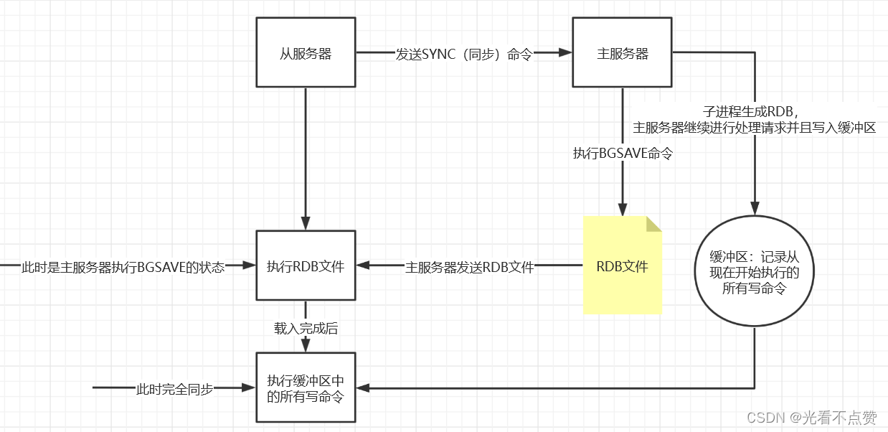
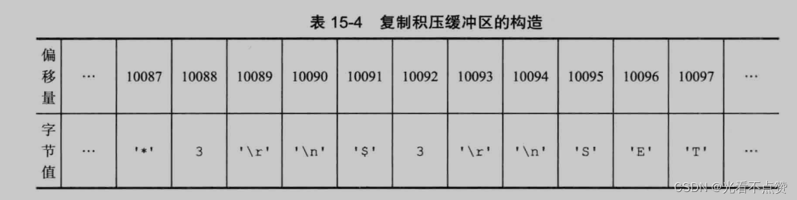
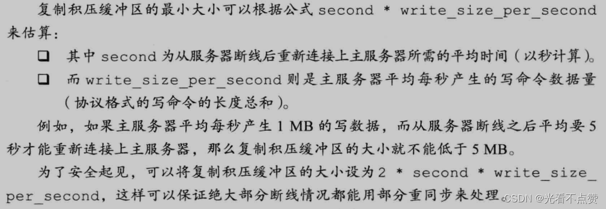

# Redis设计与实现（四）| 主从复制

type: Post
status: Published
date: 2022/06/29
summary: 当服务器使用了SLAVEOF命令，该服务器就变成目标服务器的从服务器
tags: Redis
category: 缓存

# 主从复制

- 概述

> 当服务器使用了SLAVEOF命令，该服务器就变成目标服务器的从服务器
> 
> 
> 
> 

```sql
# 12315将成为6379的从服务器
127.0.0.1:12315> SLAVEOF 127.0.0.1 6379

```

## 1.旧的主从复制

- 概述

> 对于旧的主从复制一般有两个步骤：
> 
> 1. 同步：是将从服务器同步到跟主服务器一样的状态
> 2. 命令传播：意思是修改主服务器的键值对，当主从不同步时，让主从重写回归一直的操作

### 1.1 同步

- 流程图
    
    
    

### 1.2 命令传播

- 概述

> 当在主服务器执行某个命令使主从数据不一致，主服务器就会发送命令到从服务器，让其执行
> 

### 1.3 旧版复制的的缺陷

分为以下两种情况

- 初次复制：从服务器从来没有复制过任何主服务器，或者从服务器复制当前的主服务和上一次的主服务器不一样，复制工作会很好的进行下来
- 断线后复制：断线后从服务器会再一次进行同步工作，不过从主服务器发来的RDB文件是包括首次同步开始的命令到断连重连成功的命令，这个RDB文件十分大且重复，进行同步时会非常的慢。**其实分析可知道我们不需要断连之前的所有命令，只需要断连之后到重连之间的命令对应的RDB文件就可以了**
- sync命令是一个非常消耗资源的操作

> 使用BGSAVE生成RDB文件非常消耗CPU内存磁盘IO的资源发送RDB文件到从服务器非常消耗网络IO资源从服务器加载RDB文件会一直处于阻塞直到加载完成
> 

## 2.新的主从复制

- 概述

> 新的主从复制将sync替换为psync，该命令有两种模式：完整重同步和部分重同步
> 
- 完整重同步

> 跟旧版的首次复制一致
> 
- 部分重同步

> 就是为了解决需要同步的RDB文件太大，这次改进过的直接发送断连期间的命令，从服务器执行就完事了
> 
> 
> 
> 

### 2.1 部分重同步的实现

- 概述

> 该操作的实现依赖于三个功能的构成：
> 
> 1. 主服务器的复制偏移量（replication offset）和从服务器的赋值偏移量
> 2. 主服务器的复制积压缓冲区（replication backlog）
> 3. 服务器的运行ID（run ID）
- 复制偏移量

> 在主服务器和从服务器会分别维护一个复制偏移量，如果主服务器转播了xx字节的命令长度，那么对应主从服务器的偏移量+xx；那么对比主从服务器的偏移量就能知道是否是同步状态
> 
> 
> 
> 

> 当某个从服务器跟主服务器断线后，进行重连会发送自己的偏移量，这时的偏移量对比就不一样的，这时会根据复制积压缓冲区的内容来
> 
- 复制积压缓冲区

> 在主服务器每次执行命令都会将命令写入到复制积压缓冲区，主服务器维护这个区域就是为了断连以后从服务器的同步问题，缓冲区是有一个固定大小的FIFO队列组成，当设置好一个固定大小后主服务器每次写入数据，当容量到达限制将会进行出队
> 
> 
> 
> 
> - 偏移量在这个缓冲区的范围内，那么直接回传给偏移量到重连之间的命令就好
> - **如果偏移量不在这个范围内了，说明更新的太快，那么就执行完整重同步**

> 要根据需要适当调整这个缓冲区的大小
> 
> 
> 
> 
- 服务器运行ID

> 无论是从服务器还是主服务器都会被分配一个独一无二的运行ID，重启会重新分配这个值，此ID可以进行主从校验，当从服务器初次进行同步时，会将主服务器的ID存储到自己的服务器内，当进行重连时
> 
> - 那么如果从服务器存储的ID和主服务器的ID一致说明是之前的，尝试部分重同步
> - 如果不一致，则说明不是之前的，那么进行完整重同步

### 2.2 PSYNC命令的实现

使用PSYNC一般有两种情况

1. 从服务器从来没有复制过任何主服务器，或者使用过`SLAVEOF no one`命令，那么从服务器在开始新的服务会向主服务器发送`PSYNC ? -1`命令，求请与主服务完成完整重同步
2. 如果从服务器复制过，那么在开始新的一次复制则会将自己的保存的上一次运行ID和复制的偏移量发送给主服务器，主服务器根据这两个值会有大概三种策略

> 回复+FULLPSYNC <runid><offset>，也就是说会进行完整重同步，从服务器会保存这个runid，并且以发过来的offset来初始化自己的offset回复+CONTINUE，表示执行部分重同步，等着重发缺失的数据就好并根据此来更新自己的offset回复-ERR，那么就是主服务器版本低于2.8，识别不了这个PSYNC命令
> 

### 2.3 复制的实现

1. 设置主服务器的地址和端口

> 发送SLAVEOF命令，同时将主服务器的IP和端口号保存在自己的serverObject中的materHost和masterPort
> 
1. 建立套接字连接

> 执行完SLAVEOF命令，建立套接字连接。
> 
1. 发送ping命令：

> 检查读写状态是否正常检查主服务器是否能够处理命令请求
> 

> 主服务器收到ping命令后会进行回复收到ping命令，开始回复，大概有三种回复：
> 
> 1. 返回一个命令回复，但从服务器无法读取回复内容，那么表明现在网络状态不好，会断连并重连
> 2. 主服务器向从服务器返回一个错误，表示当前无法处理这个连接，那么从服务器会断开重连
> 3. 返回pong，表示可以开始同步工作
1. 身份验证

> 如果从服务器设置了masterAuth，会进行身份验证，没有设置则直接进行接下来的工作；对应的主服务器有一个requirepass的设置，这两者的设置会造成下面的几种情况
> 
> 1. 主服务器没有设置，从也没有设置，复制工作直接进行下一步
> 2. 主从服务器都设置了，那么根据从服务器发送的密码和主服务器设置的密码对比，正确则继续，否则返回invalid password
> 3. 主设置，从未设置，返回错误
> 4. 主未设置，从设置，返回错误
1. 发送端口信息

> 上一步完了以后，从服务器REPLCONF listening-port <port-number>，向主服务器发送从服务器的监听端口号；主服务器收到后会将改端口号记录在从服务器对应的客户端状态中
> 
1. 同步

> 从服务器向主服务器发送PSYNC命令，执行同步操作；在执行同步操作之前，只有从服务器是主服务器的客户端，但在执行同步操作之后，主服务器也会成为从服务器的客户端；正因为这个的关系，主服务器才能通过发命令让从服务器改变状态，这同样也是主服务器对从服务器执行命令传播的基础
> 
1. 命令传播

> 同步完成完成之后就会进入命令传播状态，主服务器会一直向从服务器发送写命令这样就可以保持同步了
> 

### 2.4 心跳检测

- 概述

> 从服务器客户端默认每隔一秒的频率都会向主服务器发送命令 REPLCONF ACK <replication_offset>，其中offset是当前的偏移量，发送这个ACK有三个作用
> 
> 1. **检测主从服务器的网络连接状态**：如果主服务器超过一秒没有收到从服务器的ACK，就说明连接出现了问题，那么主服务器会发送INFO replication命令，在列出的列表参数中有lag一栏就是上次距离这次的时间
> 2. **辅助实现min-slaves选项**
> 3. **检测命令丢失**
- 辅助实现min-slaves配置选项

> Redis的min-slaves-to-write和 min-slaves-max-lag这两个参数可以防止主服务器在不安全的情况下执行写命令，例如第一个参数为3，第二个参数为10，那么在从服务器小于3个，或者三个从服务器的延迟（lag）都大于等于10秒，那么主服务器会拒绝写命令
> 
- 检测命令丢失

> 由于网络波动原因，主服务器给从服务器的命令可能半路丢失，当从服务器发送ACK命令时也会把自己的偏移值发送过去，主服务器发现与自己的不符会在复制积压缓冲区中去找从服务器发过来的偏移量为起始，到自己的偏移量为终，将这段发送给从服务器进行执行同步
> 

> 这里注意检测命令丢失的步骤跟部分重同步的步骤和原理很相似，唯一不同的就是检测命令丢失中主从没有断开，而部分重同步则是断开后重连之后执行的
>