# 事件驱动与单线程模型
## 单线程卡
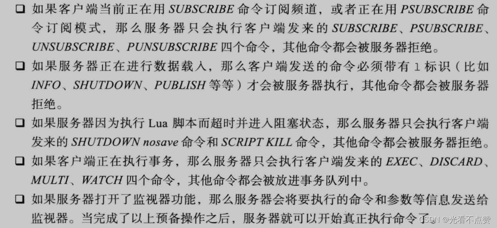

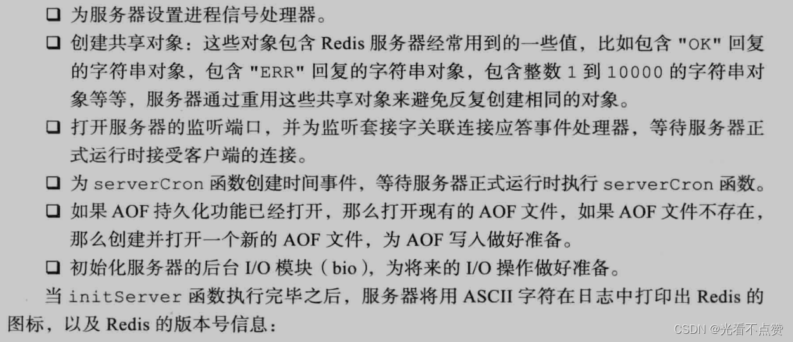
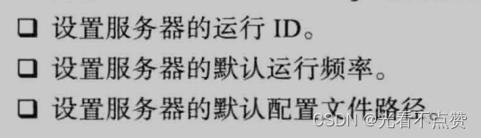

Q: Redis 为什么单线程执行命令仍然很快？
A:
- 大多数操作在内存中完成，避免磁盘随机 IO
- 单线程避免多线程锁竞争和上下文切换
- 使用 IO 多路复用处理大量连接
- 数据结构实现高度优化
- 面试边界：Redis 单线程主要指命令执行主路径，后台任务和新版网络 IO 可能有多线程参与

## 事件模型卡
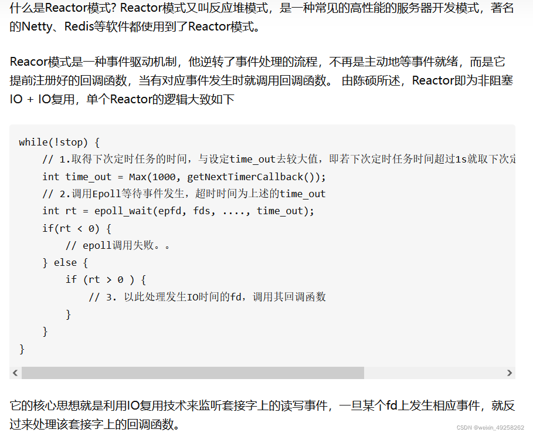
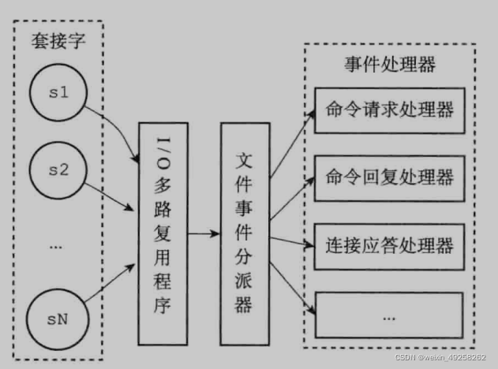
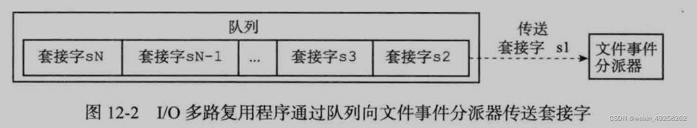
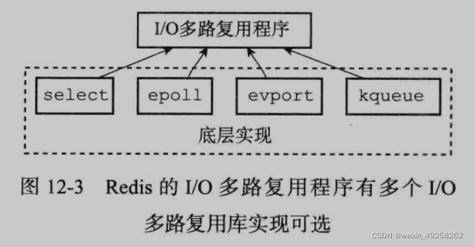
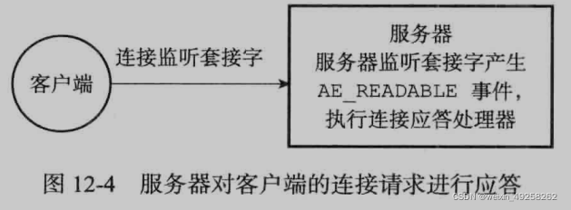
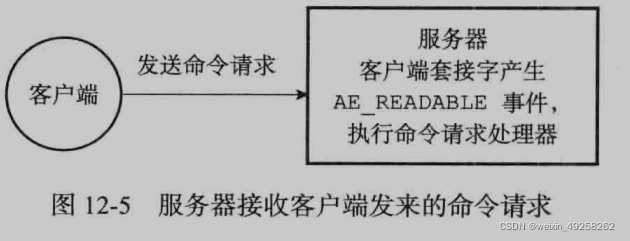
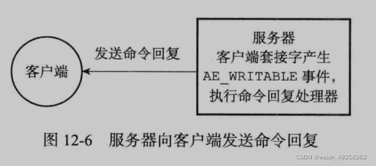
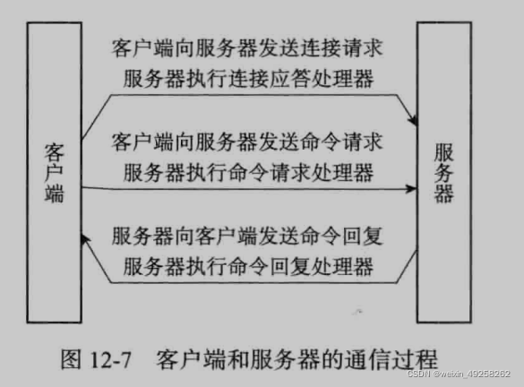
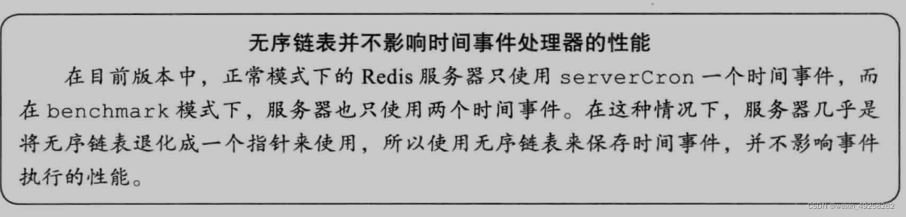
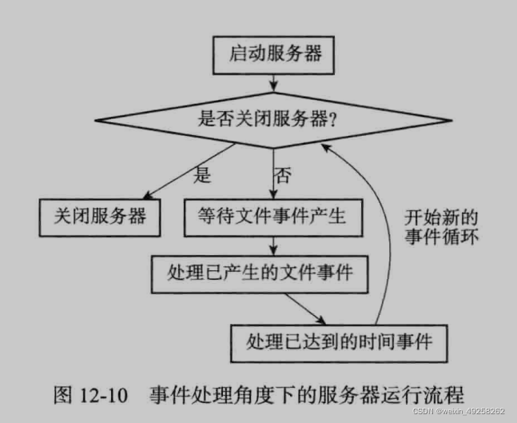
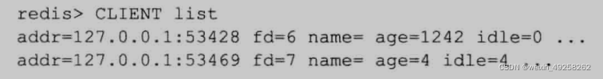
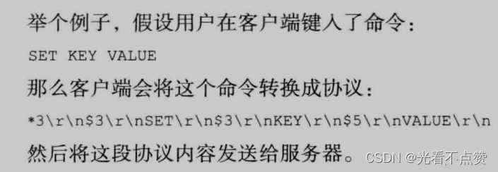
Q: Redis 文件事件处理器大致如何工作？
A:
- Redis 用 ae 事件循环封装 epoll/kqueue/select 等多路复用机制
- 多路复用器监听 socket 可读可写事件
- 事件分派器把事件交给连接应答、命令请求、命令回复等处理器
- 时间事件用于 serverCron 等周期任务
- 核心是事件驱动而不是每个连接一个线程

## 阻塞风险卡
Q: Redis 单线程模型下哪些操作容易造成阻塞？
A:
- 大 key 删除、遍历、序列化和返回大结果
- 复杂 Lua 脚本长时间执行
- `keys *`、大范围 `hgetall`、大集合聚合操作
- AOF fsync、fork、内存碎片整理也可能带来延迟尖刺
- 线上应使用 scan、unlink、分批处理和慢查询监控

## 正确性审查卡
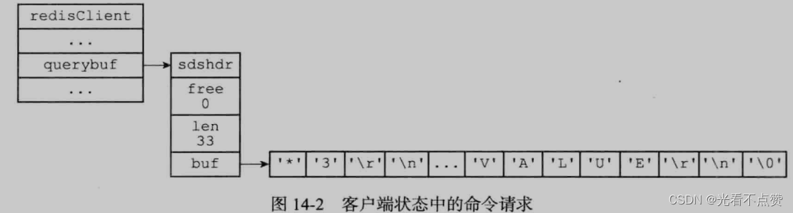
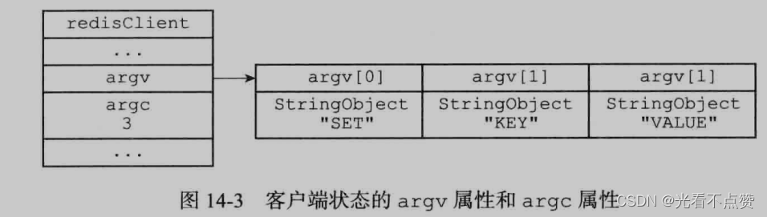
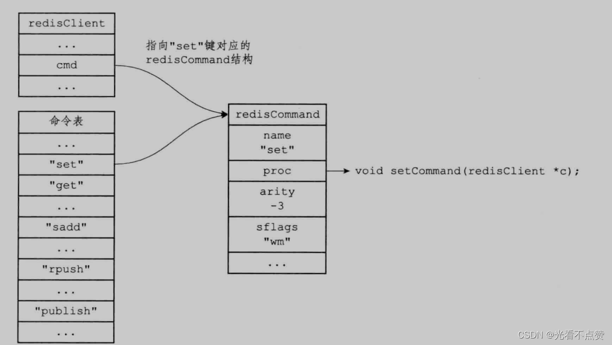
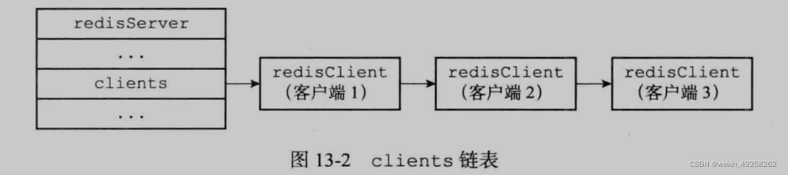
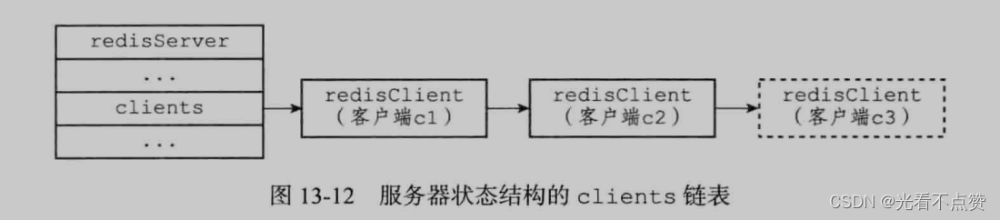
Q: Redis 单线程有哪些常见误区？
A:
- “Redis 完全没有多线程”：不准确。后台任务、异步删除、网络 IO 等版本相关
- “单线程不会有并发问题”：错误。客户端并发命令仍有顺序和原子性语义
- “慢操作只影响自己”：错误。主线程阻塞会影响所有请求
- “pipeline 能减少命令执行时间”：它主要减少网络往返，不减少命令本身 CPU
- “Redis 适合所有计算”：错误。复杂计算应放应用侧或专门计算系统