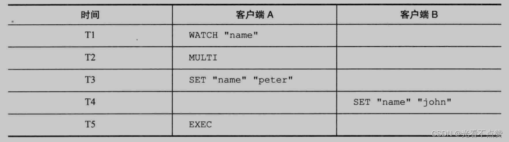
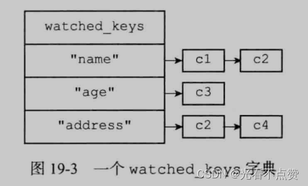

# 事务WATCH与Lua
## 事务卡

Q: Redis 事务 MULTI/EXEC 的语义是什么？
A:
- MULTI 后命令进入事务队列
- EXEC 时按顺序一次性执行队列中的命令
- 执行期间不会插入其他客户端命令
- Redis 事务不支持像关系数据库那样的自动回滚
- 入队错误会影响 EXEC，执行时单条命令错误不回滚已执行命令

## WATCH卡

Q: WATCH 如何实现乐观锁？
A:
- WATCH 监视一个或多个 key
- 如果 EXEC 前被监视 key 被其他客户端修改，事务会失败
- 客户端收到失败后需要重新读取、计算并重试
- WATCH 适合轻量 CAS 场景
- 高冲突场景下重试成本会升高

## Lua卡
Q: Redis Lua 脚本有什么价值？
A:
- Lua 脚本在 Redis 主线程中原子执行
- 可以把多条命令和判断逻辑封装成一次执行
- 常用于限流、分布式锁释放、库存扣减等小逻辑
- 脚本执行时间必须短，否则会阻塞 Redis 主线程
- 集群下脚本涉及的 key 应在同一 slot

## 正确性审查卡
Q: Redis 事务和 Lua 有哪些常见误区？
A:
- “Redis 事务支持回滚”：错误。执行错误不会自动回滚前面命令
- “WATCH 失败 Redis 会自动重试”：错误。要客户端重试
- “Lua 可以写复杂业务”：危险。长脚本会阻塞主线程
- “Lua 脚本等于分布式事务”：错误。它只保证 Redis 内部原子执行
- “事务一定持久”：还取决于 AOF/RDB 和 fsync 策略