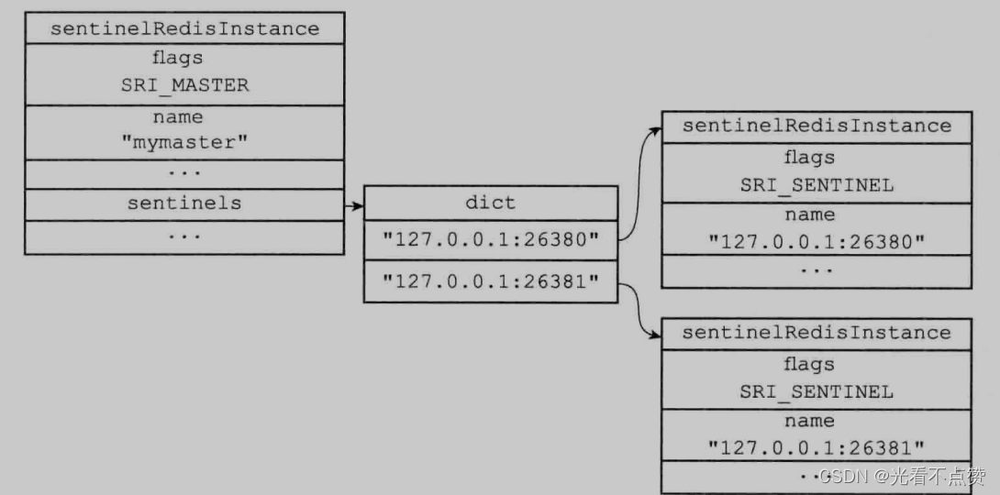
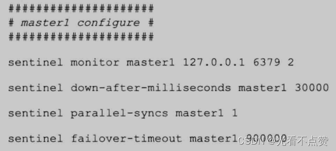
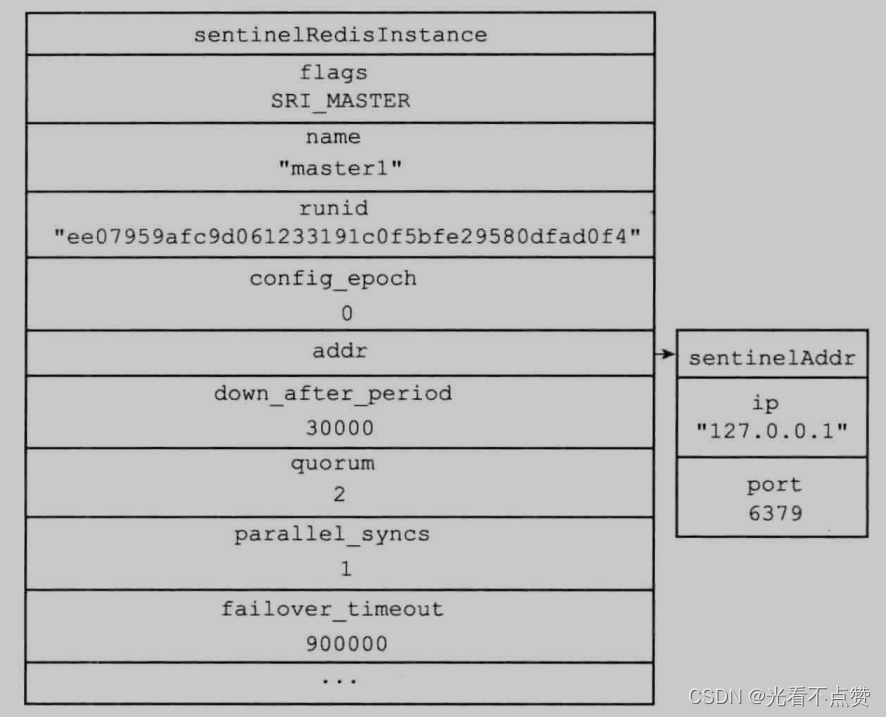
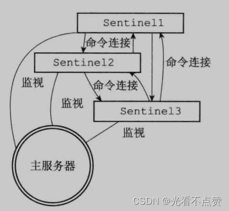
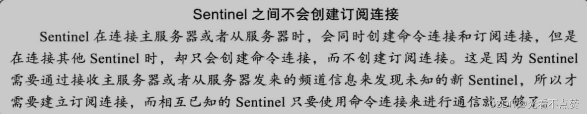
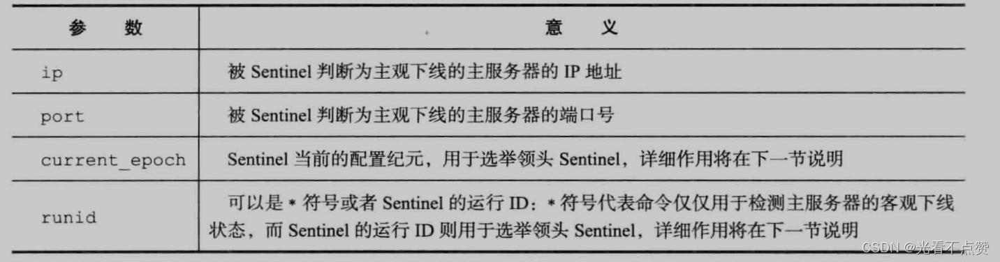
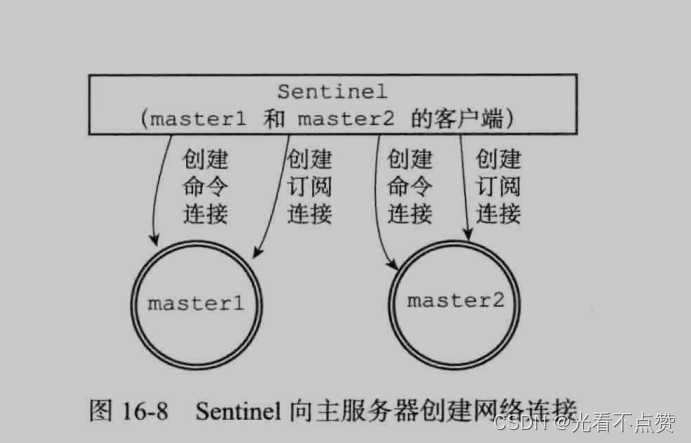
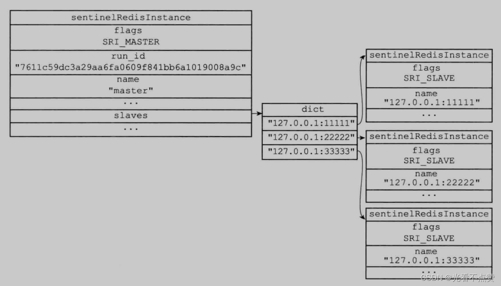
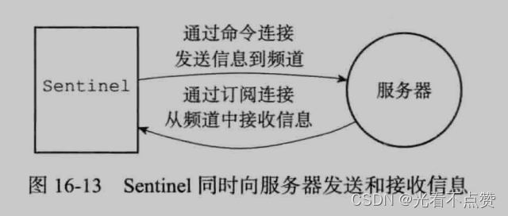
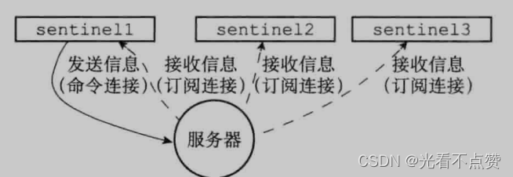

# Sentinel哨兵
## 定位卡

Q: Redis Sentinel 解决什么问题？
A:
- Sentinel 负责监控主从节点状态
- 主节点故障时，Sentinel 协调选主和故障转移
- 它能通知客户端新的主节点地址
- 多个 Sentinel 共同工作，避免单点误判
- 面试表达：Sentinel 解决高可用切换，不解决数据分片

## 下线卡

Q: Sentinel 主观下线和客观下线有什么区别？
A:
- 主观下线是单个 Sentinel 判断某节点不可达
- 客观下线是多个 Sentinel 达成足够数量的下线判断
- quorum 用于控制客观下线所需票数
- 主观下线避免不了网络抖动误判，客观下线降低误判风险
- 故障转移还需要选举 leader Sentinel 来执行

## 选主卡

Q: Sentinel 故障转移时如何选择新的主节点？
A:
- 排除下线、断线时间过长或不合适的从节点
- 优先选择优先级高的从节点
- 复制偏移量越新，数据越接近原主
- runid 等可作为进一步排序因素
- 选主目标是在可用性和数据新鲜度之间做折中

## 正确性审查卡

Q: Sentinel 有哪些常见误区？
A:
- “Sentinel 能保证零丢数据”：错误。异步复制仍可能丢数据
- “一个 Sentinel 就够”：不可靠。Sentinel 自身也要避免单点
- “客观下线后一定马上恢复服务”：还要经历选举、晋升、重配置
- “Sentinel 能做分片”：错误。分片是 Cluster 或客户端方案
- “客户端不需要适配”：错误。客户端需要感知主节点变化或接入代理