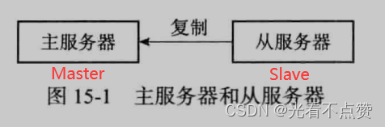
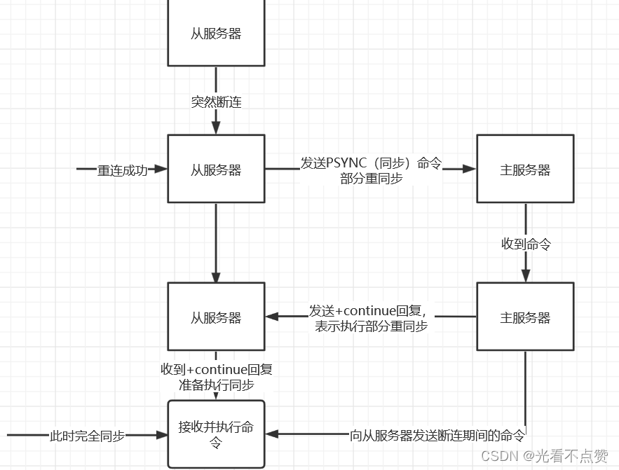
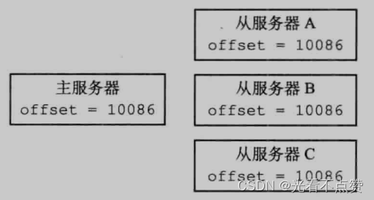

# 主从复制与PSYNC
## 复制流程卡

Q: Redis 主从复制的基本流程是什么？
A:
- 从节点向主节点发起复制请求
- 初次复制通常进行全量同步，主节点生成 RDB 并发送给从节点
- 主节点把同步期间的新写命令继续发送给从节点
- 后续进入命令传播阶段，主节点持续把写命令发给从节点
- 复制用于读扩展、数据冗余和高可用基础

## PSYNC卡

Q: Redis PSYNC 部分重同步解决什么问题？
A:
- 旧版断线重连常需要重新全量复制，成本很高
- PSYNC 通过 runid、复制偏移量和复制积压缓冲区支持部分重同步
- 从节点重连后带上旧主 runid 和 offset
- 如果主节点积压缓冲区仍保留缺失命令，就只补发增量
- 否则退化为全量同步

## 延迟卡
Q: Redis 主从复制有哪些一致性和延迟风险？
A:
- Redis 主从复制通常是异步的，从库可能落后主库
- 主库宕机时，未复制到从库的数据可能丢失
- 大 key、网络抖动、从库阻塞都会造成复制延迟
- 读从库可能读到旧数据
- 对强一致要求高的业务不能简单依赖异步复制

## 正确性审查卡
Q: Redis 主从复制有哪些常见误区？
A:
- “有从库就不会丢数据”：错误。异步复制存在丢失窗口
- “断线后一定部分同步”：不一定。积压缓冲区不够会全量同步
- “从库适合承接所有读”：不完整。要考虑读延迟和一致性
- “全量同步只影响从库”：错误。主库 fork、传输和复制缓冲也有压力
- “复制等于故障转移”：复制只是基础，自动故障转移还需要 Sentinel 或 Cluster