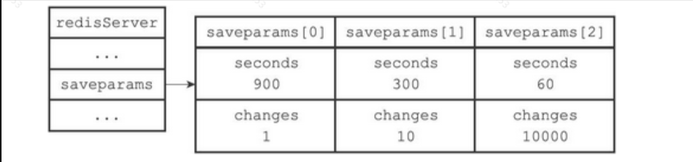
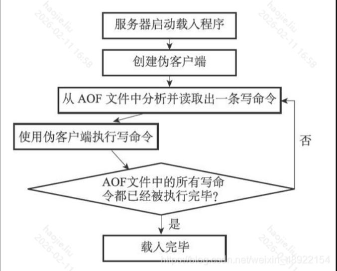
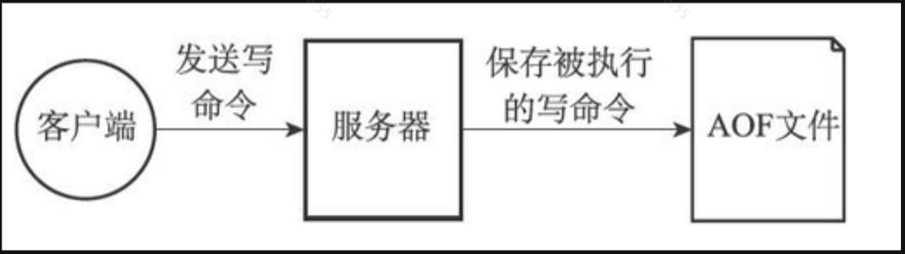
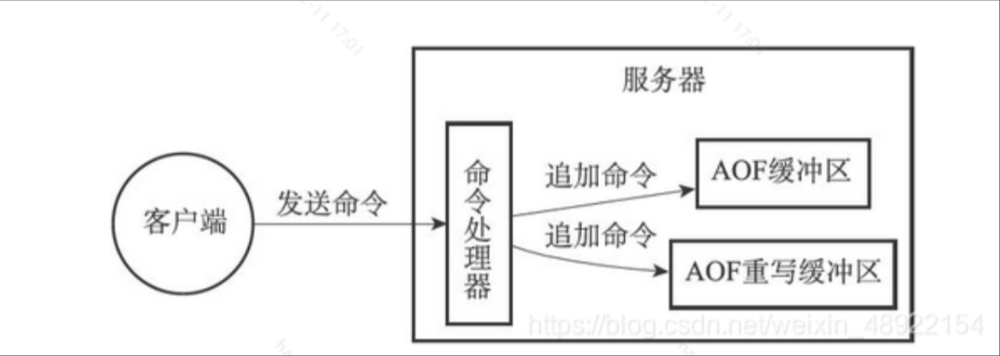
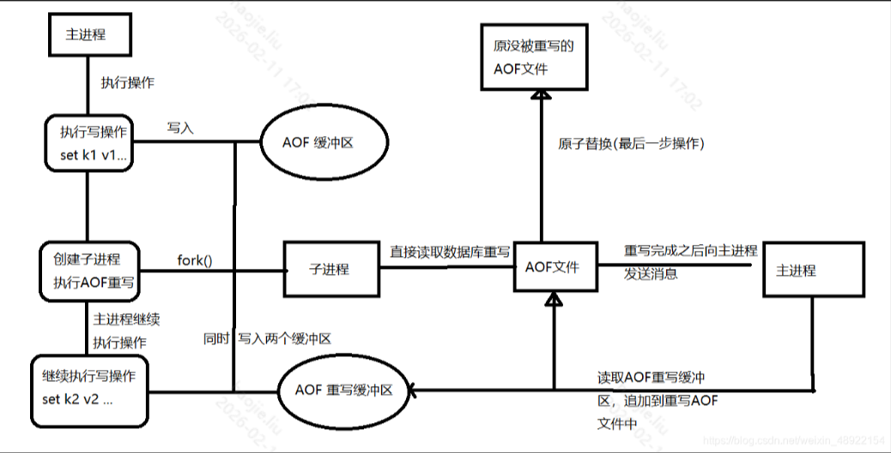

# RDB与AOF
## RDB卡

Q: Redis RDB 持久化的机制和优缺点是什么？
A:
- RDB 在某个时间点生成内存数据快照
- 适合全量备份、灾备和快速加载
- 文件紧凑，恢复速度通常较快
- 缺点是两次快照之间的数据可能丢失
- bgsave 需要 fork 子进程，可能带来 fork 延迟和写时复制内存压力

## AOF卡

Q: Redis AOF 持久化的机制和优缺点是什么？
A:
- AOF 追加记录写命令，通过重放命令恢复数据
- fsync 策略可配置为 always、everysec、no
- everysec 常在性能和数据丢失窗口之间折中
- AOF 文件可能不断增大，需要重写压缩
- AOF 通常比 RDB 数据丢失更少，但恢复和文件大小成本更高

## Rewrite卡

Q: AOF 重写为什么能压缩文件？后台重写如何保证新写入不丢？
A:
- 重写不是读旧 AOF，而是根据当前内存状态生成等价最小命令集
- 例如多次 set 同一 key，只需保留最终值
- 后台重写期间主进程继续处理写命令
- Redis 会把新写命令追加到 AOF 重写缓冲区
- 子进程完成后，主进程把增量写入新文件并替换旧文件

## 正确性审查卡

Q: RDB 和 AOF 有哪些常见误区？
A:
- “RDB 不会丢数据”：错误。快照间隔内可能丢
- “AOF always 就完全没有成本”：错误。每次写 fsync 成本很高
- “AOF 重写会阻塞所有命令”：不完整。主要由子进程做，但 fork 和收尾仍有影响
- “同时开 RDB/AOF 没意义”：不对。二者可互补
- “持久化等于强一致”：错误。还要看 fsync 策略、复制和故障场景