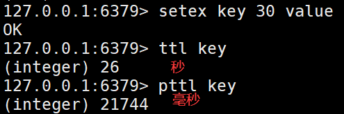
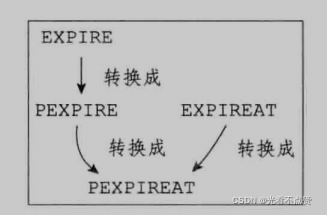

# 过期删除与内存淘汰
## 过期策略卡

Q: Redis 的过期键删除策略是什么？
A:
- 定时删除能及时释放内存，但定时器成本高
- 惰性删除在访问 key 时检查过期，CPU 友好但可能占内存
- 定期删除周期性抽样检查过期 key，平衡 CPU 和内存
- Redis 使用惰性删除加定期删除
- 面试表达：Redis 不是过期时间一到就一定立即删除

## 淘汰策略卡

Q: Redis 内存淘汰策略有哪些大类？
A:
- noeviction：内存满后写入报错
- volatile-*：只在设置了过期时间的 key 中淘汰
- allkeys-*：在所有 key 中淘汰
- LRU/LFU/random/ttl 分别按最近使用、访问频率、随机和过期时间选择
- 生产要根据缓存用途选择，纯缓存常用 allkeys-lru 或 allkeys-lfu

## 过期影响卡

Q: 大量 key 同时过期会带来什么问题？
A:
- 定期删除可能集中消耗 CPU
- 后端数据库可能因缓存同时失效被打穿
- 主从复制和 AOF 也会受到大量删除命令影响
- 应给过期时间加随机抖动，避免雪崩
- 热点 key 过期还要配合互斥重建或逻辑过期

## 正确性审查卡
Q: Redis 过期和淘汰有哪些常见误区？
A:
- “设置了 TTL 到点就马上消失”：错误。删除有惰性和定期机制
- “淘汰策略等于过期策略”：错误。过期是 TTL 到期，淘汰是内存不足
- “volatile-lru 会淘汰所有 key”：错误。只淘汰有过期时间的 key
- “缓存 key 都不设过期更安全”：危险。可能导致内存不可控
- “删除越及时越好”：不一定。需要平衡 CPU、内存和业务冲击