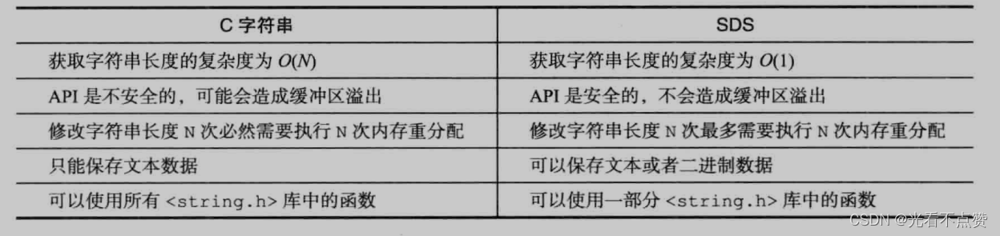
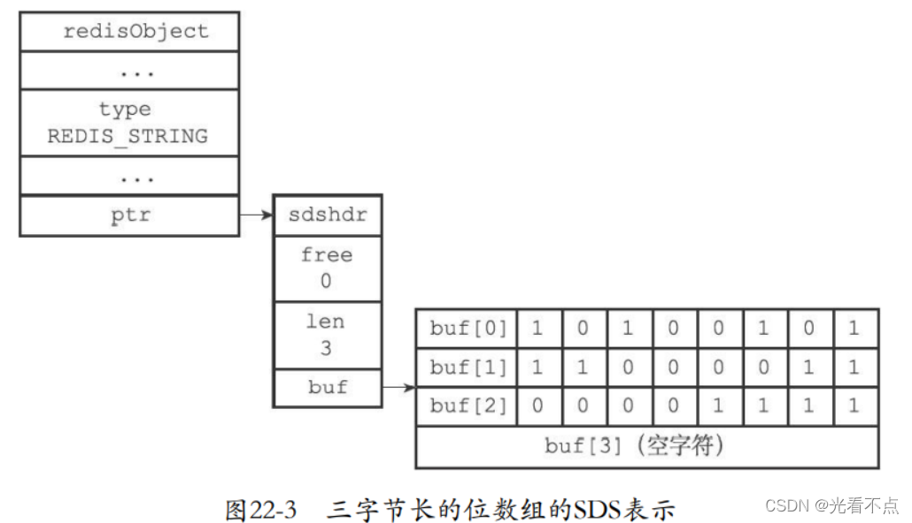
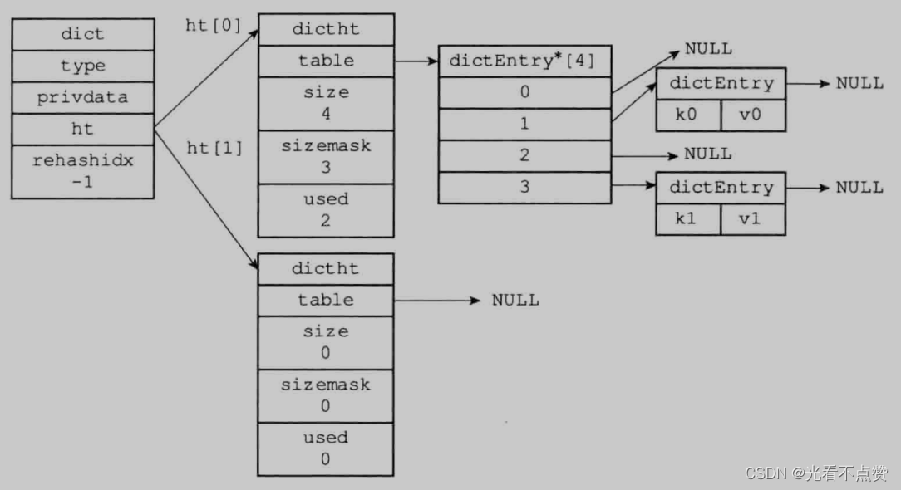
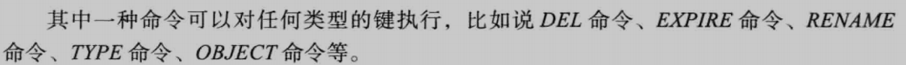
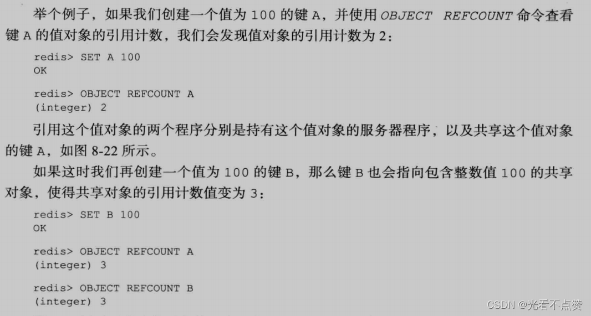
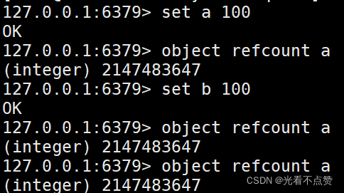
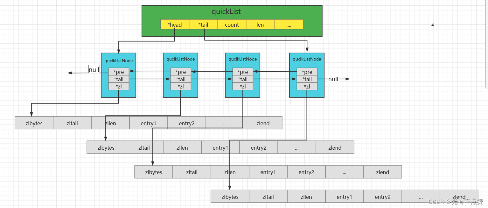

# SDS字典跳表与对象编码
## SDS卡

Q: Redis 为什么不用 C 字符串而使用 SDS？
A:
- SDS 记录字符串长度，获取长度是 O(1)
- SDS 保留剩余空间，减少频繁修改带来的内存重分配
- SDS 二进制安全，可以保存包含 `\0` 的内容
- SDS 有容量和长度信息，避免 C 字符串缓冲区溢出风险
- 面试表达：SDS 是 Redis 为性能和安全性重新封装的字符串结构

## 字典卡

Q: Redis 字典如何处理扩容和 rehash？
A:
- 字典底层是哈希表，冲突通过链表解决
- Redis 同时维护两个哈希表用于渐进式 rehash
- rehash 期间新写入通常进入新表，查询会同时查新旧表
- 每次增删改查顺带搬迁一部分桶，避免一次性 rehash 阻塞
- 核心取舍是把大迁移拆成很多小步骤，降低单次延迟尖刺

## 跳表卡
Q: Redis 为什么用跳表实现有序集合的一部分能力？
A:
- 跳表支持按 score 范围查询、排名和顺序遍历
- 平均查找、插入、删除复杂度为 O(log n)
- 实现比红黑树简单，范围扫描也自然
- zset 常同时使用 dict 做 member 到 score 的快速定位
- 面试表达：跳表服务的是有序集合的排序、范围和排名能力

## 正确性审查卡

Q: Redis 数据结构有哪些常见误区？
A:
- “Redis string 就是 C 字符串”：错误，底层是 SDS
- “渐进式 rehash 没有额外成本”：不完整。查询期间可能查两张表
- “跳表一定比红黑树快”：不绝对。Redis 选择跳表更多是实现和范围操作综合取舍
- “对象类型等于底层编码”：错误。对象类型和 encoding 是两层概念
- “所有小对象都用同一种编码”：错误。Redis 会根据大小和数量选择紧凑编码