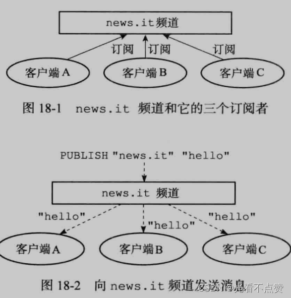
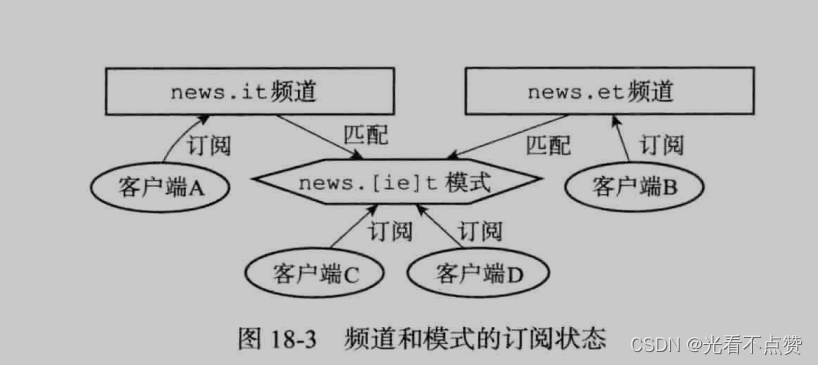
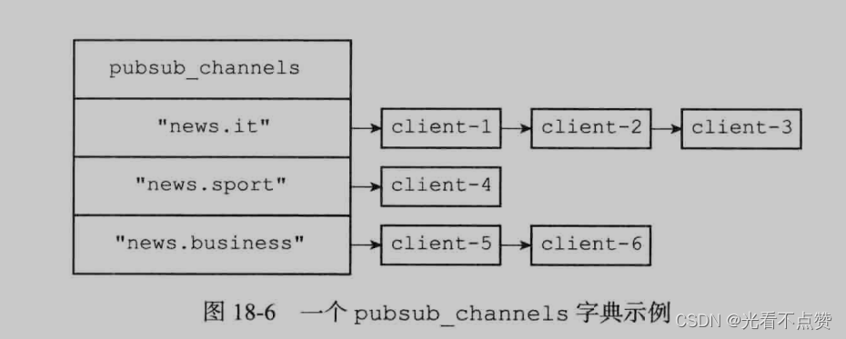
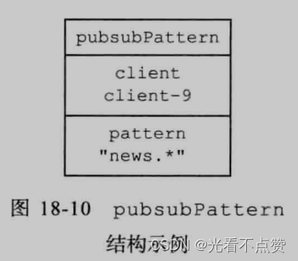

# PubSub与Stream
## PubSub卡

Q: Redis Pub/Sub 的机制和适用场景是什么？
A:
- 订阅者订阅 channel 或 pattern
- 发布者向 channel 发布消息
- Redis 把消息实时推送给当前在线订阅者
- Pub/Sub 不持久化消息，订阅者离线会错过消息
- 适合低可靠实时通知，不适合关键业务消息队列

## Stream卡
Q: Redis Stream 比 Pub/Sub 强在哪里？
A:
- Stream 持久保存消息条目
- 支持消费组和多个消费者分摊消费
- 支持 ACK 和 pending 列表追踪未确认消息
- 支持按 ID 读取历史消息
- 适合作为轻量消息队列，但堆积、重试、监控能力仍要评估

## 选型卡
Q: Redis Stream 和专业 MQ 如何选型？
A:
- Redis Stream 部署简单，适合轻量队列和已有 Redis 体系
- Kafka 适合高吞吐日志流和长时间保留
- RabbitMQ 更偏可靠消息、路由和确认语义
- RocketMQ/Kafka 更适合大规模业务消息和削峰
- 面试表达：不要把 Redis 当万能 MQ，要看可靠性、堆积、顺序、事务和运维能力

## 正确性审查卡
Q: Redis 消息能力有哪些常见误区？
A:
- "Pub/Sub 不会丢消息"：错误。离线订阅者收不到
- "Stream 有 ACK 就绝对可靠"：不完整。Redis 持久化和故障场景仍要考虑
- "Redis Stream 能替代所有 MQ"：不现实。大规模堆积和生态能力有限
- "消费组自动处理失败"：不完整。pending 消息要有重试和转移策略
- "消息保留无成本"：错误。Stream 长期堆积会占用内存
