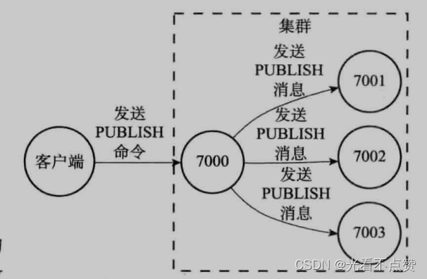
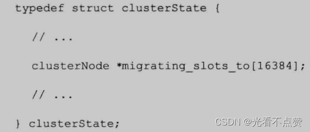
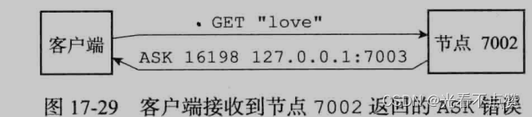
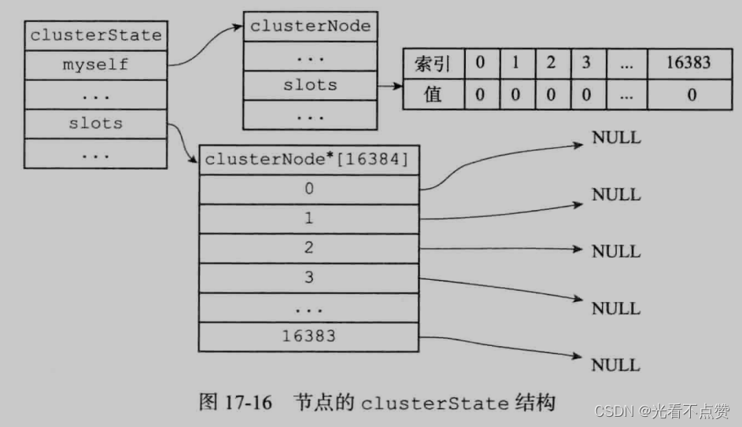
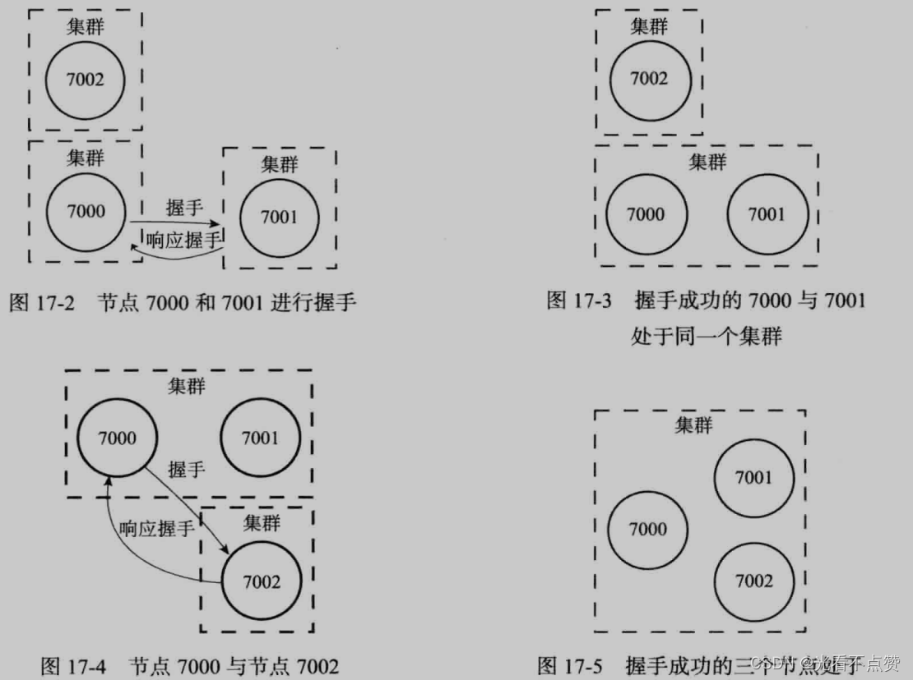
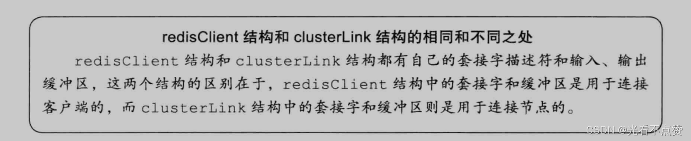

# Cluster槽与重分片
## 槽卡

Q: Redis Cluster 的槽机制是什么？
A:
- Redis Cluster 把 key 空间划分为 16384 个 hash slot
- 每个主节点负责一部分槽
- key 通过 CRC16 计算槽位
- 客户端根据槽位把命令发送到负责节点
- 槽机制让集群能水平分片和迁移数据

## 重分片卡

Q: Redis Cluster 重分片如何工作？
A:
- 重分片本质是把部分槽从源节点迁移到目标节点
- 迁移期间源节点处于 migrating 状态，目标节点处于 importing 状态
- 槽内 key 会逐步迁移，而不是一次性搬完整个集群
- 客户端可能收到 ASK 或 MOVED 重定向
- 重分片要关注迁移期间延迟、热点槽和客户端兼容性

## 故障转移卡

Q: Redis Cluster 如何做故障检测和故障转移？
A:
- 节点之间通过 Gossip 交换状态信息
- 多个节点认为某主节点故障后，会标记 FAIL
- 故障主节点的从节点参与选举
- 获胜从节点晋升为主节点并接管槽
- 这提供分片场景下的高可用，但仍有异步复制丢数据窗口

## 正确性审查卡

Q: Redis Cluster 有哪些常见误区？
A:
- “Cluster 只要加机器就线性扩容”：不一定。热点 key 和热点槽会限制扩展
- “槽迁移对业务无感”：不完整。客户端要正确处理 ASK/MOVED
- “Cluster 保证强一致”：错误。主从复制通常仍是异步
- “所有多 key 命令都能跨节点执行”：错误。跨槽命令受限制
- “分片解决大 key 问题”：不一定。单个大 key 仍落在一个槽和一个节点上