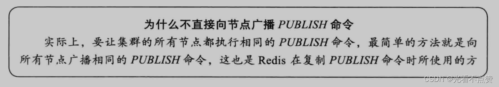
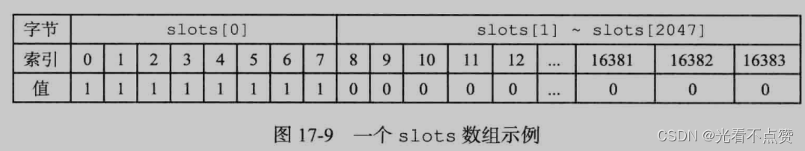
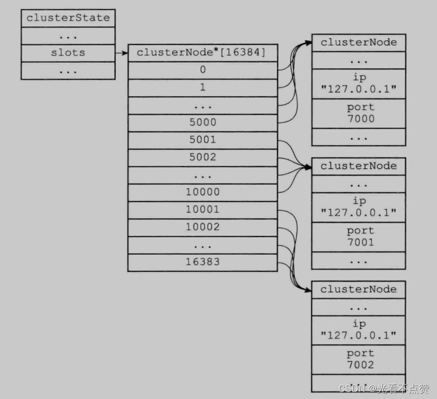
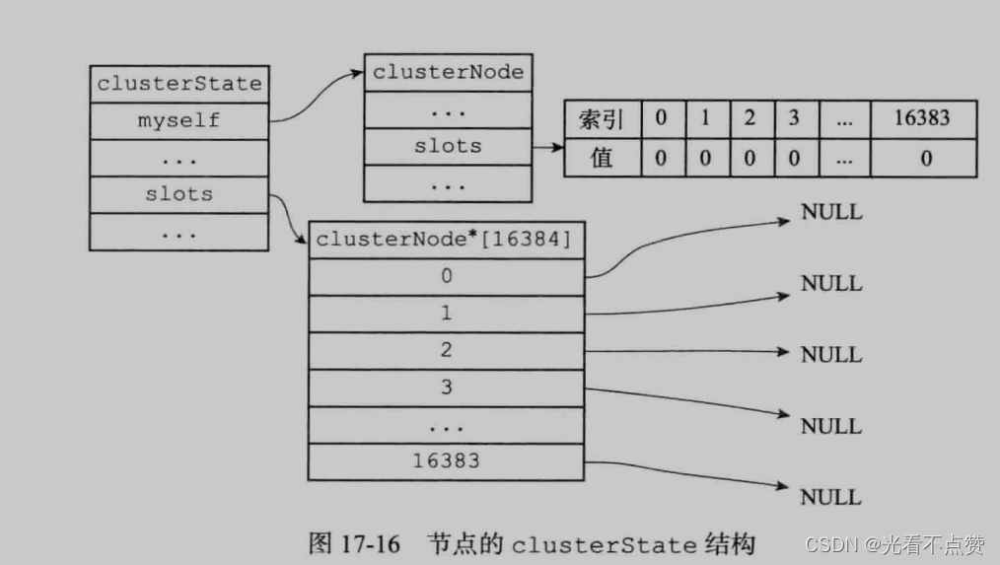
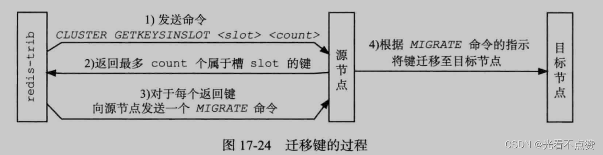
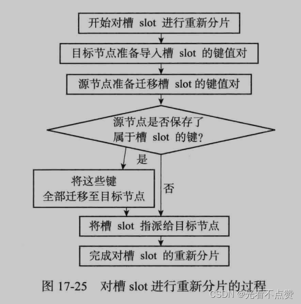
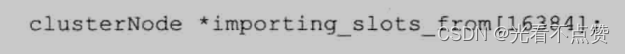
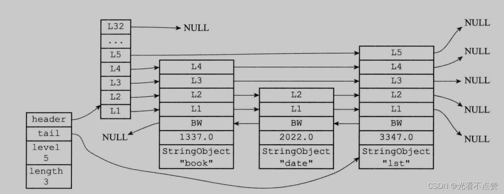
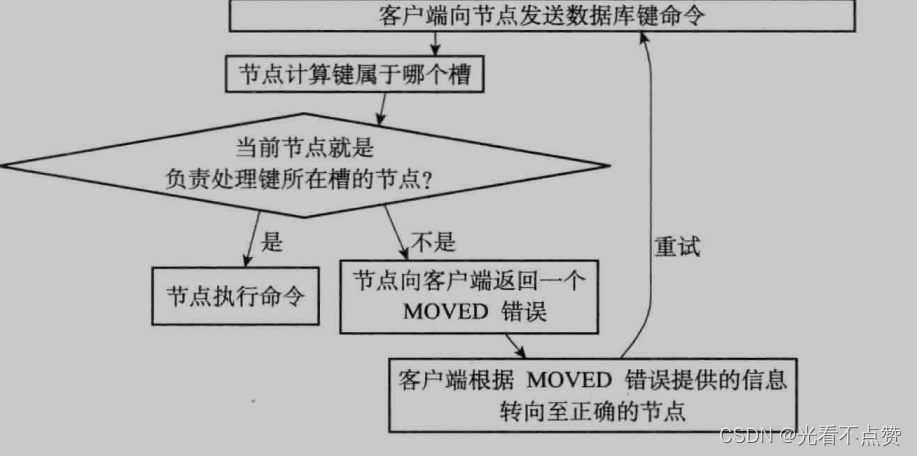

# MOVED-ASK与HashTag
## MOVED卡

Q: Redis Cluster 中 MOVED 重定向表示什么？
A:
- MOVED 表示客户端访问了错误节点
- 返回信息会告诉客户端该槽当前由哪个节点负责
- 客户端应更新本地槽位缓存
- 后续同槽请求应直接发往正确节点
- MOVED 通常表示槽位归属已经稳定变化

## ASK卡

Q: ASK 重定向和 MOVED 有什么区别？
A:
- ASK 通常出现在槽迁移过程中
- 它表示当前 key 临时应去目标节点查询
- 客户端发送到目标节点前要先发 `ASKING`
- ASK 不应让客户端永久更新槽缓存
- 面试表达：MOVED 是稳定归属变化，ASK 是迁移过程中的临时重定向

## HashTag卡

Q: Redis Cluster hash tag 解决什么问题？
A:
- hash tag 使用 `{}` 中的内容参与槽计算
- 它能让相关 key 落到同一个 slot
- 这样可以执行部分多 key 命令或 pipeline 聚合操作
- 典型用法是 `user:{1001}:profile` 和 `user:{1001}:cart`
- 滥用 hash tag 会造成热点槽，破坏分片均衡

## 正确性审查卡

Q: MOVED、ASK 和 hash tag 有哪些常见误区？
A:
- “ASK 后要更新槽缓存”：错误。ASK 是临时迁移提示
- “MOVED 只是重试一次”：不完整。客户端还应刷新槽映射
- “hash tag 可以随便用”：危险。可能导致大量 key 集中到一个槽
- “跨槽 mget 一定不能优化”：可通过 hash tag 或客户端拆分并发处理
- “客户端不用理解重定向”：错误。Cluster 客户端能力直接影响稳定性