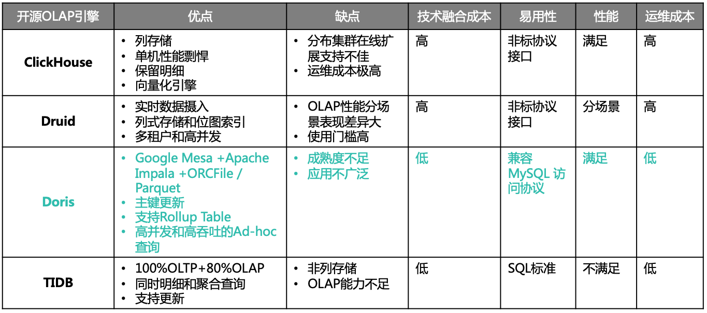
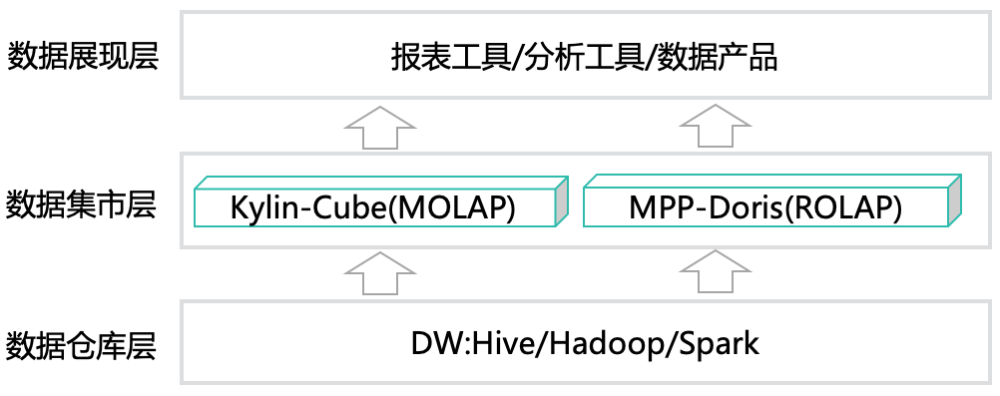
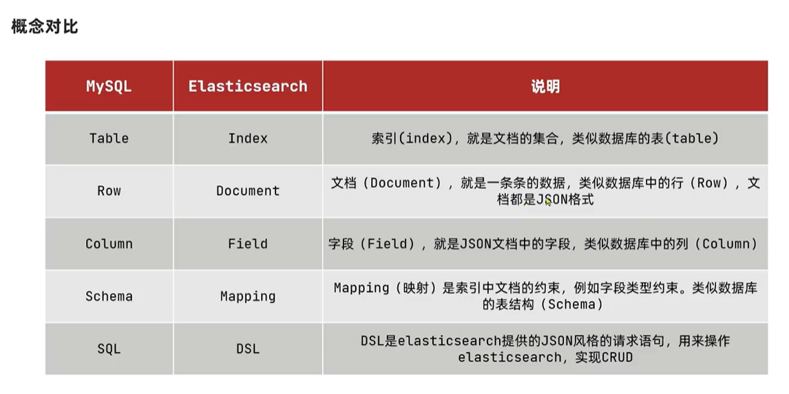
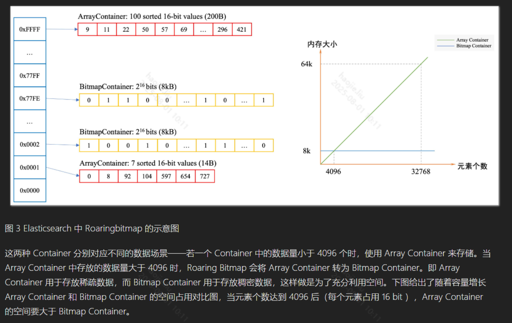
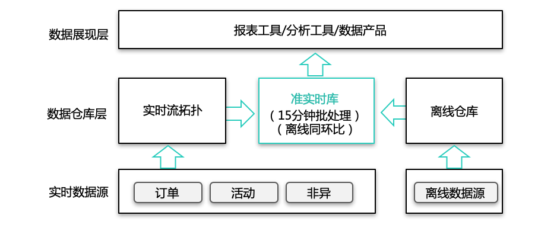
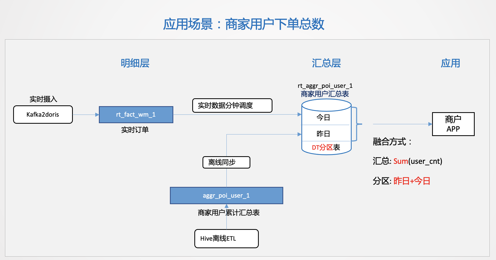
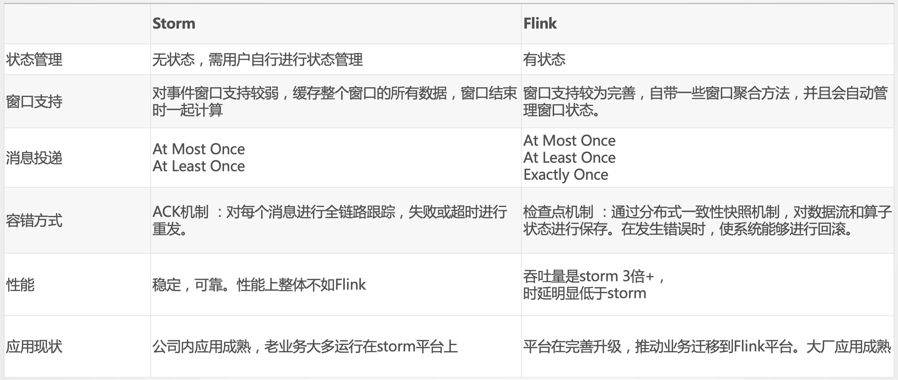
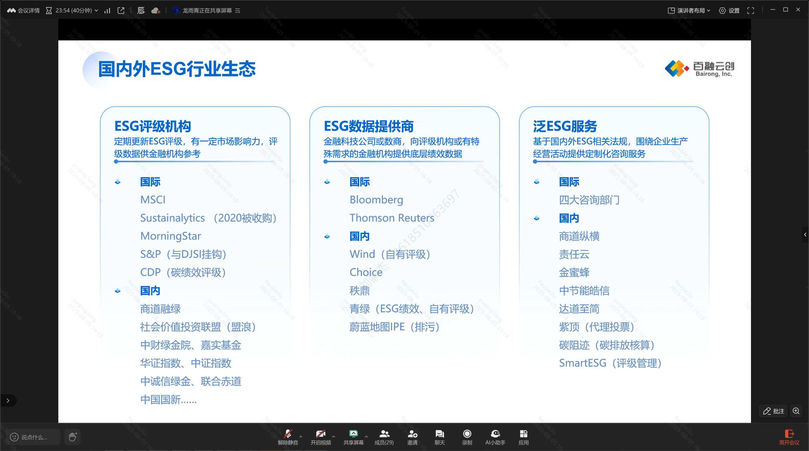
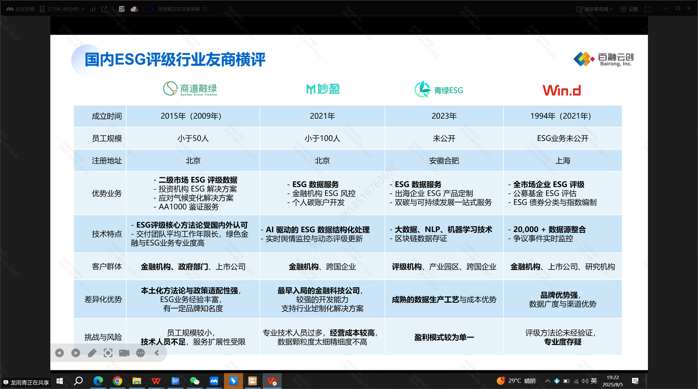

# ES+Doris+Kafka+Datax

#

# 预警功能+BI报表

### Doris（类似的产品是ClickHouse）+Davinci+Druid

https://tech.meituan.com/2021/08/26/data-warehouse-in-meituan-waimai.html

https://tech.meituan.com/2020/04/09/doris-in-meituan-waimai.html

**MPP引擎**，全称为**Massively Parallel Processing Engine**，即**大规模并行处理引擎**。它是一种专门为大数据分析和数据仓库场景设计的数据库或计算引擎架构。

OLAP：联机分析处理：是一种面向分析型应用的数据处理技术，主要用于对大量数据进行多维度、复杂的查询和分析。

- MOLAP（Multidimensional OLAP，多维联机分析处理）：

> 
> 
> 1. 应用层模型复杂，根据业务需要以及 Kylin 生产需要，还要做较多模型预处理。这样在不同的业务场景中，模型的利用率也比较低。
> 2. Kylin 配置过程繁琐，需要配置模型设计，并配合适当的 “剪枝” 策略，以实现计算成本与查询效率的平衡。
> 3. 由于 MOLAP 不支持明细数据的查询，在 “汇总 + 明细” 的应用场景中，明细数据需要同步到 DBMS 引擎来响应交互，增加了生产的运维成本。
> 4. 较多的预处理伴随着较高的生产成本。
- ROLAP（Relational OLAP，关系型联机分析处理）：这种框架一直被并发能力羸弱的DBMS所牵制，一直以来没有实际落地的方案，但随着MMP引擎的出现，关系型的大数据处理逐渐得到实现

> 
> 
> 1. 应用层模型设计简化，将数据固定在一个稳定的数据粒度即可。比如商家粒度的星形模型，同时复用率也比较高。
> 2. App 层的业务表达可以通过视图进行封装，减少了数据冗余，同时提高了应用的灵活性，降低了运维成本。
> 3. 同时支持 “汇总 + 明细”。
> 4. 模型轻量标准化，极大的降低了生产成本。
- HOLAP（Hybrid Online Analytical Processing，混合联机分析处理）

**OLTP**（Online Transaction Processing，联机事务处理）是一类主要面向日常业务操作的数据库应用，专注于高效、可靠地处理大量的**实时增删改查（CRUD）事务**。

[**Apache Druid](https://zhida.zhihu.com/search?content_id=211378421&content_type=Article&match_order=1&q=Apache+Druid&zhida_source=entity)：**Druid（德鲁伊）是一个**分布式**的、支持**实时多维 [OLAP 分析](https://zhida.zhihu.com/search?content_id=211378421&content_type=Article&match_order=1&q=OLAP+%E5%88%86%E6%9E%90&zhida_source=entity)**、[**列式存储**](https://zhida.zhihu.com/search?content_id=211378421&content_type=Article&match_order=1&q=%E5%88%97%E5%BC%8F%E5%AD%98%E5%82%A8&zhida_source=entity)的数据处理系统，支持高速的实时数据读取处理、支持实时灵活的多维数据分析查询。在Druid数十台分布式集群中支持每秒百万条数据写入，对亿万条数据读取做到亚秒到秒级响应。此外，Druid支持根据时间戳对数据进行预聚合摄入和聚合分析，在时序数据处理分析场景中也可以使用Druid。

> 跟阿里巴巴的数据库连接池不是一个东西
> 

**SLA** 的全称是 **Service Level Agreement**，中文通常翻译为**服务级别协议**。SLA 是服务提供方与客户之间就服务质量、可用性、响应时间等关键指标达成的正式协议或约定。它明确规定了服务的**性能标准**、**可用性要求**、**故障响应时间**、**支持范围**等内容。

> 假如有1TB数据需要做复杂统计，MPP引擎会把数据分片分布到10台服务器，每台只需处理100GB，最终合并结果，速度远超单机数据库。
> 

**雪花模型的定义**

**雪花模型**是在星型模型（Star Schema）的基础上进一步规范化（即分解维度表），使得维度表之间也可以有主外键关系，形成类似雪花状的结构。

### 大数据中Join的优化

- **Colocate Join：**在分布式系统中，数据通常被分片（Sharding/Partition）存储在不同节点上。
    
    > **Colocate Join** 指的是：**当两个需要 Join 的表，按照相同的分片键（colocate key）和分布方式分布在各个节点上时，Join 操作可以直接在本地节点完成，无需跨节点数据传输。**
    > 
- Shuffle Join：是指在分布式环境下，两个大表进行 Join 时，需要根据 Join Key 对数据进行重新分区（Shuffle），把相同 Key 的数据分发到同一个节点，然后在本地进行 Join。
- Broadcast Join：是指将一个小表的数据广播到所有计算节点，然后每个节点用本地的大表分片与广播过来的小表进行 Join。

| 层级 | 数据仓库层（DW） | 数据集市层（数据集市） |
| --- | --- | --- |
| 面向对象 | 全公司/全业务 | 主题/部门/业务线 |
| 数据粒度 | 明细、全量、历史 | 聚合、主题、分析优化 |
| 主要作用 | 数据整合、存储、加工 | 高性能分析、报表、数据服务 |
| 技术 | Hive、Hadoop、Spark等 | Kylin、Doris、ClickHouse等 |
| 查询性能 | 一般（适合批处理） | 高（适合多维分析、交互查询） |

### ES

https://tech.meituan.com/2022/11/17/elasicsearch-optimization-practice-based-on-run-length-encoding.html

### Kafka

https://tech.meituan.com/2015/01/13/kafka-fs-design-theory.html

https://tech.meituan.com/2021/01/14/kafka-ssd.html

https://tech.meituan.com/2022/08/04/the-practice-of-kafka-in-the-meituan-data-platform.html

mysql-binlog

双写：Doris+Mysql

技术层面
能不能实现+有没有现成资源+申请资源需要多少预算

客户层面

为什么需要这个技术+带来的效果是什么+客户预算是否允许多部署+最小部署环境是什么

**Elasticsearch（ES）：**开源的分布式搜索和分析引擎，广泛用于日志检索、全文检索、数据分析等场景。

**倒排索引（Inverted Index）：**搜索引擎的核心数据结构，将“词”映射到包含该词的文档ID集合，便于高效检索。

例如我们现在有两句话：

1. Elasticsearch is an open source search and analytics engine
2. Elasticsearch is a distributed RESTful search engine
    
    首先需要将这两句话分解成一个个词元，并且去掉一些无意义的词语，例如`a`、`an`、`for`等，再将其关联上对应的文档 id：
    
    - Elasicsearch：1, 2——Elasicsearch：[1,1], [2,1]
    - open：1——open：[1,1]
    - source：1——source：[1,1]
    - search：1, 2——search：[1,1]，[2,1]
    - analytics：1——analytics：[1,1]
    - engine：1, 2——engine：[1,1]，[2,1]
    - distributed：2——distributed：[2,1]
    - RESTful：2——RESTful：[2,1]
    
    如果我们想要搜索`Elasicsearch`，就可以通过上面的键值对很快的查询到对应的文档 1 和文档 2，搜索`source`则只能查到文档 1，而如果搜索`RESTful search`虽然也能同时搜到文档 1 和文档 2，但是文档 2 的匹配程度要高于文档 1。
    
    当然这只是一个最简单的例子，在实际应用中还会有很多问题，例如单复数形式或者动词形容词名词形式以及同义词都应该被认为是同一单词，还需要去掉没有意义的单词等，这些 Elasticsearch 都会做好，就不需要使用者操心了。
    

**Terms 检索：**ES中常用的多值精确匹配查询方式，适合大批量ID或关键词的过滤。即下面的RLE+**RoaringBitmap存储接口去支持这种检索。**

**倒排链（Posting List）：**倒排索引中，每个Term对应的文档ID列表，检索时需合并多个倒排链。

**TermDictionary & FST（Finite State Transducer）**

- **TermDictionary**：存储所有Term的有序列表，便于二分查找。
- **FST**：有限状态转导器，用于高效压缩和查找TermDictionary，提升内存效率和检索速度。

**Bitset：**一种位图数据结构，用于高效合并和表示文档ID集合，常用于倒排链的合并。

**RLE（Run-Length Encoding，游程编码）：**一种压缩算法，将连续相同的数据用“值+次数”表示。文中用于压缩倒排链，提升合并效率。

**RoaringBitmap（Bitmap 算法）：**一种高效的位图实现，支持大规模稀疏数据的高效存储和运算。结合RLE进一步优化倒排链存储和合并。

**TermInSetQuery：**ES中用于处理大批量terms过滤的查询类型，文中分析其在高并发场景下的性能瓶颈。

**Search Profiler：**Kibana中的性能分析工具，用于定位ES查询的耗时热点。

**JMH（Java Microbenchmark Harness）：**Java微基准测试工具，用于精确评估代码性能。

**ES支持明细查询**，意思是Elasticsearch（ES）不仅能做聚合、统计等分析型查询，还能直接返回**原始的、逐条的文档数据**，即“明细数据”。

比如你可以查出某个用户的所有订单详情、某个时间段内的全部日志原文等。

---

**1. 明细查询的含义**

- **明细查询**（Detail Query）指的是直接检索并返回**每一条原始文档**的内容，而不是只返回聚合结果（如总数、平均值、分组统计等）。
- 例如：GET /index/_search 查询时，返回的是每条文档的详细字段内容。

---

**2. 为什么明细查询最多只能查一万个？**

- ES默认**单次查询最多只能返回1万条明细数据**（即from+size<=10000），这是由参数index.max_result_window控制的，默认值为10000。
- **原因：**
1. **性能保护**：ES的明细查询是先把所有命中结果的docId排序，然后再根据分页参数取出对应的文档内容。如果一次查太多，内存和CPU消耗极大，容易拖垮集群。
2. **资源消耗大**：ES不是为大批量全表扫描设计的，明细查询本质上是“随机访问+排序+分页”，数据量大时会严重影响节点性能。
3. **防止误用**：防止用户误把ES当作关系型数据库做全量导出或大分页，影响线上服务。
- **官方建议**：如需导出大量明细数据，推荐用scroll、search_after等方式分批拉取，而不是直接调大size参数。

## **12. 性能优化路径**

- 通过流量录制和基准压测定位性能瓶颈
- 利用火焰图、Profiler等工具分析热点
- 设计并实现RLE+RoaringBitmap等新型倒排链结构
- 通过插件集成到ES，显著降低检索时延和CPU消耗

### **实时架构**

实时lambda生产框架：本质上就是加了实时数据的计算，从离线变为离线+实时的双路，

- 离线历史数据用批处理
- 实时数据用流处理

双路生产会存在一些问题，比如加工逻辑 Double，开发运维也会 Double，资源同样会变成两个资源链路。因为存在以上问题，所以又演进了一个 Kappa 架构。

同时还有kappa架构：指的是无论历史数据还是实时数据都用流处理

### 滑动窗口与滚动窗口

**滑动窗口（Sliding Window）**

- **定义**：窗口按照固定的步长（slide）向前滑动，每次滑动都生成一个新窗口，窗口之间可以重叠。
- **参数**：
    - 窗口长度（window size）
    - 滑动步长（slide interval）
- **举例**：
    - 窗口长度10分钟，滑动步长5分钟，则每5分钟统计一次最近10分钟的数据。

**滚动窗口（Tumbling Window）**

- **定义**：窗口按照固定长度划分，窗口之间**没有重叠**，每条数据只属于一个窗口。
- **参数**：
    - 窗口长度（window size）
- **举例**：
    - 窗口长度10分钟，则每10分钟统计一次数据，每个窗口互不重叠。

## **. 常见大数据中间件及其作用**

| 中间件 | 主要作用 |
| --- | --- |
| **HDFS** | 分布式文件存储，海量数据的底层存储 |
| **YARN** | 资源管理与作业调度，分配集群计算资源 |
| **HBase** | 分布式NoSQL数据库，适合海量结构化数据 |
| **Hive** | 数据仓库，SQL分析引擎，批量数据分析 |
| **Spark** | 分布式内存计算，批处理、流处理、ML等 |
| **Flink** | 分布式流式计算，实时数据处理 |
| **Kafka** | 分布式消息队列，数据流转、解耦、缓冲 |
| **Zookeeper** | 分布式协调、注册中心、配置管理 |
| **Sqoop** | 关系型数据库与Hadoop之间的数据同步 |
| **Oozie/Azkaban/Airflow** | 工作流调度，任务编排 |
| **Elasticsearch** | 分布式搜索与分析引擎 |
| **ClickHouse/Druid/Kylin** | 实时/近实时OLAP分析。 |
| inlong | 数据集成框架，即数据传输能力，对接数据层和业务层 |

实时数据处理主流的两个框架（SQL引擎）

## **最简易的大数据处理需要哪些中间件？**

**最简易的大数据处理平台**，至少需要以下几个核心中间件：

1. **分布式存储**：如 HDFS
- 用于存储大数据文件。
1. **分布式计算**：如 Spark 或 Hadoop MapReduce
- 用于批量数据处理和分析。
1. **资源调度**：如 YARN
- 管理和分配集群资源。
1. **消息队列（可选）**：如 Kafka
- 用于数据采集、流转和解耦（如果有实时/流式需求）。
1. **SQL分析（可选）**：如 Hive
- 让数据分析更简单（用SQL而不是写代码）。

---

**最小可用大数据平台举例**

- **HDFS + YARN + Spark**
- 支持分布式存储、资源调度和高效计算。
- **HDFS + YARN + MapReduce + Hive**
- 支持分布式存储、批量计算和SQL分析。
- **HDFS + Spark + Kafka**
- 支持存储、计算和实时数据流转。

- **ODL**：操作数据层，存原始业务数据
- **IDL**：集成数据层，做数据整合清洗
- **CDL**：公共/规范数据层，做标准化统一
- **ADL**：应用/分析数据层，面向应用和分析

### ESG

[https://www.notion.so](https://www.notion.so)