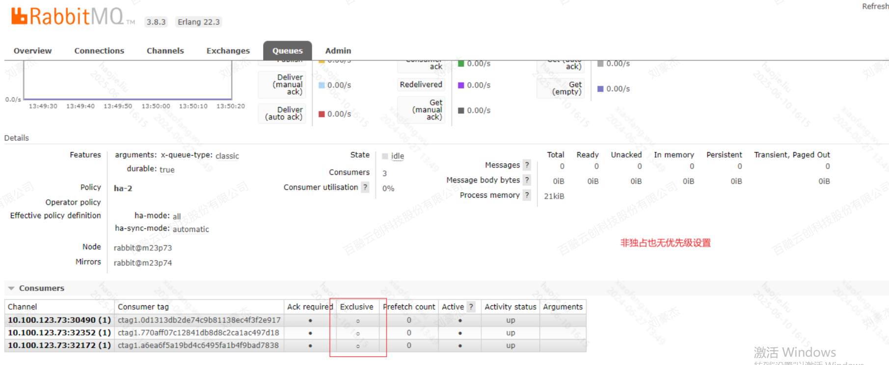
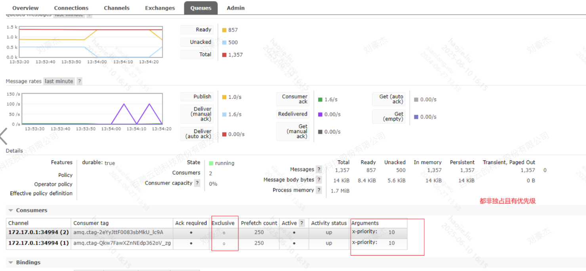
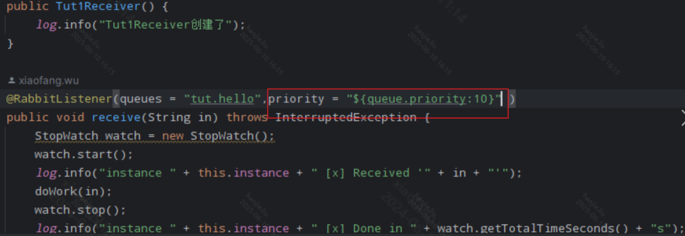
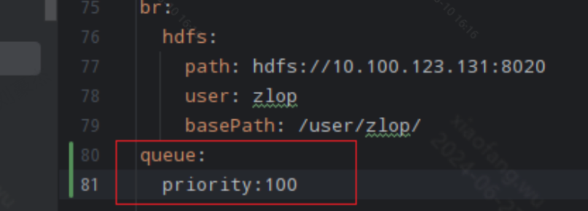
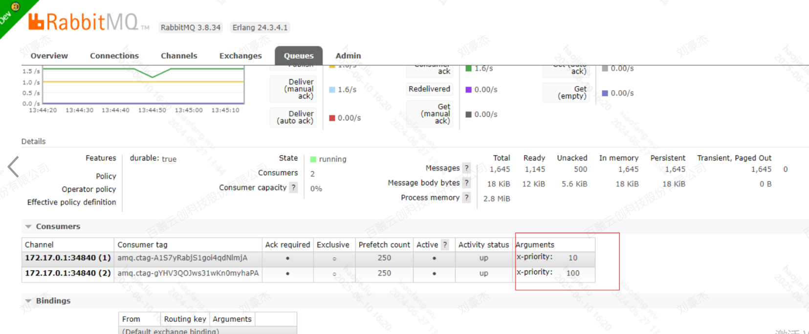
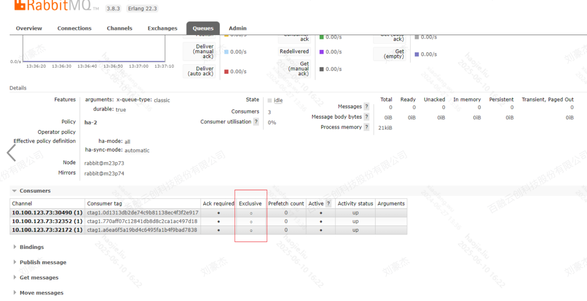
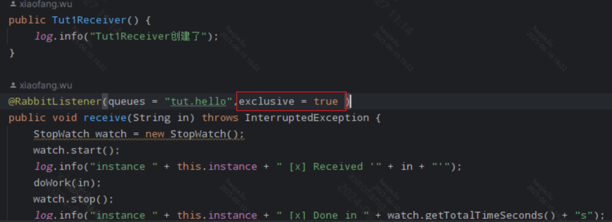
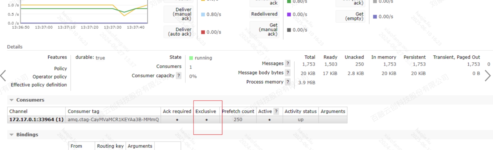
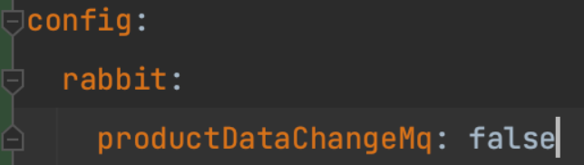
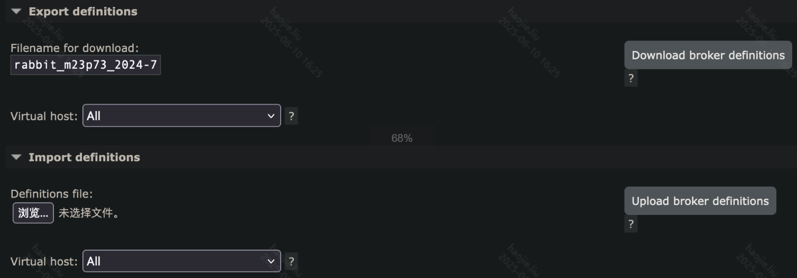

# 关于MQ相关

## RabbitMQ

### **1、RabbitMq多套环境使用时，希望某个特定环境消费时（author：xiaofang）**

当前我们pre的各个环境公用中间件，其中就包括rabbitMq,我们在测试阶段，经常会发生测试消息，被其他环境的消费者消费的问题，以下方案为解决此类事件

### **提高目标测试环境消费者优先级(推荐)**

检查各个环境消费者优先级





修改目标环境优先级，注意要大于其他环境的优先级

注解修改：



配置修改：



检查优先级配置是否成功



重启服务

缺点：

当单个消费者消费不过来时，优先级低的也会被消费，较低几率下，可能消息会被优先级低的消费，但是对于测试来说够用

### **设置目标测试环境消费者独占（不推荐）**

检查各个环境是否有独占队列



修改分支的消费者代码为exclusive=true



部署到目标环境进行测试

检查是否配置成功



重启服务

### **特别注意：上线前修改为false**

### **缺点：上线前注意修改为false，否则多实例消费不会起作用**

### **使用@Conditional家族的注解来实现通过配置消费者的Bean是否加在到容器中来控制消费**

false则认为该Bean不会加在



```java
@Slf4j
@Component
//默认为true
@ConditionalOnProperty(value = "config.rabbit.productDataChangeMq", havingValue = "true", matchIfMissing = true)
public class ProductDataChangeReceiver {
    @Resource
    private AccBillService accBillService;
 
    private static final String RMQ_QUEUE_NAME_PRODUCT = "zl-project.data.change.queue";
 
    @RabbitListener(bindings = @QueueBinding(value = @Queue(value = RMQ_QUEUE_NAME_PRODUCT, durable = "true"),
        exchange = @Exchange(value = RmqConsts.ZL_DATA_EXCHANGE, type = ExchangeTypes.TOPIC),
        key = RmqConsts.PROJECT_DATA_CHANGE_ROUTINKEY))
    public void productDataChangeEvent(String msg) {
        try {
            log.info("productDataChangeEvent.msg:{}", msg);
            ProjectUpdateVo projectUpdateVo = JSONObject.parseObject(msg, ProjectUpdateVo.class);
            this.accBillService.updateManager(projectUpdateVo);
        } catch (Exception e) {
            log.error("productDataChangeEvent.error", e);
        }
    }
}
```

缺点：

- 每次需要修改配置来完成

改进：

- 如果true和false是动态保存在redis中，来读呢？

> 这个想法实际上，混淆了这个方法的本质，这个方法的本质是将消费者的Bean不加在到容器中，假设使用了动态true或者false会有两个问题：
> 
> - redis本身的Bean如果加载顺序在消费者Bean读取注解意义的后面呢
> - 这个方法是将消费者Bean移除，但是对于MQ来说消费者还在，只是没有消费逻辑，那么这时可能会有报错

### **使用spring提供的RabbitMq客户端提供API将消费者与交换机的连接主动关闭**

```java
@Resource
private RabbitListenerEndpointRegistry rabbitListenerEndpointRegistry;
 
@GetMapping(value = "/rabbitmqAllStop")
public void rabbitmqAllStop() {
    this.rabbitListenerEndpointRegistry.stop();
}
 
@GetMapping(value = "/rabbitmqAllStart")
public void rabbitmqAllStart() {
    this.rabbitListenerEndpointRegistry.start();
}
```

缺点：

- 每次环境重启，连接也会重新启动

### **使用Vhost来逻辑隔离每个环境与交换机的绑定关系**

相当于每个环境一套

缺点：

- 需要将原有的绑定关系全部梳理并且新建vhost

优点：

- 一劳永逸

简便做法：

可以使用某个vhost把现成的配置导出再导入



### **2、当消费者消费报错时，会将消息放回至队列并重复消费**

## RocketMQ

### **1、配置文件中的producer.group和接收者注解的consumerGroup属性的区别**

在 RocketMQ 中，`producer` 的 `group` 和 `consumer` 的 `group` 是两个不同的概念，尽管它们在配置文件中可能看起来相似，但它们的用途和作用是不同的。

### **Producer Group**

- **Producer Group**：生产者组，用于标识一组生产者实例。生产者组主要用于事务消息的管理和故障恢复。
- **配置位置**：通常在生产者的配置文件中配置。

### **示例配置**

```java
rocketmq:
  producer:
    group: "producerGroupName"
    namesrvAddr: "localhost:9876"
```

---

### **Consumer Group**

- **Consumer Group**：消费者组，用于标识一组消费者实例。消费者组中的所有消费者实例共享同一个消费进度（offset），并且共同消费同一个主题（topic）的消息。
- **配置位置**：通常在消费者的注解 `@RocketMQMessageListener` 中配置。

### **示例配置**

```java
import org.apache.rocketmq.spring.annotation.RocketMQMessageListener;
import org.apache.rocketmq.spring.core.RocketMQListener;
import org.springframework.stereotype.Service;
 
@Service
@RocketMQMessageListener(topic = "topicName", consumerGroup = "consumerGroupName")
public class MyConsumer implements RocketMQListener<String> {
    @Override
    public void onMessage(String message) {
        System.out.println("Received message: " + message);
    }
}
```

### **区别**

1. **Producer Group**：
    - 用于标识一组生产者实例。
    - 主要用于事务消息的管理和故障恢复。
    - 不同的生产者组可以发送相同主题的消息。
2. **Consumer Group**：
    - 用于标识一组消费者实例。
    - 共享同一个消费进度，共同消费同一个主题的消息。
    - 不同的消费者组可以独立消费相同主题的消息。

### **2、Caused by: org.apache.rocketmq.remoting.exception.RemotingConnectException: connect to 192.168.163.64:10911 failed**

本质上mq的服务端得配置一些东西

[解决方案](https://blog.csdn.net/qq_26048293/article/details/107811795)