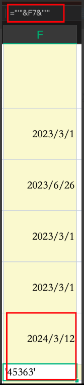
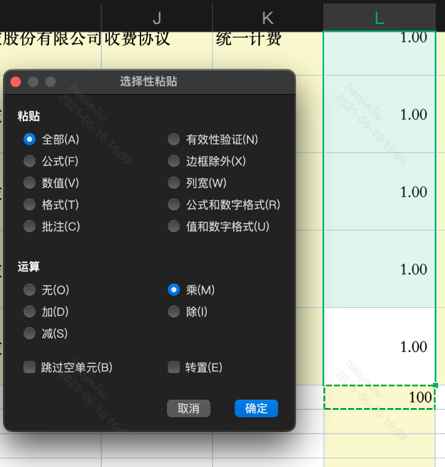

# WPS相关

## EXCEL

### **1、=VLOOKUP()函数**

这个函数支持跨sheet页和跨文件计算

### **2、自定义筛选**

### **筛选各种谓词以及且与或**

### **3、Text函数**

当别人的日期函数被别的函数引用时可能会发现引用后是一串数字，这是就可以用如下函数来格式化

`=text(单元格,"yyyy-mm-dd")`

---

### **4、选择性粘贴**

当不想用另起一列来做函数加减，就可以找一个单元格，写入需要参加运算的参数，然后在粘贴到需要影响的目标列，选中【选择性粘贴】进行操作即可

