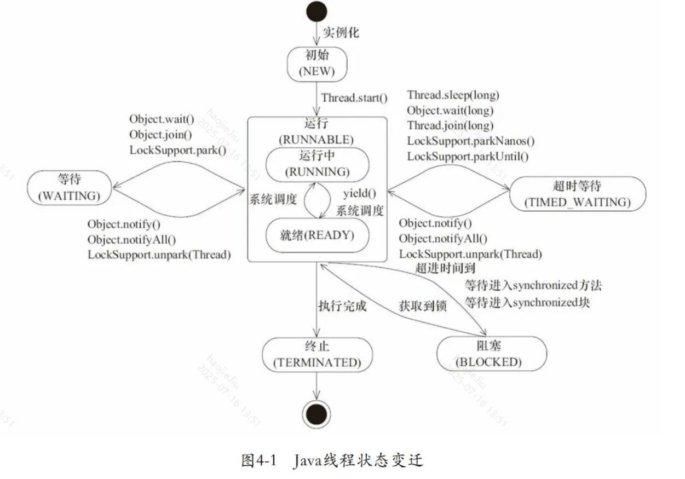
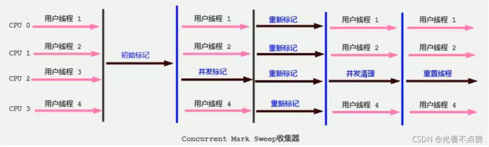
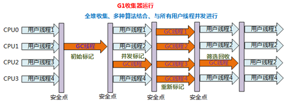
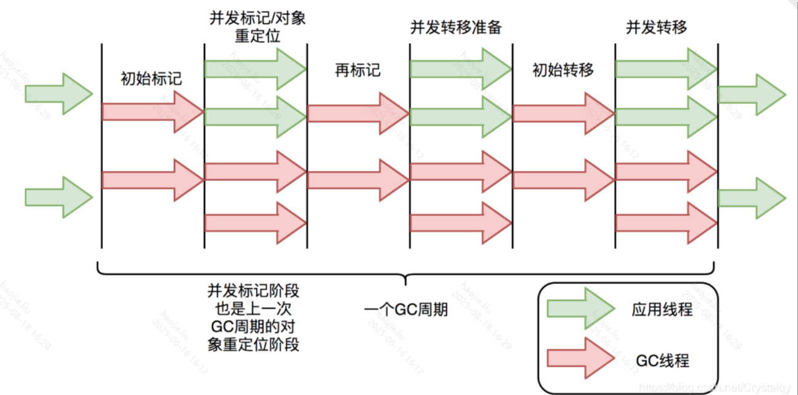
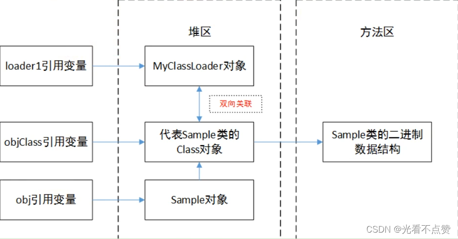

# often forget

死锁只有**同时满足**以下四个条件才会发生：

- 互斥条件：互斥条件是指**多个线程不能同时使用同一个资源**。
- 持有并等待条件：持有并等待条件是指，当线程 A 已经持有了资源 1，又想申请资源 2，而资源 2 已经被线程 C 持有了，所以线程 A 就会处于等待状态，但是**线程 A 在等待资源 2 的同时并不会释放自己已经持有的资源 1**。
- 不可剥夺条件：不可剥夺条件是指，当线程已经持有了资源 ，**在自己使用完之前不能被其他线程获取**，线程 B 如果也想使用此资源，则只能在线程 A 使用完并释放后才能获取。
- 环路等待条件：环路等待条件指的是，在死锁发生的时候，**两个线程获取资源的顺序构成了环形链**。

### QPS和TPS

- QPS（Queries Per Second）/RPS：每秒处理的请求数，常用于接口/读查询的吞吐量度量。
- TPS（Transactions Per Second）：每秒完成的“事务/交易/完整业务”数，常用于数据库、支付结算等有明确事务边界的场景。

**计算方法（常用公式）**

- 平均QPS（或TPS）= 一段时间内总请求数（或总事务数） ÷ 该时间长度（秒）
- 峰值QPS（或TPS）= 以1秒为窗口统计的最大秒级计数
- 利特尔法则（估算关系）：QPS ≈ 并发数C ÷ 平均响应时间RT（单位秒）
- 推导：C = QPS × RT → 需要的并发 = 目标QPS × 平均RT

**QPS 与 TPS 的关系**

- 一次“事务”只对应1次请求：TPS ≈ QPS
- 一次事务包含 m 次请求：QPS = TPS × m（或 TPS = QPS ÷ m）
- 例如下单事务包含“校验、锁库存、下单、支付回调”等多次接口调用。

**简单例子**

- 10分钟内处理请求 1,200,000 次 → 平均QPS = 1,200,000 ÷ 600 = 2,000
- 目标QPS=1,000，平均RT=200ms(0.2s) → 需要并发 C = 1,000 × 0.2 = 200
- 某业务一次交易平均发起3次请求，测得QPS=3,000 → TPS ≈ 3,000 ÷ 3 = 1,000

四种线程池

- 固定线程池 newFixedThreadPool(n)：核心=最大=n，队列无界，适合恒定并发。
- 缓存线程池 newCachedThreadPool()：核心=0，最大≈无限，空闲60s回收，适合大量短任务但有“线程爆炸”风险。
- 单线程池 newSingleThreadExecutor()：核心=最大=1，队列无界，保证串行与任务顺序。
- 定时线程池 newScheduledThreadPool(n)：定时/周期任务，核心=n，延迟队列。

四种预置的拒绝策略：

- CallerRunsPolicy，使用线程池的调用者所在的线程去执行被拒绝的任务，除非线程池被停止或者线程池的任务队列已有空缺。
- AbortPolicy，直接抛出一个任务被线程池拒绝的异常。
- DiscardPolicy，不做任何处理，静默拒绝提交的任务。
- DiscardOldestPolicy，抛弃最老的任务，然后执行该任务。
- 自定义拒绝策略，通过实现接口可以自定义任务拒绝策略。

**LRU（最近最少使用）**

- **核心思想**：淘汰最近最久未被访问的数据。
- **实现方式**：通常用双向链表+哈希表（如LinkedHashMap），每次访问都把数据移到链表头部，淘汰时移除链表尾部。
- **适用场景**：数据访问有“时间局部性”，即最近用过的数据很可能还会被用到。
- **优点**：实现简单，命中率高于FIFO。
- **缺点**：如果有热点数据被短时间大量访问后长期不用，仍然可能被淘汰。

---

**LFU（最不经常使用）**

- **核心思想**：淘汰一段时间内访问次数最少的数据。
- **实现方式**：需要记录每个数据的访问次数，淘汰时移除访问次数最少的。
- **适用场景**：数据访问有“频率局部性”，即经常被访问的数据应该长期保留。
- **优点**：能保留长期热点数据，适合访问频率分布极不均匀的场景。
- **缺点**：实现复杂，维护计数开销大，容易出现“缓存污染”（短时间内被频繁访问的数据可能长期占用缓存）。

| 策略名 | 含义/淘汰规则 | 典型应用场景/系统 |
| --- | --- | --- |
| FIFO：First-In, First-Out | 最早进入的先淘汰 | 简单缓存、队列 |
| LRU：Least Recently Used | 最近最少使用的淘汰 | 操作系统、数据库 |
| LFU：Least Frequently Used | 最不常用的淘汰 | 缓存系统 |
| Random：Random Replacement | 随机淘汰 | Redis、硬件缓存 |
| MRU：Most Recently Used | 最近最常用的淘汰 | 特殊场景 |
| ARC：Adaptive Replacement Cache | 自适应LRU+LFU | ZFS、DB2 |
| CLOCK：Clock (Second-Chance) | 近似LRU，带使用位的循环淘汰 | 操作系统页面置换 |
| 2Q：Two Queues | 两队列，防止一次性访问污染 | PostgreSQL |
| Segmented LRU：Segmented Least Recently Used (S-LRU) | 分段管理，提升灵活性 | 多级缓存 |
| TTL：Time To Live | 超时自动淘汰 | Web缓存、分布式缓存 |



### **引用类型有哪些？有什么区别？**

引用类型主要分为强软弱虚四种：

- 强引用指的就是代码中普遍存在的赋值方式，比如 A a = new A() 这种。强引用关联的对象，永远不会被 GC 回收。
- 软引用可以用 SoftReference 来描述，指的是那些有用但是不是必须要的对象。系统在发生内存溢出前会对这类引用的对象进行回收。
- 弱引用可以用 WeakReference 来描述，他的强度比软引用更低一点，弱引用的对象下一次 GC 的时候一定会被回收，而不管内存是否足够。
- 虚引用也被称作幻影引用，是最弱的引用关系，可以用 PhantomReference 来描述，他必须和 ReferenceQueue 一起使用，同样的当发生 GC 的时候，虚引用也会被回收。可以用虚引用来管理堆外内存。

### **双亲委派**

- 定义：类加载请求先交给父加载器，父找不到才由当前加载器自己加载。
- 典型流程（ClassLoader#loadClass 简化）：

1) 已加载缓存检查

2) 若有父加载器：parent.loadClass(name)（最终可到 Bootstrap）

3) 父返回找不到时，当前加载器 findClass(name) → defineClass → 解析/链接

- 作用：
- 安全与唯一性：JDK核心类只由 Bootstrap 加载，杜绝“伪系统类”冒充
- 共享与复用：父加载的类对子可见，避免重复加载
- 命名空间稳定：类身份=“加载器+全限定名”，委派保证系统类唯一

### **什么时候“用不到/被打破”**

- 子先于父（parent-last/child-first）自定义加载器
- 典型：应用服务器/插件体系（Tomcat WebAppClassLoader、JBoss Modules、OSGi 等），为“允许应用覆盖容器类、实现多应用隔离”而改写 loadClass 流程先尝试本地再委派。
- SPI/TCCL 机制绕过父委派
- JDBC、JNDI、JAXP、日志等通过 ServiceLoader 或线程上下文类加载器（TCCL）在“子/应用加载器”中找实现，接口在父/Bootstrap，避免“父看不见子”的问题。
- 代理与运行期定义类（非常规路径）
- Java Agent/Instrumentation、CGLIB/ByteBuddy、MethodHandles.Lookup#defineClass/隐藏类、appendToSystemClassLoaderSearch 等直接把字节码定义到指定加载器/搜索路径，不走标准委派链。
- 模块/沙箱自定义路由
- OSGi 按“导入/导出包”精确布线；并非纯粹的父优先。

**双亲委派模型的作用**

- **保证类的唯一性**：通过委托机制，确保了所有加载请求都会传递到启动类加载器，避免了不同类加载器重复加载相同类的情况，保证了 Java 核心类库的统一性，也防止了用户自定义类覆盖核心类库的可能。
- **保证安全性**：由于 Java 核心库被启动类加载器加载，而启动类加载器只加载信任的类路径中的类，这样可以防止不可信的类假冒核心类，增强了系统的安全性。例如，恶意代码无法自定义一个 Java.lang.System 类并加载到 JVM 中，因为这个请求会被委托给启动类加载器，而启动类加载器只会加载标准的 Java 库中的类。
- **支持隔离和层次划分**：双亲委派模型支持不同层次的类加载器服务于不同的类加载需求，如应用程序类加载器加载用户代码，扩展类加载器加载扩展框架，启动类加载器加载核心库。这种层次化的划分有助于实现沙箱安全机制，保证了各个层级类加载器的职责清晰，也便于维护和扩展。
- **简化了加载流程**：通过委派，大部分类能够被正确的类加载器加载，减少了每个加载器需要处理的类的数量，简化了类的加载过程，提高了加载效率。

**环比增长率公式**


### isAssignableFrom

A.isAssignableFrom(B) = “B 是不是 A 的子类/实现类（或相同类型），能否赋给 A 变量”。

**与 instanceof/isInstance 的区别**

- obj instanceof A 只对对象判断。
- A.isInstance(obj) 等价于 A.isAssignableFrom(obj.getClass())。
- isAssignableFrom 比较“两个 Class 之间的可赋值关系”，无需实例。

### 有向无环*图*

在*图*论中，如果一个有向*图*从任意顶点出发无法经过若干条边回到该点，则这个*图*是一个有向无环*图*（英语：Directed Acyclic Graph，缩写：*DAG*

### **4层（TCP/IP）**

- 链路层（Link/Network Access）：以太网、PPP、ARP；设备：网卡、L2 交换机
- 网际层（Internet）：IP、ICMP；设备：路由器（转发/路由）
- 传输层（Transport）：TCP、UDP（端到端可靠/不可靠传输）
- 应用层（Application）：HTTP、DNS、SMTP、FTP、TLS 等

### **5层（教学版）**

- 物理层：比特传输（电气/光信号）
- 数据链路层：成帧、MAC、VLAN、以太网；设备：L2 交换机
- 网络层：IP 路由、ICMP；设备：路由器
- 传输层：TCP/UDP、端口、流量控制、重传
- 应用层：把 OSI 的会话+表示+应用合并（HTTP、DNS、SSL/TLS、JSON 编解码等）

### **7层（OSI）**

- 物理层：比特传输
- 数据链路层：帧、MAC 地址、错误检测
- 网络层：包、IP 路由、寻址
- 传输层：段、TCP/UDP、可靠性与复用
- 会话层：会话建立/维护/同步（实践中常由应用/框架承担）
- 表示层：数据表示、加解密、压缩（TLS、编码/序列化）
- 应用层：具体应用协议（HTTP、FTP、SMTP、DNS）

### 垃圾回收器

CMS

垃圾回收算法：**标记-清除算法**

垃圾回收过程：



G1

垃圾回收算法：标记-压缩&复制算法

垃圾回收过程：



ZGC：

垃圾回收算法：标记-复制算法

垃圾回收过程



### NIO、BIO、AIO

**先分清两个概念**

- 同步/异步：谁负责等结果。同步=应用线程主动等并取结果；异步=OS/框架完成后主动通知你（回调/未来）。
- 阻塞/非阻塞：调用是否把线程“挂住”。阻塞=调用没准备好就挂住；非阻塞=立即返回（可能返回0/EAGAIN）。

- BIO 也叫**同步阻塞性 IO**，意思就是应用程序向内核发起读取数据的申请后，自己就阻塞了，直到内核返回数据。
- NIO 其实就是**同步非阻塞 IO**，它会反复发起申请，直到内核返回数据，这时候应用程序是不阻塞的。
- IO 多路复用，这个 Redis 也在用，本质是使用 **select、poll、epoll 函数**发起申请，然后等待内核回调通知应用程序数据准备好了，然后应用再发起读取请求获取数据。相较于 BIO\NIO **优势**在于可以同时发起多个读取数据的请求。select 有两**缺点**，一是有 1024 的最大连接数限制，二是只能知道有数据准备成功，但是不知道具体是哪个监听事件成功，只能遍历查找。poll 解决了最大连接数的问题，epoll 则是同时解决了两个问题，他们的**底层数据结构依次是数组、链表、红黑树加双链表**。
- 信号 IO 则是建立一个**信号联系**，内核准备好数据后回调通知应用程序去发起读取数据的请求，相较 IO 多路复用优势在于发起信号联系不会阻塞。
- AIO 也就是**异步 IO**，应用程序发送读取数据的请求后，不会阻塞，内核准备好数据后直接返回数据给应用程序，相较信号 IO 又**省了第二阶段申请**的步骤。

**一句话理解**

- BIO：read() 不到数据就卡住线程。
- NIO：先用 Selector 知道谁“就绪”，再自己去 read()；调用不阻塞，但还是你来取数据 ⇒ 同步。
- AIO：提交 read() 后马上返回，数据到了系统主动调用你的 CompletionHandler ⇒ 异步。

### 对象、对象class、类加载器的关系

Java 的类“标识”是“加载器 + 全限定名”

```java
class Sample{
	public static void main(String[] args) {
		//obj引用变量——A对象
		Sample a = new Sample();
		//objClass引用变量——代表Sample类的Class对象
		Class<? extends Sample >aClass = a.getClass();
		//类加载器
		ClassLoader classLoader = aClass.getClassLoader();
	}
}
```



### 对称加密和非对称加密

对称加密算法：DES、AES

非对称加密算法：RSA

### **@Autowired和@Resource的区别**

`@Autowired`和`@Resource`都是Spring框架提供的注解，用于实现依赖注入（DI），但它们在注入方式和来源上有所不同。

**@Autowired**

- **来源**：`@Autowired`是Spring框架的注解。
- **注入方式**：默认按类型（Type）进行自动装配。如果找到多个相同类型的bean，则会根据属性名称（Name）作为bean的id进行匹配。
- **可选性**：可以设置`required`属性为`false`，表示如果没有找到匹配的bean也不会报错，只是该属性不会被设置（默认为`true`）。
- **使用位置**：可以用在构造器、属性字段、setter方法上。

**@Resource**

- **来源**：`@Resource`是由JDK提供，来自于`javax.annotation.Resource`，Spring支持该注解实现依赖注入。
- **注入方式**：默认按名称（Name）进行装配。如果没有指定名称，那么会按照字段名称或setter方法名称进行匹配。如果没有找到匹配的名称，则会按类型（Type）进行匹配。
- **可选性**：`@Resource`没有`required`属性，如果没有找到匹配的bean，将会抛出异常。
- **使用位置**：可以用在字段或setter方法上。

**主要区别**

1. **来源不同**：`@Autowired`是Spring的注解，而`@Resource`是JDK的注解。
2. **默认注入方式不同**：`@Autowired`默认按类型装配，`@Resource`默认按名称装配。
3. **可选性处理**：`@Autowired`可以通过`required`属性设置不是必须的依赖，`@Resource`没有这样的属性，找不到对应bean时会抛出异常。
4. 指定名称的方式

```java
@Component
public class PaymentService {
    @Autowired
    @Qualifier("client")
    private Client client;
  
    // ...
}
@Component
public class PaymentService {
    @Resource(name = "client")
    private Client client;
  
    // ...
}
```

### **选择建议**

- 如果你完全在Spring环境下工作，推荐使用`@Autowired`，因为它更加灵活，特别是配合`@Qualifier`注解使用时，可以更精确地控制bean的选择。
- 如果你希望你的应用尽可能地与Spring解耦，或者需要按名称进行注入，那么`@Resource`可能是更好的选择。

### **Java 元注解及其作用**

- **@Target**: 指定注解可用于哪些程序元素。取值为 ElementType（如 TYPE, METHOD, FIELD, PARAMETER, CONSTRUCTOR, LOCAL_VARIABLE, ANNOTATION_TYPE, PACKAGE, TYPE_PARAMETER, TYPE_USE, MODULE, RECORD_COMPONENT）。
- **@Retention**: 指定注解的保留策略。
    - SOURCE（仅源码）
    - CLASS（编译期保留，不可反射）
    - RUNTIME（运行期可反射）。
- **@Documented**: 使该注解出现在 Javadoc 中。
- **@Inherited**: 使类级别注解可被子类继承（仅对 ElementType.TYPE 有效，接口实现不继承）。
- **@Repeatable**: 使一个注解可在同一位置重复使用。需要定义配套的“容器注解”。