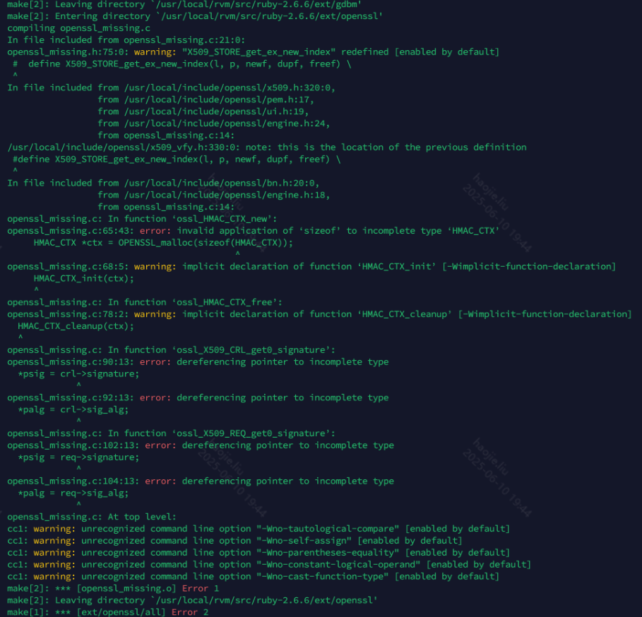
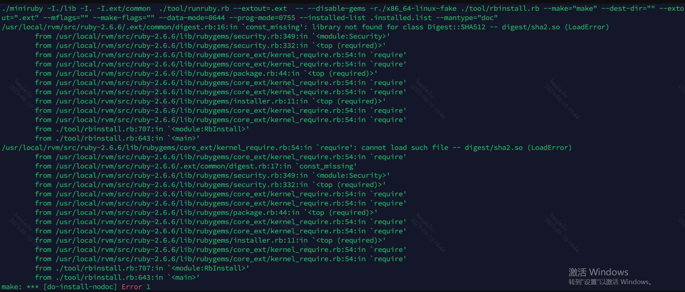
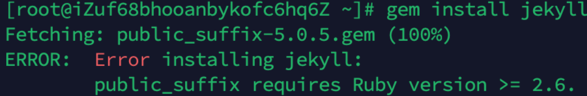

# 从0到1使用Jekyll部署静态博客

## 环境搭建

### **1、安装ruby**

在CentOS上安装Ruby，你可以使用yum包管理器，或者使用RVM（Ruby Version Manager）来安装。以下是两种方法的步骤：

**使用yum安装：**

`sudo yum install ruby`

---

**使用rvm安装**：

`rvm install 2.6`

---

这将安装Ruby的默认版本。

**验证是否安装成功：**

`[root@iZuf68bhooanbykofc6hq6Z` `~]# gem -v`

`2.0.14.1`

`[root@iZuf68bhooanbykofc6hq6Z` `~]# ruby -v`

`ruby 2.0.0p648 (2015-12-16) [x86_64-linux]`

---

### **2、安装RVM**

rvm是管理ruby的一个工具

[安装过程](https://www.jianshu.com/p/ac8bfda5eb31)

```java
//RVM 的安装脚本是通过 GPG 签名来验证的。首先，你需要导入用于验证 RVM 安装包的 GPG 密钥。在终端中运行以下命令：
gpg2 --keyserver hkp://keyserver.ubuntu.com --recv-keys 409B6B1796C275462A1703113804BB82D39DC0E3 7D2BAF1CF37B13E2069D6956105BD0E739499BDB
//下载
curl -sSL https://get.rvm.io | bash -s stable
//引入环境变量
source /etc/profile.d/rvm.sh
//查看被管理组件的版本
rvm list known
```

---


### **3、安装openssl**

安装：

```java
[root@iZuf68bhooanbykofc6hq6Z ~]# openssl -version
openssl: error while loading shared libraries: libssl.so.1.1: cannot open shared object file: No such file or directory
 
/usr/local/rvm/src/ruby-2.6.6/ext/openssl
 
find / -name libssl.so.1.1
ln -s 自己libssl的库路径 /usr/lib64/libssl.so.1.1
ln -s 自己libcrypto的库路径 /usr/lib64/libcrypto.so.1.1
```

---

出现的问题：

1、这个问题主要是因为在安装时找不到openssl的位置，所以需要在安装时制定库的问题：

```java
#查询openssl的目录
which openssl
openssl version (-a)
#指定路径
rvm install 版本号 --with-openssl-dir=xxxx
```

---



2、而这个错误主要是因为openssl缺少一些文件，博主建议直接全部把openssl相关全部删除，重新安装，亦或者重装虚拟机的环境



### **4、安装Jekyll**

### [**官网文档**](http://jekyllcn.com/docs/installation/)

下面的命令会安装Jekyll相关的全部依赖包

```java
# 下载ruby会自带gem
gem install jekyll
# 如果需要更新gem的版本
gem update --system 版本号
# 查看当前的gem镜像地址
gem sources l
# 更改gem的镜像地址
gem sources --remove https://rubygems.org/
gem sources -a https://mirrors.aliyun.com/rubygems/
```

---

出现问题：

[解决方式](https://www.jianshu.com/p/7a625eb8cde0)



### **5、启动Jekyll**

```java
~ $ gem install jekyll
~ $ jekyll new myblog
~ $ cd myblog
~/myblog $ jekyll serve
# => Now browse to http://localhost:4000
 
# 后台运行
jekyll serve --detach
# 检测改变并且重新加载，在2.4版本及以后默认就会检测文件中的改变
jekyll serve --watch
```

---