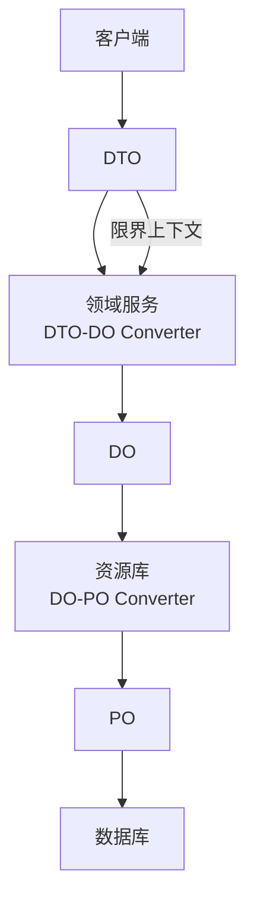
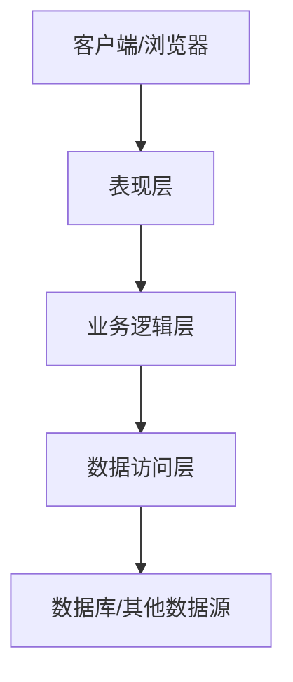

# 有关DDD（领域驱动设计）的学习

type: Post
status: Published
date: 2025/10/30
summary: 有关DDD（领域驱动设计）的学习
tags: 设计模式
category: 技术分享

## 学习友链

[领域驱动设计在互联网业务开发中的实践](https://tech.meituan.com/2017/12/22/ddd-in-practice.html)

[领域驱动设计DDD在B端营销系统的实践](https://tech.meituan.com/2024/05/27/ddd-in-business.html)

## 什么是DDD

### **1、定义**

DDD的全称是“Domain-Driven Design”，中文通常翻译为“领域驱动设计”。领域驱动设计是一种软件开发方法论，强调在软件开发过程中对业务领域的深入理解和建模。其核心思想是通过与领域专家的紧密合作，创建一个反映业务需求和逻辑的模型，并将其作为软件系统的基础。领域驱动设计的关键概念包括：

- 领域模型：一个抽象的模型，用于表示业务领域中的概念和关系。
- 限界上下文：定义模型的边界，确保模型在特定上下文中保持一致。
- 聚合：一组相关对象的集合，作为一个单元进行数据更改。
- 实体和值对象：实体是具有唯一标识的对象，而值对象是没有唯一标识的、不可变的对象。
- 领域事件：表示领域中发生的重要事件。

领域驱动设计通过这些概念帮助开发人员更好地理解和实现复杂的业务需求，提高软件的可维护性和可扩展性

### **2、九种上下文限界的映射关系**

- 合作关系（Partnership）：两个上下文紧密合作的关系，一荣俱荣，一损俱损。
- 共享内核（Shared Kernel）：两个上下文依赖部分共享的模型。
- 客户方 - 供应方开发（Customer-Supplier Development）：上下文之间有组织的上下游依赖。
- 遵奉者（Conformist）：下游上下文只能盲目依赖上游上下文。
- 防腐层（Anticorruption Layer）：一个上下文通过一些适配和转换与另一个上下文交互。
- 开放主机服务（Open Host Service）：定义一种协议来让其他上下文来对本上下文进行访问。
- 发布语言（Published Language）：通常与 OHS 一起使用，用于定义开放主机的协议。
- 大泥球（Big Ball of Mud）：混杂在一起的上下文关系，边界不清晰。
- 另谋他路（SeparateWay）：两个完全没有任何联系的上下文。



### 3、J2EE开发模式以及贫血问题

J2EE的开发结构如下：



**贫血领域对象**

贫血领域对象（Anemic Domain Object）是指仅用作数据载体，而没有行为和动作的领域对象。

在我们习惯了 J2EE 的开发模式后，Action/Service/DAO 这种分层模式，会很自然地写出过程式代码，而学到的很多关于 OO 理论的也毫无用武之地。使用这种开发方式，对象只是数据的载体，没有行为。以数据为中心，以数据库 ER 设计作驱动。分层架构在这种开发模式下，可以理解为是对数据移动、处理和实现的过程。

以笔者最近开发的系统抽奖平台为例：

- 场景需求

奖池里配置了很多奖项，我们需要按运营预先配置的概率抽中一个奖项。 实现非常简单，生成一个随机数，匹配符合该随机数生成概率的奖项即可。

- 贫血模型实现方案

先设计奖池和奖项的库表配置。


抽奖 ER 图

- 设计 AwardPool 和 Award 两个对象，只有简单的 get 和 set 属性的方法

```java
class AwardPool {
    int awardPoolId;
    List<Award> awards;
    public List<Award> getAwards() {
        return awards;
    }

    public void setAwards(List<Award> awards) {
        this.awards = awards;
    }
    ......
}

class Award {
   int awardId;
   int probability;

   ......
}
```

- Service 代码实现

设计一个 LotteryService，在其中的 drawLottery() 方法写服务逻辑

```java
AwardPool awardPool = awardPoolDao.getAwardPool(poolId);
for (Award award : awardPool.getAwards()) {

}
```

- 按照我们通常思路实现，可以发现：在业务领域里非常重要的抽奖，我的业务逻辑都是写在 Service 中的，Award 充其量只是个数据载体，没有任何行为。**简单的业务系统采用这种贫血模型和过程化设计是没有问题的，**但在业务逻辑复杂了，业务逻辑、状态会散落到在大量方法中，原本的代码意图会渐渐不明确，我们将这种情况称为由贫血症引起的失忆症。

更好的是采用领域模型的开发方式，将数据和行为封装在一起，并与现实世界中的业务对象相映射。各类具备明确的职责划分，将领域逻辑分散到领域对象中。继续举我们上述抽奖的例子，使用概率选择对应的奖品就应当放到 AwardPool 类中。