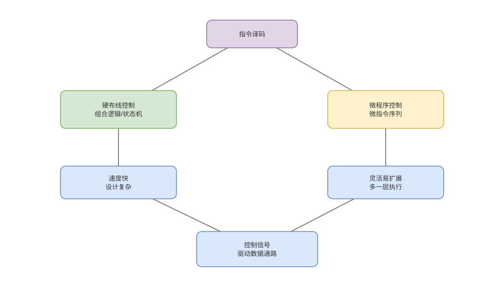

# 寄存器、ALU、数据通路与控制器

> 基线：数据通路保存和变换值，控制器依据指令与状态选择“何时让哪条路径做什么”。

## 01-CPU状态
Q: CPU 对软件可见和内部不可见的状态分别有哪些？
A:
- 架构状态包括 PC、通用/向量寄存器、标志、控制寄存器和架构可见内存效果，异常恢复必须以它为准。
- 微架构状态包括流水线寄存器、物理寄存器、ROB、预测器和缓存内容，可影响性能但不应改变正确结果。
- 上下文切换主要保存所需架构状态，不会逐项保存缓存和预测器；后者会自然冷却或带来侧信道风险。
- 区分两者才能理解乱序执行为何可在精确异常时“回滚”。

## 02-寄存器堆
Q: 寄存器堆为什么有多个读写端口，端口数带来什么代价？
A:
- 一条算术指令常同时读两个源并写一个目标，超标量每周期多发射需要更多并行端口。
- 多端口寄存器堆的面积、布线、功耗和访问延迟快速增长，成为扩大执行宽度的物理限制。
- 乱序 CPU 使用更大的物理寄存器文件和旁路网络，架构寄存器只是重命名映射。
- “寄存器永远零成本”错误；数量有限、端口竞争和依赖链都会限制吞吐。

## 03-ALU与标志
Q: ALU 执行哪些操作，标志位怎样产生？
A:
- ALU 处理整数加减、逻辑、移位和比较；乘除、浮点、向量和地址生成常有专用执行单元。
- 加法器同时产生 carry、overflow、zero、sign 等条件，ISA 决定哪些更新为架构标志。
- 条件分支或条件移动消费比较结果；共享标志寄存器也可能形成额外依赖，某些 ISA 使用独立比较结果。
- 单元延迟与吞吐不同：一个乘法可能延迟多周期但流水化后每周期仍接收新操作。

## 04-数据通路
Q: 一条 Load 指令在数据通路上经过哪些关键选择？
A:
- 译码选择基址寄存器与立即数，地址生成单元计算有效虚拟地址并检查对齐/权限链路。
- TLB 翻译后访问 L1 D-Cache；命中返回数据，未命中创建 miss 状态并向下层请求。
- 数据经扩展/格式转换写入目标物理寄存器，最终在提交时成为架构可见结果。
- Load 不是“ALU 后直接读内存”一个动作，地址依赖、TLB、缓存和内存顺序都会造成等待。

## 05-硬布线控制
Q: 硬布线控制如何由指令生成控制信号？
A:
- 组合逻辑和有限状态/流水阶段根据 opcode、功能位、当前状态与异常条件决定 mux、读写使能和 ALU 操作。
- 简单规则可快速并行产生信号，适合高频流水线和规则指令。
- 指令与状态组合增多会使逻辑和验证复杂，关键路径也可能限制时钟频率。
- 现代处理器的前端/调度逻辑远比教材单周期控制器复杂，但“状态到控制信号”本质仍成立。

## 06-微程序控制
Q: 微程序控制器内部有哪些部件，怎样执行复杂指令？
A:
- 控制存储器保存微指令，微 PC/序列器选择下一条，每条微指令产生一组底层控制动作。
- 复杂架构指令可展开为 load、ALU、状态更新等多个 micro-operation，条件和异常由微序列处理。
- 优点是复杂语义易组织、可通过 microcode update 修补部分缺陷；代价是额外序列和前端吞吐。
- 并非所有 x86 指令都走慢微码，常用简单指令通常由硬件译码为少量 µops。

## 07-单周期与多周期
Q: 单周期、多周期和流水线数据通路有何区别？
A:
- 单周期让最慢指令在一个长周期完成，硬件直观但所有简单指令也被最长路径限制。
- 多周期复用 ALU/存储通路，把一条指令拆成多个短状态，周期短但一段时间只推进一条或有限指令。
- 流水线在阶段间加寄存器，让不同指令重叠，提高吞吐，同时引入冒险、旁路和冲刷。
- 三者是组织方式而非 ISA 属性，同一 ISA 可由不同数据通路实现。

## 08-图与审查
Q: 面试讲“控制器”时最容易混淆哪些层次？
A:
- 控制器不是只做译码，也负责时序、选择数据路径、异常和提交协调；ALU 才主要做数值计算。
- microcode、µop 和 JVM 字节码都可类比“分解语义”，但分别属于硬件控制、内部执行和软件虚拟机。
- 硬布线与微程序不是现代 CPU 的绝对二选一，常见实现会混合 fast path 与微码慢路径。
- 应能把一条指令落实到寄存器、mux、执行单元和写回，而不是停在“五阶段”名词。

