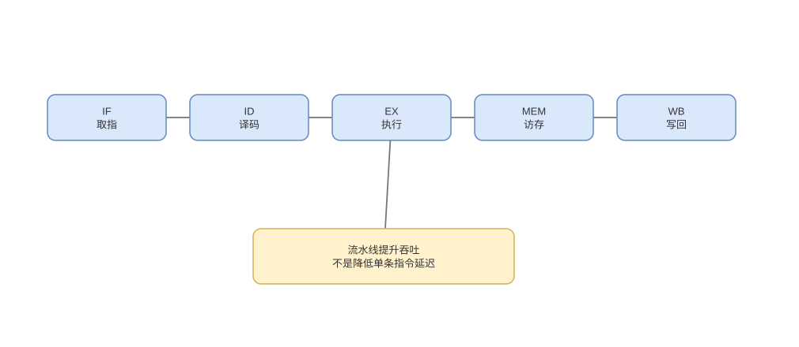

# 流水线、数据冒险与旁路

> 基线：流水线提高吞吐而非必然降低单指令延迟；真实 CPI 由资源、依赖、分支和缓存共同决定。

## 01-五级模型
Q: 经典 IF/ID/EX/MEM/WB 五级流水各阶段做什么？
A:
- IF 用 PC 取指并选择下一 PC；ID 译码、读寄存器和生成立即数；EX 做 ALU、分支判断或地址计算。
- MEM 访问数据缓存；WB 把结果写回寄存器；阶段之间用流水寄存器保存数据和控制位。
- 理想稳态每周期有多条不同指令处于不同阶段，接近每周期完成一条，而单条仍经历多个周期。
- 现代超标量乱序 CPU 阶段更多且边界不同，五级模型用于理解依赖，不是型号说明书。

## 02-吞吐与延迟
Q: 为什么加深流水线可能提高频率，却不一定提升程序性能？
A:
- 把长组合路径切短可缩短时钟周期，但增加流水寄存器开销、阶段间不平衡和控制复杂度。
- 单指令经过更多阶段，基础延迟未必下降；分支误预测或异常需冲刷更多在途工作。
- 性能取决于 `instructions × CPI × cycleTime`，只提高频率若 CPI 同时上升，收益可能抵消。
- 功耗与散热还限制电压频率，现代设计倾向结合宽度、预测和缓存而非无限加深。

## 03-结构冒险
Q: 什么是结构冒险，如何解决？
A:
- 同一周期多条指令需要同一不可并行硬件，如单端口存储器同时取指与访数、有限除法器或写回端口。
- 可复制/多端口化资源、分离 I/D Cache、增加执行单元，或让调度器暂停一部分指令。
- 复制资源提高面积、功耗和旁路网络复杂度，不可能无限扩展；发射宽度最终受端口限制。
- 结构冒险是资源容量问题，与两条指令是否有数据依赖不同。

## 04-RAW依赖
Q: RAW、WAR、WAW 中哪一种是真数据依赖？
A:
- RAW（读后写依赖）表示消费者必须获得生产者结果，属于真实数据流，不能靠重命名消除。
- WAR 和 WAW 是因复用同一架构寄存器名产生的假依赖，乱序执行可用物理寄存器重命名消除。
- 简单顺序五级流水主要遇到 RAW，因为读写阶段固定；乱序发射中三类都必须正确处理。
- 内存地址可能相同又未知，Load/Store 之间还有内存依赖，需要专门消歧。

## 05-旁路转发
Q: 数据旁路怎样减少 RAW 停顿，为什么 Load-use 仍可能等待？
A:
- ALU 结果在 EX 末已产生，可直接从 EX/MEM 流水寄存器送到后续指令 ALU 输入，无需等 WB 后再读寄存器堆。
- 控制逻辑比较后续源寄存器与在途目标，选择最新匹配结果并保持优先级。
- Load 数据通常到 MEM 末才返回，紧随其后的消费者在下一 EX 需要得更早，即使旁路也可能插一拍。
- 缓存未命中会把等待扩大到多周期，乱序执行只能寻找不依赖工作隐藏部分延迟。

## 06-Stall与Flush
Q: stall、bubble 和 flush 分别怎样改变流水线？
A:
- stall 冻结某些阶段寄存器与 PC，让前部不再推进；bubble 向后续阶段注入一条无副作用空操作。
- flush 将已进入流水线但不应提交的指令标记无效，常用于分支误预测、异常和权限失败。
- 正确控制需避免被冲刷指令写寄存器/内存，并保证更老指令的架构效果不丢失。
- 三者都减少有效吞吐，CPI 中体现为 base cycles 之外的 stall/flush cycles。

## 07-编译器调度
Q: 编译器指令调度能解决哪些流水线等待，不能解决哪些？
A:
- 编译器可把独立计算放到长延迟 load 与消费者之间，或展开循环增加可用独立指令。
- 静态调度依赖已知微架构和别名信息，运行时 cache miss、分支方向和动态地址常不可知。
- 过度重排增加寄存器压力，可能导致 spill 到栈，反而引入更多访存。
- 现代 CPU 结合编译器静态优化与硬件动态调度，不能把全部责任交给任一方。

## 08-图与审查
Q: 如何从流水线图判断性能损失，而不是只背冒险名称？
A:
- 先标生产结果真正可用的阶段与消费者需要的阶段，再看是否有旁路；差出的周期就是最小等待。
- 检查资源在同周期是否冲突、分支何时解析以及错误路径包含多少阶段/指令。
- “流水线让一条指令快五倍”错误；填充和排空存在，理想加速主要来自大量指令的重叠吞吐。
- “转发解决所有依赖”也错误，真依赖延迟、cache miss 和串行资源仍构成关键路径。

