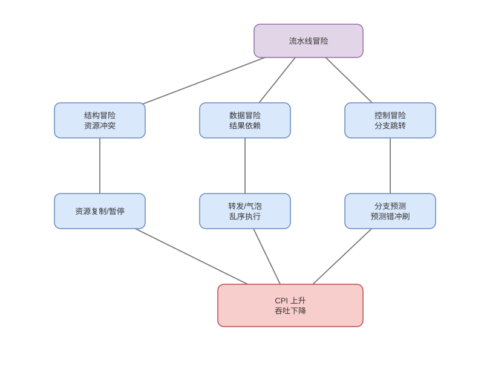

# 分支预测、寄存器重命名与乱序执行

> 基线：现代 CPU 在内部推测并乱序执行，但通过按序提交保持单线程架构语义和精确异常。

## 01-前端预测
Q: 分支预测器需要预测哪些信息？
A:
- 方向预测回答条件分支 taken/not-taken；BTB 缓存分支目标，返回地址栈预测函数 return。
- 间接分支目标可能随历史变化，需要更复杂目标预测；取指宽度还依赖尽早识别指令边界。
- 预测结果在真实条件计算前驱动下一 PC，保证前端持续供给后端。
- 猜错不会提交错误结果，但会浪费取指、译码和执行带宽并增加能耗。

## 02-动态预测
Q: 两位饱和计数器和全局/局部历史为什么比“上次方向”更好？
A:
- 两位状态需连续两次相反结果才翻转强预测，循环末尾一次退出不会立刻破坏下一轮预测。
- 局部历史捕捉某一分支自身模式，全局历史捕捉不同分支相关性，索引模式表给出方向置信。
- 现代预测器组合多种历史长度和组件，具体实现属于型号相关微架构细节。
- 规律数据分布易预测，随机 key 或多态间接调用可能显著增加 miss。

## 03-预测失败恢复
Q: 分支误预测后 CPU 如何恢复正确路径？
A:
- 分支执行单元得到真实方向/目标，与预测比较；不一致时停止错误路径继续扩散。
- 丢弃该分支之后的年轻 µops，恢复重命名映射和资源检查点，把前端 PC 重定向到正确地址。
- 分支之前更老指令继续按序提交，错误路径 store 不得成为架构可见内存更新。
- penalty 取决于发现阶段、前端重启和流水线深度/宽度，不是一个跨 CPU 固定周期数。

## 04-超标量
Q: superscalar CPU 怎样做到每周期完成多条指令？
A:
- 前端每周期取指/译码多个指令，后端有多类执行端口，可让互相独立的 µops 并行运行。
- 发射宽度只是上限，实际 IPC 还受依赖链、端口、分支、缓存、ROB 和带宽限制。
- 同一条依赖链即使有许多 ALU 也无法并行，程序需具备 instruction-level parallelism。
- SMT 可用另一硬件线程填空闲资源，但共享前端、缓存和端口会互相竞争。

## 05-寄存器重命名
Q: 寄存器重命名如何消除 WAR/WAW 假依赖？
A:
- rename table 把架构寄存器映射到更大的物理寄存器；每次写目标分配新物理寄存器。
- 后续读取得到当时最新映射，旧值仍保留给更早读者，WAR/WAW 因名字复用而消失。
- 真正 RAW 仍指向生产者新物理寄存器，必须等其 ready；重命名不创造数据。
- 提交后旧物理寄存器才可回收到 free list，异常恢复需还原映射检查点。

## 06-调度与执行
Q: 乱序调度器如何决定哪条指令先执行？
A:
- 译码/重命名后的 µop 进入 reservation station/issue queue，记录源物理寄存器 ready 状态和所需端口。
- 结果广播唤醒消费者；调度器从已就绪 µops 中选择并发射到可用执行单元，不必按程序顺序。
- cache miss 的 load 可等待时，后面的独立算术先执行以隐藏延迟；依赖它的链仍无法越过。
- Load/Store queue 负责地址、顺序和转发，错误内存消歧需要检测并重放。

## 07-ROB与按序提交
Q: Reorder Buffer 为什么能让“乱序执行、按序退休”同时成立？
A:
- ROB 按程序顺序记录在途指令的完成、异常和目标信息，执行结果先进入物理寄存器/缓冲而非任意提交。
- 只有位于 ROB 头且完成无异常的指令才能退休，使架构状态看起来按序变化。
- 若某指令异常，先让所有更老指令提交，再丢弃它之后的年轻指令，形成精确异常。
- ROB 容量限制可隐藏的延迟窗口；长 cache miss 填满窗口后前端仍会停住。

## 08-边界与安全
Q: 推测执行为什么既提高性能又带来 Spectre 类风险？
A:
- 错误路径结果不会架构提交，但可能改变 cache、TLB、预测器等微架构状态。
- 攻击者用计时侧信道观察这些残留，推断越权读取的数据，这突破了“架构回滚就无影响”的假设。
- 缓解包括屏障、索引掩码、预测器隔离和微码/编译器策略，通常带来性能成本。
- 面试应区分架构正确性、内存模型和微架构侧信道，它们不是同一层保证。

