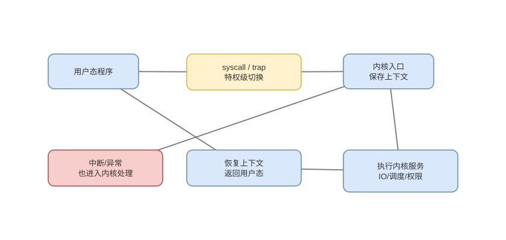

# 中断、异常、特权级与系统调用入口

> 基线：同步异常来自当前指令，外部中断异步到达，系统调用是软件主动的受控特权入口。

## 01-事件分类
Q: interrupt、fault、trap、abort 和 syscall 应如何分类？
A:
- 外部中断由设备/定时器异步发起，与当前指令无直接因果；CPU 在可接受边界转入 handler。
- fault 通常在指令完成前报告，修复后可重试，如缺页；trap 常在指令完成后报告，如断点。
- abort 表示难以精确恢复的严重硬件/一致性错误；syscall 是程序执行专用指令主动进入内核。
- 具体术语随 ISA 有差异，面试先说同步/异步、来源和返回点，避免把所有入口统称“中断”。

## 02-特权保护
Q: CPU 特权级和页权限如何共同隔离用户态与内核态？
A:
- 当前特权级限制特权指令、控制寄存器和入口操作；页表项同时标记 user/supervisor、读写执行权限。
- 用户代码即使知道内核虚拟地址，也不能绕过页权限读取；越权访问触发保护异常。
- 内核入口由 ISA 定义的门、向量表或专用 syscall 配置指定，不能跳到任意内核地址获得权限。
- 安全边界还依赖内核校验用户指针和参数，硬件切级并不自动验证业务语义。

## 03-入口保存
Q: 异常或中断发生时，CPU 与入口汇编分别保存什么？
A:
- 硬件按 ISA 保存返回 PC、状态/标志、事件原因，必要时切换特权状态和栈；具体集合并非完整线程上下文。
- 入口代码再保存通用寄存器、建立统一 trap frame，并切换到内核可安全使用的执行环境。
- handler 根据向量/原因分派，可能确认中断控制器、处理缺页或执行系统调用。
- 返回前处理挂起信号/调度并恢复状态，使用专用返回指令验证目标权限。

## 04-精确异常
Q: 乱序 CPU 如何保证精确异常？
A:
- 执行单元发现异常时记录在对应 ROB 项，不让该指令及更年轻指令提交架构副作用。
- 更老指令继续退休；异常指令到 ROB 头时，清除年轻指令并以该指令 PC 和原因进入 handler。
- handler 因而看到“之前全完成、之后都没发生”的顺序状态，可修复后重试或终止。
- store 通常进入缓冲并在安全提交点之后才对缓存系统可见，避免错误路径写内存。

## 05-系统调用
Q: 一次 syscall 在硬件边界上发生什么？
A:
- 用户代码按 syscall ABI 放编号和参数，执行 `syscall/ecall` 等指令；CPU 从预配置入口取得内核 PC 并改变权限。
- 入口保存用户返回位置和寄存器，切换到内核栈，校验编号与用户参数后分派服务。
- 返回值按 ABI 写入寄存器，恢复用户状态并通过专用路径返回；安全检查和缓解可能增加成本。
- 进入内核态不是进程上下文切换；只有阻塞、抢占等才会调度另一任务。

## 06-中断控制器
Q: 外设中断从设备到某个 CPU 核心需要哪些硬件协作？
A:
- 设备通过引脚或 MSI/MSI-X 内存写形式发出请求，中断控制器完成路由、优先级和向量投递。
- 目标核心在允许时接受向量并进入对应入口，驱动读取/确认设备状态并向控制器完成 EOI。
- 多队列网卡可把不同 MSI-X vector 绑定不同 CPU，提高并行度和局部性。
- 中断屏蔽只影响相应范围，设备仍可能继续产生数据，所以 ring 容量和流控同样重要。

## 07-缺页重试
Q: 缺页 fault 为什么能在处理后重试原指令？
A:
- 地址翻译检测页表不存在、未驻留或写保护，保存 faulting address、访问类型与原 PC。
- 内核判断是否合法：可分配匿名页、执行 COW、从文件调页或因越权终止进程。
- 建立 PTE、执行必要 TLB 失效后返回，CPU 从原指令重新进行翻译和访问。
- 已产生部分外部副作用的指令必须由 ISA 保证可重启语义或报告足够状态，不能简单假设任意复杂指令都无代价重放。

## 08-图与审查
Q: 系统调用、中断和上下文切换最常见的错误关系是什么？
A:
- mode switch 是同一任务改变特权级，context switch 是调度器保存一个任务并运行另一个，两者可同时发生但不等价。
- 系统调用可立即返回而不调度；中断可能打断任意任务，也不代表设备创建了一个用户线程。
- 普通函数调用不改变页表权限和特权级；vDSO 等 API 甚至可在用户态完成而不 syscall。
- 解释性能时要分入口成本、handler 工作、阻塞调度和缓存扰动，不能笼统说“切换很重”。

