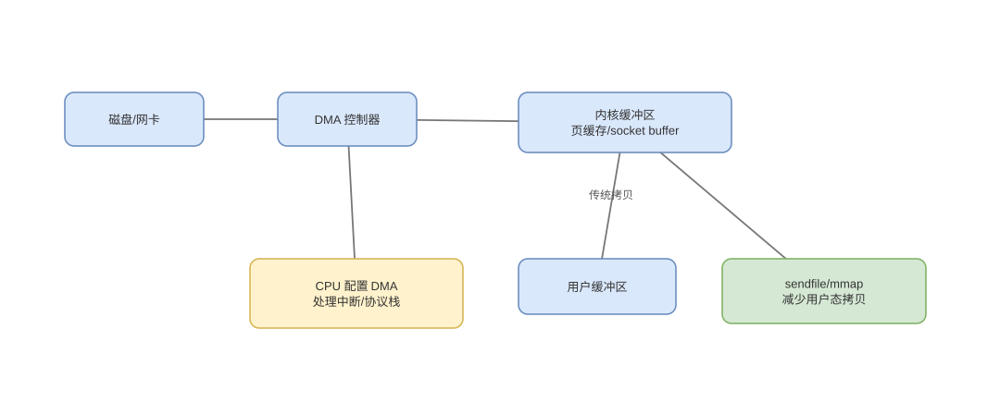

# DMA、IOMMU、MSI-X 与中断合并

> 基线：DMA 解决数据搬运，IOMMU 解决设备地址翻译与隔离，MSI-X 解决多队列中断投递；三者职责不同。

## 01-DMARing
Q: 高性能网卡/磁盘的 DMA descriptor ring 内部如何工作？
A:
- 驱动分配环形描述符和数据缓冲，descriptor 保存 DMA 地址、长度、flags；producer/consumer index 区分可用与完成项。
- 接收时驱动预投空 buffer，设备 DMA 写数据并更新完成状态；发送时设备读取 descriptor 后 DMA 取 payload。
- 驱动通过 MMIO doorbell 通知新工作，设备通过中断或轮询通知完成。
- 发布 descriptor 前必须先完成字段和 buffer 的内存写，再用 DMA barrier 保证设备观察顺序。

## 02-CacheCoherency
Q: DMA 与 CPU Cache 之间为什么可能需要同步？
A:
- coherent DMA 平台由硬件让设备和 CPU cache 观察一致内容；non-coherent 平台需显式 clean/flush/invalidate。
- CPU 写 buffer 后设备读，必须确保脏 cache line 已对设备可见；设备写后 CPU 读，要避免读取旧 cache 副本。
- DMA API 同时管理地址映射、方向和同步，不能只把虚拟地址转整数交给设备。
- false sharing 也可能发生在 descriptor/status 与其他 CPU 写字段共用 line 时。

## 03-IOMMU
Q: IOMMU 怎样给设备提供地址翻译和隔离？
A:
- 设备发出 DMA address/IOVA，IOMMU 按设备所属 domain 查 I/O 页表，转换为物理地址并检查权限。
- 驱动可把离散物理页映射成设备连续 IOVA，也可限制设备只能访问授权 buffer。
- IOTLB 缓存设备翻译；map/unmap 和 invalidation 有成本，大量小映射会降低吞吐。
- 没有正确 IOMMU 隔离，恶意/故障设备 DMA 可覆盖任意内存；但 IOMMU 也不能修复驱动授权过宽。

## 04-BounceBuffer
Q: 什么情况下需要 bounce buffer，它的代价是什么？
A:
- 设备地址位宽不足、内存不连续/不满足对齐，或隔离/加密限制导致原 buffer 不能直接 DMA 时，使用中间可访问区域。
- 发送前 CPU 复制到 bounce buffer，接收后再复制回原目标，功能正确但失去部分零拷贝收益。
- IOMMU 和 scatter-gather 能减少这类需求，但 descriptor 数、segment 边界和设备能力仍有限。
- 排查 DMA 性能要确认是否隐式 bounce，而不是只看 API 名称含“zero copy”。

## 05-MSI与MSIX
Q: 传统线中断、MSI 和 MSI-X 有什么差异？
A:
- 传统 INTx 用共享电平引脚，设备需读取状态判断来源并处理屏蔽/确认。
- MSI 让设备做一笔特殊内存写，包含目标地址/数据以投递中断消息，摆脱物理共享线。
- MSI-X 提供更多独立 vector 和表项，可让不同队列绑定不同 CPU，改善并行与亲和性。
- vector 数仍受设备、平台和 OS 限制；多 vector 不会自动带来吞吐，需配合队列和 CPU 分布。

## 06-中断合并
Q: Interrupt Coalescing 为什么能提升吞吐，又怎样损害延迟？
A:
- 若每个包/请求一次中断，入口退出和 cache 扰动会占用大量 CPU；设备可累计数量或时间后再通知。
- 合并让一次 handler 批量处理多个完成项，摊薄固定成本并改善缓存局部性。
- 等待批次形成会给请求增加额外延迟，批量过大还造成突发处理和尾延迟。
- 自适应合并根据负载调节；低延迟和高吞吐场景的最佳参数不同。

## 07-轮询
Q: 中断驱动、NAPI/混合轮询和纯 polling 如何选择？
A:
- 低负载时中断让 CPU 可睡眠，事件到来才工作；高包率会产生 interrupt storm。
- 混合模式由中断唤醒后暂时轮询一批队列，抑制后续中断，兼顾空闲效率与高负载吞吐。
- busy polling 持续检查 completion，延迟可低但占满 CPU、增加功耗，适合专核数据面。
- 关键是队列深度、batch、亲和性和业务 SLO，不是“轮询一定快/中断一定省”。

## 08-零拷贝边界
Q: DMA 与 sendfile/mmap 等“零拷贝”是什么关系？
A:
- DMA 仍在设备与内存间移动字节；零拷贝通常减少 CPU 在用户/内核缓冲之间复制或复用页映射。
- sendfile 可让页缓存数据直接进入网络发送路径，scatter-gather 网卡按 descriptor 读取页面。
- TLS、压缩、内容修改、页固定和生命周期可能迫使额外复制或专用卸载。
- 应精确说减少了哪一段 CPU copy、系统调用或映射，而不是声称数据完全没移动。

