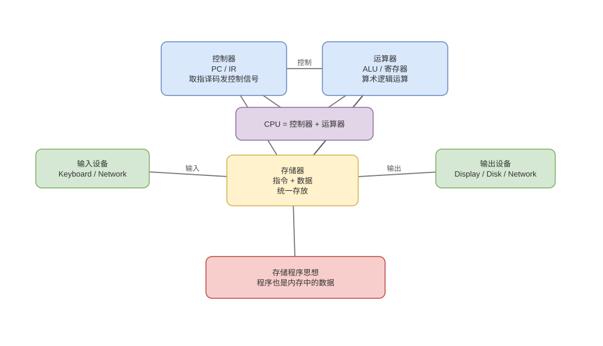

# 存储程序、冯诺依曼与现代计算机

> 基线：教材五部件是功能抽象，现代处理器仍遵循存储程序思想，但内部采用分层缓存、流水线和改进型哈佛结构。

## 01-存储程序
Q: “存储程序”思想究竟改变了什么？
A:
- 指令和数据都编码为位模式存入可读写存储器，CPU 通过 PC 按地址取指，不必为每个任务重新接线。
- 程序因此能被装载、修改、复制和作为数据处理，编译器与操作系统也可统一管理代码和数据。
- 指令位模式只有进入取指/译码路径才具有指令语义；页权限、执行权限和 ABI 进一步约束用途。
- 自修改代码理论上可行，但现代缓存一致性、安全和流水线使它需要专门同步，不是普通编程方式。

## 02-五大部件
Q: 冯诺依曼模型的五大部件如何协作？
A:
- 运算器执行算术逻辑，控制器解释指令并发控制信号；现代二者与寄存器、缓存共同集成在 CPU。
- 存储器保存运行中的指令和数据，输入/输出设备通过控制器、总线和内存与处理器交换信息。
- 控制器用 PC、指令寄存器和状态寄存器组织“取指—译码—执行—提交”循环。
- 五部件描述职责而非芯片封装，GPU、DMA 控制器和多级缓存仍可放回这套功能框架理解。

## 03-取指执行闭环
Q: 从 PC 到下一条 PC，一条指令的体系结构级执行链是什么？
A:
1. 取指单元用 PC 访问指令缓存，获得指令字节并预测下一 PC。
2. 译码确定操作、源/目标寄存器、立即数和寻址方式，读取或重命名操作数。
3. 执行单元计算结果或有效地址，Load/Store 经缓存层次访问数据。
4. 结果按架构语义提交，更新寄存器/内存可见状态；分支、异常会选择新的 PC。

## 04-冯诺依曼瓶颈
Q: 冯诺依曼瓶颈为什么本质上是数据搬运瓶颈？
A:
- CPU 计算吞吐增长快于主存延迟和带宽，若每条指令都等待远端数据，执行单元大部分周期闲置。
- 指令与数据都要经过有限的片上/片外通路，工作集超出缓存后形成 memory wall。
- 多级缓存、预取、乱序执行、批处理和数据局部性只能隐藏或减少访问，不能消除物理传输成本。
- 后端中的连续数组、对象紧凑化、批量序列化和减少随机指针追逐，都是在减少慢层数据移动。

## 05-哈佛对比
Q: 冯诺依曼与哈佛结构如何区分，现代 CPU 为什么常称“改进型哈佛”？
A:
- 纯冯诺依曼指令和数据共享存储与通路；哈佛结构将二者的存储和访问通路分离，可并行取指与访存。
- 现代通用 CPU 常有独立 L1 I-Cache/D-Cache 和前端/Load-Store 端口，但更低层缓存和主存统一。
- 这种混合既提高一级访问带宽，又保留统一地址空间、装载和共享的通用性。
- 所以不能仅凭“代码和数据最终都在内存”否认内部哈佛化，也不能说现代 CPU 是完全分离哈佛机。

## 06-体系结构与微架构
Q: Architecture、ISA 和 Microarchitecture 分别处在哪一层？
A:
- 广义体系结构描述计算系统对软件可见的组织；ISA 是最核心的软件—硬件契约，包括指令、寄存器、异常和内存模型。
- 微架构是实现某 ISA 的内部方案，如流水线深度、缓存大小、执行宽度、ROB 和预测器。
- 同一 ISA 的不同 CPU 可有完全不同的性能、功耗和漏洞；正确程序却应获得相同架构结果。
- OS/JVM 既依赖 ISA 契约，也会根据微架构特征选择屏障、指令序列和优化策略。

## 07-现代扩展
Q: 多核、GPU 和 DMA 是否推翻了经典体系结构模型？
A:
- 没有；它们扩展了执行与 IO 并行度，但依然需要指令、状态、存储和控制的职责划分。
- 多核引入共享内存一致性，GPU 强化吞吐型数据并行，DMA 让设备直接搬运内存，都是对瓶颈的专门优化。
- 异构系统还要解决地址空间、缓存一致性、任务提交和同步，经典模型反而提供共同语言。
- “现代机器太复杂所以五部件无用”错误；应把抽象用于定位职责，再下钻具体实现。

## 08-结构图
Q: 如何用一张图串起 CPU、存储器与 IO 的主数据流？
A:
- CPU 内部控制器驱动数据通路，寄存器/ALU 处理热数据；缓存位于 CPU 与主存之间缓解速度差。
- 设备经控制器和互连访问，DMA 可直接读写内存，CPU 通过 MMIO/描述符配置并通过中断获知完成。
- 指令流与数据流在 L1 可能分离，在共享缓存和内存层重新汇合。
- 图是职责和流向抽象，不代表所有部件共享一根物理“总线”。

